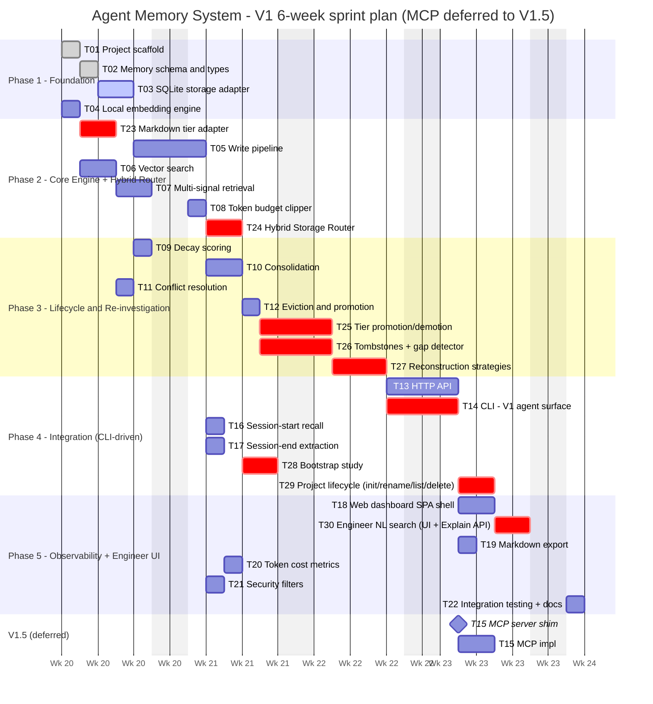

# Agent Memory System - Tasks

> **Working todo list - update this file as you implement.** See [How to update this file](#how-to-update-this-file) below.
> 1 point ≈ 1 day of focused work.

---

## Status Snapshot

| Field | Value |
|---|---|
| **Phase** | **0 - design only** (no code shipped beyond `install.go`) |
| **V1 progress** | **0 / 29 tasks - 0 / 43.5 points** complete |
| **Active task** | none |
| **Blocked** | none |
| **Next up** | **[T01 - Project Scaffold](#t01-project-scaffold)** (start of Phase 1) |
| **Last updated** | 2026-05-07 |

> **Read order:** scroll to the **[Master Checklist](#master-checklist-v1)** for the flat task list. Each task in the per-phase sections further down has its own `Status` row in its metadata table - flip it as you progress and tick the corresponding box in the Master Checklist. Acceptance-criteria boxes inside each task are sub-todos for that task.

---

## Master Checklist (V1)

Tick each box as the task lands. Detail (scope, files, deliverables, acceptance criteria) is in the per-phase sections below - click a task ID to jump to it.

### Phase 1 - Foundation (5.5 pts) - 0/4 done
- [ ] **[T01](#t01-project-scaffold)** Project Scaffold *(1)* - *not started*
- [ ] **[T02](#t02-memory-schema-types)** Memory Schema & Types *(1)* - *not started*
- [ ] **[T03](#t03-sqlite-storage-adapter)** SQLite Storage Adapter *(2)* - *not started*
- [ ] **[T04](#t04-local-embedding-engine)** Local Embedding Engine *(1.5)* - *not started*

### Phase 2 - Core Engine + Hybrid Router (10 pts) - 0/6 done
- [ ] **[T05](#t05-write-pipeline)** Write Pipeline *(2)* - *not started*
- [ ] **[T06](#t06-vector-search)** Vector Search *(1.5)* - *not started*
- [ ] **[T07](#t07-multi-signal-retrieval-engine)** Multi-Signal Retrieval Engine *(1.5)* - *not started*
- [ ] **[T08](#t08-token-budget-clipper)** Token Budget Clipper *(1)* - *not started*
- [ ] **[T23](#t23-markdown-tier-adapter)** Markdown Tier Adapter *(2)* - *not started*
- [ ] **[T24](#t24-hybrid-storage-router)** Hybrid Storage Router *(2)* - *not started*

### Phase 3 - Lifecycle + Re-investigation (12 pts) - 0/7 done
- [ ] **[T09](#t09-decay-scoring)** Decay Scoring *(1)* - *not started*
- [ ] **[T10](#t10-consolidation)** Consolidation *(2)* - *not started*
- [ ] **[T11](#t11-conflict-detection-resolution)** Conflict Detection & Resolution *(1)* - *not started*
- [ ] **[T12](#t12-eviction-promotion)** Eviction & Promotion *(1)* - *not started*
- [ ] **[T25](#t25-tier-promotion-demotion-lifecycle-integration)** Tier Promotion / Demotion *(2)* - *not started*
- [ ] **[T26](#t26-tombstones-gap-detector)** Tombstones + Gap Detector *(2)* - *not started*
- [ ] **[T27](#t27-reconstruction-strategies)** Reconstruction Strategies *(3)* - *not started*

### Phase 4 - Integration (9 pts) - 0/6 done - *★ CLI surface for AI agents ★*
- [ ] **[T13](#t13-http-api-v1-build-v15-surface)** HTTP API *(1.5)* - *not started*
- [ ] **[T14](#t14-cli-v1-ai-agent-integration-surface)** CLI *(2)* - *★ V1 AI-agent integration surface ★* - *not started*
- [ ] **[T16](#t16-session-start-recall)** Session-Start Recall *(1)* - *not started*
- [ ] **[T17](#t17-session-end-extraction)** Session-End Extraction *(1)* - *not started*
- [ ] **[T28](#t28-bootstrap-study-cold-start-ingestion-of-an-existing-project)** Bootstrap Study *(2)* - *not started*
- [ ] **[T29](#t29-project-lifecycle-commands-init-rename-list-delete)** Project Lifecycle Commands *(1.5)* - *not started*

### Phase 5 - Observability + Engineer UI (7 pts) - 0/6 done
- [ ] **[T18](#t18-web-dashboard)** Web Dashboard *(2)* - *not started*
- [ ] **[T30](#t30-engineer-natural-language-search-ui-explain-api)** Engineer NL Search (UI + Explain API) *(2)* - *★ engineer surface ★* - *not started*
- [ ] **[T19](#t19-markdown-export)** Markdown Export *(0.5)* - *not started*
- [ ] **[T20](#t20-token-cost-metrics)** Token Cost Metrics *(0.5)* - *not started*
- [ ] **[T21](#t21-security-filters)** Security Filters *(1)* - *not started*
- [ ] **[T22](#t22-integration-testing-documentation)** Integration Testing & Documentation *(1)* - *not started*

### Deferred to V1.5+
- [ ] **[T15](#t15-mcp-server-shim-deferred-from-v1)** MCP Server Shim *(1.5)* - *deferred until V1 ships and the CLI envelope is frozen*

---

## How to update this file

When you start, finish, or block a task:

1. **Tick the box in the [Master Checklist](#master-checklist-v1)** ( `[ ]` -> `[x]` ) when the task is done. Update the trailing status word (*not started* -> *in progress* / *done* / *blocked: \<reason>*).
2. **Update the `Status` row in the task's metadata table** in the per-phase section below (use the same vocabulary).
3. **Tick the acceptance-criteria checkboxes** within the task as you complete them - those are the sub-todos.
4. **Update the [Status Snapshot](#status-snapshot)** at the top - counts, active task, blocked, next up, last-updated date.
5. **If blocked**, include what unblocks you (link to the blocking task or external dependency).
6. **For non-trivial implementation sessions**, add a recap under `tools/agent-memory/recap/YYYY-MM-DD_<slug>.md` (per workspace rule `.cursor/rules/system-design-study.mdc` -> *Implementation recap*).
7. **Optional progress styling on the dependency graph below**: when a task is done, change its node style to green so the diagram shows progress at a glance - `style TXX fill:#d1e7dd,stroke:#0a3622`. When blocked, use `fill:#f8d7da,stroke:#842029`.

**Status vocabulary** (use these exact strings so the file stays grep-able):

| Status | When to use |
|---|---|
| `not started` | Default - task hasn't been picked up |
| `in progress` | Someone is actively working on it (only one developer per task to keep it clean) |
| `done` | Every acceptance criterion ticked, code merged, tests passing |
| `blocked: <reason>` | Cannot proceed; include the blocker (e.g. `blocked: waiting on T03`) |
| `deferred` | Out of V1 scope (only used for T15 today) |

**Quick progress check** - count completions from the shell:
```bash
cd tools/agent-memory
grep -c '^- \[x\]' tasks.md           # tasks done in master checklist
grep -c '^| \*\*Status\*\* | done' tasks.md  # tasks marked done in metadata
```
--------------------------------------------------------------------------------
Task Dependency Graph (V1)
flowchart TB
    subgraph P1["Phase 1 - Foundation (5.5 pts)"]
        T01[T01 Project scaffold]
        T02[T02 Memory schema and types]
        T03[T03 SQLite storage adapter]
        T04[T04 Local embedding engine]
    end

    subgraph P2["Phase 2 - Core Engine + Hybrid Router (10 pts)"]
        T05[T05 Write pipeline]
        T06[T06 Vector search]
        T07[T07 Multi-signal retrieval]
        T08[T08 Token budget clipper]
        T23[T23 Markdown tier adapter]
        T24[T24 Hybrid Storage Router]
    end

    subgraph P3["Phase 3 - Lifecycle + Re-investigation (12 pts)"]
        T09[T09 Decay scoring]
        T10[T10 Consolidation]
        T11[T11 Conflict resolution]
        T12[T12 Eviction and promotion]
        T25[T25 Tier promotion/demotion]
        T26[T26 Tombstones + Gap Detector]
        T27[T27 Reconstruction Strategies]
    end

    subgraph P4["Phase 4 - Integration (9 pts) * CLI-driven *"]
        T13[T13 HTTP API<br>built, optional surface]
        T14[T14 CLI<br>> V1 AI-agent surface <]
        T16[T16 Session-start recall]
        T17[T17 Session-end extraction]
        T28[T28 Bootstrap study<br>cold-start ingestion]
        T29[T29 Project lifecycle<br>init/rename/list/delete]
    end

    subgraph P5["Phase 5 - Observability (7 pts)"]
        T18[T18 Web dashboard SPA shell]
        T30[T30 Engineer NL search<br>* same engine path as agent *]
        T19[T19 Markdown export]
        T20[T20 Token cost metrics]
        T21[T21 Security filters]
        T22[T22 Integration testing and docs]
    end

    subgraph Future["Deferred to V1.5+"]
        T15[T15 MCP server shim<br>thin wrapper over T14 CLI]
    end

    T01 --> T02 --> T03
    T01 --> T04
    T03 --> T23
    T03 --> T05
    T03 --> T06
    T04 --> T05
    T04 --> T06
    T23 --> T24
    T05 --> T24
    T06 --> T07
    T07 --> T08
    T03 --> T09
    T05 --> T10
    T06 --> T10
    T06 --> T11
    T09 --> T12
    T10 --> T12
    T11 --> T12
    T12 --> T25
    T24 --> T25
    T03 --> T26
    T12 --> T26
    T05 --> T27
    T26 --> T27
    T08 --> T13
    T07 --> T13
    T12 --> T13
    T27 --> T13
    T25 --> T13
    T08 --> T14
    T12 --> T14
    T17 --> T14
    T27 --> T14
    T28 --> T14
    T07 --> T16
    T08 --> T16
    T23 --> T16
    T05 --> T17
    T05 --> T28
    T10 --> T28
    T23 --> T28
    T14 --> T29
    T28 --> T29
    T03 --> T29
    T13 --> T18
    T18 --> T30
    T07 --> T30
    T13 --> T30
    T23 --> T30
    T24 --> T30
    T16 --> T30
    T03 --> T19
    T08 --> T20
    T16 --> T20
    T05 --> T21
    T14 -.->|stable JSON envelope| T15

    style T14 fill:#d1e7dd,stroke:#0a3622,color:#0a3622,stroke-width:3px
    style T29 fill:#d1e7dd,stroke:#0a3622,color:#0a3622,stroke-width:3px
    style T30 fill:#e2d4f7,stroke:#5a2ea6,color:#3b1c70,stroke-width:3px
    style T23 fill:#cfe2ff,stroke:#0c63e4,color:#084298
    style T24 fill:#cfe2ff,stroke:#0c63e4,color:#084298
    style T25 fill:#cfe2ff,stroke:#0c63e4,color:#084298
    style T26 fill:#fff3cd,stroke:#664d03,color:#664d03
    style T27 fill:#fff3cd,stroke:#664d03,color:#664d03
    style Future fill:#f5f5f5,stroke:#999,color:#666,stroke-dasharray: 5 5
    style T15 fill:#f5f5f5,stroke:#999,color:#666
V1 AI-agent surface (green, bold): T14 (CLI) -- agents invoke agent-memory <subcommand> directly via shell tool calls. No daemon, no MCP, no Node required. T29 (Project Lifecycle) sits next to it as the per-project on-ramp the user runs after install.go (agent-memory init --project-name <name>).
V1 engineer surface (purple, bold): T30 (Engineer NL Search) -- the dashboard search page that calls the same retrieval engine path as the AI agent (T07 multi-signal retrieval over T24 hybrid router), with an explain mode so engineers can see why each hit ranked. Backed by a parity test that proves CLI <-> HTTP results are byte-identical for the same query.
Hybrid storage tasks (blue): T23, T24, T25 -- markdown tier adapter, routing logic, lifecycle promotion/demotion. See  §6.5 and .
Re-investigation tasks (yellow): T26, T27 -- tombstones + gap detector + reconstruction strategies. See  §8. These give the system "tip of the tongue" recovery - without them, evicted memories are gone forever.
Deferred (gray, dashed): T15 (MCP server shim) -- written after V1 is shipped and the CLI envelope contract is frozen. Ships as a separate npm package; zero engine changes required. See Deferred / V1.5+ Tasks.

--------------------------------------------------------------------------------
Phase 1: Foundation (5.5 points)
T01 - Project Scaffold
Scope: Initialize the tools/agent-memory/ Go module + the two TypeScript shim packages (MCP + dashboard). Set up build tooling, directory structure, and CI scaffolding. Layout follows golang-standards/project-layout. Implementation sub-tasks: Create directory tree cmd/agent-memory/, internal/{core,storage,engine,embeddings,api,cli,config}/, pkg/, test/, testdata/. go mod init. Cobra root command stub. Makefile targets. golangci.yml. dashboard/ and mcp-server/ package skeleton. Add CI script. Update README. Acceptance criteria: go build ./... compiles. go test ./... runs. golangci-lint run passes. make build produces static binary bin/agent-memory. agent-memory --help shows root. npm run build works in both TS packages.
T02 - Memory Schema & Types
Scope: Define all Go structs and enums from design.md §3. Implementation sub-tasks: Define MemoryEntry, Relation, MemorySource, Outcome structs with json and db tags. Define enum types (MemoryType, OutcomeResult, SourceType, Tier). Add MemoryPatch struct. Define SearchFilters and RecallOptions. Define StoreStats, ConsolidationResult. Add helper constructors and validation methods (Validate() error). Table-driven tests for JSON round-trip and validation. Acceptance criteria: go vet ./... clean. All types represented. JSON round-trip preserves fields. validator.Struct(dto) rejects invalid inputs. Pointer field semantics documented.
T03 - SQLite Storage Adapter
Scope: Implement the Store interface using SQLite via mattn/go-sqlite3. Schema migration management, CRUD, relation ops, bulk operations. CGO build works without sqlite-vec. Implementation sub-tasks: Declare Store and TierAdapter interfaces. Add mattn/go-sqlite3 deps. Create 001_init.sql (memories), 002_relations.sql, 003_sessions.sql. Implement migration runner (schema_versions). Create SqliteStore struct, enable PRAGMA foreign_keys = ON, WAL, synchronous = NORMAL. Implement CRUD (WriteMemory, GetMemory, Update, Delete), SearchByEntity, GetRelated, BulkUpdateDecay, BulkSupersede. Implement Stats. Add Scanner/Valuer for JSON columns. Prepared statement caching. Viper workspace DB config. Table-driven CRUD tests. Benchmark over 10K rows. Acceptance criteria: Interface satisfied. All CRUD operations pass tests against real SQLite file. Migration runs idempotently. BulkUpdateDecay over 10K rows in <500ms. Clean go test -race. JSON columns round-trip. Foreign key violations properly error.
T04 - Local Embedding Engine
Scope: Implement local embedding generation in Go using ONNX Runtime bindings (yalue/onnxruntime_go) with all-MiniLM-L6-v2. Stub OpenAI provider for V1. Implementation sub-tasks: Define Provider interface: Embed(ctx, text) ([]float32, error), EmbedBatch. Add yalue/onnxruntime_go deps. Create EnsureModel() downloads from HF into ~/.agent-memory/models/. Load tokenizer via daulet/tokenizers. Load ONNX session once at startup via sync.Once. Implement mean-pooling + L2-normalization. Implement batching. Stub OpenAI fallback. Wire viper config. Benchmark BenchmarkEmbed. Acceptance criteria: Embed("hello world") returns []float32 of length 384. Batch embedding 100 texts <5 sec. Model downloaded once. Cosine similarity assertions >0.7. BenchmarkEmbed < 10ms per single call. Clean go test -race.
Phase 2: Core Engine + Hybrid Router (10 points)
T05 - Write Pipeline
Scope: Implement the four-stage write pipeline (Extract -> Dedup -> Compress -> Store, plus pre-filter). Implementation sub-tasks: Pre-pipeline filter: reject secret regex patterns. Stage 1 Heuristic extractor: regex for file paths/classes, structure facts, classify MemoryType. Stage 2: embed incoming content, call SearchByVector; >0.92 skip, 0.70-0.92 mark for update. Stage 3: strip conversational filler ("I looked at"). Optional LLM wrapper. Content-hash dedup (sha256). Structured logging (slog). Table-driven tests. Benchmark BenchmarkPipeline_E2E. Acceptance criteria: Pipeline processes raw text -> MemoryEntry. Duplicate content not stored. Contradicting updates existing. Compressed output <= 30% of input length. Secrets ("AKIA..") rejected. Rate limiting rejects 101st write in 1 min.
T06 - Vector Search
Scope: Implement vector similarity search in Go using the sqlite-vec extension, pure-Go brute-force fallback for small stores. Implementation sub-tasks: Load sqlite-vec extension via sql.Conn.Raw. Add migration 004_vec.sql (CREATE VIRTUAL TABLE vec_memories USING vec0(...)). Add SQLite triggers mirroring memories to vec_memories. Implement SearchByVector. Apply filters via JOIN between vec_memories and memories. Pure-Go cosine fallback in cosine.go (parallel via goroutines) when extension not loaded or row count < 10K. Table-driven tests and Benchmarks. Acceptance criteria: Semantic search returns memories about "OPS" before "RES rules". Top-10 completes in < 50ms for 10K, < 200ms for 100K. Filters correctly restrict results. Brute-force fallback identical rankings to ANN within float32 precision.
T07 - Multi-Signal Retrieval Engine
Scope: Implement the multi-signal ranking pipeline from design.md §5.1 in Go. Implementation sub-tasks: Orchestrator Search(ctx, query, mode, opts) running candidate fetch + signals in parallel. Candidate fetch: SearchByVector (T06) for top 50, fetch markdown-tier candidates (T23) - merged. Compute semantic similarity, temporal decay, graph proximity (BFS), outcome boost, tier bias. Create rerank.go weighted score combination (defaults w1=0.45, w2=0.20, w3=0.15, w4=0.10, w5=0.10). Dispatchers for modes search, recall, relate, outcomes. Add RetrievalResult.Explain(). Tests and golden files. Acceptance criteria: Recent memories rank higher than old. Linked rank higher than unlinked. relate returns graph neighbors. outcomes returns outcome-type. Weights configurable.
T08 - Token Budget Clipper
Scope: Implement token-aware result truncation in Go - never return more tokens than budget. Implementation sub-tasks: Add pkoukk/tiktoken-go dep. Create singleton encoder for cl100k_base. Define ClipResult struct (Results, TotalTokens, Truncated, EntriesIncluded, EntriesAvailable, ClippedReasons). Implement Clip(results, budget) ClipResult - walks ranked results, accumulates tokens, stops. Handle edge case: single entry exceeds budget. Wire default budget (4000). Benchmarks. Acceptance criteria: Result set never exceeds configured budget. Token count accurate within 5% of tiktoken ref. Truncation metadata correct. Graceful empty returns. BenchmarkClip_1000Results < 5ms.
T23 - Markdown Tier Adapter
Scope: Implement the markdown tier in Go - a file-based storage backend maintaining <workspace>/.agent-memory/MEMORY.md with structured sections. Implementation sub-tasks: Add yuin/goldmark and natefinch/atomic. Define section constants procedural, pinned, promoted, historical. Define section markers <!-- agent-memory:section -->. Custom goldmark renderer for byte-for-byte round-trip. MarkdownAdapter struct implementing TierAdapter: LoadAll(), AddEntry(), RemoveEntry(), MoveEntry(). Token usage via TokenUsage(). Auto-create file on first write with templated header + markers. Enforce markdown.token_budget and overflow triggers eviction hook. Concurrent write safety test. Acceptance criteria: Adding to "procedural" produces well-formatted markdown. Removing by ID works. Round-trip preserves user-edited content outside markers. Token usage accurate within 5%. Atomic writes prevent corruption.
T24 - Hybrid Storage Router
Scope: Implement the routing engine deciding which tier each memory belongs in (design.md §6.5). Implementation sub-tasks: Importance(*MemoryEntry) float64 pure function. Register Rule struct. Implement R1-R7 (pinned -> markdown, user-pinned -> markdown, importance >= 0.85 -> markdown, procedural -> markdown, >500 tokens -> document, >=2 entities -> vector+graph, default -> vector). Route(*MemoryEntry) Decision iterating rules. Fallback logic. Wire router into write pipeline. Expose router.Explain(). Table-driven tests. Acceptance criteria: Rules 1-7 pass validation gates. Fallback warns. Router-driven write produces memory with correct storage_tier field.
Phase 3: Lifecycle + Re-investigation (12 pts)
T09 - Decay Scoring
Scope: Implement decay function from design.md §3.3 in Go. Implementation sub-tasks: ComputeDecay(entry, nowTime) float64. Define half-lives in days (episodic: 7, semantic: 90, outcome: 30, procedural: Inf). Access boost: 1 + log2(1 + access_count) * 0.1. Outcome boost: 1.5 success, 0.5 failure. Add BulkUpdate(ctx, workspace) executing single SQL UPDATE memories SET decay_score = .... Wire into retrieval engine (increments access_count, updates last_accessed_at). Tests and benchmark. Acceptance criteria: Episodic from 14 days ago has score 0.37. Access boosts applied. Procedural always 1.0. Batch update 10K memories < 1 sec.
T10 - Consolidation
Scope: Implement cluster + merge phases of REM Cycle (design.md §7). Implementation sub-tasks: DBSCAN-style clustering on embeddings (cosine > 0.8 AND >=2 shared entities). Honor config knobs (min_cluster_size, max_cluster_size). Fast template merge (concatenating unique facts). Add LLM-assisted merge path (off by default). Orchestrator: cluster -> merge -> write new semantic -> mark cluster as superseded -> emit supersedes relations. consolidation_log insertion. Wire integration with eviction (T12). Acceptance criteria: 5 episodic about "OPS Kafka topics" cluster into 1 semantic. Merged content contains unique facts. Original memories marked superseded. Consolidation logged.
T11 - Conflict Detection & Resolution
Scope: Implement Phase 4 of REM Cycle. Implementation sub-tasks: DetectConflicts(ctx, workspace) ([]ConflictPair, error). Detect candidate pairs (cosine > 0.7 + different factual content via T06 + entity index). Heuristic signals: negation words, differing numeric values. Resolution strategy: keep entry with higher confidence x recency, mark loser superseded_by winner. Flag ambiguous conflicts for human review. Golden cases testing. Acceptance criteria: "OPS uses topic A" vs "OPS uses topic B" detected as conflict. "OPS uses topic A" vs "OPS processes orders" not detected. More recent entry wins. Ambiguous flagged.
T12 - Eviction & Promotion
Scope: Implement Phases 5-6 of REM Cycle (eviction + promotion + full-cycle orchestrator). Implementation sub-tasks: Eviction rules (decay < 0.05 AND type=episodic -> delete with tombstone; superseded AND age > 30 days -> delete with tombstone; store exceeds max_entries -> evict lowest decay). Promotion rules (P1: same successful approach >= 3 outcomes -> create procedural; P2: same failed approach in >= 2 outcomes -> create procedural "avoid X"). Create REM manager orchestrating decay -> cluster -> consolidate -> conflict -> evict -> promote -> metrics. Add robfig/cron/v3 scheduler. Wire eviction -> tombstone writer (T26). Emit metrics. Acceptance criteria: Decayed episodic evicted. Superseded > 30 days evicted. Repeated successful/failed approaches create procedural. Full REM cycle < 30 sec for 10K. Metrics scored, merged, evicted, promoted, duration.
T25 - Tier Promotion / Demotion
Scope: Integrate Hybrid Storage Router into REM Cycle so memories move between tiers based on observed value. Implementation sub-tasks: Extend T12 manager with Phase 6b: Tier Rebalance. Implement **Promote** (vector -> markdown): access_count >= 10 in last 30 days AND size <= 100 AND not already markdown. Implement **Demote** (markdown -> vector): access_count < 2 in last 60 days AND pinned = false. Implement **Cold archive** (vector -> document): decay < 0.05 AND referenced by >=1 active. Implement **Restore** (document -> vector) via T07 hook. Implement **Supersede in markdown**. Add token budget enforcement. Log transitions to consolidation_log_transition_type. Add manual override endpoints Pin/Unpin (T13). Acceptance criteria: Vector memory accessed 12 times in 30 days promoted. Markdown unused for 60 days demoted. User-pinned never demoted. Markdown budget overflow triggers demotion. Cold-archived restored when referenced entity queried. Manual pin moves immediately. Transitions logged. No data loss.
T26 - Tombstones + Gap Detector
Scope: Implement tombstone storage + gap detector for forgotten memory re-investigation. Implementation sub-tasks: Migration 006_tombstones.sql (id, workspace, type, entities JSON, entity_hash BLOB, source_meta JSON, created_at, evicted_at, eviction_reason, successor_ids JSON, cluster_id, fragment_summary). Add LSH via mfonda/simhash. Wire into T12 lifecycle manager (every evict/consolidate -> archive/tombstone). Add retention enforcement (default 1825 days). Create gap/signals.go implementing 4 signals: EntityOverlap, DanglingEdges, ClusterCoverageGap, SourceDensity. Orchestrate in parallel via errgroup, normalize to [0.0, 1.0]. Implement false-positive guards (require >=2 matching tombstones, 24-hr cooldown LRU). Acceptance criteria: Evicting writes tombstone preserving ID/entities. Tombstones ~50 bytes. Gap detector returns 0.0-1.0 with explanation. Score above 0.4 only when >=2 tombstones match. Cooldown skips same query < 24h. Old tombstones hard-deleted.
T27 - Reconstruction Strategies
Scope: Implement the four reconstruction strategies and orchestration (largest task in V1). Implementation sub-tasks: Strategy interface. Create helper audit.go stamping reconstructed memories (source.type="reconstruction", decay_score=1.0, original_evicted_at, etc.). Add per-memory monthly cap (default 3) via loop_guard.go. Strategy 1 (Fragment Interpolation): pull tombstones + living sharing entities + 1-hop graph neighbors, combine fragments via template. Strategy 2 (Outcome Back-tracing): find surviving outcome memories containing tombstone IDs, derive intermediate steps. Strategy 3 (Source Re-investigation): read tombstone source.file_path, read file via os, compare mtime, re-run T05 extractor. Strategy 4 (User Confirmation): format prompt in interactive mode. Orchestrator executing strategies in cost order, short-circuit at confidence >= reconstruct.auto_store_threshold (0.8). Wire into T13 routes + T14 CLI. Acceptance criteria: S1 produces memory from 3+ surviving fragments. S2 derives intermediate steps. S3 reads real file and re-extracts. Source-changed flag works. S4 prompts in interactive. Memories clearly tagged. Strategies stop at first confidence >= 0.8. Per-session guard prevents >3 times/month. CLI lists tombstones and provenance.
Phase 4: Integration (CLI-driven; MCP deferred)
T13 - HTTP API (V1 build, V1.5 surface)
Scope: Implement chi-based HTTP API (used by T18 dashboard; V1 agents do not call this). Implementation sub-tasks: Add go-chi/chi/v5. Create router + middleware chain (request logging, panic recovery, CORS, token auth honoring MEMORY_API_TOKEN). Create route handlers: POST /memories, GET /memories/:id, PUT, DELETE, POST /memories/search, POST /memories/recall, POST /memories/reconstruct, POST /memories/:id/confirm-reconstruction, POST /memories/:id/pin|unpin, POST /sessions/end, POST /consolidation/run, POST /router/explain, GET /tombstones, GET /dashboard, GET /memories/export, GET /health. Wire DTO validation via validator/v10. Implement graceful shutdown + SIGTERM trap. Add --addr flag (default :3210). Embed dashboard via //go:embed. Table-driven tests. Acceptance criteria: Endpoints respond correctly. Invalid input returns 400 with details. Token budget enforced on search/recall. Server starts on port 3210, graceful shutdown. GET /dashboard/ serves embedded SPA index.html.
T14 - CLI (V1 AI-agent integration surface)
Scope: Implement CLI in Go using spf13/cobra. Must satisfy deterministic JSON-over-stdout contract. Implementation sub-tasks: Add cobra and viper. Create root cobra command + global flags (--workspace/-w, --format/-f, --no-color, --quiet/-q, --timeout, --api, --no-rem, --idempotency-key). Workspace auto-detection (env MEMORY_WORKSPACE -> cwd Sentinel T29 -> cwd basename). Default --format to text if tty, else json. Create output/envelope.go schema. Exit-code map (0 success, 1 runtime, 2 usage, etc.). transport/inproc.go opens SQLite engine in-process, transport/http.go used when --api <url> set. Subcommands: write, search, recall, session_end, consolidate, tombstones, reconstruct, export, stats, serve, version, completion, bench. Create help agent-prompt printing design.md snippet. Tests/docs: golden tests, concurrent-write integration test, auto-generate docs schema. Acceptance criteria: agent-memory write stdout exactly one JSON object matching schema. agent-memory search returns ranked results in envelope. agent-memory recall returns markdown context block. Exit codes correct. Idempotent write returns same id both times. No daemon required. In-process cold start < 200ms. Concurrent safe.
T28 - Bootstrap Study (cold-start ingestion)
Scope: Implement agent-memory study subcommand - bulk ingest of local project knowledge artifacts. Implementation sub-tasks: Create unified source walker for file:// / dir:// / glob. Implement .gitignore honoring. Add --ignore <glob> and --max-files N flags. Implement extract_markdown.go (goldmark AST walker -> procedural snippets, links -> semantic). Implement extract_code.go (walk code dirs, heuristics). Stamp studied memory with source.type = "code_analysis". Create orchestrator walk -> extract -> funnel through T05's Process -> final consolidation pass. Wire dry-run mode. Emit JSON envelope with memories_created, etc. Acceptance criteria: Max-files aborts with clear error envelope. --dry-run produces envelope without writing. Existing MEMORY.md content preserved byte-for-byte. Concurrent safety. Recall output non-empty for 3 known queries after study. Markdown extractor produces semantic + procedural memories. External source schemes return deferred error.
T29 - Project Lifecycle Commands (init / rename / list / delete)
Scope: Implement four per-project lifecycle commands. This is the per-project on-ramp users run. Implementation sub-tasks: Create registry/name.go validator (lowercase, reject reserved). Create registry/registry.go loader+saver for ~/.agent-memory/workspaces.json. Add file-lock for writes. Implement self-healing via scanning *.db. Add Cursor rule template with sentinel <!-- agent-memory:project=NAME -->. Embed via embed.FS. Write replaces {{.ProjectName}}. Idempotent rewrite. init command: resolves project name, creates SQLite DB, registers workspace, drops Cursor rule, implements --reuse and --force, implements --study. rename command: auto-detect from old, atomic move DB, update registry, rewrite Cursor rule. list command: read registry + compute DB size/memory count. delete command: refuse without --yes in TTY, implement --keep-data archive move. Tests asserting all behaviors. Acceptance criteria: init --project-name MyApp-Prod rejected. init twice exits 5, with --reuse succeeds. init --study produces non-zero memories. rename moves DB + updates rule. list --format json returns one row per DB. delete requires --yes in TTY. Concurrent init/list do not corrupt workspaces.json.
T16 - Session-Start Recall
Scope: Implement auto-recall context assembly. Implementation sub-tasks: Create recall.go Build(ctx, workspace, task, budget). Implement proportional allocation: 30% procedural, 35% semantic, 20% outcome, 15% episodic. When task non-empty, rebias toward semantic + outcome relevant to task (T07). Run T08 token-budget clipper. Create markdown renderer with sections "Conventions", "Key Knowledge", "Recent Outcomes", "Last Session Summary". Add stable serialization mode for parity test. Acceptance criteria: Recall without task returns balanced context. With task description biases toward task. Output fits within budget. Output is valid parseable markdown. Graceful "no prior context" on empty workspace.
T17 - Session-End Extraction
Scope: Extract learnings from completed agent session and store as memories. Implementation sub-tasks: parser.go accepts array of Message{Role, Content} JSON. Orchestrator parse -> extract -> write via T05. Implement fast-mode extraction (regex + templates + LLM): "I found/verified" -> semantic, "I tried X worked/failed" -> outcome, "always/never" -> procedural. Implement LLM-assisted mode. Generate session summary <= 200 tokens. Link outcome memories to referenced semantic via relations. Wire all writes through T05 dedup/compress. Acceptance criteria: Session with 20 messages produces 3-8 memory entries. Duplicate facts not stored twice. Outcome memories linked to semantic. Session summary captures what was done in < 200 tokens.
Phase 5: Observability & Polish (7 points)
T18 - Web Dashboard
Scope: Build Vite + React dashboard for inspecting and managing memories. SPA only - talks to Go HTTP API. T30 owns natural-language search experience. Implementation sub-tasks: Project setup in dashboard/, install react, react-router-dom, react-query, tailwindcss, recharts. Configure vite base path to dashboard/, proxy /api to http://localhost:3210. App shell: React root, top-bar workspace selector, left-nav, typed API client wrapper. Pages: Browser.tsx (memory list with filters), Lifecycle.tsx (timeline charts), Metrics.tsx (token savings pie chart), Tombstones.tsx, Graph.tsx (force-directed entity graph via reactflow), Search.tsx (minimal placeholder replaced by T30). Components: MemoryCard, TierBadge, DecayIndicator, TokenChart. Build integration producing optimized SPA in dashboard/dist/, embedded into Go. Tests. Acceptance criteria: Dashboard loads at localhost:3210/dashboard/ served by Go binary. Memory list shows all entries. Workspace selector switches context. Metrics show token savings. Works in Chrome and Firefox. Make target works.
T30 - Engineer Natural-Language Search (UI + Explain API)
Scope: Engineer-facing natural-language search experience in dashboard, backed by an explain mode on existing /api/v1/memories/search endpoint. Hard requirement: results MUST come from the same engine path that AI agents use (T07 multi-signal retrieval). No separate SQL-similarity branch. Implementation sub-tasks: Backend explain mode: Explain() returns per-signal ScoreBreakdown. Add match_reason synthesizer. Extend POST /api/v1/memories/search to accept explain bool. Add tiers filter to request body. Add POST /api/v1/memories/recall/preview route returning exact context_block + tokens_used. Backend Parity test: >5 fixture queries run via CLI vs HTTP search, assert identical result IDs and scores. Frontend Search page: Replace placeholder. Multi-line input, local storage history. Filters (type, tier, decay, outcome). ResultCard.tsx with snippet, badges, score breakdown. RecallPreview.tsx showing exact markdown + side panel of clipped memories. "Same as agent" parity badge. "Open in CLI" copy button. Acceptance criteria: Explain false is byte-identical to current behavior. Explain true returns score breakdowns. Parity test passes exactly (CLI vs HTTP). Markdown-tier appears in search results. Search latency p50 < 200ms. UI shows visible tier badges and score breakdowns. "Open in CLI" generates copy-pasteable command.
T19 - Markdown Export
Scope: Export all memories for a workspace as a human-readable markdown file (and round-trippable JSON). Implementation sub-tasks: json.go serialize/deserialize memories+relations+sessions to versioned JSON. import.go deserialize. export_markdown.go group by type, entity, render metadata. Format outcome memories as Approach -> Result -> Reason. Wire into T13 routes and T14 subcommand. Tests. Acceptance criteria: Export 100 memories produces well-formatted markdown. Export is importable back via JSON. File size proportional to memory count.
T20 - Token Cost Metrics
Scope: Track and report token savings compared to full-context baseline. Implementation sub-tasks: Add migration 007_metrics.sql (workspace, command, tokens_returned, tokens_full_context_estimate, ts). Add Go aggregator flushing to metrics_log. Wire instrumentation into T07 and T16. Compute tokens_saved. Expose GET /api/v1/dashboard?workspace= metrics endpoint. Wire agent-memory stats CLI. Optional Prometheus /metrics endpoint. Acceptance criteria: After 10 recall operations, metrics show cumulative tokens saved. Savings percentage matches expectations (>80%).
T21 - Security Filters
Scope: Harden write pipeline with security controls. Implementation sub-tasks: Create secrets.go regex catalogue (AWS, GCP, Azure, JWT, connection strings, PEM). Optional gitleaks library hook. Create pii.go patterns (email, SSN, credit card). Create ratelimit.go via golang.org/x/time/rate. Create poison.go prompt-injection heuristics. Extend write pipeline to plug these into pre-pipeline filter. Log rejections with sanitized reason. Benchmarks. Acceptance criteria: "AKIA..." triggers rejection. "Bearer eyJ..." triggers rejection. Normal tech content passes. Rate limit enforced concurrently. Poisoning patterns flagged.
T22 - Integration Testing & Documentation
Scope: V1 end-to-end tests and user-facing documentation. Focus is CLI integration path. Implementation sub-tasks: E2E tests: test/e2e/ package, full_lifecycle_test.go (write->search->recall->consolidate->tier transition->tombstone->reconstruct), session_test.go, security_test.go, cli_agent_test.go (simulates AI agent: spawns subprocesses, parses envelopes, asserts schema), study_test.go, lifecycle_commands_test.go. Load tests: load/bench_test.go (100K memory load, parallel reads/writes). Release tooling: goreleaser.yaml producing binaries for Darwin/Linux, CI step asserting zero node_modules in release artifact. Documentation: Update README.md Quickstart. Generate docs/cli-schema.md from golden tests. Write docs/architecture.md, docs/deployment.md, docs/engineer-search.md. Final gates: Manual smoke test against Cursor, Run full test suite. Acceptance criteria: All Go E2E tests pass. CLI-as-agent test passes (deterministic results). Load test completes in < 5 mins for 100K. Concurrent test 10 parallel writes succeed. Zero node_modules checked into V1 release artifact.


Here is the rest of the content from `tasks.md` that was missing from the previous response. This covers the Summary, Gantt chart, Critical Path details, and the deferred V1.5+ tasks (MCP Server Shim) found in images through.
## Summary

| Phase | Tasks (V1) | V1 Points |
|---|---|---|
| **Phase 1: Foundation** | T01-T04 | 5.5 |
| **Phase 2: Core Engine + Hybrid Router** | T05-T08, **T23, T24** | 10 |
| **Phase 3: Lifecycle + Re-investigation** | T09-T12, **T25, T26, T27** | 12 |
| **Phase 4: Integration** (*CLI-only for AI agents*) | T13, **T14**, T16, T17, **T28**, **T29** *(T15 deferred)* | 9 |
| **Phase 5: Observability + Engineer UI** | T18, **T30**, T19-T22 | 7 |
| **V1 Total** | **29 tasks** | **43.5 points** |
| **Deferred to V1.5+** | T15 - MCP server shim | 1.5 |

> **Notes on the totals**:
> - **T14 (CLI)** bumped from 1 -> 2 points: it became the V1 AI-agent integration surface and absorbed the JSON envelope contract, exit-code mapping, stdin discipline, idempotency, golden tests, and the agent-prompt helper command (design.md §9.1).
> - **T15 (MCP)** moved out of V1 - see [Deferred / V1.5+ Tasks](#deferred---v15-tasks). V1 agents integrate via shell tool calls into the CLI; the MCP shim, when written, is a thin wrapper over the same CLI commands.
> - **T18 (Web Dashboard)** is built but not required for AI-agent use. It is browser-only inspection that depends on `agent-memory serve` (which exists in V1 but is optional).
> - **T04 (Local Embeddings)** previously bumped from 1 -> 1.5 points in the Go migration: ONNX Runtime CGO setup, HuggingFace tokenizer integration, and model auto-download.

### What changed (vs initial estimate)

| Change | Δ Points | Why it matters |
|---|---|---|
| **T23 - Markdown Tier Adapter** | +2 | Enables always-on rules / pinned facts; foundation for hybrid storage |
| **T24 - Hybrid Storage Router** | +2 | The decision engine that picks the right tier per memory |
| **T25 - Tier Promotion/Demotion** | +2 | Memories move between tiers as their value changes (runtime learning loop) |
| **T26 - Tombstones + Gap Detector** | +2 | The "tip of the tongue" capability - system recognizes "I used to know something here" |
| **T27 - Reconstruction Strategies** | +3 | Four strategies (interpolation -> outcome trace -> source re-investigation -> user confirm) - turns catastrophic forgetting into graceful re-investigation |
| **T14 - CLI scope expansion** | +1 | CLI is now the V1 AI-agent surface - full JSON envelope contract, idempotency, golden tests |
| **T15 - MCP deferred to V1.5+** | -1.5 (from V1) | V1 ships zero TS - agents call the Go binary directly. MCP shim wraps the CLI later with no engine changes. |
| **T28 - Bootstrap Study** | +2 | Cold-start ingestion of existing project artifacts (READMEs, ADRs, code). Differentiates "agent that discovers from scratch" from "agent that starts knowing the project". Reuses the write pipeline (T05) - no special schema. **V1 = local files/dirs only**; Confluence/Jira/Notion deferred to V2 via the `Fetcher` interface. |
| **T29 - Project Lifecycle (`init`/`rename`/`list`/`delete`)** | +1.5 | The per-project on-ramp users actually run after `install.go`: `cd <project> && agent-memory init --project-name <name>`. Drops the Cursor rule with the project name baked in, creates the SQLite DB, optionally chains into T28. Without it, every new project requires manual config and rule-file editing. |
| **T30 - Engineer NL Search (UI + Explain API)** | +2 | Closes the loop: an engineer can natural-language-search the memory in the dashboard and see results with per-signal score breakdowns, tier badges, and source links - and preview what the AI agent would actually load for the same task. Hard contract: **same engine path as the agent**, enforced by a CLI-vs-HTTP parity test. T18's "Search Panel" deliverable was reduced to a placeholder so this task owns the engineer search experience end-to-end. |
| **T04 - ONNX Runtime CGO setup** | +0.5 | Go embedding path requires more wiring than Node `@xenova/transformers` |

### Critical Path (V1)

The V1 minimum viable product is **Phases 1-4 = 36.5 points** (agent-only path); the full **engineer + agent** product is **Phases 1-5 = 43.5 points**:

Foundation -> Core Engine + Hybrid Router -> Lifecycle + Re-investigation -> Integration (**CLI-driven**) -> Observability + Engineer UI

- **Re-investigation (T26, T27)** can be further deferred to V1.1 if MVP scope must shrink - the system is still useful without it (just less human-like)
- **Bootstrap Study (T28)** lands in Phase 4 because it is the difference between "agent has to discover everything" and "agent starts knowing the project" - without it, V1 is technically functional but practically slow to ramp on existing codebases
- **Project Lifecycle (T29)** is also red - without it, the user has to know where the SQLite file lives, hand-edit a Cursor rule, and pick a workspace name on every command. The `init` command makes the system a one-liner per project: `cd <project> && agent-memory i`
- **Engineer NL Search (T30)** is the **engineer-facing critical path**. Without it, V1 is functional for AI agents but engineers can only inspect memory by reading CLI JSON envelopes. T30 closes the loop: an engineer can ask the same questions the agent asks, see ranked results across the markdown + vector tiers, understand *why* each ranked, and preview what context the agent would actually receive - all over the **same engine path** (parity test enforced).
- **MCP (T15) is fully out of V1 scope** - it is added in V1.5+ as a thin wrapper over the V1 CLI

### Parallelization Opportunities

- **T03 (SQLite) and T04 (Embeddings)** can run in parallel after T01/T02
- **T05 (Write Pipeline) and T23 (Markdown Adapter)** can run in parallel after T03
- **T06 (Vector Search) and T09 (Decay)** can run in parallel after T03
- **T24 (Router)** depends on T05 + T23 (must run after both)
- **T12 (Eviction)** depends on T09 + T10 + T11
- **T25 (Tier Promotion)** can run in parallel with T11 / T25 once T12 is done
- **T26 (Tombstones)** can run in parallel with T11 / T25 once T12 is done
- **T27 (Reconstruction)** depends on T05 + T26
- **T13 (HTTP API) and T14 (CLI)** can run in parallel after Phase 3 - both call the same engine layer; CLI uses in-process transport, HTTP uses chi handlers
- **T16 (Recall) and T17 (Session-End)** can run in parallel after T05/T07
- **T29 (Project Lifecycle)** can start as soon as T14 has the cobra root + envelope plumbing; T29's `--study` flag depends on T28 being available, but `init` / `rename` / `list` / `delete` themselves do not
- **T30 (Engineer NL Search)** has two halves that can run in parallel: the backend `explain` mode + parity test (Go) only depends on T07 + T13; the React Search/RecallPreview pages only depend on T18's SPA shell. Both meet at the JSON envelope contract.

### Suggested Sprint Plan (V1 - 2-person team, MCP deferred)

| Sprint | Developer A | Developer B | Points |
|---|---|---|---|
| Sprint 1 (week 1) | T01, T02, T03 | T04, **T23 (start)** | 6 |
| Sprint 2 (week 2) | T05, T06 | **T23 (finish)**, T07, T08 | 7 |
| Sprint 3 (week 3) | **T24**, T09, T10 | T11, T12, **T26 (start)** | 8 |
| Sprint 4 (week 4) | T13, **T14 (CLI - V1 surface)**, **T25** | **T26 (finish)**, **T27** | 10 |
| Sprint 5 (week 5) | T16, T17, **T28 (Bootstrap Study)**, **T29 (init/rename/list/delete)** | T18 | T19, T20, T21, T22 | 10.5 |
| Sprint 6 (week 6) | **T30 (Engineer NL Search - backend `explain` + parity test)** | **T30 (Engineer NL Search - React Search/RecallPreview pages)** | 2 |
| **V1 Total** | | | **43.5** |
| **V1.5 sprint (later)** | T15 (MCP shim) | | 1.5 |

### Gantt View (V1 - 6-week plan, 2 developers; MCP deferred to V1.5)



**Critical-path highlight** (rendered red in `gantt`): the unique path that distinguishes this design from any markdown-only / vector-only / Mem0-style system:
- **T23 -> T24 -> T25** - hybrid storage router and tier rebalancing
- **T26 -> T27** - tombstones, gap detector, and reconstruction strategies (the "tip of the tongue" capability)
- **T14 (CLI)** is red because it is the **single integration surface** that ships V1 to AI agents
- **T28 (Bootstrap Study)** is red because it is what makes V1 *practically useful* on day 1 of an existing project - without it the system is technically functional but starts cold
- **T29 (Project Lifecycle)** is red because it is the per-project on-ramp users actually run after `install.go`. Without `init`/`rename`/`list`/`delete`, every new project requires manual config and rule-file editing - the difference between "wire any project from inside it with one command" and "a backend with no ergonomic front door"
- **T30 (Engineer NL Search)** is red because it is the **engineer-facing critical path**: a natural-language search UI over the same engine path the agent uses, with an `explain` mode that surfaces per-signal score breakdowns (semantic / recency / outcome / decay) and tier source (markdown / vector / vector+graph / document). Without it, engineers can only inspect memory by reading raw JSON envelopes from the CLI

Slipping any of these blocks the V1 release. T27 (Reconstruction Strategies) remains the largest single task at 3 points because it implements four strategies, each with its own logic and tests.

---

## Deferred / V1.5+ Tasks

> Tasks below are **not part of the V1 release**. They depend on V1 being shipped and stable. Each one wraps or extends V1 surfaces without modifying the core engine.

### T15 - MCP Server Shim *(deferred from V1)*

| Field | Value |
|---|---|
| **Status** | deferred |
| **Estimate** | 1.5 points |
| **Target release** | V1.5+ |
| **Depends on** | **T14** (V1 CLI contract is stable), optional T13 if HTTP path desired |
| **Blocked by** | V1 release (so the CLI envelope schema is frozen) |
| **Why deferred** | (1) V1 agents already work via shell tool calls into the CLI. (2) The MCP SDK is TypeScript-first, so adding it pulls Node into the install footprint - we don't want that on the V1 critical path. (3) Building MCP after V1 means it is a pure pass-through to a stable contract - zero engine work. |

**Scope**: Implement the MCP server in TypeScript - a thin shim that translates MCP tool calls into the V1 CLI commands (or HTTP calls when `agent-memory serve` is running). See design.md §9.3 and §13.3.

**Package**: `tools/agent-memory/mcp-server/` (separate npm package; not bundled into the Go binary)

**Implementation sub-tasks** - deferred to V1.5+; do **not** start until V1 is shipped and the CLI envelope schema in `docs/cli-schema.md` is frozen:

- [ ] Install deps: `@modelcontextprotocol/sdk`, `zod`, `zod-to-json-schema`, `tsup`
- [ ] Create `mcp-server/src/schemas.ts` - `zod` schemas for every MCP tool input
- [ ] Create `mcp-server/src/workspace.ts` - auto-detect workspace from `cwd` (`.git`, `go.mod`, `package.json`)
- [ ] Create `mcp-server/src/transport/cli.ts` - `spawn` agent-memory `<subcommand> --format json`, parse the V1 envelope, surface errors with the same exit-code semantics
- [ ] Create `mcp-server/src/transport/http.ts` - calls Go API on `localhost` when `serve` is up; same envelope schema
- [ ] Create `mcp-server/src/transport/select.ts` - picks CLI vs HTTP based on env / probe
- [ ] Create `mcp-server/src/tools/write.ts` - `memory_write` MCP tool
- [ ] Create `mcp-server/src/tools/search.ts` - `memory_search`
- [ ] Create `mcp-server/src/tools/recall.ts` - `memory_recall`
- [ ] Create `mcp-server/src/tools/outcomes.ts` - `memory_outcomes`
- [ ] Create `mcp-server/src/tools/relate.ts` - `memory_relate`
- [ ] Create `mcp-server/src/tools/reconstruct.ts` - `memory_reconstruct`
- [ ] Each tool body is just `transport.invoke(...)` - **zero business logic in TS**
- [ ] Create `mcp-server/src/index.ts` - MCP server entry; registers all tools; stdio transport
- [ ] Configure `mcp-server/package.json` `bin: "agent-memory-mcp"` so `npx agent-memory-mcp` works
- [ ] Configure `mcp-server/tsup.config.ts` - bundle to single ESM file `dist/index.js`
- [ ] Add an example MCP config block for `~/.cursor/mcp.json` in `tools/agent-memory/README.md`
- [ ] Add black-box integration tests that **re-use the V1 CLI golden envelope fixtures** (T14) - proves shim transparency
- [ ] **Sign-off** (when V1.5 is released): update Status row to `done`, tick `T15` in [Master Checklist](#master-checklist-v1), update [Status Snapshot](#status-snapshot)

**Acceptance criteria** - validation gates:
- [ ] MCP server starts via `npx agent-memory-mcp` (stdio transport)
- [ ] Each MCP tool maps 1:1 to a V1 CLI command and forwards stdin/args correctly
- [ ] Each MCP tool result equals the V1 CLI `data` field (verified by reusing T14 golden fixtures)
- [ ] Cursor / Claude Code can discover and invoke the tools via the MCP config block in README
- [ ] Clear error message displayed when the `agent-memory` binary is not on `PATH`
- [ ] Bundle size < 200 KB (zod + MCP SDK)
- [ ] **Zero changes required to the Go engine, CLI, or HTTP API** - proves the V1 contract is sufficient

**MCP tool specifications** (V1.5):

```typescript
// memory_write
{
  name: "memory_write",
  description: "Store a memory (fact, observation, outcome, or convention) for future recall",
  inputSchema: {
    type: "object",
    properties: {
      content: { type: "string", description: "The memory to store" },
      type: { type: "string", enum: ["episodic", "semantic", "procedural", "outcome"] },
      entities: { type: "array", items: { type: "string" } },
      outcome: { type: "object", properties: { result: { type: "string" }, approach: { type: "string" }, reason: { type: "string" } } }
    },
    required: ["content"]
  }
}

// memory_search
{
  name: "memory_search",
  description: "Search past memories by semantic similarity with optional filters",
  inputSchema: {
    type: "object",
    properties: {
      query: { type: "string" },
      types: { type: "array", items: { type: "string" } },
      top_k: { type: "number", default: 5 },
      token_budget: { type: "number", default: 2000 }
    },
    required: ["query"]
  }
}

// memory_recall
{
  name: "memory_recall",
  description: "Get contextual recall for session start - retrieves the most relevant memories",
  inputSchema: {
    type: "object",
    properties: {
      task_description: { type: "string" },
      token_budget: { type: "number", default: 4000 }
    }
  }
}
```