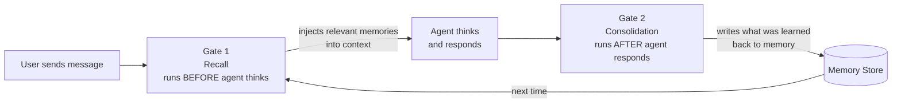
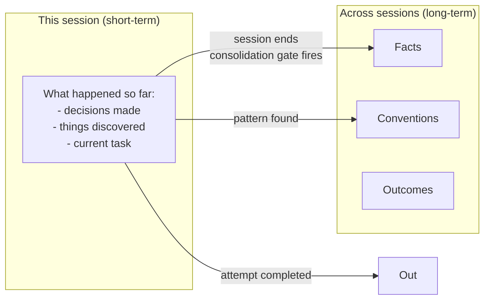

# Agent Memory System - Design v2

> v2 does not replace v1. It fixes one specific problem: **the agent decides whether to use memory, so it often skips it.**

---

## The Problem

v1 has a great memory store. But the agent only uses it when it feels like it.

Ask it a simple question like "how does X work?" — it answers from general knowledge and never touches memory. Finish a task — it might write back what it learned, or it might not. The rules say "you should use memory", but there's nothing that forces it.

This is the same as having a great notebook but never opening it.

---

## The Fix: Two Automatic Gates

v2 adds two hooks that run automatically — the agent has no choice.



That's the whole idea. Gate 1 feeds the agent memory before it works. Gate 2 saves what it learned after it works. The loop closes automatically.

---

## Gate 1: Recall (before every message)

**When:** `promptSubmit` — fires on every user message, before the agent sees it.

**What it does:**
1. Takes the user's message
2. Searches memory for anything relevant
3. Injects the results into the agent's context

The agent always starts with relevant history. It doesn't decide whether to look — the gate already looked.

```json
{
  "name": "Memory Recall Gate",
  "version": "2.0.0",
  "when": { "type": "promptSubmit" },
  "then": {
    "type": "askAgent",
    "prompt": "Before responding, run: agent-memory search --query '<key terms>' --top-k 8 and agent-memory recall --task '<user message>' --budget 800 --format raw. Use the results as context first."
  }
}
```

---

## Gate 2: Consolidation (after every response)

**When:** `agentStop` — fires after the agent finishes a turn.

**What it does:**
1. Reviews what happened this session
2. Writes anything worth keeping to memory
3. Runs session-end compaction

The agent always saves what it learned. It doesn't decide whether to write — the gate writes it.

```json
{
  "name": "Memory Consolidation Gate",
  "version": "2.0.0",
  "when": { "type": "agentStop" },
  "then": {
    "type": "askAgent",
    "prompt": "Review this session. Write anything durable using: agent-memory write --type semantic|procedural|outcome --content '<content>'. Then run: agent-memory session-end --transcript '<summary>' --format json"
  }
}
```

---

## What Gets Written

Not everything is worth saving. The consolidation gate applies a simple filter:

| What happened | Write it? | Type |
|---|---|---|
| Learned a fact about the system | Yes | `semantic` |
| Discovered a convention or process | Yes | `procedural` |
| Tried something and it worked | Yes | `outcome` |
| Tried something and it **failed** | **Always yes** | `outcome` |
| Fixed a typo, answered a simple question | No | — |

Failures are always written — no filter. A failed approach is the most valuable thing to remember (prevents repeating the same mistake).

---

## Short-Term vs Long-Term



Short-term memory is just the agent's current context window — it disappears when the session ends. The consolidation gate extracts what's worth keeping and moves it to long-term storage before the session closes.

---

## Deep Consolidation (the sleep cycle)

The REM cycle in v1 runs at the end of each session. That's good for within-session cleanup.

v2 adds a **deep consolidation** pass that runs across multiple sessions — it finds patterns that only appear when you look at a week or month of work:

- "The agent has tried approach X and failed 3 times — write a procedural rule to avoid it"
- "These 10 episodic memories are all about the same service — merge them into one semantic fact"

It's not a daemon. It's a single CLI command you can run manually or schedule:

```bash
agent-memory consolidate --deep
```

---

## Confidence Filter

When the consolidation gate writes a memory, it estimates how confident it is:

| Confidence | What happens |
|---|---|
| High (≥ 0.8) | Written immediately |
| Medium (0.5 – 0.8) | Written, tagged `low-confidence` for review |
| Low (< 0.5) | Discarded |

Failures skip this filter — they're always written regardless of confidence.

---

## What v2 Does NOT Change

Everything in v1 stays the same:

- CLI commands (`write`, `search`, `recall`, `session-end`, `consolidate`, `tombstones`)
- Storage (SQLite, vector, markdown tier, graph)
- Hybrid storage router
- REM lifecycle cycle
- Tombstones and reconstruction
- Token budget enforcement
- Security filters

v2 is just two hooks + a `--deep` flag + confidence scoring. The memory engine is untouched.

---

## Summary

| | v1 | v2 |
|---|---|---|
| Recall | Agent decides when to search | Gate forces search before every message |
| Write-back | Agent decides when to write | Gate forces write after every response |
| Session end | Agent decides when to compact | Gate forces compaction automatically |
| Cross-session patterns | REM micro-tick only | Deep consolidation pass added |
| Failures | Filtered like everything else | Always written, no filter |
