# Agent Memory System - Design

## 1. Design Principles

Rationale

| ID | Principle                                            | Rationale                                                                                                                                                                                                                                                                                                                                                                                       |
| -- | ---------------------------------------------------- | ----------------------------------------------------------------------------------------------------------------------------------------------------------------------------------------------------------------------------------------------------------------------------------------------------------------------------------------------------------------------------------------------- |
| P1 | **Local-first, cloud-optional**                      | Developers run it on their machine with zero setup; teams optionally share via PostgreSQL                                                                                                                                                                                                                                                                                                       |
| P2 | **Write policy, not just retrieval**                 | Every memory write goes through extraction -> conflict detection -> storage. No blind appending                                                                                                                                                                                                                                                                                                 |
| P3 | **Token budget as a first-class constraint**         | Every retrieval operation respects a configurable token ceiling - never blow the context window                                                                                                                                                                                                                                                                                                 |
| P4 | **Forgetting is a feature**                          | Decay, eviction, and consolidation are core operations, not afterthoughts                                                                                                                                                                                                                                                                                                                       |
| P5 | **Agent-agnostic**                                   | CLI + HTTP + MCP - works with Cursor, Claude Code, Copilot, LangChain, or custom agents                                                                                                                                                                                                                                                                                                         |
| P6 | **Human-inspectable**                                | All memory is exportable as markdown/JSON; no opaque binary stores                                                                                                                                                                                                                                                                                                                              |
| P7 | **Hybrid storage, automatic routing**                | Each memory is stored in the tier where it serves the agent best - markdown for always-on rules, vector for semantic recall, graph for relationships, document for bulk metadata. The router decides; lifecycle moves memories between tiers as their value changes. See §6.5 and `[analysis.md](./analysis.md)`.                                                                               |
| P8 | **Graceful forgetting, not catastrophic forgetting** | Eviction and consolidation are necessary for a healthy store, but they leave **tombstones** - tiny breadcrumbs that let the system later recognize "I used to know something here" and either reconstruct from fragments or re-investigate the original source. See §8.                                                                                                                         |
| P9 | **Single static binary, CGO where it pays**          | The backend ships as one **Go** binary (\~12 MB) - no runtime, no `node_modules`, no Python venv. CGO is used only where the alternative is materially worse: `sqlite-vec` (vector search) and ONNX Runtime (local embeddings). Every other dep is pure Go. The MCP shim and the React dashboard stay in TypeScript because their respective ecosystems (MCP SDK, React) are TS-first. See §12. |

## 2. Architecture Overview

### 2.1 V1 integration model

**V1 ships with the local Go CLI as the only AI-agent integration surface.** Agents (Cursor, Claude Code, Copilot, custom) invoke `agent-memory` as a shell command via their existing tool-call mechanism. **No MCP server, no daemon required.** The HTTP API and React dashboard exist for human inspection (browser) and are also reused later by V1.5 MCP and remote-team deployments. This keeps the V1 install down to **a single binary, no Node, no extra service to manage**.

### 2.2 Mermaid view (V1)

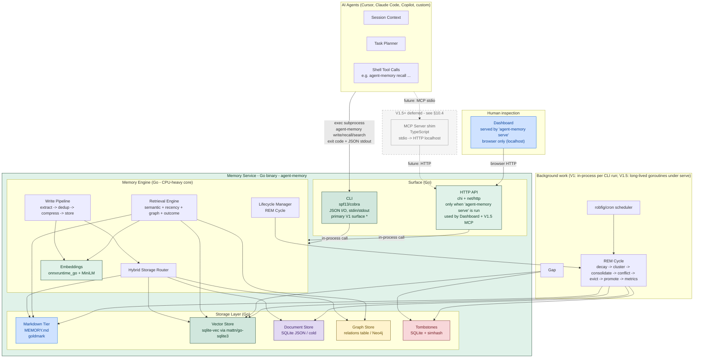
```mermaid
flowchart TB
    subgraph Agents["AI Agents (Cursor, Claude Code, Copilot, custom)"]
        SC[Session Context]
        TP[Task Planner]
        TC[Shell Tool Calls<br>e.g. agent-memory recall ...]
    end

    subgraph Browser["Human inspection"]
        Dash["Dashboard<br/>served by 'agent-memory serve'<br/>browser only (localhost)"]
    end

    subgraph Service["Memory Service - Go binary - agent-memory"]
        subgraph API["Surface (Go)"]
            CLI[CLI<br>spf13/cobra<br>JSON I/O, stdin/stdout<br>primary V1 surface *]
            HTTP[HTTP API<br>chi + net/http<br>only when 'agent-memory serve' is run<br>used by Dashboard + V1.5 MCP]
        end

        subgraph Engine["Memory Engine (Go - CPU-heavy core)"]
            Router[Hybrid Storage Router]
            Write[Write Pipeline<br>extract -> dedup -> compress -> store]
            Retrieval[Retrieval Engine<br>semantic + recency + graph + outcome]
            Lifecycle[Lifecycle Manager<br>REM Cycle]
            Embed[Embeddings<br>onnxruntime_go + MiniLM]
        end

        subgraph Storage["Storage Layer (Go)"]
            Md[Markdown Tier<br>MEMORY.md<br>goldmark]
            Vec[Vector Store<br>sqlite-vec via mattn/go-sqlite3]
            Doc[Document Store<br>SQLite JSON / cold]
            Graph[Graph Store<br>relations table / Neo4j]
            Tomb[Tombstones<br>SQLite + simhash]
        end
    end

    subgraph BG["Background work (V1: in-process per CLI run; V1.5: long-lived goroutines under serve)"]
        REM[REM Cycle<br>decay -> cluster -> consolidate -> conflict -> evict -> promote -> metrics]
        Sched[robfig/cron scheduler]
    end

    subgraph Future["V1.5+ deferred - see §10.4"]
        MCP[MCP Server shim<br>TypeScript<br>stdio -> HTTP localhost]
    end

    Agents -->|exec subprocess<br>agent-memory write/recall/search<br>exit code + JSON stdout| CLI
    Agents -.->|future: MCP stdio| MCP
    MCP -.->|future: HTTP| HTTP
    Dash -->|browser HTTP| HTTP
    CLI -->|in-process call| Engine
    HTTP -->|in-process call| Engine
    Router --> Md
    Router --> Vec
    Router --> Doc
    Router --> Graph
    Write --> Router
    Write --> Embed
    Retrieval --> Md
    Retrieval --> Vec
    Retrieval --> Graph
    Retrieval --> Embed
    Gap --> Tomb
    Gap --> Vec
    Lifecycle --> REM
    Sched --> REM
    REM --> Md
    REM --> Vec
    REM --> Doc
    REM --> Tomb

    style Service fill:#e0f2e9,stroke:#0a3622,color:#0a3622
    style CLI fill:#d1e7dd,stroke:#0a3622,color:#0a3622
    style HTTP fill:#e0f2e9,stroke:#0a3622,color:#0a3622
    style Md fill:#cfe2ff,stroke:#0c63e4,color:#084298
    style Vec fill:#d1e7dd,stroke:#0a3622,color:#0a3622
    style Graph fill:#fff3cd,stroke:#664d03,color:#664d03
    style Doc fill:#e2d9f3,stroke:#3d216c,color:#3d216c
    style Tomb fill:#f8d7da,stroke:#721c24,color:#721c24
    style Embed fill:#e0f2e9,stroke:#0a3622,color:#0a3622
    style Future fill:#f5f5f5,stroke:#999,color:#666,stroke-dasharray: 5 5
    style MCP fill:#f5f5f5,stroke:#999,color:#666
    style Dash fill:#cfe2ff,stroke:#0c63e4,color:#084298
```

**V1 integration:** the agent runs `agent-memory <subcommand>` as a shell tool call. The CLI does the work in-process (opens SQLite, runs engine, prints JSON to stdout, exits). **No daemon, no socket, no MCP layer needed for V1.** Solid, dotted lines mark deferred V1.5+ paths.

**Why CLI-first for V1**:

| Reason                         | Detail                                                                                                                                                                                    | <br />                                                          |
| ------------------------------ | ----------------------------------------------------------------------------------------------------------------------------------------------------------------------------------------- | :-------------------------------------------------------------- |
| **Zero install friction**      | One binary on PATH. No `npm install`, no Node version, no daemon to systemctl.                                                                                                            | <br />                                                          |
| **Universal agent support**    | Every modern agent (Cursor, Claude Code, Copilot, Continue, custom Python loops) already has shell tool calls. MCP support is uneven and changing.                                        | <br />                                                          |
| **Process isolation = safety** | Each invocation gets a fresh process with no shared state — easy to reason about, easy to kill, easy to sandbox.                                                                          | <br />                                                          |
| **Debuggable**                 | Agent's tool-call log shows the exact command, stdin, stdout, exit code. No black-box stdio JSON-RPC frames.                                                                              | <br />                                                          |
| **Composes with shell**        | \`cat session.log                                                                                                                                                                         | agent-memory session-end -\` — agents already speak this idiom. |
| **MCP added later for free**   | The MCP shim, when written in V1.5, simply translates MCP tool calls into the same CLI invocations (or HTTP calls if `serve` is running). The CLI contract becomes the stable foundation. | <br />                                                          |

### 2.3 ASCII view (V1)

```text
       AI Agent (Cursor, Claude Code, etc.)
 ------------------------------------------------
 | Session   |   | Task    |   | Shell Tool Call                     |
 | Context   |   | Planner |   | e.g. agent-memory recall            |
 |           |   |         |   |      --workspace foo                |
 |           |   |         |   |      --task "..."                   |
 |           |   |         |   |      --format json                  |
 ------------------------------------------------
                                |
                                | exec subprocess
                                | stdin/stdout/stderr
                                v + exit code
 -------------------------------------------------------------------
 | MEMORY SERVICE - single static Go binary                        |
 |       cmd/agent-memory   (~12 MB, CGO for sqlite-vec + ONNX)    |
 |                                                                 |
 | * V1 PRIMARY SURFACE: cobra CLI *                               |
 |                                                                 |
 | agent-memory write      --content - --type semantic ...         |
 | agent-memory search     --query "..." --top-k 10 ...            |
 | agent-memory recall     --task "..." --budget 4000 ...          |
 | agent-memory session-end --from-stdin ...                       |
 | agent-memory tombstones                                         |
 | agent-memory reconstruct --query "..."                          |
 | agent-memory consolidate                                        |
 | agent-memory export     --format markdown|json                  |
 | agent-memory stats                                              |
 |                                                                 |
 | All commands: --workspace <ws>  --format text|json              |
 |               exit 0 success / exit 1+ error                    |
 |               stable JSON schema (versioned)                    |
 |                                                                 |
 | -- deferred V1.5 -----------------------                        |
 | agent-memory                           |                        |
 | serve --addr ...       used by:        |                        |
 | -> chi HTTP API        React Dashboard (browser)                |
 |                        MCP shim (V1.5+)                         |
 -------------------------------------------------------------------
                                |
 -------------------------------------------------------------------
 | MEMORY ENGINE (Go - CPU-heavy core, parallel goroutines)        |
 |                                                                 |
 |  -----------     -------------      ------------                |
 |  | Write   |     | Retrieval |      | Lifecycle|                |
 |  | Pipeline|     | + Gap     |      | Manager  |                |
 |  |         |     | Detector  |      |          |                |
 |  | Extract |     | Embed qry |      | Decay -> |                |
 |  | Dedup ->|     | Parallel: |      | Consol ->|                |
 |  | Compress|     | | vector +|      | Conflict |                |
 |  | Route   |     | | graph + |      | Evict -> |                |
 |  | Store   |     | | outcome |      | Promote  |                |
 |  -----------     | | gap sig |      | Tier rebal|               |
 |                  | Rerank -> |      ------------                |
 |                  | Reconst?  |                                  |
 |                  | Budget clp|                                  |
 |                  -------------                                  |
 -------------------------------------------------------------------
                                |
 -------------------------------------------------------------------
 | STORAGE LAYER (Go adapters)                                     |
 |                                                                 |
 |  ----------    ----------    ----------    ----------           |
 |  | Markdown|   | Vector |    | Graph  |    | Tombstones         |
 |  | Tier    |   | Store  |    | Store  |    | + simhash          |
 |  |         |   |        |    |        |    |                    |
 |  | goldmark|   | sqlite |    | relation|   | tiny rows          |
 |  | MEMORY.md|  | vec    |    | table  |    | for recall         |
 |  ----------    ----------    ----------    ----------           |
 |         ----------                                              |
 |         | Document |   All in one SQLite file by default        |
 |         | Cold tier|   (Postgres + pgvector for teams)          |
 |         ----------                                              |
 -------------------------------------------------------------------
                                |
 -------------------------------------------------------------------
 | BACKGROUND CONSOLIDATION (REM Cycle)                            |
 |                                                                 |
 | V1   : runs at the *end* of session-end / consolidate /         |
 |        after every Nth write - no long-lived process needed     |
 | V1.5 : same code, scheduled by robfig/cron under 'serve'        |
 |                                                                 |
 | 1. Decay scoring    - reduce weight of unaccessed memories      |
 | 2. Cluster          - group related episodic memories           |
 | 3. Consolidate      - merge clusters into semantic facts        |
 | 4. Conflict resolve - detect and merge contradictions           |
 | 5. Evict            - remove memories below threshold           |
 | 6. Promote          - patterns -> procedural memory             |
 | 6b. Tier rebalance  - markdown <-> vector <-> document <-> cold |
 | 7. Metrics          - update token savings, store health        |
 -------------------------------------------------------------------
```

### 2.4 End-to-end system flow (process flowchart)

> §2.2 / §2.3 above show **what** the architecture is (boxes + dependencies). The flowcharts below show **how a request moves through it** end-to-end. Read these two diagrams first if you want to understand the system as a *behavior*, not just a *component map*.
>
> - **Diagram A (session lifecycle)** - the outer loop: how an agent's task lifts memories in at the start, drops new ones in during the work, and feeds the REM cycle on the way out - so the next session is *cheaper and smarter* than this one.
> - **Diagram B (single CLI request)** - the inner loop: what happens inside one `agent-memory` subprocess invocation, with both the **recall** (read) and **write** branches drawn explicitly. This is the contract every AI agent integrates against in V1.
>
> Both diagrams are **canonical** - they are the picture every other section in this design (§4 write, §5 retrieval, §7 REM, §8 reconstruction, §9 API) is a zoom-in of.

#### Diagram A - Session lifecycle (outer loop)

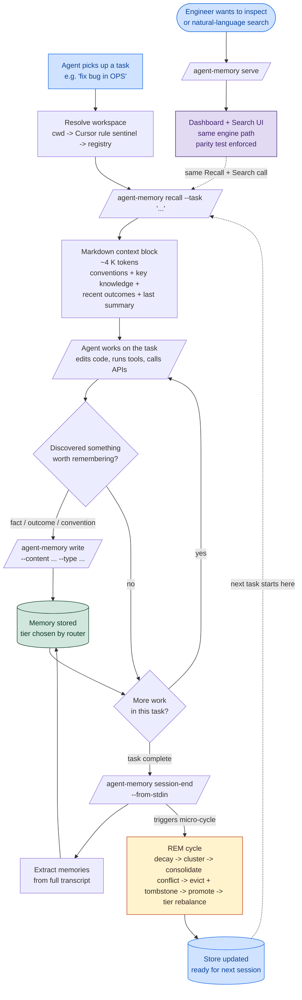
```mermaid
flowchart TD
    Start[Agent picks up a task<br/>e.g. 'fix bug in OPS'] --> Detect[Resolve workspace<br/>cwd -> Cursor rule sentinel -> registry]
    Detect --> Recall[/agent-memory recall --task '...'/]
    Recall --> Ctx[Markdown context block<br/>~4 K tokens<br/>conventions + key knowledge +<br/>recent outcomes + last summary]
    Ctx --> Work[/Agent works on the task<br/>edits code, runs tools, calls APIs/]

    Work --> Discovered{Discovered something<br/>worth remembering?}
    Discovered -->|fact / outcome / convention| Write[/agent-memory write<br/>--content ... --type .../]
    Write --> Stored[(Memory stored<br/>tier chosen by router)]
    Stored --> Morework{More work<br/>in this task?}
    Discovered -->|no| Morework
    Morework -->|yes| Work

    Morework -->|task complete| End[/agent-memory session-end<br/>--from-stdin/]
    End --> Extract[Extract memories<br/>from full transcript]
    Extract --> Stored
    End -->|triggers micro-cycle| REM[REM cycle<br/>decay -> cluster -> consolidate <br/>conflict -> evict + tombstone -> promote -> tier rebalance]
    REM --> Ready[(Store updated<br/>ready for next session)]
    Ready -.->|next task starts here| Recall

    %% Engineer side (parallel, optional)
    Engineer([Engineer wants to inspect<br/>or natural-language search]) --> Serve[/agent-memory serve/]
    Serve --> Dash[Dashboard + Search UI<br/>same engine path <br/>parity test enforced]
    Dash -.->|same Recall + Search call| Recall

    %% Styling
    style Start fill:#cfe2ff,stroke:#0c63e4,color:#084298
    style Ready fill:#cfe2ff,stroke:#0c63e4,color:#084298
    style Engineer fill:#cfe2ff,stroke:#0c63e4,color:#084298
    style Stored fill:#d1e7dd,stroke:#0a3622,color:#0a3622
    style REM fill:#fff3cd,stroke:#bf360c,color:#3e2723
    style Dash fill:#e2d9f3,stroke:#3d216c,color:#3d216c
```

**What this picture says:**

- **Memory is a closed loop, not a one-shot store.** Every recall is fed by writes from prior sessions; every write is conditioned by what was just recalled.
- **The REM cycle is a session-end concern, not a long-running daemon** in V1 — it runs in-process on the same Go binary and exits when the cycle is done. Same code is later wrapped under `serve` for V1.5 scheduled mode (see §13.3).
- **The engineer dashboard sits on the same path** as the agent — there is no separate "engineer query" code path. The HTTP `search` and `recall/preview` endpoints reach the same `Engine` methods the CLI does (parity test in T30 enforces this).

#### Diagram B - Single CLI request (inner loop)

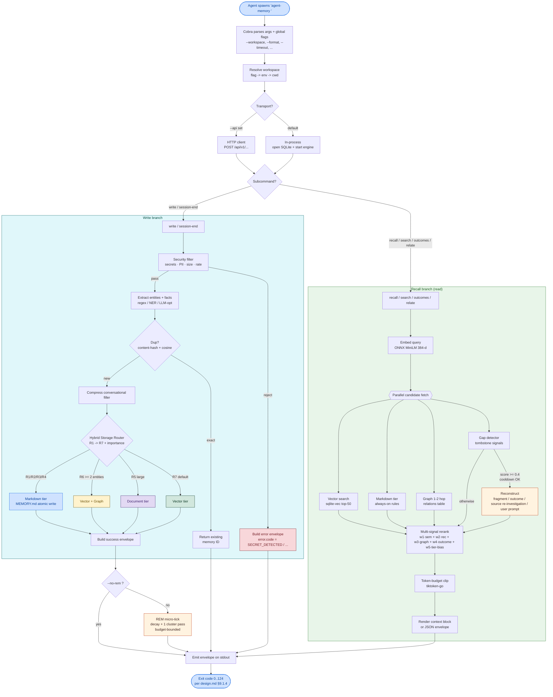
```mermaid
flowchart TD
    %% -- Spawn --
    Spawn([Agent spawns 'agent-memory <cmd>']) --> Parse[Cobra parses args + global flags<br/>--workspace, --format, --timeout, ...]
    Parse --> Resolve[Resolve workspace<br/>flag -> env -> cwd]
    Resolve --> Transport{Transport?}
    Transport -->|--api set| Http[HTTP client<br/>POST /api/v1/...]
    Transport -->|default| InProc[In-process<br/>open SQLite + start engine]
    Http --> Dispatch
    InProc --> Dispatch{Subcommand?}

    %% -- Recall branch --
    subgraph RecallBranch["Recall branch (read)"]
        direction TB
        DispatchR[recall / search / outcomes / relate] --> Embed[Embed query<br/>ONNX MiniLM 384-d]
        Embed --> Fan{{Parallel candidate fetch}}
        Fan --> VecQ[Vector search<br/>sqlite-vec top-50]
        Fan --> MdQ[Markdown tier<br/>always-on rules]
        Fan --> GraphQ[Graph 1-2 hop<br/>relations table]
        Fan --> GapQ[Gap detector<br/>tombstone signals]
        VecQ --> Rerank[Multi-signal rerank<br/>w1·sem + w2·rec + w3·graph + w4·outcome + w5·tier-bias]
        MdQ --> Rerank
        GraphQ --> Rerank
        GapQ -->|score >= 0.4 <br/>cooldown OK| Recon[Reconstruct<br/>fragment / outcome / source re-investigation / user prompt]
        GapQ -->|otherwise| Rerank
        Recon --> Rerank
        Rerank --> Clip[Token-budget clip<br/>tiktoken-go]
        Clip --> RenderR[Render context block<br/>or JSON envelope]
    end

    Dispatch -->|recall / search / outcomes / relate| DispatchR

    %% -- Write branch --
    subgraph WriteBranch["Write branch"]
        direction TB
        DispatchW[write / session-end] --> Sec[Security filter<br/>secrets · PII · size · rate]
        Sec -->|reject| RejectW[Build error envelope<br/>error.code = SECRET_DETECTED / ...]
        Sec -->|pass| Extract[Extract entities + facts<br/>regex / NER / LLM-opt]
        Extract --> Dedup{Dup?<br/>content-hash + cosine}
        Dedup -->|exact| ReturnExisting[Return existing<br/>memory ID]
        Dedup -->|new| Compress[Compress conversational filler]
        Compress --> Router{Hybrid Storage Router<br/>R1 -> R7 + importance}
        Router -->|R1/R2/R3/R4| MdWrite[Markdown tier<br/>MEMORY.md atomic write]
        Router -->|R6 >= 2 entities| VGWrite[Vector + Graph]
        Router -->|R5 large| DocWrite[Document tier]
        Router -->|R7 default| VecWrite[Vector tier]
        MdWrite --> WriteOk[Build success envelope]
        VGWrite --> WriteOk
        DocWrite --> WriteOk
        VecWrite --> WriteOk
    end

    Dispatch -->|write / session-end| DispatchW

    %% -- Background: REM micro-tick (write side only) --
    WriteOk --> Micro{--no-rem ?}
    Micro -->|no| MicroREM[REM micro-tick<br/>decay + 1 cluster pass<br/>budget-bounded]
    Micro -->|yes| Emit
    MicroREM --> Emit
    ReturnExisting --> Emit
    RejectW --> Emit[Emit envelope on stdout]
    RenderR --> Emit
    Emit --> Exit([Exit code 0..124<br/>per design.md §9.1.4])

    %% Styling
    style Spawn fill:#cfe2ff,stroke:#0c63e4,color:#084298
    style Exit fill:#cfe2ff,stroke:#0c63e4,color:#084298
    style RecallBranch fill:#e8f5e9,stroke:#2e7d32,color:#1b5e20
    style WriteBranch fill:#e0f7fa,stroke:#006064,color:#004d40
    style RejectW fill:#f8d7da,stroke:#721c24,color:#721c24
    style MdWrite fill:#cfe2ff,stroke:#0c63e4,color:#084298
    style VGWrite fill:#fff3cd,stroke:#664d03,color:#664d03
    style DocWrite fill:#e2d9f3,stroke:#3d216c,color:#3d216c
    style VecWrite fill:#d1e7dd,stroke:#0a3622,color:#0a3622
    style Recon fill:#fff3e0,stroke:#bf360c,color:#3e2723
    style MicroREM fill:#fff3e0,stroke:#bf360c,color:#3e2723
```

**What this picture says:**

- **Two branches share one binary, one engine, one envelope.** The CLI dispatcher picks recall *or* write but they hit the same SQLite, the same embedding provider, the same router; only the path through the engine differs.
- **Reconstruction is** ***inside*** **the recall path, not a separate command.** The gap detector runs in parallel with the rerank; if it crosses threshold, the orchestrator transparently fills gaps before clipping. The agent does not need to know that reconstruction happened - it just gets a richer context block. (`agent-memory reconstruct` exists as an explicit handle for engineers / tests; see §8.5.)
- **Every write triggers a tiny REM micro-tick** (decay + one cluster pass, budget-bounded) unless `--no-rem`. The full REM cycle still runs at session-end. This way, **lifecycle work happens incrementally on every write** rather than only in big background bursts - fits the V1 "no daemon" model.
- **All paths converge on one envelope + exit code** so AI agents can integrate against a single deterministic contract (see §9.1.3 / §9.1.4).

#### Cross-references - where each block is detailed

| Flow node                        | Detailed in                                           |
| -------------------------------- | ----------------------------------------------------- |
| Workspace resolution             | §9.1.2 (CLI flags) + §9.1.8 (project lifecycle)       |
| Embed query / Embeddings         | §10 (Embedding Strategy)                              |
| Vector / Markdown / Graph fetch  | §6.1 - §6.4 (Storage Layer)                           |
| Gap detector + Reconstruct       | §8 (Forgotten Memory Re-investigation)                |
| Multi-signal rerank              | §5.1 (Retrieval Engine)                               |
| Token-budget clip                | §11 (Token Economics)                                 |
| Security filter                  | §14 (Security Model) + §4.4 (write pipeline security) |
| Hybrid Storage Router R1-R7      | §6.5.2 (routing rules) + §6.5.3 (importance)          |
| REM cycle (full + micro-tick)    | §7 (Lifecycle Manager / REM Cycle)                    |
| Envelope + exit codes            | §9.1.3 (envelope) + §9.1.4 (exit codes)               |
| Engineer Search + Recall Preview | §9.2 (HTTP API) + §9.4 (Engineer search experience)   |

***

## 3. Memory Model

### 3.1 Memory Entry Schema

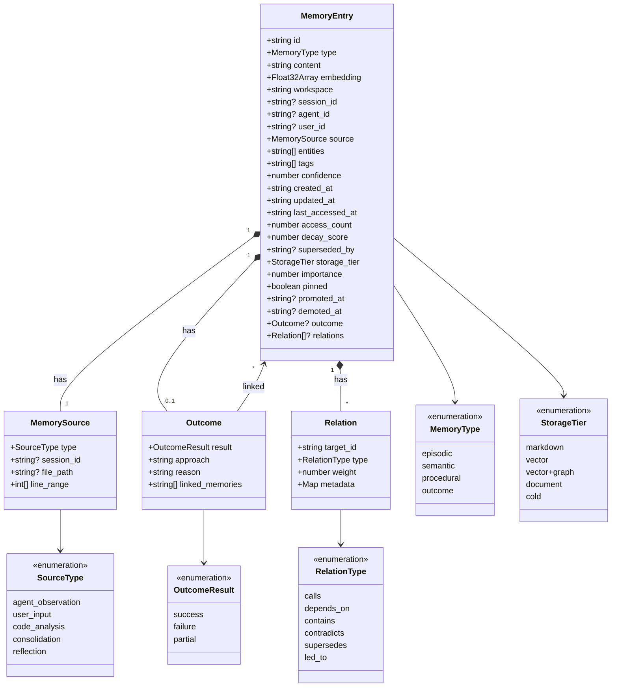
```mermaid
classDiagram
    class MemoryEntry {
        +string id
        +MemoryType type
        +string content
        +Float32Array embedding
        +string workspace
        +string? session_id
        +string? agent_id
        +string? user_id
        +MemorySource source
        +string[] entities
        +string[] tags
        +number confidence
        +string created_at
        +string updated_at
        +string last_accessed_at
        +number access_count
        +number decay_score
        +string? superseded_by
        +StorageTier storage_tier
        +number importance
        +boolean pinned
        +string? promoted_at
        +string? demoted_at
        +Outcome? outcome
        +Relation[]? relations
    }

    class Relation {
        +string target_id
        +RelationType type
        +number weight
        +Map metadata
    }

    class MemorySource {
        +SourceType type
        +string? session_id
        +string? file_path
        +int[] line_range
    }

    class Outcome {
        +OutcomeResult result
        +string approach
        +string reason
        +string[] linked_memories
    }

    class MemoryType {
        <<enumeration>>
        episodic
        semantic
        procedural
        outcome
    }

    class StorageTier {
        <<enumeration>>
        markdown
        vector
        vector+graph
        document
        cold
    }

    class RelationType {
        <<enumeration>>
        calls
        depends_on
        contains
        contradicts
        supersedes
        led_to
    }

    class SourceType {
        <<enumeration>>
        agent_observation
        user_input
        code_analysis
        consolidation
        reflection
    }

    class OutcomeResult {
        <<enumeration>>
        success
        failure
        partial
    }

    MemoryEntry "1" *-- "1" MemorySource : has
    MemoryEntry "1" *-- "0..1" Outcome : has
    MemoryEntry "1" *-- "*" Relation : has
    MemoryEntry --> MemoryType
    MemoryEntry --> StorageTier
    Relation --> RelationType
    MemorySource --> SourceType
    Outcome --> OutcomeResult
    Outcome --> "*" MemoryEntry : linked
```

Every memory entry (regardless of type) shares a common schema. Implementation is in Go (`internal/core/types.go`):

```go
package core

import "time"

// MemoryEntry is the canonical record for every agent memory.
type MemoryEntry struct {
    ID          string       `json:"id" db:"id"`                 // UUID v7 (time-sortable)
    Type        MemoryType   `json:"type" db:"type"`             // episodic | semantic | procedural | outcome
    Content     string       `json:"content" db:"content"`       // compressed, human-readable text
    Embedding   []float32    `json:"-" db:"embedding"`           // vector (384-dim MiniLM / 1536-dim OpenAI)

    // Scoping
    Workspace string  `json:"workspace" db:"workspace"`
    SessionID *string `json:"session_id,omitempty" db:"session_id"`
    AgentID   *string `json:"agent_id,omitempty" db:"agent_id"`
    UserID    *string `json:"user_id,omitempty" db:"user_id"`

    // Metadata
    Source     MemorySource `json:"source"`
    Entities   []string     `json:"entities" db:"entities"`     // JSON-encoded in DB
    Tags       []string     `json:"tags" db:"tags"`             // JSON-encoded in DB
    Confidence float64      `json:"confidence" db:"confidence"` // 0.0 - 1.0

    // Lifecycle
    CreatedAt      time.Time `json:"created_at" db:"created_at"`
    UpdatedAt      time.Time `json:"updated_at" db:"updated_at"`
    LastAccessedAt time.Time `json:"last_accessed_at" db:"last_accessed"`
    AccessCount    int       `json:"access_count" db:"access_count"`
    DecayScore     float64   `json:"decay_score" db:"decay_score"`
    SupersededBy   *string   `json:"superseded_by,omitempty" db:"superseded_by"`

    // Hybrid storage routing (see §6.5)
    StorageTier StorageTier `json:"storage_tier" db:"storage_tier"`
    Importance  float64     `json:"importance" db:"importance"`
    Pinned      bool        `json:"pinned" db:"pinned"`
    PromotedAt  *time.Time  `json:"promoted_at,omitempty" db:"promoted_at"`
    DemotedAt   *time.Time  `json:"demoted_at,omitempty" db:"demoted_at"`

    // Outcome linking (when Type == OutcomeMemory)
    Outcome *Outcome `json:"outcome,omitempty"`

    // Relationship edges (for graph storage)
    Relations []Relation `json:"relations,omitempty"`
}

type Outcome struct {
    Result         OutcomeResult `json:"result"`            // success | failure | partial
    Approach       string        `json:"approach"`          // what was tried
    Reason         string        `json:"reason"`            // why it succeeded/failed
    LinkedMemories []string      `json:"linked_memories"`   // IDs of related memories
}

type Relation struct {
    TargetID string            `json:"target_id"`
    Type     RelationType      `json:"type"`      // calls | depends_on | contains | contradicts | supersedes | led_to
    Weight   float64           `json:"weight"`    // 0.0 - 1.0
    Metadata map[string]string `json:"metadata,omitempty"`
}

type MemorySource struct {
    Type      SourceType `json:"type"`          // agent_observation | user_input | code_analysis | consolidation | reflection | reconstruction
    SessionID string     `json:"session_id,omitempty"`
    FilePath  string     `json:"file_path,omitempty"`
    LineRangeint     `json:"line_range,omitempty"` // [start, end]
}

// MemoryType is a string enum.
type MemoryType string

const (
    EpisodicMemory   MemoryType = "episodic"
    SemanticMemory   MemoryType = "semantic"
    ProceduralMemory MemoryType = "procedural"
    OutcomeMemory    MemoryType = "outcome"
)

// StorageTier is chosen by the Hybrid Storage Router (see §6.5).
type StorageTier string

const (
    TierMarkdown    StorageTier = "markdown"
    TierVector      StorageTier = "vector"
    TierVectorGraph StorageTier = "vector+graph"
    TierDocument    StorageTier = "document"
    TierCold        StorageTier = "cold"
)

type SourceType string

const (
    SourceAgentObservation SourceType = "agent_observation"
    SourceUserInput        SourceType = "user_input"
    SourceCodeAnalysis     SourceType = "code_analysis"
    SourceConsolidation    SourceType = "consolidation"
    SourceReflection       SourceType = "reflection"
    SourceReconstruction   SourceType = "reconstruction" // see §8
)

type RelationType string

const (
    RelCalls         RelationType = "calls"
    RelDependsOn     RelationType = "depends_on"
    RelContains      RelationType = "contains"
    RelContradicts   RelationType = "contradicts"
    RelSupersedes    RelationType = "supersedes"
    RelLedTo         RelationType = "led_to"
    RelDerivedFrom   RelationType = "derived_from" // reconstruction provenance (see §8)
)

type OutcomeResult string

const (
    OutcomeSuccess OutcomeResult = "success"
    OutcomeFailure OutcomeResult = "failure"
    OutcomePartial OutcomeResult = "partial"
)
```

Validation tags (`validator/v10`) are added on the API request/response wrappers in `internal/api/dto.go` rather than on the core domain struct.

### 3.2 Memory Type Semantics

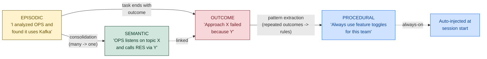
```mermaid
flowchart LR
    EP[EPISODIC<br>'I analyzed OPS and<br>found it uses Kafka'] -->|"consolidation<br>(many -> one)"| SEM[SEMANTIC<br>'OPS listens on topic X<br>and calls RES via Y']
    EP -->|task ends with<br>outcome| OUT[OUTCOME<br>'Approach X failed<br>because Y']
    OUT -->|"pattern extraction<br>(repeated outcomes -> rules)"| PROC[PROCEDURAL<br>'Always use feature toggles<br>for this team']
    
    SEM -.->|linked| OUT
    PROC -.->|always-on| Inject[Auto-injected at<br>session start]

    style EP fill:#fff3cd,stroke:#664d03,color:#664d03
    style SEM fill:#d1e7dd,stroke:#0a3622,color:#0a3622
    style OUT fill:#f8d7da,stroke:#721c24,color:#721c24
    style PROC fill:#cfe2ff,stroke:#0c63e4,color:#084298
    style Inject fill:#cfe2ff,stroke:#0c63e4,color:#084298
```

```text
      MEMORY TYPE HIERARCHY
     -----------------------------------
     |                                 |
     |  EPISODIC        consolidation  |
     |  ---------      --------------  |
     |  |       |       (many -> one)  |   SEMANTIC
     |  | "I    |                      |   ---------
     |  | analy-| -----------------------> | "OPS    |
     |  | zed   |                      |   | listens |
     |  | OPS   |                      |   | on     |
     |  | and   |                      |   | topic X |
     |  | found |                      |   | and     |
     |  | ..."  |                      |   | calls   |
     |  ---------                      |   | RES    |
     |      |                          |   | via Y"  |
     |      | outcome                  |   ---------
     |      v                          |
     |  ---------      pattern         |
     |  OUTCOME        extraction      |
     |  ---------      --------------  |   PROCEDURAL
     |  | "Appro|      (patterns ->    |   ----------
     |  | -ach X|       rules)         |   | "Always |
     |  | failed| -----------------------> | use     |
     |  | becau-|                      |   | feature |
     |  | -se Y"|                      |   | toggles |
     |  ---------                      |   | with    |
     |                                 |   | this    |
     |                                 |   | team"   |
     |                                 |   ----------
     -----------------------------------
```

| Type                      | Writes Consolidates Into                                      | Reads                                      | Decays                        |
| ------------------------- | ------------------------------------------------------------- | ------------------------------------------ | ----------------------------- |
| **Episodic**              | Every agent action/observation  -> Semantic (clustered facts) | On semantic search, weighted by recency    | Yes - exponential decay       |
| **Semantic** (terminal)   | From consolidation or direct extraction                       | On semantic search, weighted by confidence | Slow - only when contradicted |
| **Procedural** (terminal) | From pattern extraction or user input (pinned)                | Always injected at session start (pinned)  | No - explicit versioning only |
| **Outcome**               | At task completion  -> Procedural (repeated patterns)         | When planning similar tasks                | Yes - moderate decay          |

### 3.3 Decay Function

Inspired by the **FadeMem** and **OBLIVION** research, decay uses an adaptive exponential function modulated by access frequency and outcome value.

**Visual: how decay differs across memory types over 90 days (no access boost):**

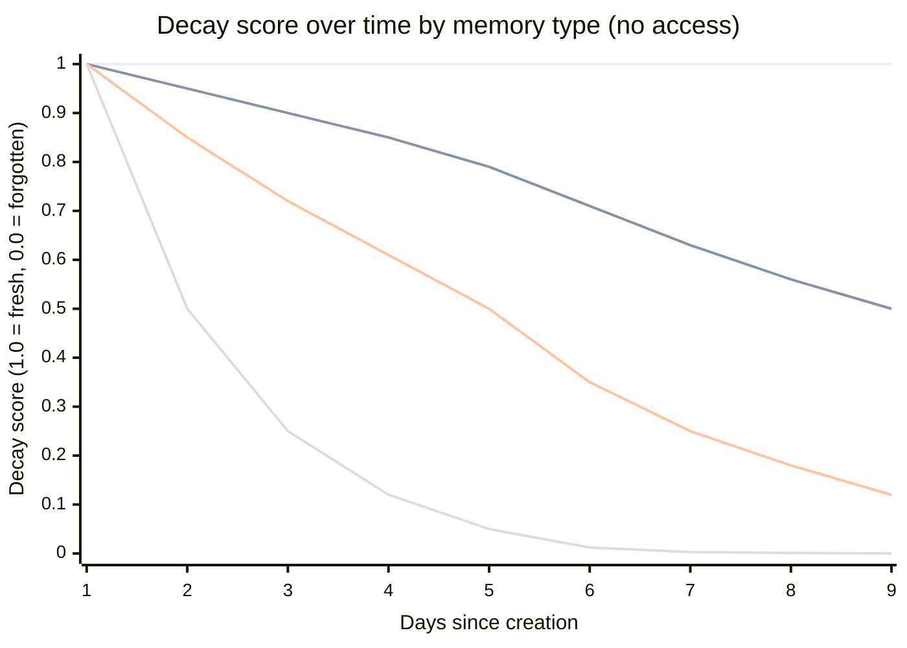
```mermaid
xychart-beta
    title "Decay score over time by memory type (no access)"
    x-axis "Days since creation"
    y-axis "Decay score (1.0 = fresh, 0.0 = forgotten)" 0 --> 1
    line "Procedural (no decay)" [1.0, 1.0, 1.0, 1.0, 1.0, 1.0, 1.0, 1.0, 1.0]
    line "Semantic (90d half-life)" [1.0, 0.95, 0.90, 0.85, 0.79, 0.71, 0.63, 0.56, 0.50]
    line "Outcome (30d half-life)" [1.0, 0.85, 0.72, 0.61, 0.50, 0.35, 0.25, 0.18, 0.12]
    line "Episodic (7d half-life)" [1.0, 0.50, 0.25, 0.12, 0.05, 0.012, 0.003, 0.001, 0.0002]
```

The episodic curve (red) drops below the **0.05 eviction threshold** at \~30 days. The semantic curve stays above eviction for over 9 months. Procedural memories never decay automatically.

**Effect of access frequency on a 14-day-old episodic memory:**

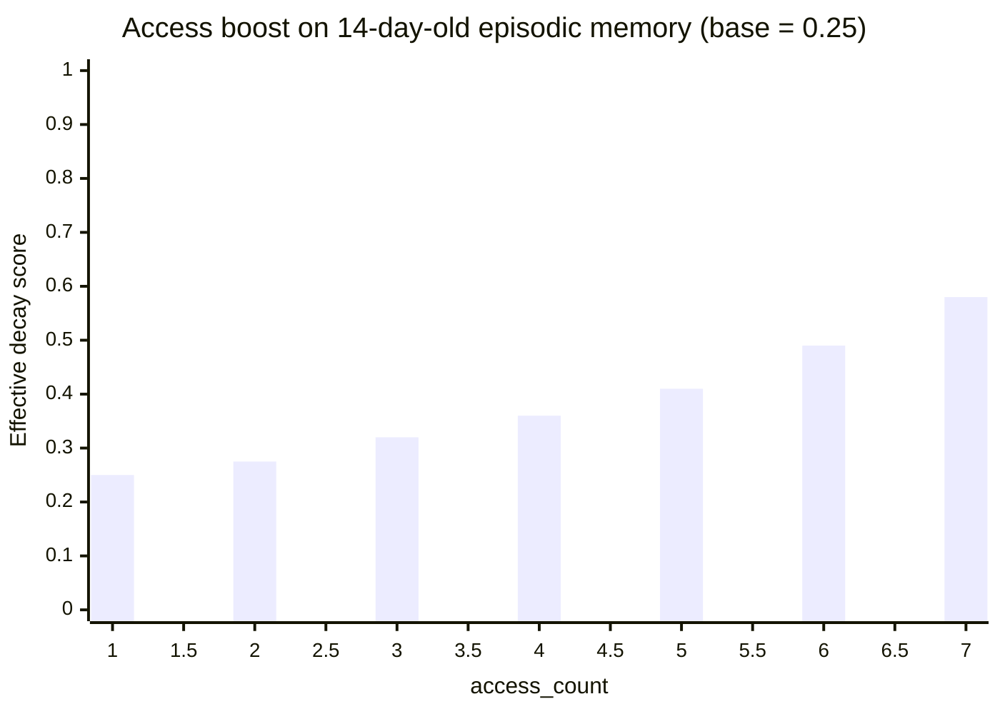
```mermaid
xychart-beta
    title "Access boost on 14-day-old episodic memory (base = 0.25)"
    x-axis "access_count"
    y-axis "Effective decay score" 0 --> 1
    bar [0.25, 0.275, 0.32, 0.36, 0.41, 0.49, 0.58]
```

A frequently accessed episodic memory (20+ hits) rises above 0.40 - high enough to survive eviction and become a candidate for **promotion to the markdown tier** (see §6.5.5).

```
decay_score(t) = base_decay(t) × access_boost × outcome_boost

where:
  base_decay(t) = e^(-λ × (t_now - t_created) / half_life)
  access_boost  = 1 + log2(1 + access_count) × 0.1
  outcome_boost = 1.5 if linked to successful outcome, 0.5 if linked to failure

  half_life defaults:
    episodic   = 7 days
    semantic   = 90 days
    outcome    = 30 days
    procedural = ∞ (no decay)
```

Memories with `decay_score < 0.05` are candidates for eviction during the next consolidation cycle.

***

## 4. Write Pipeline

Every memory write passes through a four-stage pipeline (inspired by Mem0's ADDN pattern):

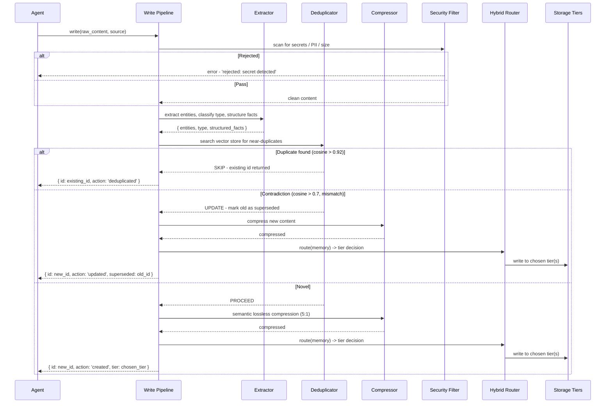
```mermaid
sequenceDiagram
    participant A as Agent
    participant W as Write Pipeline
    participant E as Extractor
    participant D as Deduplicator
    participant C as Compressor
    participant S as Security Filter
    participant R as Hybrid Router
    participant Store as Storage Tiers

    A->>W: write(raw_content, source)
    W->>S: scan for secrets / PII / size
    alt Rejected
        S-->>A: error - 'rejected: secret detected'
    else Pass
        S-->>W: clean content
    end
    W->>E: extract entities, classify type, structure facts
    E-->>W: { entities, type, structured_facts }
    W->>D: search vector store for near-duplicates
    alt Duplicate found (cosine > 0.92)
        D-->>W: SKIP - existing id returned
        W-->>A: { id: existing_id, action: 'deduplicated' }
    else Contradiction (cosine > 0.7, mismatch)
        D-->>W: UPDATE - mark old as superseded
        W->>C: compress new content
        C-->>W: compressed
        W->>R: route(memory) -> tier decision
        R->>Store: write to chosen tier(s)
        W-->>A: { id: new_id, action: 'updated', superseded: old_id }
    else Novel
        D-->>W: PROCEED
        W->>C: semantic lossless compression (5:1)
        C-->>W: compressed
        W->>R: route(memory) -> tier decision
        R->>Store: write to chosen tier(s)
        W-->>A: { id: new_id, action: 'created', tier: chosen_tier }
    end
```

ASCII view (kept for reference):

```text
Input (raw text, conversation turn, tool output, etc.)
  |
  v
-----------------------------------
| Stage 1: EXTRACT                |
|                                 |
| Parse raw input into candidate  |
| memory entries:                 |
| - Named entity extraction (files|
|   services, classes, topics, etc|
| - Fact extraction (subject-relat|
|   -object triples)              |
| - Outcome extraction (if task en|
| - Classify memory type          |
|                                 |
| Can use: regex + heuristics (fas|
|      or: LLM extraction (accurat|
-----------------------------------
  |
  v
-----------------------------------
| Stage 2: DEDUPLICATE & CONFLICT |
|                                 |
| For each candidate:             |
| 1. Embed and search existing st |
|    for similar entries (cosine >|
| 2. If near-duplicate found:     |
|    - SKIP (no write)            |
| 3. If contradiction found:      |
|    - UPDATE existing (supersede)|
| 4. If novel:                    |
|    - PROCEED to compress        |
|                                 |
| Similarity threshold θ = 0.92   |
| Contradiction detection: cosine |
| > 0.7 but sentiment/entity mism |
-----------------------------------
  |
  v
-----------------------------------
| Stage 3: COMPRESS               |
|                                 |
| Semantic lossless compression   |
| (SimpleMem-inspired):           |
| - Strip conversational filler   |
| - Normalize to declarative form |
| - Extract key-value structure   |
| - Target: 5:1 compression ratio |
|                                 |
| "I looked at OrderProcessor.    |
|  java and noticed it uses Spring|
|  Kafka @KafkaListener on the top|
|  called orders.events to receive|
|  incoming order messages"       |
|            |                    |
|            v                    |
| "OrderProcessor: Spring Kafka   |
|  @KafkaListener on orders.events|
-----------------------------------
  |
  v
-----------------------------------
| Stage 4: STORE                  |
|                                 |
| 1. Generate embedding vector    |
| 2. Extract entity list          |
| 3. Build relation edges (if any)|
| 4. Write to vector store +      |
|    document store + graph store |
| 5. Return memory ID             |
-----------------------------------
```

### 4.1 Extraction Modes

The system supports two extraction modes, selectable per-deployment:

| Mode                 | How                                               | Speed    | Accuracy | Token Cost          |
| -------------------- | ------------------------------------------------- | -------- | -------- | ------------------- |
| **Fast (heuristic)** | Regex, NER, keyword extraction, template matching | < 10ms   | \~70%    | Zero                |
| **LLM-assisted**     | Send raw input to LLM with extraction prompt      | 500ms-2s | \~95%    | 200-500 tokens/call |

Default: **Fast mode** for episodic writes during a session, **LLM-assisted** for session-end consolidation and outcome extraction.

### 4.2 Content Filtering (Security)

Before storage, content passes through a security filter:

- **Secret detection**: regex patterns for API keys, passwords, tokens, connection strings
- **PII detection**: email, phone, SSN patterns (configurable)
- **Size guard**: individual memory content capped at 2,000 characters
- **Rate limit**: max 100 writes per minute per workspace (prevents runaway agents)

***

### 5.1 Multi-Signal Retrieval

Retrieval combines three signals, unlike pure vector similarity:

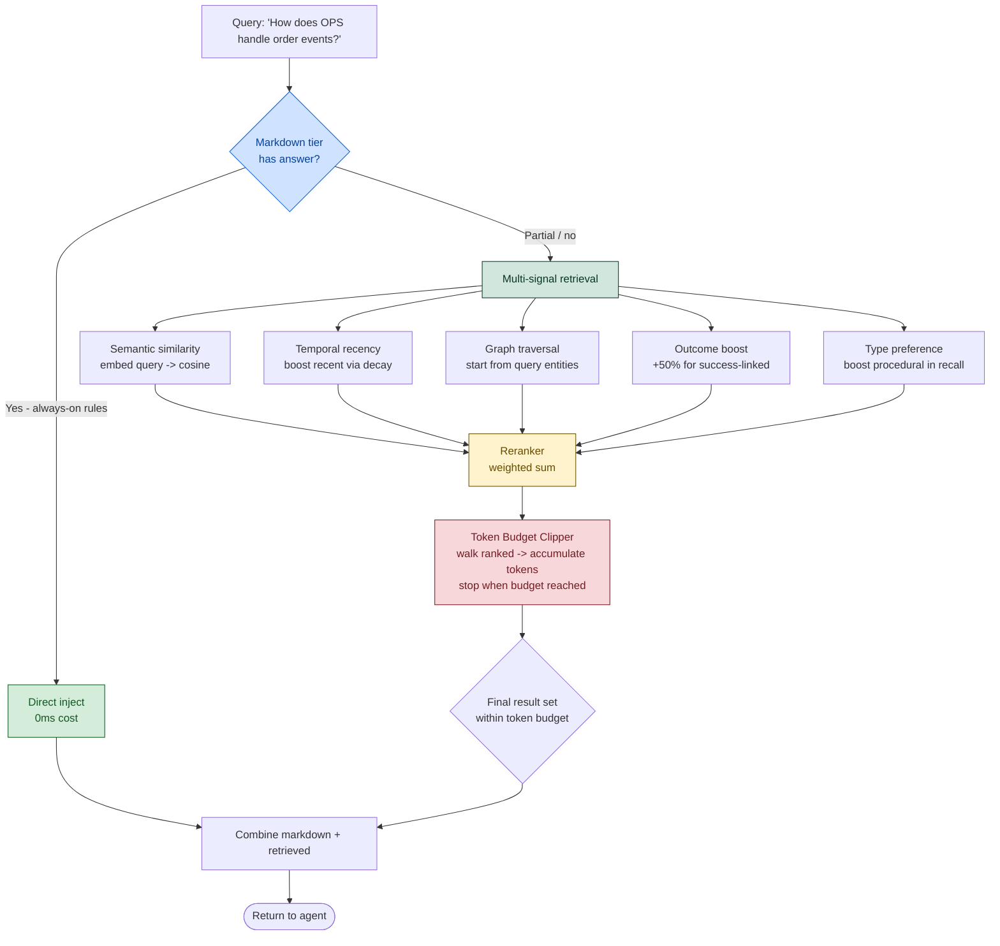
```mermaid
flowchart TB
    Q["Query: 'How does OPS handle order events?'"] --> Md{Markdown tier<br>has answer?}

    Md -->|Yes - always-on rules| MdHit[Direct inject<br>0ms cost]
    Md -->|Partial / no| Multi[Multi-signal retrieval]

    Multi --> S1[Semantic similarity<br>embed query -> cosine]
    Multi --> S2[Temporal recency<br>boost recent via decay]
    Multi --> S3[Graph traversal<br>start from query entities]
    Multi --> S4[Outcome boost<br>+50% for success-linked]
    Multi --> S5[Type preference<br>boost procedural in recall]

    S1 --> Rerank[Reranker<br>weighted sum]
    S2 --> Rerank
    S3 --> Rerank
    S4 --> Rerank
    S5 --> Rerank

    Rerank --> Clip[Token Budget Clipper<br>walk ranked -> accumulate tokens<br>stop when budget reached]
    Clip --> Final{Final result set<br>within token budget}

    MdHit --> Combine[Combine markdown + retrieved]
    Final --> Combine
    Combine --> Out([Return to agent])

    style Md fill:#cfe2ff,stroke:#0c63e4,color:#084298
    style MdHit fill:#d4edda,stroke:#155724,color:#155724
    style Multi fill:#d1e7dd,stroke:#0a3622,color:#0a3622
    style Rerank fill:#fff3cd,stroke:#664d03,color:#664d03
    style Clip fill:#f8d7da,stroke:#721c24,color:#721c24
```

**Default reranker weights**: `semantic_sim 0.45 + decay 0.20 + graph_proximity 0.15 + outcome_boost 0.10 + type_pref 0.10`

ASCII view:

```text
         RETRIEVAL PIPELINE
 -----------------------------------
 |                                 |
 | Query: "How does OPS handle order events?" |
 |                                 |
 |  -----------   -----------   ----------- |
 |  | SEMANTIC|   | TEMPORAL|   | GRAPH   | |
 |  | SIMILARITY| | RECENCY |   | TRAVERSAL| |
 |  |---------|   |---------|   |---------| |
 |  | Embed   |   | Boost   |   | Start:  | |
 |  | query ->|   | recent  |   | "OPS"   | |
 |  | cosine  |   | memories|   | Traverse:| |
 |  | vs store|   | via     |   | OPS -calls->|
 |  |         |   | decay   |   | RES     | |
 |  |         |   | score   |   | OPS -listens->|
 |  |         |   |         |   | orders.events|
 |  -----------   -----------   ----------- |
 |         |           |             |      |
 |         v           v             v      |
 |  -----------------------------------     |
 |  |          RERANKER               |     |
 |  |                                 |     |
 |  | final_score = w1 * semantic_sim |     |
 |  |             + w2 * decay_score  |     |
 |  |             + w3 * graph_proximity|   |
 |  |             + w4 * outcome_boost|     |
 |  |             + w5 * type_preference|   |
 |  |                                 |     |
 |  | Default weights:                |     |
 |  |   w1=0.45, w2=0.20, w3=0.15, w4=0.10, w5=0.10 |
 |  -----------------------------------     |
 |                   |                      |
 |                   v                      |
 |  -----------------------------------     |
 |  |      TOKEN BUDGET CLIPPER       |     |
 |  |                                 |     |
 |  | Walk ranked results, accumulate |     |
 |  | token count.                    |     |
 |  | Stop when budget reached. Return|     |
 |  | top-K within budget. Default:   |     |
 |  | 4,000 tokens.                   |     |
 |  -----------------------------------     |
 -----------------------------------
```

### 5.2 Retrieval Modes

| Mode           | Use Case                                               | Behavior                                                                     |
| -------------- | ------------------------------------------------------ | ---------------------------------------------------------------------------- |
| **`search`**   | Agent asks a specific question                         | Full pipeline: embed -> vector search -> rerank -> clip                      |
| **`recall`**   | Session start - "What do I know about this workspace?" | Retrieve top-K procedural + recent semantic + recent outcomes, within budget |
| **`relate`**   | "What connects to service X?"                          | Graph traversal from entity, return connected subgraph                       |
| **`outcomes`** | "What worked / failed for task type Y?"                | Filter to outcome memories, match by task similarity                         |

### 5.3 Session-Start Recall (Context Assembly)

When an agent begins a new session, the memory system assembles an optimized context injection:

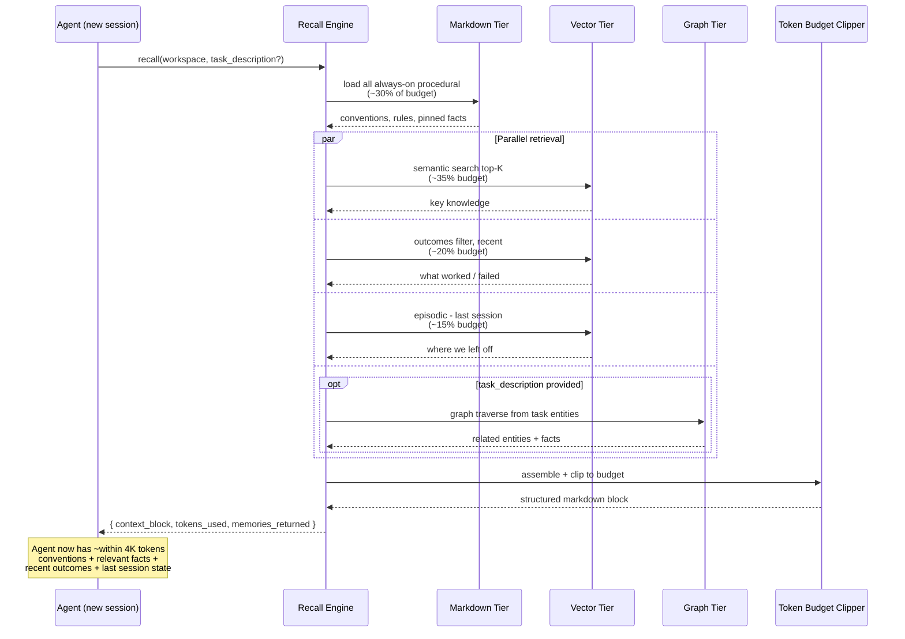
```mermaid
sequenceDiagram
    participant A as Agent (new session)
    participant R as Recall Engine
    participant Md as Markdown Tier
    participant V as Vector Tier
    participant G as Graph Tier
    participant T as Token Budget Clipper

    A->>R: recall(workspace, task_description?)
    R->>Md: load all always-on procedural<br>(~30% of budget)
    Md-->>R: conventions, rules, pinned facts
    par Parallel retrieval
        R->>V: semantic search top-K<br>(~35% budget)
        V-->>R: key knowledge
    and
        R->>V: outcomes filter, recent<br>(~20% budget)
        V-->>R: what worked / failed
    and
        R->>V: episodic - last session<br>(~15% budget)
        V-->>R: where we left off
    and
        opt task_description provided
            R->>G: graph traverse from task entities
            G-->>R: related entities + facts
        end
    end
    R->>T: assemble + clip to budget
    T-->>R: structured markdown block
    R-->>A: { context_block, tokens_used, memories_returned }

    Note over A: Agent now has ~within 4K tokens <br>conventions + relevant facts +<br>recent outcomes + last session state
```

```text
 --------------------------------------------------
 |       SESSION-START RECALL (auto-inject)       |
 |                                                |
 | Token Budget: 4,000 tokens (configurable)      |
 |                                                |
 | Allocation:                                    |
 |                                                |
 |  PROCEDURAL (always-on)   ~30%    Conventions, prefs, |
 |                                   pinned facts |
 |                                                |
 |  SEMANTIC (key facts)     ~35%    System architecture, |
 |                                   API specs    |
 |                                                |
 |  OUTCOMES (recent)        ~20%    What failed last |
 |                                   time         |
 |                                                |
 |  EPISODIC (last session)  ~15%    Where we left off|
 |                                                |
 |                                                |
 | If the agent provides a task description / query, the |
 | allocation shifts toward semantic + outcome memories  |
 | relevant to that specific task.                |
 --------------------------------------------------
```

Output format - injected as a structured block the agent can parse:

```markdown
## Memory Context (auto-retrieved)

### Conventions (procedural)
- Feature toggles: Use `@Value("${toggle.<feature>.enabled:false}")`, default false [m_001]
- Test strategy: unit + component + blackbox for all new features
- Branch naming: `feature/<JIRA-ID>-<short-description>` [m_002]

### Key Knowledge (semantic)
- OPS listens on `orders.events`, enriches with metadata, publishes to `decisions.events`
- RES uses an embedded rule engine with versioned rule packages; rules are in the `app-rules` repo
- IDS integration uses REST through PRX proxy, not direct API calls

### Recent Outcomes
- [SUCCESS] Direct binary-serializer setters in OSM - 3x faster than reflection-based mapping
- [FAILURE] Attempted Spring WebClient for PRX calls - timeout issues, reverted to RestTemplate

### Last Session Summary
- Studied real-time inbound message flow through OPS
- Identified 16 new fields requiring RES rule updates
- Left off at: task design for the next field-mapping batch (tasks/field_mapping.md)
```

***

## 6. Storage Layer

### 6.1 Backend Architecture

The storage layer uses a **polyglot persistence** model behind a unified internal API. In Go, the interface lives at `internal/storage/adapter.go`:

```go
package storage

import (
    "context"
    "github.com/yourorg/agent-memory/internal/core"
)

// Store is the primary persistence interface. Backends (SQLite, Postgres) implement it.
type Store interface {
    WriteMemory(ctx context.Context, entry *core.MemoryEntry) (string, error)
    GetMemory(ctx context.Context, id string) (*core.MemoryEntry, error)
    Update(ctx context.Context, id string, patch *core.MemoryPatch) error
    Delete(ctx context.Context, id string) error

    SearchByVector(ctx context.Context, embedding []float32, topK int, filters SearchFilters) ([]*core.MemoryEntry, error)
    SearchByEntity(ctx context.Context, entity string, filters SearchFilters) ([]*core.MemoryEntry, error)
    GetRelated(ctx context.Context, id string, depth int) ([]*core.MemoryEntry, error)

    // Bulk operations for the REM Cycle
    BulkUpdateDecay(ctx context.Context, workspace string) (int, error)
    BulkSupersede(ctx context.Context, ids []string, supersedeBy string) error
    Stats(ctx context.Context, workspace string) (*StoreStats, error)
}

// TierAdapter is implemented by storage tiers that don't speak the full Store interface
// (e.g. the markdown tier is file-backed and only supports its own operations).
type TierAdapter interface {
    SupportsTier(tier core.StorageTier) bool
    Write(ctx context.Context, entry *core.MemoryEntry) error
    Read(ctx context.Context, id string) (*core.MemoryEntry, error)
    Remove(ctx context.Context, id string) error
}
```

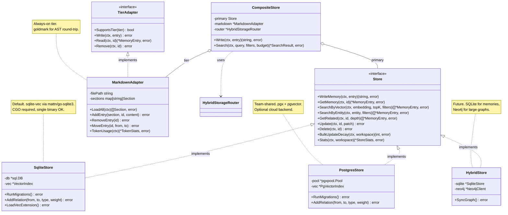
```mermaid
classDiagram
    class Store {
        <<interface>>
        +WriteMemory(ctx, entry) (string, error)
        +GetMemory(ctx, id) (*MemoryEntry, error)
        +SearchByVector(ctx, embedding, topK, filters) ([]*MemoryEntry, error)
        +SearchByEntity(ctx, entity, filters) ([]*MemoryEntry, error)
        +GetRelated(ctx, id, depth) ([]*MemoryEntry, error)
        +Update(ctx, id, patch) error
        +Delete(ctx, id) error
        +BulkUpdateDecay(ctx, workspace) (int, error)
        +Stats(ctx, workspace) (*StoreStats, error)
    }

    class TierAdapter {
        <<interface>>
        +SupportsTier(tier) bool
        +Write(ctx, entry) error
        +Read(ctx, id) (*MemoryEntry, error)
        +Remove(ctx, id) error
    }

    class MarkdownAdapter {
        -filePath string
        -sections map[string]Section
        +LoadAll(ctx) ([]Section, error)
        +AddEntry(section, id, content) error
        +RemoveEntry(id) error
        +MoveEntry(id, from, to) error
        +TokenUsage(ctx) (*TokenStats, error)
    }

    class SqliteStore {
        -db *sql.DB
        -vec *VectorIndex
        +RunMigrations() error
        +AddRelation(from, to, type, weight) error
        +LoadVecExtension() error
    }

    class PostgresStore {
        -pool *pgxpool.Pool
        -vec *PgVectorIndex
        +RunMigrations() error
        +AddRelation(from, to, type, weight) error
    }

    class HybridStore {
        -sqlite *SqliteStore
        -neo4j *Neo4jClient
        +SyncGraph() error
    }

    class CompositeStore {
        -primary Store
        -markdown *MarkdownAdapter
        -router *HybridStorageRouter
        +Write(ctx, entry) (string, error)
        +Search(ctx, query, filters, budget) (*SearchResult, error)
    }

    Store <|.. SqliteStore : implements
    Store <|.. PostgresStore : implements
    Store <|.. HybridStore : implements
    TierAdapter <|.. MarkdownAdapter : implements
    CompositeStore o-- Store : primary
    CompositeStore o-- MarkdownAdapter : tier
    CompositeStore ..> HybridStorageRouter : uses

    note for SqliteStore "Default. sqlite-vec via mattn/go-sqlite3.<br>CGO required, single binary OK."
    note for PostgresStore "Team-shared. pgx + pgvector.<br>Optional cloud backend."
    note for HybridStore "Future. SQLite for memories,<br>Neo4j for large graphs."
    note for MarkdownAdapter "Always-on tier.<br>goldmark for AST round-trip."
```

The `Store` interface is the abstraction the engine talks to. Tests use a `MemStore` (in-memory map) implementation; production uses `SqliteStore` (default) or `PostgresStore` (team-shared).

### 6.2 SQLite Schema (Default - Local Mode)

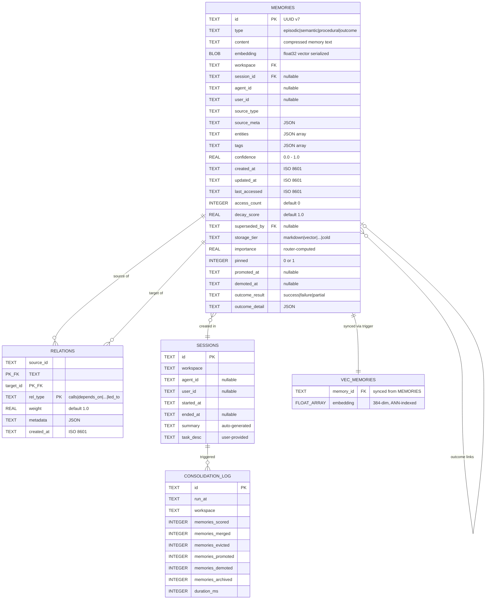
```mermaid
erDiagram
    MEMORIES ||--o{ RELATIONS : "source of"
    MEMORIES ||--o{ RELATIONS : "target of"
    MEMORIES }o--|| SESSIONS : "created in"
    MEMORIES ||--o{ MEMORIES : "superseded by"
    SESSIONS ||--o{ CONSOLIDATION_LOG : "triggered"
    MEMORIES }o--o| MEMORIES : "outcome links"

    MEMORIES {
        TEXT id PK "UUID v7"
        TEXT type "episodic|semantic|procedural|outcome"
        TEXT content "compressed memory text"
        BLOB embedding "float32 vector serialized"
        TEXT workspace FK
        TEXT session_id FK "nullable"
        TEXT agent_id "nullable"
        TEXT user_id "nullable"
        TEXT source_type
        TEXT source_meta "JSON"
        TEXT entities "JSON array"
        TEXT tags "JSON array"
        REAL confidence "0.0 - 1.0"
        TEXT created_at "ISO 8601"
        TEXT updated_at "ISO 8601"
        TEXT last_accessed "ISO 8601"
        INTEGER access_count "default 0"
        REAL decay_score "default 1.0"
        TEXT superseded_by FK "nullable"
        TEXT storage_tier "markdown|vector|...|cold"
        REAL importance "router-computed"
        INTEGER pinned "0 or 1"
        TEXT promoted_at "nullable"
        TEXT demoted_at "nullable"
        TEXT outcome_result "success|failure|partial"
        TEXT outcome_detail "JSON"
    }

    RELATIONS {
        TEXT source_id PK_FK
        TEXT target_id PK_FK
        TEXT rel_type PK "calls|depends_on|...|led_to"
        REAL weight "default 1.0"
        TEXT metadata "JSON"
        TEXT created_at "ISO 8601"
    }

    SESSIONS {
        TEXT id PK
        TEXT workspace
        TEXT agent_id "nullable"
        TEXT user_id "nullable"
        TEXT started_at
        TEXT ended_at "nullable"
        TEXT summary "auto-generated"
        TEXT task_desc "user-provided"
    }

    CONSOLIDATION_LOG {
        TEXT id PK
        TEXT run_at
        TEXT workspace
        INTEGER memories_scored
        INTEGER memories_merged
        INTEGER memories_evicted
        INTEGER memories_promoted
        INTEGER memories_demoted
        INTEGER memories_archived
        INTEGER duration_ms
    }

    VEC_MEMORIES {
        TEXT memory_id FK "synced from MEMORIES"
        FLOAT_ARRAY embedding "384-dim, ANN-indexed"
    }

    MEMORIES ||--|| VEC_MEMORIES : "synced via trigger"
```

```sql
-- Core memory entries
CREATE TABLE memories (
    id              TEXT PRIMARY KEY,     -- UUID v7
    type            TEXT NOT NULL,        -- episodic | semantic | procedural | outcome
    content         TEXT NOT NULL,        -- compressed memory text
    embedding       BLOB NOT NULL,        -- float32 vector (serialized)

    workspace       TEXT NOT NULL,
    session_id      TEXT,
    agent_id        TEXT,
    user_id         TEXT,

    source_type     TEXT NOT NULL,
    source_meta     TEXT,                 -- JSON
    entities        TEXT,                 -- JSON array of entity strings
    tags            TEXT,                 -- JSON array of tag strings
    confidence      REAL DEFAULT 1.0,

    created_at      TEXT NOT NULL,
    updated_at      TEXT NOT NULL,
    last_accessed   TEXT NOT NULL,
    access_count    INTEGER DEFAULT 0,
    decay_score     REAL DEFAULT 1.0,
    superseded_by   TEXT,                 -- FK to memories.id

    -- Hybrid storage routing (see §6.5)
    storage_tier    TEXT NOT NULL DEFAULT 'vector', -- markdown | vector | vector+graph | document | cold
    importance      REAL NOT NULL DEFAULT 0.5,      -- 0.0 - 1.0, computed by router
    pinned          INTEGER NOT NULL DEFAULT 0,     -- boolean: 1 = user-pinned to markdown
    promoted_at     TEXT,                           -- ISO 8601, set when promoted to markdown
    demoted_at      TEXT,                           -- ISO 8601, set when demoted from markdown

    outcome_result  TEXT,                           -- success | failure | partial
    outcome_detail  TEXT                            -- JSON with approach, reason, linked_memories
);

CREATE INDEX idx_memories_workspace ON memories(workspace);
CREATE INDEX idx_memories_type ON memories(type);
CREATE INDEX idx_memories_decay ON memories(decay_score);
CREATE INDEX idx_memories_entities ON memories(entities);
CREATE INDEX idx_memories_created ON memories(created_at);
CREATE INDEX idx_memories_tier ON memories(storage_tier);
CREATE INDEX idx_memories_importance ON memories(importance);

-- Relationship edges (lightweight graph)
CREATE TABLE relations (
    source_id   TEXT NOT NULL REFERENCES memories(id),
    target_id   TEXT NOT NULL REFERENCES memories(id),
    rel_type    TEXT NOT NULL,          -- calls | depends_on | contains | contradicts | supersedes | led_to
    weight      REAL DEFAULT 1.0,
    metadata    TEXT,                   -- JSON
    created_at  TEXT NOT NULL,
    PRIMARY KEY (source_id, target_id, rel_type)
);

CREATE INDEX idx_relations_target ON relations(target_id);

-- Session metadata
CREATE TABLE sessions (
    id          TEXT PRIMARY KEY,
    workspace   TEXT NOT NULL,
    agent_id    TEXT,
    started_at  TEXT,
    ended_at    TEXT,
    summary     TEXT,                   -- auto-generated session summary
    task_desc   TEXT                    -- user-provided task description
);

-- Consolidation log
CREATE TABLE consolidation_log (
    id                  TEXT PRIMARY KEY,
    run_at              TEXT NOT NULL,
    workspace           TEXT NOT NULL,
    memories_scored     INTEGER,
    memories_merged     INTEGER,
    memories_evicted    INTEGER,
    memories_promoted   INTEGER,
    duration_ms         INTEGER
);
```

### 6.3 Vector Search Implementation

**Local mode (SQLite)**:

- Use `sqlite-vec` extension (successor to `sqlite-vss`) for ANN search
- Embedding model: `all-MiniLM-L6-v2` (384 dimensions) via ONNX Runtime - runs locally, no API calls
- Fallback: brute-force cosine similarity for stores < 10K entries (fast enough without ANN)

**Cloud mode (PostgreSQL)**:

- Use `pgvector` extension with IVFFlat or HNSW indexes
- Embedding model: configurable - local ONNX or OpenAI `text-embedding-3-small` (1536 dim)

### 6.4 Graph Storage (Relationship Modeling)

For the initial implementation, the `relations` table in SQLite provides a lightweight adjacency list. Queries like "What does OPS connect to?" are simple JOINs:

```sql
SELECT m.* FROM memories m
JOIN relations r ON r.target_id = m.id
WHERE r.source_id = (SELECT id FROM memories WHERE content LIKE '%OPS%' AND type = 'semantic' LIMIT 1)
  AND r.rel_type IN ('calls', 'depends_on', 'listens_on')
ORDER BY r.weight DESC;
```

For future scale (> 50K relationships), the design supports plugging in Neo4j or a dedicated graph database via the `StorageAdapter` interface.

### 6.5 Hybrid Storage Router

The **Hybrid Storage Router** is the component that decides - for every memory write - which tier(s) the memory belongs in. This is what makes the system **flexible**: markdown is used where markdown wins, vector where vector wins, graph where graph wins, document store where bulk metadata wins.

> See `[analysis.md](./analysis.md)` for the full justification of why a hybrid router beats markdown-only or vector-only, with worked examples.

#### 6.5.1 The four storage tiers

| Tier               | Backed by                                             | Best for                                                             | Always-loaded?                           |
| ------------------ | ----------------------------------------------------- | -------------------------------------------------------------------- | ---------------------------------------- |
| **`markdown`**     | `MEMORY.md` files in `.agent-memory/` (per workspace) | Procedural rules, pinned facts, hot-promoted small facts             | **Yes** - auto-injected at session start |
| **`vector`**       | SQLite + sqlite-vec                                   | Episodic, semantic, outcome memories                                 | No - retrieved on demand                 |
| **`vector+graph`** | SQLite (vec table + relations table)                  | Semantic facts with entity relationships                             | No - retrieved or traversed on demand    |
| **`document`**     | SQLite JSON columns                                   | Large structured records (session logs, outcome detail), audit trail | No - filter by metadata on demand        |
| **`cold`**         | Compressed JSON archive on disk                       | Decayed but historically referenced memories                         | No - restored on demand                  |

#### 6.5.2 Router decision flow

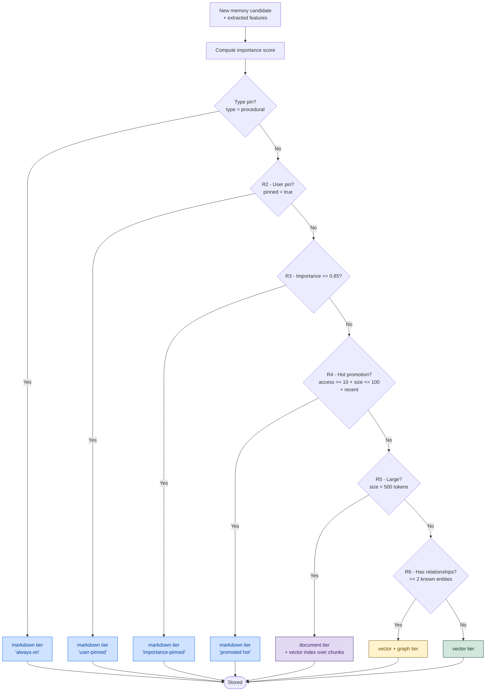
```mermaid
flowchart TD
    Write[New memory candidate<br>+ extracted features] --> Score[Compute importance score]
    
    Score --> R1{"Type pin?<br>type = procedural"}
    R1 -->|Yes| Md1[markdown tier<br>'always-on']
    R1 -->|No| R2{"R2 - User pin?<br>pinned = true"}
    
    R2 -->|Yes| Md2[markdown tier<br>'user-pinned']
    R2 -->|No| R3{"R3 - Importance >= 0.85?"}
    
    R3 -->|Yes| Md3[markdown tier<br>'importance-pinned']
    R3 -->|No| R4{"R4 - Hot promotion?<br>access >= 10 + size <= 100<br>+ recent"}
    
    R4 -->|Yes| Md4[markdown tier<br>'promoted hot']
    R4 -->|No| R5{"R5 - Large?<br>size > 500 tokens"}
    
    R5 -->|Yes| Doc[document tier<br>+ vector index over chunks]
    R5 -->|No| R6{"R6 - Has relationships?<br>>= 2 known entities"}
    
    R6 -->|Yes| VG[vector + graph tier]
    R6 -->|No| V[vector tier]
    
    Md1 --> Done([Stored])
    Md2 --> Done
    Md3 --> Done
    Md4 --> Done
    Doc --> Done
    VG --> Done
    V --> Done
    
    style Md1 fill:#cfe2ff,stroke:#0c63e4,color:#084298
    style Md2 fill:#cfe2ff,stroke:#0c63e4,color:#084298
    style Md3 fill:#cfe2ff,stroke:#0c63e4,color:#084298
    style Md4 fill:#cfe2ff,stroke:#0c63e4,color:#084298
    style V fill:#d1e7dd,stroke:#0a3622,color:#0a3622
    style VG fill:#fff3cd,stroke:#664d03,color:#664d03
    style Doc fill:#e2d9f3,stroke:#3d216c,color:#3d216c
```

#### 6.5.3 Importance score

```text
importance = 0.30 × type_weight
           + 0.20 × user_signal       (user-stated +1.0; agent-inferred +0.5)
           + 0.20 × outcome_link      (linked to outcome +1.0; no link 0.0)
           + 0.15 × frequency_signal  (related entity appears in many memories)
           + 0.15 × confidence        (write-pipeline confidence 0.0 - 1.0)

type_weight:
  procedural = 1.0
  semantic   = 0.7
  outcome    = 0.6
  episodic   = 0.4
```

#### 6.5.4 Markdown tier file format

The markdown tier writes to `<workspace>/.agent-memory/MEMORY.md`. The file is:

- **Versioned in git** (recommended)
- **Human-readable & editable**
- **Auto-injected at session start** (via the recall engine, see §5.3)
- **Bounded by** **`markdown_token_budget`** (default 4,000 tokens; demotion enforces it)

Example layout:

```markdown
# Agent Memory - sample workspace

> Auto-managed by tools/agent-memory. Each section is a memory tier.
> Last updated: 2026-05-07T14:30:00Z

## Conventions (procedural - always on)
<!-- agent-memory:procedural -->
- Feature toggles: `@Value("${toggle.<feature>.enabled:false}")`, default false [m_001]
- Branch naming: `feature/<JIRA-ID>-<short-description>` [m_002]
- Test strategy: unit + component + blackbox for all new features [m_003]

## User-pinned facts
<!-- agent-memory:pinned -->
- Production environment uses Java 17, Spring Boot 3.2 [m_010]
- All OPS services route through PRX proxy for external calls [m_011]

## Promoted hot facts (auto-managed)
<!-- agent-memory:promoted -->
- OPS listens on `orders.events`, publishes to `decisions.events` [m_088, accessed 14x]
- RES uses an embedded rule engine with versioned rule packages from `app-rules` repo [m_092, accessed 12x]

## Historical / superseded
<!-- agent-memory:historical -->
- ~~Use Spring WebClient for PRX calls~~ [m_055, superseded 2026-04-12]
  Reason: timeout issues, replaced with RestTemplate [m_056]
```

The `[m_xxx]` IDs link back to the canonical entries in the SQLite store. The HTML comments are tier markers the markdown adapter uses for safe round-tripping (read -> modify -> write without disturbing other sections).

#### 6.5.5 Promotion and demotion (lifecycle integration)

The router is **invoked twice**: at write time (§6.5.2) and during the REM cycle (background lifecycle review, §7 Phase 6). The lifecycle uses these rules to **move memories between tiers**:

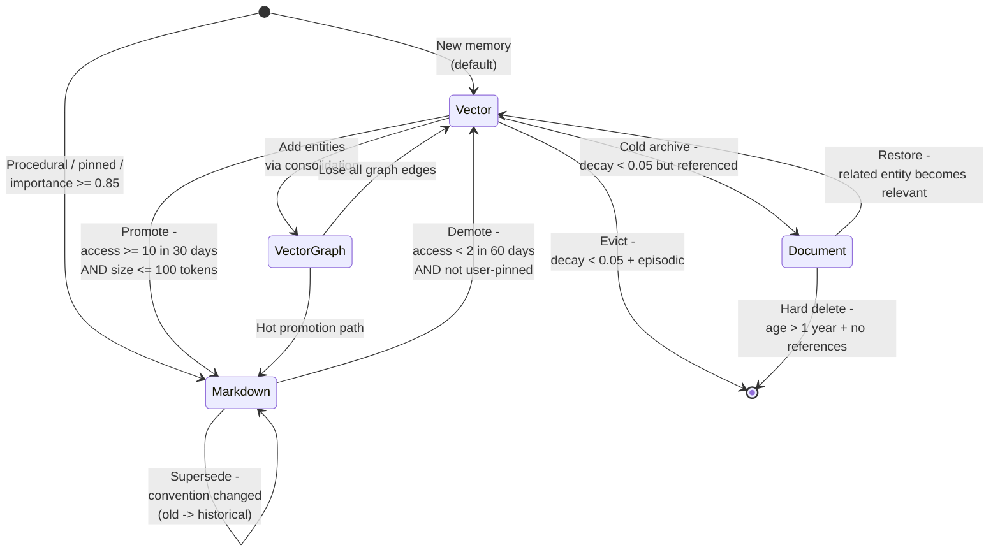
```mermaid
stateDiagram-v2
    [*] --> Vector : New memory<br>(default)
    [*] --> Markdown : Procedural / pinned /<br>importance >= 0.85

    Vector --> Markdown : Promote -<br>access >= 10 in 30 days<br>AND size <= 100 tokens
    Vector --> VectorGraph : Add entities<br>via consolidation
    Vector --> Document : Cold archive -<br>decay < 0.05 but referenced
    Vector --> [*] : Evict -<br>decay < 0.05 + episodic

    VectorGraph --> Markdown : Hot promotion path
    VectorGraph --> Vector : Lose all graph edges

    Markdown --> Vector : Demote -<br>access < 2 in 60 days<br>AND not user-pinned
    Markdown --> Markdown : Supersede -<br>convention changed<br>(old -> historical)

    Document --> Vector : Restore -<br>related entity becomes relevant
    Document --> [*] : Hard delete -<br>age > 1 year + no references
```

| Transition rule                       | Trigger                                                  | Why this                                                                                   |
| ------------------------------------- | -------------------------------------------------------- | ------------------------------------------------------------------------------------------ |
| **Vector -> Markdown** (promote)      | `access_count >= 10` in 30 days AND `size <= 100 tokens` | Hot, small facts - pinning eliminates 10+ retrieval calls/month, costs \~30 tokens/session |
| **Markdown -> Vector** (demote)       | `access_count < 2` in 60 days AND not user-pinned        | Markdown is finite - keep only what's actively used                                        |
| **Vector -> Document** (cold archive) | `decay_score < 0.05` AND referenced from active memories | Don't lose facts entirely if other memories link to them                                   |
| **Document -> Vector** (restore)      | A query touches a related entity                         | Revive cold facts when relevance returns                                                   |
| **Markdown -> Markdown** (historical) | New memory contradicts an existing markdown entry        | Preserve audit trail; remove from always-on section                                        |

#### 6.5.6 Routing API

The router is internal (not user-facing) but exposes diagnostics:

```yaml
# Get router decision for a hypothetical memory
POST /api/v1/router/explain
  Body:
    content: string
    type?: MemoryType
    entities?: string[]
    pinned?: boolean
  Response:
    importance: number
    chosen_tier: StorageTier
    rules_evaluated: [{ rule: string, matched: boolean, reason: string }]
    explanation: string

# Manually pin / unpin a memory (overrides router)
POST /api/v1/memories/:id/pin
  Body: { pinned: boolean }
  Response: { id, storage_tier, pinned }
```

CLI:

```bash
agent-memory router-explain --content "Always use feature toggles" --type procedural
# -> importance: 0.95, chosen_tier: markdown (rule R1: type=procedural)

agent-memory pin m_088
# -> m_088 promoted to markdown tier, pinned=true
```

***

## 7. Lifecycle Manager (REM Cycle)

The REM cycle ("Review, Evaluate, Maintain") runs as a background process between sessions or on a configurable schedule:

```mermaid
flowchart TB
    Trigger([Trigger:<br>session end / cron / manual]) --> P1

    subgraph P1["Phase 1 - DECAY SCORING"]
        D1[For each memory:<br>decay_score = e^(-λ·age) ×<br>access_boost × outcome_boost]
        D1 --> D2[Write updated scores back]
    end

    subgraph P2["Phase 2 - CLUSTER"]
        C1[Group episodic memories<br>by entity overlap +<br>semantic similarity]
        C1 --> C2[Clusters of >= 3 -> consolidation candidates]
    end

    subgraph P3["Phase 3 - CONSOLIDATE"]
        S1[For each cluster:<br>fast template merge OR<br>LLM merge]
        S1 --> S2[Create 1 semantic memory<br>from N episodic]
        S2 --> S3[Mark originals superseded]
    end

    subgraph P4["Phase 4 - CONFLICT RESOLVE"]
        F1[Find pairs:<br>same entities + high sim +<br>contradicting content]
        F1 --> F2[Keep more recent /<br>higher confidence]
        F2 --> F3[Add 'contradicts' relation]
    end

    subgraph P5["Phase 5 - EVICT"]
        E1[Delete:<br>decay < 0.05 + episodic<br>OR superseded > 30 days<br>OR over max_entries]
    end

    subgraph P6["Phase 6 - PROMOTE"]
        Pr1[Outcomes: same approach succeeds 3x -><br>create procedural rule]
        Pr2[Outcomes: same approach fails 2x -><br>create avoidance rule]
        Pr3[Vector: access_count >= 10 + small -><br>promote to markdown tier]
    end

    subgraph P7["Phase 7 - METRICS"]
        M1[Log: scored, merged, evicted, promoted]
        M1 --> M2[Update store health metrics]
        M2 --> M3[Estimate token savings]
    end

    P1 --> P2 --> P3 --> P4 --> P5 --> P6 --> P7
    P7 --> Done([Cycle complete])

    style P1 fill:#fff3cd,stroke:#664d03,color:#664d03
    style P3 fill:#d1e7dd,stroke:#0a3622,color:#0a3622
    style P5 fill:#f8d7da,stroke:#721c24,color:#721c24
    style P6 fill:#cfe2ff,stroke:#0c63e4,color:#084298
```

ASCII view:

```text
-------------------------------------------------------
|                REM CYCLE (Background)               |
|                                                     |
| Trigger: session end, cron (every 6h), or manual    |
|                                                     |
| Phase 1: DECAY SCORING                              |
| --------------------------------------------------- |
| For each memory:                                    |
|   decay_score = e^(-λ × age) × access_boost × outcome_val |
| Write updated scores back to store.                 |
|                                                     |
| Phase 2: CLUSTER                                    |
| --------------------------------------------------- |
| Group episodic memories by entity overlap + semantic sim. |
| Clusters of >= 3 memories about the same entity -> candidate |
| for consolidation.                                  |
|                                                     |
| Phase 3: CONSOLIDATE                                |
| --------------------------------------------------- |
| For each cluster:                                   |
|   - Fast mode: merge contents via template          |
|   - LLM mode: send cluster to LLM with merge prompt |
|   - Create one semantic memory from N episodic memories |
|   - Mark episodic memories as superseded            |
|                                                     |
| Phase 4: CONFLICT RESOLVE                           |
| --------------------------------------------------- |
| Find memory pairs with high similarity but contradicting |
| content (detected via entity match + negation / different |
| values for same property).                          |
|   - Keep the more recent / higher confidence entry  |
|   - Mark the older one as superseded                |
|                                                     |
| Phase 5: EVICT                                      |
| --------------------------------------------------- |
| Delete memories where:                              |
|   - decay_score < 0.05 AND type = "episodic"        |
|   - superseded_by IS NOT NULL AND age > 30 days     |
|   - Store exceeds max_entries -> evict lowest decay_score |
|                                                     |
| Phase 6: PROMOTE                                    |
| --------------------------------------------------- |
| Scan outcome memories for repeated patterns:        |
|   - If same approach succeeds >= 3 times -> create  |
|     procedural memory ("always do X for task type Y") |
|   - If same approach fails >= 2 times -> create     |
|     procedural memory ("avoid X for task type Y")   |
|                                                     |
| Phase 7: METRICS                                    |
| --------------------------------------------------- |
| Log: memories scored, merged, evicted, promoted.    |
| Update store health metrics.                        |
| Estimate token savings since last cycle.            |
-------------------------------------------------------
```

***

## 8. Forgotten Memory Re-investigation

> **The "tip of the tongue" problem.** Decay + eviction + consolidation are necessary for a healthy store - but they create a gap that pure machine forgetting cannot recover from. Humans don't truly forget the way databases do: we *know we knew something*, we have *fragments*, and we can *reconstruct or re-learn* from sources. This section adds that capability.

### 8.1 The gap pure forgetting leaves

The current lifecycle (§7) creates four kinds of "forgetting" - each with different recoverability if we do nothing extra:

| Mechanism                                       | What's lost                                     | Recoverable without extra design?              |
| ----------------------------------------------- | ----------------------------------------------- | ---------------------------------------------- |
| **Decay** (score -> 0)                          | Memory ranks low in retrieval, but still exists | ✅ Yes - score recovers on access               |
| **Demotion** (markdown -> vector)               | Always-on guarantee                             | ✅ Yes - still searchable                       |
| **Eviction** (decay < 0.05 + episodic)          | Memory deleted                                  | ❌ **No** - gone                                |
| **Consolidation** (N -> 1)                      | Originals replaced by merged summary            | ⚠️ Partial - summary survives, originals don't |
| **Cold archive expiry** (1 year + unreferenced) | Document-tier hard delete                       | ❌ **No** - gone                                |

The two ❌ rows are where the system mimics catastrophic forgetting - the agent has no way to know it ever knew. This section closes that gap with **tombstones**, a **gap detector**, and **reconstruction strategies**.

### 8.2 Cognitive analogy

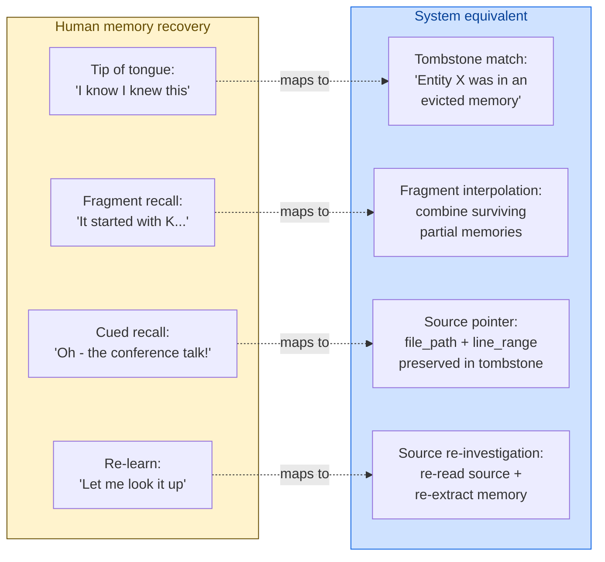
```mermaid
flowchart LR
    subgraph Human["Human memory recovery"]
        H1[Tip of tongue:<br>'I know I knew this']
        H2[Fragment recall:<br>'It started with K...']
        H3[Cued recall:<br>'Oh - the conference talk!']
        H4[Re-learn:<br>'Let me look it up']
    end

    subgraph System["System equivalent"]
        S1[Tombstone match:<br>'Entity X was in an<br>evicted memory']
        S2[Fragment interpolation:<br>combine surviving<br>partial memories]
        S3[Source pointer:<br>file_path + line_range<br>preserved in tombstone]
        S4[Source re-investigation:<br>re-read source +<br>re-extract memory]
    end

    H1 -.->|maps to| S1
    H2 -.->|maps to| S2
    H3 -.->|maps to| S3
    H4 -.->|maps to| S4

    style Human fill:#fff3cd,stroke:#664d03,color:#664d03
    style System fill:#cfe2ff,stroke:#0c63e4,color:#084298
```

### 8.3 Tombstones - what survives eviction

Instead of fully deleting evicted/expired memories, we keep a **tombstone** - a tiny record (\~50 bytes vs \~1 KB for the full memory) that preserves *just enough to detect "I used to know something here"*:

```typescript
interface MemoryTombstone {
  id: string;                 // original memory ID (preserved across eviction)
  workspace: string;
  type: MemoryType;           // what kind of memory was lost
  entities: string[];         // entity names - the keys for matching
  entity_hash: string;        // locality-sensitive hash for fast lookup
  source: MemorySource;       // pointer to original source (file, page, session)
  created_at: string;         // when the original memory was created
  evicted_at: string;         // when the original memory was lost
  eviction_reason: 'decay' | 'evict' | 'demote' | 'consolidate' | 'archive_expired' | 'manual';
  successor_ids: string[];    // memory IDs that replaced/consumed this (consolidation)
  cluster_id?: string;        // if part of a consolidation cluster
  fragment_summary?: string;  // optional ~100-char gist for cheap reconstruction hints
}
```

Storage cost in perspective:

| Memories evicted | Tombstones (50 B each) | Storage    | Equivalent in original memory storage (\~1 KB each) |
| ---------------- | ---------------------- | ---------- | --------------------------------------------------- |
| 10,000           | 500 KB                 | Negligible | 10 MB                                               |
| 100,000          | 5 MB                   | Trivial    | 100 MB                                              |
| 1,000,000        | 50 MB                  | Acceptable | 1 GB                                                |

Tombstones get their own table with a long TTL (default **5 years**) - far longer than any active memory's half-life, but bounded:

```sql
CREATE TABLE memory_tombstones (
    id              TEXT PRIMARY KEY,       -- original memory ID
    workspace       TEXT NOT NULL,
    type            TEXT,
    entities        TEXT,                   -- JSON array
    entity_hash     TEXT,                   -- LSH for fast match
    source_type     TEXT,
    source_meta     TEXT,                   -- JSON: file_path, line_range, page_id
    created_at      TEXT,
    evicted_at      TEXT NOT NULL,
    eviction_reason TEXT NOT NULL,
    successor_ids   TEXT,                   -- JSON array
    cluster_id      TEXT,
    fragment_summary TEXT
);

CREATE INDEX idx_tombstone_workspace ON memory_tombstones(workspace);
CREATE INDEX idx_tombstone_entity_hash ON memory_tombstones(entity_hash);
CREATE INDEX idx_tombstone_evicted_at ON memory_tombstones(evicted_at);
```

### 8.4 The gap detector

Every retrieval call runs the gap detector **in parallel** with normal multi-signal retrieval (§5.1). It computes a **forgotten-signal score** indicating how strongly the system used to know more about the query than it does now:

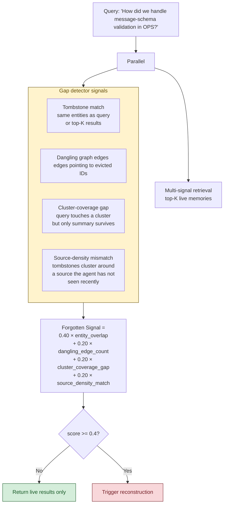
```mermaid
flowchart TD
    Q[Query: 'How did we handle message-schema validation in OPS?'] --> Parallel
    Parallel --> Live[Multi-signal retrieval <br>top-K live memories]
    Parallel --> Gap[Gap detector]

    subgraph Gap["Gap detector signals"]
        T[Tombstone match <br>same entities as query<br>or top-K results]
        E[Dangling graph edges <br>edges pointing to evicted IDs]
        C[Cluster-coverage gap <br>query touches a cluster<br>but only summary survives]
        S[Source-density mismatch <br>tombstones cluster around<br>a source the agent has not<br>seen recently]
    end

    Gap --> Score["Forgotten Signal =<br>0.40 × entity_overlap<br>+ 0.20 × dangling_edge_count<br>+ 0.20 × cluster_coverage_gap<br>+ 0.20 × source_density_match"]
    Score --> Threshold{score >= 0.4?}
    Threshold -->|No| Pass[Return live results only]
    Threshold -->|Yes| Reconstruct[Trigger reconstruction]

    style Gap fill:#fff3cd,stroke:#664d03,color:#664d03
    style Reconstruct fill:#f8d7da,stroke:#721c24,color:#721c24
    style Pass fill:#d4edda,stroke:#155724,color:#155724
```

**False-positive guards:**

- Threshold defaults to **0.4** - only fires when the signal is unambiguous
- Requires `>= 2` tombstones to match (single tombstone may be coincidence)
- Cooldown: don't re-investigate the same query within 24 hours

### 8.5 Reconstruction strategies - in cost order

When the gap detector fires, the system tries strategies from cheapest to most expensive. It stops as soon as one produces a memory above the confidence threshold.

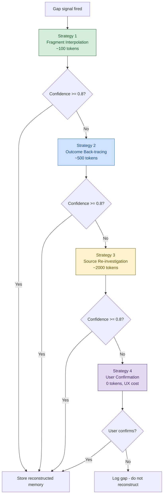
```mermaid
flowchart TB
    Trigger[Gap signal fired] --> S1
    S1[Strategy 1<br>Fragment Interpolation<br>~100 tokens] --> C1{Confidence >= 0.8?}
    C1 -->|Yes| Done[Store reconstructed memory]
    C1 -->|No| S2

    S2[Strategy 2<br>Outcome Back-tracing<br>~500 tokens] --> C2{Confidence >= 0.8?}
    C2 -->|Yes| Done
    C2 -->|No| S3

    S3[Strategy 3<br>Source Re-investigation<br>~2000 tokens] --> C3{Confidence >= 0.8?}
    C3 -->|Yes| Done
    C3 -->|No| S4

    S4[Strategy 4<br>User Confirmation<br>0 tokens, UX cost] --> C4{User confirms?}
    C4 -->|Yes| Done
    C4 -->|No| Discard[Log gap - do not reconstruct]

    style S1 fill:#d4edda,stroke:#155724,color:#155724
    style S2 fill:#cfe2ff,stroke:#0c63e4,color:#084298
    style S3 fill:#fff3cd,stroke:#664d03,color:#664d03
    style S4 fill:#e2d9f3,stroke:#3d216c,color:#3d216c
```

#### Strategy 1 - Fragment Interpolation (cheap)

Combine surviving partial memories around the gap to infer the missing piece. No external calls; uses only what's already in the store.

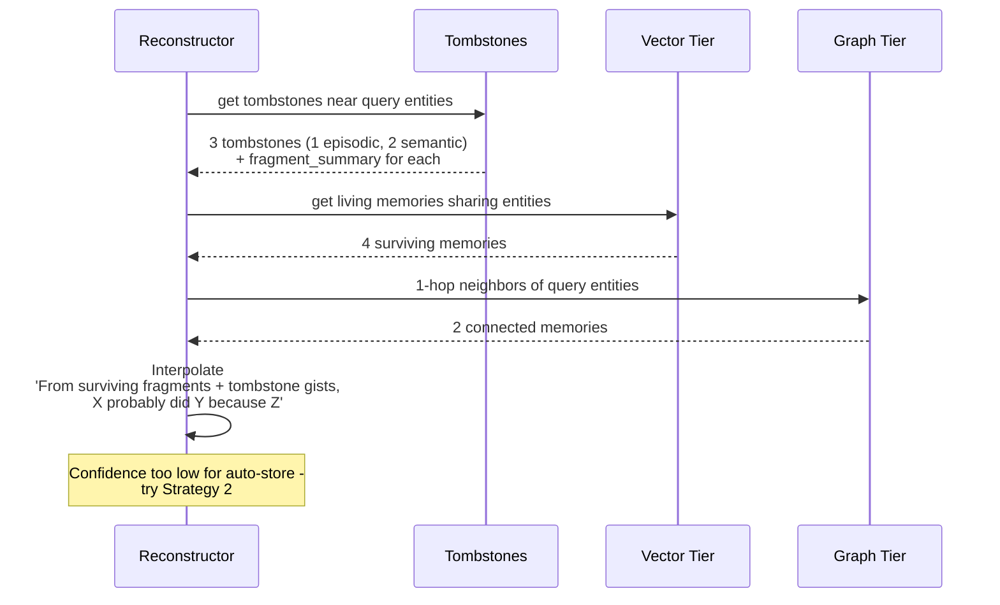
```mermaid
sequenceDiagram
    participant R as Reconstructor
    participant T as Tombstones
    participant V as Vector Tier
    participant G as Graph Tier

    R->>T: get tombstones near query entities
    T-->>R: 3 tombstones (1 episodic, 2 semantic)<br>+ fragment_summary for each
    R->>V: get living memories sharing entities
    V-->>R: 4 surviving memories
    R->>G: 1-hop neighbors of query entities
    G-->>R: 2 connected memories
    R->>R: Interpolate <br>'From surviving fragments + tombstone gists,<br>X probably did Y because Z'
    Note over R: Confidence too low for auto-store -<br>try Strategy 2
```

#### Strategy 2 - Outcome Back-tracing (medium)

If the chain of episodic memories was evicted but a linked **outcome** survived, derive the lost intermediate steps backwards from the outcome.

#### Strategy 3 - Source Re-investigation (expensive)

The most powerful strategy: use the tombstone's `source` pointer (file path, line range, Confluence page ID, session ID) to **re-read the original source** and re-extract it.

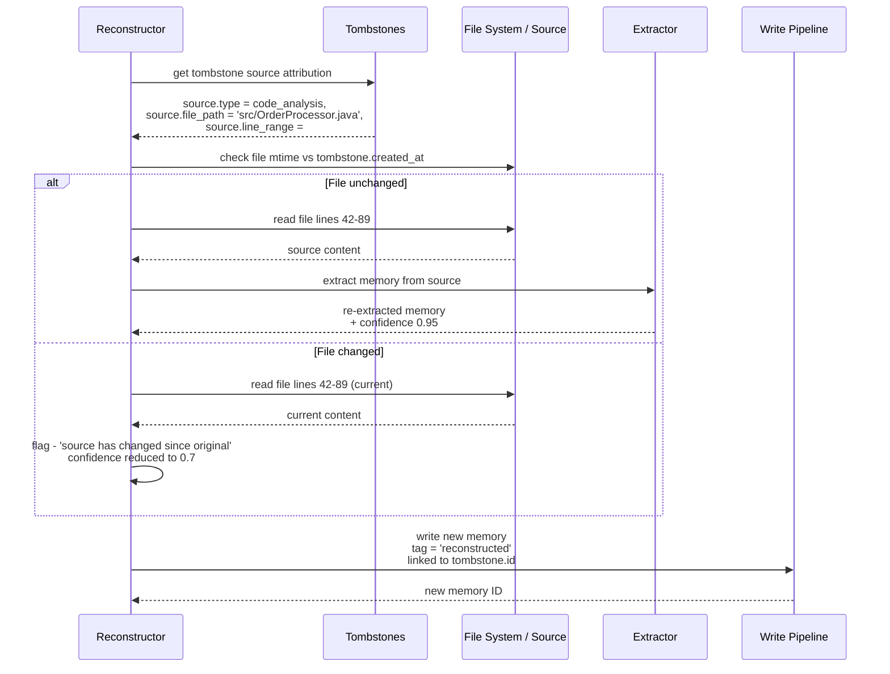
```mermaid
sequenceDiagram
    participant R as Reconstructor
    participant T as Tombstones
    participant FS as File System / Source
    participant E as Extractor
    participant W as Write Pipeline

    R->>T: get tombstone source attribution
    T-->>R: source.type = code_analysis,<br>source.file_path = 'src/OrderProcessor.java',<br>source.line_range =
    R->>FS: check file mtime vs tombstone.created_at
    alt File unchanged
        R->>FS: read file lines 42-89
        FS-->>R: source content
        R->>E: extract memory from source
        E-->>R: re-extracted memory<br>+ confidence 0.95
    else File changed
        R->>FS: read file lines 42-89 (current)
        FS-->>R: current content
        R->>R: flag - 'source has changed since original'<br>confidence reduced to 0.7
    end
    R->>W: write new memory<br>tag = 'reconstructed'<br>linked to tombstone.id
    W-->>R: new memory ID
```

#### Strategy 4 - User Confirmation (no token, UX cost)

Surface the gap to the user: *"I see we discussed* *`message-schema validation in OPS`* *around 2026-03-12 but I no longer have details. Do you remember the gist?"* - most useful in interactive sessions where the user is present.

### 8.6 What gets reconstructed vs what stays forever lost

```mermaid
flowchart LR
    subgraph Recoverable["Recoverable (✅)"]
        R1[Episodic with file/page source]
        R2[Semantic from consolidation - cluster surviving siblings]
        R3[Outcome with linked memories - outcome survives, can interpolate]
    end

    subgraph Partial["Partially recoverable (⚠️)"]
        P1[Episodic with conversation source - depends on session archive]
        P2[Memory whose source file has changed - can re-extract but flagged]
        P3[Old user preferences - may need confirmation]
    end

    subgraph Lost["Forever lost (❌)"]
        L1[Random tool output - no source attribution]
        L2[Tombstones older than retention - tombstone itself expired]
        L3[Anonymous in-context observation - no source pointer]
    end

    style Recoverable fill:#d4edda,stroke:#155724,color:#155724
    style Partial fill:#fff3cd,stroke:#664d03,color:#664d03
    style Lost fill:#f8d7da,stroke:#721c24,color:#721c24
```

### 8.7 Reconstructed memory - clearly marked

Reconstructed memories are first-class but **never confused** with original observations:

| Field         | Original observation                               | Reconstructed                                          |
| ------------- | -------------------------------------------------- | ------------------------------------------------------ |
| `source.type` | `agent_observation`, `user_input`, `code_analysis` | `reconstruction`                                       |
| `tags`        | various                                            | includes `"reconstructed"`                             |
| `confidence`  | typically 0.9-1.0                                  | 0.5 - 0.95 (per strategy)                              |
| `relations`   | as observed                                        | always includes a `derived_from` edge to the tombstone |
| `decay_score` | 1.0 on creation                                    | 1.0 (treated as new memory)                            |
| Audit         | `created_at`                                       | + `reconstruction_strategy` and `original_evicted_at`  |

This means the agent can **trust reconstructed memories cautiously** - useful enough to inform behavior, but explicitly weaker than originals.

### 8.8 The full re-investigation flow

```mermaid
sequenceDiagram
    participant A as Agent
    participant Re as Retrieval
    participant G as Gap Detector
    participant Rc as Reconstructor
    participant U as User (optional)
    participant W as Write Pipeline

    A->>Re: search 'how does OPS validate the message schema?'
    par
        Re-->>Re: vector search -> top-5 live memories
    and
        Re->>G: scan tombstones + dangling edges +<br>cluster-coverage + source density
        G-->>Re: forgotten signal = 0.55
    end
    Re->>Rc: gap above threshold - try strategies
    Rc->>Rc: Strategy 1 - fragment interpolation
    Rc-->>Rc: confidence 0.45 - too low
    Rc->>Rc: Strategy 2 - outcome back-tracing
    Rc-->>Rc: no relevant outcome - skip
    Rc->>Rc: Strategy 3 - source re-investigation
    Rc->>Rc: read tombstone source files
    Rc-->>Rc: confidence 0.92 - good
    Rc->>W: store reconstructed memory<br>(tag: reconstructed, linked to tombstone)
    W-->>Rc: new memory ID = m_R001
    Rc-->>Re: reconstructed memory + provenance
    Re-->>A: results = [live memories] + [m_R001 marked reconstructed]
    Note over A: Agent now has both surviving knowledge<br>and re-derived knowledge - clearly distinguished
```

### 8.9 Knobs and guardrails

| Setting                             | Default                 | Effect                                                                 |
| ----------------------------------- | ----------------------- | ---------------------------------------------------------------------- |
| `tombstone_retention_days`          | 1825 (5 years)          | How long tombstones survive after eviction                             |
| `gap_detection_threshold`           | 0.4                     | Minimum forgotten-signal score to trigger reconstruction               |
| `gap_detection_min_tombstones`      | 2                       | Floor - single tombstone match doesn't fire                            |
| `gap_detection_cooldown_hours`      | 24                      | Don't re-investigate the same query within window                      |
| `enable_strategy_1_fragment`        | true                    | Cheap, always-on by default                                            |
| `enable_strategy_2_outcome`         | true                    | Medium cost                                                            |
| `enable_strategy_3_source`          | true                    | Expensive - disable for cost-sensitive deployments                     |
| `enable_strategy_4_user_confirm`    | true (interactive only) | Skipped in batch / non-interactive mode                                |
| `max_reinvestigations_per_session`  | 5                       | Prevents runaway token cost                                            |
| `confidence_auto_store_threshold`   | 0.8                     | Above -> store automatically; below -> suggest only                    |
| `confidence_discard_threshold`      | 0.5                     | Below -> log gap, don't reconstruct                                    |
| `reconstruction_loop_max_per_month` | 3                       | Same memory ID reconstructed -> evicted -> reconstructed -> ... capped |

### 8.10 API additions

```yaml
# Inspect tombstones for diagnostics
GET /api/v1/tombstones?workspace=<ws>&entity=<entity>
  Response: { tombstones: MemoryTombstone[] }

# Manually trigger reconstruction for a query (debug / power-user)
POST /api/v1/memories/reconstruct
  Body:
    workspace: string
    query: string
    strategies?: ['fragment' | 'outcome' | 'source' | 'user_confirm']
    max_cost_tokens?: number
  Response:
    reconstructed: MemoryEntry[]
    strategies_tried: [{ name, confidence, tokens_used }]
    final_confidence: number

# Approve / reject a low-confidence reconstruction (UX hook)
POST /api/v1/memories/:id/confirm-reconstruction
  Body: { confirmed: boolean, corrections?: string }
  Response: { stored: boolean, id }
```

CLI:

```bash
# Show tombstones (what we used to know)
agent-memory tombstones --workspace my-project --entity OPS

# Manual reconstruction
agent-memory reconstruct --workspace my-project \
  --query "how does OPS validate the message schema?" \
  --max-cost 3000

# Inspect a reconstructed memory's provenance
agent-memory show m_R001 --include-provenance
```

### 8.11 Why this matters

Without re-investigation, the system has the same fundamental limitation as a vector DB or markdown file: **once forgotten, gone**. The agent will silently re-research the same things from scratch - defeating one of the system's core goals (token savings, no repeated work).

With re-investigation:

| Scenario                                                                                                                 | Without re-investigation                     | With re-investigation                                                                                  |
| ------------------------------------------------------------------------------------------------------------------------ | -------------------------------------------- | ------------------------------------------------------------------------------------------------------ |
| Episodic memory of "OPS analysis" evicted; user asks again 3 months later                                                | Agent re-analyzes from scratch (\~5K tokens) | Agent reads tombstone, re-investigates source files (\~2K tokens) **and** flags it as a recurring need |
| Consolidation merged 5 episodic notes about "engine rules" into 1 semantic; user asks for specific detail not in summary | Agent says "I don't know"                    | Agent uses surviving cluster siblings to interpolate detail                                            |
| Cold-archived memory about a deprecated approach; new task hits same problem                                             | Agent silently re-tries the failed approach  | Outcome back-tracing surfaces the prior failure -> avoids it                                           |
| User: "Didn't we discuss X last quarter?"                                                                                | Agent: "I have no record"                    | Agent: "I have a tombstone for X from 2026-02-14; let me reconstruct"                                  |

This is the difference between a memory system that **degrades to ignorance** and one that **degrades to graceful re-investigation** - the same difference that separates a database from a mind.

***

## 9. API Surface

> **V1 surface = the CLI.** Every AI-agent integration point in V1 goes through `agent-memory <subcommand>` invoked as a shell tool call. The HTTP API is built (because the engine needs handlers either way and the dashboard reuses them), but it only listens when the user explicitly runs `agent-memory serve`. The MCP server is **deferred to V1.5** - when written, it will translate MCP tool calls into the same CLI invocations or HTTP calls. **The CLI contract below is the stable foundation everything else wraps.**

### 9.1 CLI - primary AI-agent integration surface

#### 9.1.1 Command catalog

```bash
# -- Project lifecycle (run once per project, see §9.1.8) --
# Wire the CURRENT directory as a project memory:
agent-memory init --project-name peh           # short alias: 'agent-memory i'
agent-memory init --project-name peh --study   # also bootstrap from local README/docs/src
agent-memory init                              # auto-detects project name from cwd basename

# Rename, list, remove projects:
agent-memory rename --from peh --to peh-prod
agent-memory list                              # all projects on this machine
agent-memory delete --project-name peh-old [--keep-data]

# -- Write a memory --
# Inline content
agent-memory write --workspace my-project \
  --type semantic \
  --content "OPS listens on orders.events topic" \
  --entities OPS,orders.events \
  --format json

# Content from stdin (preferred for anything > 1 line - avoids quoting hell)
echo "OPS listens on orders.events topic" | \
  agent-memory write --workspace my-project --type semantic --content - --format json

# Outcome memory (what worked / failed)
agent-memory write --workspace my-project \
  --type outcome \
  --content "Used Avro deserializer for order events; worked end-to-end" \
  --outcome-result success \
  --outcome-approach "Avro deserializer" \
  --outcome-reason "Schema registry available, payload was Avro-encoded" \
  --entities OPS,Avro \
  --format json

# -- Search memories --
agent-memory search --workspace my-project \
  --query "How does OPS handle order events?" \
  --top-k 5 \
  --budget 2000 \
  --format json

# -- Session-start recall (context assembly) --
agent-memory recall --workspace my-project \
  --task "Design task list for the next field-mapping batch" \
  --budget 4000 \
  --format json    # -> { "context_block": "...", "memories_used": 12, "tokens": 3842 }

# Same recall but emit just the context_block as plain text (drop-in for prompt prefix)
agent-memory recall --workspace my-project --task "..." --budget 4000 --format raw

# -- End-of-session extraction --
# Pipe a conversation JSON in; extracts facts/outcomes/conventions and stores them
cat session.json | agent-memory session-end --workspace my-project --from-stdin --format json

# -- Bootstrap / study an existing project (cold-start ingestion) --
# Reads local docs and code in bulk through the same write pipeline as session-end.
# Idempotent. V1 covers files and dirs only - external sources (Confluence, Jira,
# Notion) are V2 follow-ups.
agent-memory study --workspace my-project \
  --source ./README.md \
  --source ./docs \
  --source ./src \
  --depth shallow|medium|deep \
  --llm-assisted=false \
  --dry-run \
  --format json

# -- Tombstones + reconstruction (graceful forgetting, see §8) --
agent-memory tombstones --workspace my-project --entity OPS --format json
agent-memory reconstruct --workspace my-project --query "old kafka topic config for OPS" \
  --max-cost 2000 --format json

# -- Lifecycle --
agent-memory consolidate --workspace my-project --format json        # run REM cycle now
agent-memory stats       --workspace my-project --format json        # store health, token savings, tier distribution

# -- Export / inspection --
agent-memory export --workspace my-project --format markdown > memory-dump.md
agent-memory export --workspace my-project --format json     > memory-dump.json

# -- Dashboard / HTTP API (deferred V1.5 surfaces - present but optional) --
agent-memory serve --addr 127.0.0.1:3210     # exposes HTTP + dashboard SPA

# -- Misc --
agent-memory version
agent-memory completion bash | zsh | fish    # shell completions
agent-memory help [command]
```

#### 9.1.2 Global flags (every subcommand)

| Flag                     | Default                                                                            | Meaning                                                                                                                                 | <br />                     | <br />                                                                                              |
| ------------------------ | ---------------------------------------------------------------------------------- | --------------------------------------------------------------------------------------------------------------------------------------- | :------------------------- | :-------------------------------------------------------------------------------------------------- |
| `--workspace, -w <name>` | `$MEMORY_WORKSPACE` or auto-detected from `cwd` (`.git`, `go.mod`, `package.json`) | Memory scope. Required (or recall context block).                                                                                       | <br />                     | <br />                                                                                              |
| \`--format, -f text      | json                                                                               | raw\`                                                                                                                                   | `text` if TTY, else `json` | Output format. `raw` drops envelope and prints the bare value (e.g. just the recall context block). |
| `--no-color`             | auto when not a TTY                                                                | Disable ANSI colors.                                                                                                                    | <br />                     | <br />                                                                                              |
| `--quiet, -q`            | off                                                                                | Suppress info logs to stderr; only emit the result on stdout.                                                                           | <br />                     | <br />                                                                                              |
| `--verbose, -v` / `-vv`  | off                                                                                | Increase log level on stderr.                                                                                                           | <br />                     | <br />                                                                                              |
| `--db <path>`            | `~/.agent-memory/<workspace>.db`                                                   | Override DB path.                                                                                                                       | <br />                     | <br />                                                                                              |
| `--config <path>`        | `~/.agent-memory/config.yaml`                                                      | Config file.                                                                                                                            | <br />                     | <br />                                                                                              |
| `--timeout <dur>`        | `30s`                                                                              | Per-command timeout (`5s`, `2m`).                                                                                                       | <br />                     | <br />                                                                                              |
| `--api <url>`            | (off)                                                                              | If set, the CLI calls this HTTP API instead of opening the DB in-process. Lets a CLI invocation talk to a running `agent-memory serve`. | <br />                     | <br />                                                                                              |
| `--no-rem`               | off                                                                                | Skip the post-write REM micro-tick (write-only mode).                                                                                   | <br />                     | <br />                                                                                              |

#### 9.1.3 Output contract - the part the agent must rely on

This is the **stable contract** an AI agent (or any wrapper) parses:

```json
{
  "ok": true,
  "command": "recall",
  "version": "v1",
  "data": {
    "context_block": "## Memory Context (auto-retrieved)\n\n### Conventions ...",
    "memories_used": 12,
    "tokens": 3842,
    "budget": 4000,
    "truncated": false
  },
  "warnings": [],
  "meta": {
    "duration_ms": 184,
    "workspace": "my-project",
    "store_size": 1247
  }
}
```

| Property   | Notes                                                                                    |
| ---------- | ---------------------------------------------------------------------------------------- |
| `ok`       | `true` for success, `false` for handled error. Mirrors exit code.                        |
| `command`  | Echoes the subcommand name.                                                              |
| `version`  | Schema version (`v1`). Bumped only on breaking change.                                   |
| `data`     | Subcommand-specific payload (see per-command schema in `docs/cli-schema.md`).            |
| `warnings` | Non-fatal issues (e.g. "rate limit nearly hit", "model file outdated"). Always an array. |
| `meta`     | `duration_ms`, `workspace`, `store_size`, optional `request_id`.                         |

**On error:**

```json
{
  "ok": false,
  "command": "write",
  "version": "v1",
  "error": {
    "code": "SECRET_DETECTED",
    "message": "Memory rejected: AWS access key pattern detected",
    "details": { "pattern": "AKIA[0-9A-Z]{16}", "offset": 42 }
  },
  "meta": { "duration_ms": 12, "workspace": "my-project" }
}
```

#### 9.1.4 Exit codes

| Code  | Meaning                  | Examples                                                |
| ----- | ------------------------ | ------------------------------------------------------- |
| `0`   | Success                  | normal completion                                       |
| `1`   | Generic / runtime error  | DB locked, ONNX session failed                          |
| `2`   | Bad usage / invalid args | unknown flag, missing `--workspace`                     |
| `3`   | Validation rejected      | content too large, secret detected, rate limit exceeded |
| `4`   | Not found                | `--id` doesn't exist                                    |
| `5`   | Conflict                 | duplicate memory hash, stale `--if-match` token         |
| `124` | Timeout                  | `--timeout` exceeded                                    |
| `137` | Killed (SIGKILL)         | external signal                                         |

Agents should treat **`0`** **= consume the JSON** **`data`**, **`>=1`** **= surface** **`error.message`** **to the user**, **`2-5`** are deterministic and safe to retry only after fixing the root cause.

#### 9.1.5 stdin / stdout / stderr discipline

| Stream     | Carries                                                           | Why                                                                                |
| ---------- | ----------------------------------------------------------------- | ---------------------------------------------------------------------------------- |
| **stdin**  | Bulk content (`--content -`, `--from-stdin` for session-end)      | Avoids shell quoting/escaping issues - agents can pipe arbitrary text/JSON safely. |
| **stdout** | **Only the result** - JSON envelope or text payload, nothing else | Lets `command \| jq` / `command \| pbcopy` work as-is.                             |
| **stderr** | Logs, progress bars, model-download chatter                       | Never mixed with stdout. Agents reading stdout never see noise.                    |

**Guarantee**: if `--format json`, the **entire stdout is exactly one JSON object** - no banner, no progress, no trailing newline beyond the JSON. Agents can call `JSON.parse(stdout)` directly.

#### 9.1.6 Determinism + idempotency

- `agent-memory write` returns the existing memory ID when the content hash matches an existing memory (idempotent - safe to retry).
- `--idempotency-key <key>` (optional) deduplicates by client-supplied key over a 24-hour window.
- All read commands (`search`, `recall`, `tombstones`, `stats`, `export`) are pure reads - safe to retry without side effects.

#### 9.1.7 Bootstrap - studying an existing project

> **Cold start problem.** The lifecycle described in §4-§8 grows memory **organically** through `session-end` extraction. But on day 1 of an existing project (which may already have years of READMEs, ADRs, design docs, code conventions in `AGENTS.md` / `.cursor/rules/`), starting from zero memory means the agent has to re-discover everything. **`agent-memory study`** **solves this** by ingesting existing knowledge artifacts in bulk through the same write pipeline as `session-end` - so dedup, security filter, and the hybrid router all apply uniformly.
>
> **V1 scope: local files and directories only.** External sources (Confluence, Jira, Notion, web pages) are deliberately deferred to V2 - they need credential plumbing and per-source-type fetchers that are not on the V1 critical path. Once `study` is solid for local content, an external source is just another walker plugin.

##### Inputs

```bash
agent-memory study --workspace <ws> \
  --source <path>... \
  --depth shallow|medium|deep \
  [--llm-assisted] [--dry-run] [--max-files N] [--ignore <glob>]
  --format json
```

| Source kind                               | Examples                                        | What's extracted                                                                                                                                      |
| ----------------------------------------- | ----------------------------------------------- | ----------------------------------------------------------------------------------------------------------------------------------------------------- |
| **Markdown file / dir**                   | `./README.md`, `./docs/`, `./architecture/`     | Headings -> semantic memories; code blocks -> procedural snippets; cross-links -> graph edges                                                         |
| **Source code dir**                       | `./src/`, `./internal/`                         | Module topology (one procedural memory per package), `AGENTS.md` / `.cursor/rules/*.mdc` / `.editorconfig` / linter configs -> procedural conventions |
| **Existing** **`MEMORY.md`**              | auto-detected at `<ws>/.agent-memory/MEMORY.md` | Pinned and procedural sections **respected** - never overwritten; new findings are added                                                              |
| **Glob**                                  | `--source './adr/*.md'`                         | Standard Go `filepath.Match`                                                                                                                          |
| **~~External (Confluence/Jira/Notion)~~** | -                                               | **V2 - deferred.** Add a fetcher plugin per source type; route output through the same markdown extractor.                                            |

##### Behavior

```mermaid
flowchart LR
    Walk[Walk sources<br/>respect .gitignore + --ignore]
    Extract[Per-type extractor<br/>markdown / code]
    Pipeline[Same write pipeline as session-end:<br/>dedup -> security filter -> embed -> route]
    Cons[Final consolidation pass<br/>cluster + merge + tier-promote]
    Out[JSON envelope:<br/>sources_scanned, memories_created,<br/>tier_distribution, warnings]

    Walk --> Extract --> Pipeline --> Cons --> Out

    style Pipeline fill:#d1e7dd,stroke:#0a3622,color:#0a3622
```

| Property                          | Value                                                                                                                                                                                                 |
| --------------------------------- | ----------------------------------------------------------------------------------------------------------------------------------------------------------------------------------------------------- |
| **Idempotent**                    | Re-running with the same sources is safe - content-hash dedup means no duplicates. Re-run after docs change to refresh.                                                                               |
| **Same pipeline as session-end**  | Zero special schema. Studied memories carry `source.type = "code_analysis"` (file) or `"agent_observation"` (study-extracted), with `source.file_path` + `line_range` set for re-investigation later. |
| **Respects existing memory**      | Pinned facts in `MEMORY.md`, user-tagged memories, and recent outcomes are never overwritten. Consolidation only merges near-duplicates from the bulk import.                                         |
| **Per-source progress on stderr** | stdout stays JSON-only (per §9.1.5). Progress (`studying ./docs/architecture.md ... 14 memories`) goes to stderr.                                                                                     |
| **`--dry-run`**                   | Walks + extracts but does not write. Returns the would-be tier distribution. Useful before a large ingest.                                                                                            |
| **`--llm-assisted`**              | Each chunk gets a 1-sentence summary by an LLM before storage - higher quality, costs LLM tokens. Off by default.                                                                                     |

##### Depth knob

| `--depth`          | What it extracts                                                                                                             | Approx. cost                        |
| ------------------ | ---------------------------------------------------------------------------------------------------------------------------- | ----------------------------------- |
| `shallow`          | Headings + first paragraph per section. Code dirs: just topology summary.                                                    | \~50 memories per 1K lines of docs  |
| `medium` (default) | Headings + body of each section, code blocks as procedural, important config files, key entities cross-linked                | \~150 memories per 1K lines of docs |
| `deep`             | Same as medium plus: every code file's package-level summary, every test name as procedural, link extraction for graph edges | \~400 memories per 1K lines of docs |

##### Worked example - bootstrapping a Spring Boot service

```bash
cd ~/work/ops
agent-memory init --project-name ops --study   # see §9.1.8 for init details

# -- what --study runs under the hood --
agent-memory study --workspace ops \
  --source ./README.md \
  --source ./docs \
  --source ./src/main/resources \
  --source ./src/main/java \
  --depth medium --format json
```

Yields (typical):

```json
{
  "ok": true, "command": "study", "version": "v1",
  "data": {
    "sources_scanned": 47, "memories_created": 312,
    "memories_skipped_duplicate": 18, "memories_rejected_secret": 0,
    "tier_distribution": { "markdown": 14, "vector": 287, "vector+graph": 11, "document": 0 },
    "promoted_to_memory_md": 14, "consolidation_run": true, "duration_ms": 41280
  },
  "warnings": ["1 file >2000 chars truncated to first chunk: long_doc.md"]
}
```

After this, the very next `agent-memory recall --workspace ops --task "How does OPS consume Kafka?"` returns \~3K tokens of pre-loaded relevant context. The agent **never has to discover this from scratch**.

##### When to re-run

- **Docs updated**: `agent-memory study -w ops --source ./docs/` - dedup means only changed sections create new memories
- **New ADR / design doc added**: `--source ./adr/<new-file>.md` - incremental
- **After a major refactor of the codebase**: full re-study of the affected dirs

#### 9.1.8 Project Lifecycle commands - wire any project from inside it

> **Purpose.** Once the binary is installed (one-time, per machine via `install.sh`), each project gets its own SQLite-backed memory. These five commands manage the full project lifecycle and are designed to be run **from inside the project directory** - `cd` into a project, run one command, you're done.

##### Why these four

| Command                         | What it does                                                                                                                                                                                         | Run from                                                |
| ------------------------------- | ---------------------------------------------------------------------------------------------------------------------------------------------------------------------------------------------------- | ------------------------------------------------------- |
| `agent-memory init` (alias `i`) | Creates the project's SQLite DB, drops a per-project Cursor rule into `./.cursor/rules/agent-memory.mdc` with the project name baked in, and (with `--study`) bootstraps memory from local docs/code | inside the project dir                                  |
| `agent-memory reinstall`        | Re-writes the project's agent integration files (hooks + rules) to the current canonical templates without changing the DB or project name                                                             | inside the project dir                                  |
| `agent-memory rename`           | Renames an existing project (moves the DB file, updates any local Cursor rule that references the old name)                                                                                          | anywhere, but auto-updates the cwd's rule if applicable |
| `agent-memory list`             | Lists every project registered on this machine - name, DB path, size, memory count, last activity                                                                                                    | anywhere                                                |
| `agent-memory delete`           | Removes a project (DB + entries from the workspace registry). Refuses without `--yes`. Optional `--keep-data` archives the DB to `~/.agent-memory/archived/`.                                        | anywhere                                                |

##### `agent-memory init` - wire any project from inside it

```bash
agent-memory init [--project-name <name>] [--study] [--reuse] [--force]
                  [--no-rule] [--rule-path <path>] [--format json]
agent-memory i ...     # short alias
```

| Flag                 | Default                            | Behavior                                                                                                                                                                                                                               |
| -------------------- | ---------------------------------- | -------------------------------------------------------------------------------------------------------------------------------------------------------------------------------------------------------------------------------------- |
| `--project-name, -n` | `filepath.Base(cwd)`, sanitized    | Project name. Lowercase, alphanumeric + dash + underscore, <= 64 chars. Reserved names (`default`, `archived`) rejected.                                                                                                               |
| `--study`            | off                                | After the workspace is created, run `agent-memory study` on the standard locations that exist in cwd: `./README.md`, `./docs`, `./src`, `./internal`, `./cmd`, `./pkg`, `./AGENTS.md`, `./.cursor/rules`. Skips ones that don't exist. |
| `--reuse`            | off                                | If the project already exists, accept it and just (re)write the Cursor rule. No DB changes.                                                                                                                                            |
| `--force`            | off                                | If the project already exists, **destroy it** (DB -> archived/ trash) and start fresh. Refuses without `--yes` in TTY mode.                                                                                                            |
| `--no-rule`          | off                                | Skip dropping the Cursor rule file. (Useful if you manage `.cursor/rules` via dotfiles.)                                                                                                                                               |
| `--rule-path`        | `./.cursor/rules/agent-memory.mdc` | Override where the Cursor rule is written.                                                                                                                                                                                             |

**What** **`init`** **does:**

```mermaid
flowchart LR
    A[agent-memory init<br>in cwd] --> B{project name?}
    B -->|--project-name given| C[validate name]
    B -->|omitted| D[derive from<br>filepath.Base cwd<br>sanitize]
    D --> C
    C --> E{exists in<br>~/.agent-memory/?}
    E -->|no| F[create SQLite DB<br>~/.agent-memory/peh.db<br>register in workspaces.json]
    E -->|yes, --reuse| G[keep existing DB]
    E -->|yes, --force --yes| H[archive old DB<br>create new one]
    E -->|yes, default| I[exit 5: project exists<br>hint --reuse or --force]
    F --> J{drop Cursor rule?}
    G --> J
    H --> J
    J -->|--no-rule| L
    J -->|default| K[write .cursor/rules/<br>agent-memory.mdc<br>name baked in]
    K --> L{--study?}
    L -->|no| M[done]
    L -->|yes| N[run agent-memory study<br>on local README/docs/src etc.]
    N --> M
```

**Worked example (matches the user's flow):**

```bash
$ cd ~/work/project_x
$ agent-memory i
# auto-derives name "project_x" from cwd
> project: project_x
> created ~/.agent-memory/project_x.db
> wrote .cursor/rules/agent-memory.mdc
> open in Cursor - agent will pick up the rule on next session.
> to bootstrap memory now, re-run with --study (or:
  agent-memory study -w project_x --source ./README.md --source ./docs)

# Or in one shot, with bootstrap:
$ agent-memory i --project-name project_x --study --format json
{
  "ok": true, "command": "init", "version": "v1",
  "data": {
    "project": "project_x",
    "db_path": "/Users/me/.agent-memory/project_x.db",
    "cursor_rule": ".cursor/rules/agent-memory.mdc",
    "study_run": true,
    "memories_created": 287
  },
  "meta": { "duration_ms": 38240, "store_size": 287 }
}
```

##### `agent-memory rename` - rename a project

```bash
agent-memory rename --from <old> --to <new>      # explicit
agent-memory rename --to <new>                   # --from auto-detected from cwd's Cursor rule
```

| Step | Action                                                                                                                |
| ---- | --------------------------------------------------------------------------------------------------------------------- |
| 1    | Validate `<new>` (same rules as `init`)                                                                               |
| 2    | Look up `<old>` in `~/.agent-memory/workspaces.json`; error if not found                                              |
| 3    | Move `~/.agent-memory/<old>.db` -> `<new>.db` (and `.db-wal` / `.db-shm` if present) atomically                       |
| 4    | Update `workspaces.json`                                                                                              |
| 5    | If cwd has a Cursor rule referencing `<old>`, rewrite it in place to `<new>` (idempotent - won't touch other content) |
| 6    | Print summary on stdout (envelope)                                                                                    |

**Worked example:**

```bash
$ cd ~/work/project_x
$ agent-memory rename --to project_x_v2
> renamed: project_x -> project_x_v2
> moved /Users/me/.agent-memory/project_x.db -> project_x_v2.db
> updated .cursor/rules/agent-memory.mdc
```

##### `agent-memory list` - what's on this machine

```bash
agent-memory list [--format json|text]

$ agent-memory list
PROJECT     SIZE    MEMORIES  LAST ACTIVITY      DB
peh-prod    4.2 MB     1,247  2026-05-07 18:14   ~/.agent-memory/peh-prod.db
project_x   842 KB       287  2026-05-07 21:02   ~/.agent-memory/project_x.db
cop         14 MB      3,180  2026-05-06 09:31   ~/.agent-memory/cop.db
```

In `--format json` mode each row becomes an array entry under `data.projects[]`.

##### `agent-memory delete` - remove a project

```bash
agent-memory delete --project-name <name> [--keep-data] [--yes]
```

| Flag          | Behavior                                                                                     |
| ------------- | -------------------------------------------------------------------------------------------- |
| `--keep-data` | Move the DB to `~/.agent-memory/archived/<name>.<timestamp>.db` instead of deleting outright |
| `--yes`       | Skip the interactive confirmation (required in non-TTY contexts)                             |

The Cursor rule file (`.cursor/rules/agent-memory.mdc`) inside any project dir is **not touched** by `delete` - remove it manually if you want.

##### Where the project registry lives

```text
~/.agent-memory/
├── workspaces.json          # tiny registry: { name, db_path, created_at, last_used_at }
├── peh-prod.db              # one SQLite file per project
├── project_x.db
├── cop.db
├── archived/                # populated by --keep-data
│   └── peh-old.20260501T120000Z.db
├── models/all-MiniLM-L6-v2/
└── logs/
```

The registry is a thin layer - the **DB file** is the source of truth. If `workspaces.json` is corrupted, `agent-memory init --reuse` rebuilds it from the existing `*.db` files.

#### 9.1.9 Recommended agent prompt snippet

This is what a system prompt teaches an agent to use the CLI well:

```markdown
You have a persistent memory tool: `agent-memory`. Use it like this.

# 0. WORKSPACE DETECTION (do this once at session start)
# The active project name is the marker line in this project's
# .cursor/rules/agent-memory.mdc. If that file does not exist, the project
# was never wired up - ask the user to run, from the project's root dir:
#     agent-memory init --project-name <name>          # short alias: 'agent-memory i'
#     agent-memory init --project-name <name> --study  # also bootstrap memory from local docs/code
# After that, treat <name> as <ws> in every command below.

# 1. AT SESSION START, run:
  agent-memory recall --workspace <ws> --task "one-line task description" \
                      --budget 4000 --format raw
# Prepend the output to your working context.

# 2. WHEN YOU LEARN A FACT WORTH REMEMBERING:
  echo "<the fact>" | agent-memory write -w <ws> --type semantic --content - \
                      --entities <comma,separated> --format json

# 3. WHEN AN APPROACH WORKED OR FAILED:
  agent-memory write -w <ws> --type outcome \
    --content "<what you tried and result>" \
    --outcome-result success|failure|partial \
    --outcome-approach "<approach>" \
    --outcome-reason   "<why>" \
    --format json

# 4. WHEN YOU SUSPECT YOU "USED TO KNOW" SOMETHING but recall is thin:
  agent-memory reconstruct -w <ws> --query "<what you're trying to recall>" \
                           --max-cost 2000 --format json

# 5. AT SESSION END:
  cat <session-transcript.json> | \
    agent-memory session-end -w <ws> --from-stdin --format json

# 6. INCREMENTAL BOOTSTRAP (when new docs/code arrive that I should know about):
  agent-memory study -w <ws> --source ./<new-doc-or-dir> --depth medium --format json
# V1 supports local files and directories only - no Confluence/Jira/Notion fetch.
# Ask the user to fetch external pages locally first, then point study at the file.

Always use `--format json` (or `--format raw` for recall) and read stdout only.
On non-zero exit, surface error.message to the user; do NOT retry validation/usage errors.
Exit codes: 0 ok, 1 runtime, 2 usage, 3 validation, 4 not-found, 5 conflict, 124 timeout.
```

### 9.2 HTTP API (V1.5 surface - used by Dashboard now, by remote MCP later)

> The HTTP API exists in V1 because the in-process Go engine and the HTTP handlers share the same code paths - building one builds the other. **It only listens when** **`agent-memory serve`** **is running.** V1 AI-agent integration does not require it.

```yaml
# Write a memory
POST /api/v1/memories
  Body:
    content: string       # raw content (will be extracted/compressed)
    type?: MemoryType     # optional, auto-classified if omitted
    workspace: string
    session_id?: string
    entities?: string[]   # optional, auto-extracted if omitted
    tags?: string[]
    outcome?: { result, approach, reason }
  Response: { ok, data: { id, type, content_compressed, entities } }

# Search memories
POST /api/v1/memories/search
  Body:
    query: string
    workspace: string
    filters?:
      type?: MemoryType[]
      tiers?: ("markdown" | "vector" | "vector+graph" | "document")[]   # T30 - filter by tier
      outcome_result?: "success" | "failure"
      min_confidence?: number
      min_decay_score?: number
      entities?: string[]
      date_range?: { from, to }
    top_k?: number        # default 10
    token_budget?: number # default 4000
    explain?: boolean     # T30 - when true, results carry per-signal score breakdowns
  Response: { ok, data: { results: MemoryEntry[], total_tokens, search_time_ms } }
# When explain=true, each result additionally carries:
#  tier:             "markdown" | "vector" | "vector+graph" | "document"
#  score:            number   (final ranking score)
#  score_breakdown:  { semantic_similarity, recency, outcome_boost, decay_weight, tier_bias }
#  match_reason:     string   (one-sentence human-readable explanation)
#  tombstone_hint:   null | { id, last_seen_at }
# See §9.4 (Engineer search experience) for how the dashboard uses this.

# Session-start recall (agent-facing - same call agents make at session start)
POST /api/v1/memories/recall
  Body:
    workspace: string
    task_description?: string
    token_budget?: number
  Response: { ok, data: { context_block, memories_used, tokens } }

# Recall PREVIEW (engineer-facing - T30; mirrors /recall but additionally
# returns what was clipped by the budget so engineers can validate decisions)
POST /api/v1/memories/recall/preview
  Body: { workspace, task_description, token_budget }
  Response:
    ok, data:
      context_block:        string   (byte-identical to what /recall returns for the same input)
      tokens_used:          number
      tokens_budget:        number
      memories_included:    [{ id, type, tier, score, tokens, score_breakdown }]
      memories_clipped:     [{ id, reason, would_add_tokens }]  # reason: "budget_exceeded" | "duplicate" | "below_min_score"
      tier_distribution:    { markdown, vector, "vector+graph", document }

# Update / Delete a memory
PUT    /api/v1/memories/:id   Body: { content?, confidence?, tags?, superseded_by? }
DELETE /api/v1/memories/:id

# Trigger session-end extraction
POST /api/v1/sessions/end
  Body: { session_id, workspace, conversation: Message[] }
  Response: { ok, data: { memories_created, session_summary } }

# Trigger consolidation
POST /api/v1/consolidation/run
  Body: { workspace }
  Response: { ok, data: { scored, merged, evicted, promoted, duration_ms } }

# Tombstones + reconstruction (see §8.10)
GET  /api/v1/tombstones?workspace=<ws>&entity=<e>
POST /api/v1/memories/reconstruct
POST /api/v1/memories/:id/confirm-reconstruction

# Dashboard data + export
GET /api/v1/dashboard?workspace=<ws>
GET /api/v1/memories/export?workspace=<ws>&format=markdown|json
```

The HTTP envelope mirrors the CLI envelope exactly - `{ ok, data | error, warnings, meta }` - so wrappers can share parsing code.

### 9.3 MCP Server - DEFERRED to V1.5

> **Not built in V1.** Reasoning is in §2.1 ("V1 integration model") and §15. When written, it is a thin TypeScript shim using `@modelcontextprotocol/sdk` over stdio that translates MCP tool calls into either direct CLI subprocess invocations or HTTP calls (when `serve` is running). The five planned tools (`memory_write`, `memory_search`, `memory_recall`, `memory_outcomes`, `memory_relate`, `memory_reconstruct`) map 1:1 onto the CLI subcommands above - adding MCP later requires **zero engine changes**.

What V1.5 will look like, for reference:

```jsonc
// ~/.cursor/mcp.json - V1.5+
{
  "mcpServers": {
    "agent-memory": {
      "command": "npx",
      "args": ["agent-memory-mcp"],
      "env": { "MEMORY_WORKSPACE": "my-project" }
    }
  }
}
```

| Tool (V1.5)          | Wraps CLI command                                               |
| -------------------- | --------------------------------------------------------------- |
| `memory_write`       | `agent-memory write --format json`                              |
| `memory_search`      | `agent-memory search --format json`                             |
| `memory_recall`      | `agent-memory recall --format json`                             |
| `memory_outcomes`    | `agent-memory search --filter outcome_result=... --format json` |
| `memory_relate`      | `agent-memory search --mode relate --entity ... --format json`  |
| `memory_reconstruct` | `agent-memory reconstruct --format json`                        |

### 9.4 Engineer search experience (V1)

> **Audience.** AI agents are *one* consumer of the memory system; **engineers are the other**. Agents read JSON envelopes, but engineers want to ask the same questions in natural language, see *why* each result ranked, and validate that the agent will receive the right context for a given task. This subsection describes the engineer surface - implemented in **T30** - which is a UI on top of **the same engine path agents use**, *not* a parallel SQL-similarity branch. Engineers access this surface by running `agent-memory serve`, which launches a local dashboard at `http://localhost:3210/dashboard/`. See **tasks.md -> T30** for the implementation breakdown.

#### 9.4.1 Hard contract: same engine, same answers

```mermaid
flowchart LR
    subgraph Agent["AI Agent"]
        AC["agent-memory search<br/>or recall"]
    end
    subgraph Engineer["Engineer in dashboard"]
        UI["Search box<br/>natural language"]
    end

    AC -->|in-process call| RE
    UI -->|POST /api/v1/memories/search<br/>explain=true| HA["HTTP handler"]
    HA -->|in-process call| RE

    RE["T07 multi-signal retrieval<br/>over T24 hybrid router"]
    RE --> MD["Markdown tier (T23)<br/>always-on rules"]
    RE --> VEC["Vector tier (T03)<br/>sqlite-vec semantic"]
    RE --> GR["Graph tier<br/>relationships"]
    RE --> DOC["Document tier<br/>raw archives"]

    style RE fill:#e2d4f7,stroke:#5a2ea6,color:#3b1c70
    style MD fill:#cfe2ff,stroke:#0c63e4,color:#084298
    style VEC fill:#cfe2ff,stroke:#0c63e4,color:#084298
```

The CLI and the HTTP handler **call the same** **`retrieval.Engine.Search()`** **function in-process**. There is no second code path that "approximates" what the agent would see. This invariant is enforced in CI by a parity test (see tasks.md T30 acceptance) that runs `agent-memory search` and `POST /api/v1/memories/search` against the same workspace + query and asserts the result IDs and scores are identical.

#### 9.4.2 What `explain=true` adds

When the engineer hits search, the existing endpoint runs and produces the same ranked list, **plus** a per-result breakdown:

| Field                                 | Source                                  | Why an engineer cares                                                                                        |
| ------------------------------------- | --------------------------------------- | ------------------------------------------------------------------------------------------------------------ |
| `tier`                                | T24 hybrid router output                | Did this hit come from the always-on markdown rules or from semantic recall?                                 |
| `score`                               | T07 final ranking score                 | The single number used for ordering                                                                          |
| `score_breakdown.semantic_similarity` | cosine sim from T03/T06                 | "Did the query semantically match this memory?"                                                              |
| `score_breakdown.recency`             | computed from `updated_at` (T07)        | "Was this memory touched recently?"                                                                          |
| `score_breakdown.outcome_boost`       | T07 outcome weighting                   | "Is this an outcome memory (success/failure) the agent should remember?"                                     |
| `score_breakdown.decay_weight`        | T09 decay scoring                       | "How much has this memory faded?"                                                                            |
| `score_breakdown.tier_bias`           | T24 router weights                      | "Was this nudged up because it lives in the markdown tier (always-on)?"                                      |
| `match_reason`                        | one-line summary of the dominant signal | Human-readable: *"Strong semantic match on 'orders.events'; promoted because referenced in last 3 sessions"* |

**Default is** **`explain=false`** so existing CLI/agent calls are byte-identical and unchanged.

#### 9.4.3 The recall-preview tab - what the agent will actually load

Search shows ranked candidates; **recall preview** shows the **assembled context block** that the agent receives at session-start (the output of T16). Engineers use this to validate that the right memories will be loaded for a task before letting the agent run. The dashboard presents this as a dedicated preview tab with a side panel that makes the token budget impact explicit (which memories were clipped and why).

```mermaid
sequenceDiagram
    participant Eng as Engineer (browser)
    participant API as HTTP API
    participant Engine as Retrieval Engine (T07)
    participant Clip as Token Budget Clipper (T08)

    Eng->>API: POST /memories/recall/preview<br>{ workspace, task_description, token_budget: 4000 }
    API->>Engine: same Search() call as agent's recall
    Engine->>API: candidates (ranked across all tiers)
    API->>Clip: assemble context block within budget
    Clip->>API: included[], clipped[]
    API->>Eng: { context_block, memories_included, memories_clipped, tier_distribution }

    Note over Eng: Engineer sees:<br>exact markdown the agent receives<br>which memories were dropped (and why)<br>tier mix (e.g. 4 markdown + 18 vector)
```

The `context_block` returned is **byte-identical** to what `agent-memory recall -w <ws> --task <t> --format raw` returns for the same inputs - same parity guarantee.

#### 9.4.4 What this gives engineers (and what it deliberately doesn't)

| Engineer can...                                                                   | Engineer cannot...                                                           |
| --------------------------------------------------------------------------------- | ---------------------------------------------------------------------------- |
| Type a natural-language question and get ranked results across **all four tiers** | Bypass the engine and run raw SQL - the API is the only authorized read path |
| See *why* a result ranked (per-signal score breakdown)                            | Modify ranking weights from the UI - those live in config (see §7)           |
| Filter by tier, type, date range, decay score, and outcome                        | Inject query rewrites that change the agent's view of memory                 |
| Preview the agent's session-start context before letting it run                   | Dry-run a full agent session - that's still an agent's job                   |
| Copy the equivalent `agent-memory search ...` or `agent-memory recall ...` CLI command ("Open in CLI") | Persist UI-only filters as defaults (kept local to localStorage on purpose)  |

Result: the dashboard is an **observation tool** for the same memory the agent uses, not a parallel control plane.

***

## 10. Embedding Strategy

### 10.1 Local Embeddings (Default)

Model: `all-MiniLM-L6-v2` (via ONNX Runtime)
Dimensions: 384
Speed: \~5ms per embedding (CPU)
Quality: Good for code/technical content
Size: \~80 MB model file

This model runs entirely locally - no API calls, no data leaving the machine, no per-request cost.

### 10.2 Cloud Embeddings (Optional)

Model: `text-embedding-3-small` (OpenAI) or similar
Dimensions: 1536
Speed: \~100ms per embedding (API call)
Quality: Better for natural language nuance
Cost: \~$0.02 per 1M tokens

Configurable via environment variable: `MEMORY_EMBEDDING_PROVIDER=local|openai|cohere`.

### 10.3 Embedding Cache

Embeddings are cached in the database alongside the memory entry - never re-computed for the same content. Query embeddings are cached for the duration of a session.

***

## 11. Token Economics

### 11.1 Cost Model

| Operation                           | Tokens (No Memory)           | Tokens (With Memory)    | Savings |
| ----------------------------------- | ---------------------------- | ----------------------- | ------- |
| Session start - context loading     | 25,000 (re-read study docs)  | 3,000 (targeted recall) | **88%** |
| Mid-session - "how does X work?"    | 5,000 (re-read + re-analyze) | 800 (search + retrieve) | **84%** |
| Repeated task - same approach       | 10,000 (re-research)         | 200 (outcome recall)    | **98%** |
| Consolidation (background, per run) | N/A                          | 500 (if LLM-assisted)   | N/A     |

**Visual: Token cost per operation (lower is better):**

```mermaid
xychart-beta
    title "Tokens per operation: baseline vs hybrid memory"
    x-axis ["Session start", "Mid-session Q", "Repeated task", "Consolidation"]
    y-axis "Tokens per operation" 0 --> 26000
    bar "Baseline (no memory)" [25000, 5000, 10000, 0]
    bar "With hybrid memory" [3000, 800, 200, 500]
```

**Cumulative monthly token cost** for a typical workload (40 sessions/month, 10 mid-session questions/session, 5 repeated tasks/month):

```mermaid
xychart-beta
    title "Cumulative tokens per month (40 sessions, 400 questions, 5 repeats)"
    x-axis ["Week 1", "Week 2", "Week 3", "Week 4"]
    y-axis "Total tokens (thousands)" 0 --> 800
    line "Baseline" [200, 400, 600, 800]
    line "With hybrid memory" [60, 110, 160, 210]
```

At $15 per million input tokens, the **monthly delta is roughly $10/developer/month** - and grows linearly with session frequency.

### 11.2 Token Budget Enforcement

The system enforces hard and soft token budgets:

- **Hard budget**: Retrieval never returns more than `max_tokens` (default 4,000). Results are truncated by rank.
- **Soft budget**: Session-start recall allocates proportionally across memory types (30% procedural, 35% semantic, 20% outcome, 15% episodic). Allocation shifts dynamically if a task description is provided.

### 12. Technology Stack

### 12.1 Language split

| Layer                                                     | V1 status                          | Language                      | Why                                                                                                                                                                                 |
| --------------------------------------------------------- | ---------------------------------- | ----------------------------- | ----------------------------------------------------------------------------------------------------------------------------------------------------------------------------------- |
| **Memory engine, HTTP API, CLI** (+ AI-agent integration) | **V1**                             | **Go 1.22+**                  | All CPU-heavy work; single static binary deployment; great concurrency for parallel retrieval + gap detection; matches the language used by other local Go tools in this workspace. |
| **Web dashboard**                                         | **V1.5+** (build but not required) | **TypeScript + React + Vite** | Standard SPA tooling; browser-only inspection - does not block AI-agent V1 use.                                                                                                     |
| **MCP server shim**                                       | **DEFERRED to V1.5+**              | TypeScript / Node.js 20+      | Official MCP SDK is TS-first. Translates MCP tool calls into the V1 CLI commands. **Not built or shipped in V1.** See §15.                                                          |

**V1 install footprint is one Go binary.** Nothing else is required for an AI agent (Cursor / Claude Code / Codex / Cline / custom) to use the system end-to-end via shell tool calls.

### 12.2 Go stack (the backend - `cmd/agent-memory`)

| Component                             | Library                                                   | Rationale                                                                                                                             |
| ------------------------------------- | --------------------------------------------------------- | ------------------------------------------------------------------------------------------------------------------------------------- |
| Runtime                               | **Go 1.22+**                                              | Generics, `slog`, `range over int`, fast iteration                                                                                    |
| Build                                 | **go build** (V1) + **Vite** for the dashboard SPA (V1.5) | Single static binary for V1. The dashboard is built as static assets and embedded into the binary via `embed.FS` when shipping V1.5+. |
| HTTP router                           | **go-chi/chi**                                            | Idiomatic, composes with `net/http`, lightweight (<10K LOC), middleware-friendly                                                      |
| Schema validation                     | **go-playground/validator/v10**                           | Struct-tag validation for API DTOs                                                                                                    |
| CLI                                   | **spf13/cobra**                                           | Subcommands, autocomplete, used by kubectl/hugo/gh                                                                                    |
| Logging                               | **log/slog** (stdlib)                                     | Structured JSON logs, no external dep                                                                                                 |
| Config                                | **spf13/viper** + env vars                                | Layered config: defaults -> file -> env -> flags                                                                                      |
| SQLite driver                         | **mattn/go-sqlite3**                                      | CGO-based; supports loadable extensions (we need `sqlite-vec`)                                                                        |
| Vector search (local)                 | **sqlite-vec** extension                                  | Loaded into SQLite at startup; ANN over 384-dim vectors                                                                               |
| Vector math fallback                  | **gonum.org/v1/gonum/floats** + custom cosine             | Brute-force cosine for stores < 10K entries                                                                                           |
| Postgres driver (cloud)               | **jackc/pgx/v5**                                          | Modern, fast, native pgvector support                                                                                                 |
| Embeddings (local)                    | **yalue/onnxruntime\_go**                                 | Go bindings for ONNX Runtime; runs `all-MiniLM-L6-v2`                                                                                 |
| Tokenizer (HF preprocessing)          | **daulet/tokenizers**                                     | HuggingFace tokenizers in Go (CGO)                                                                                                    |
| Embeddings (cloud, optional)          | **sashabaranov/go-openai**                                | OpenAI client for `text-embedding-3-small`                                                                                            |
| Token counting                        | **pkoukk/tiktoken-go**                                    | Tiktoken in Go; accurate budget enforcement (T08)                                                                                     |
| Markdown parse / serialize            | **yuin/goldmark** + custom renderer                       | AST round-trip safe for `MEMORY.md` (T23)                                                                                             |
| LSH / simhash                         | **mfonda/simhash**                                        | Fast tombstone matching by entity hash (T26)                                                                                          |
| Atomic file writes                    | **natefinch/atomic**                                      | Corruption-safe writes to `MEMORY.md`                                                                                                 |
| REM scheduler                         | **robfig/cron/v3**                                        | Cron expressions for background consolidation                                                                                         |
| UUID v7                               | **google/uuid**                                           | Time-sortable IDs (v7 supported in v1.6+)                                                                                             |
| Secret detection                      | **zricethezav/gitleaks/v8** (library) + custom regex      | Reject memories containing API keys/JWTs (T21)                                                                                        |
| HTTP client (source re-investigation) | **net/http** stdlib + retry middleware                    | Fetch Confluence pages for Strategy 3 reconstruction (T27)                                                                            |
| Date / time                           | **stdlib** **`time`**                                     | Decay calculations, ISO 8601                                                                                                          |
| Concurrency primitives                | **stdlib** **`context`,** **`sync`,** **`errgroup`**      | Parallel gap detection, REM cycle workers                                                                                             |

### 12.3 TypeScript stack (V1.5 deferred surfaces)

> **Not on the V1 critical path.** These are listed here so the reader knows what V1.5 will pull in. V1 ships zero TypeScript and zero `node_modules`.

#### MCP server shim (`tools/agent-memory/mcp-server/`) - **V1.5+ only**

| Component           | Library                             | Rationale                                                                                           |
| ------------------- | ----------------------------------- | --------------------------------------------------------------------------------------------------- |
| Runtime             | Node.js 20+                         | MCP SDK requirement                                                                                 |
| MCP SDK             | **@modelcontextprotocol/sdk**       | Official; stdio transport for Cursor/Claude Code                                                    |
| HTTP client         | **undici** (built into Node)        | Calls Go API on `localhost` when `serve` is up                                                      |
| Subprocess fallback | **stdlib** **`node:child_process`** | Spawns `agent-memory <subcommand> --format json` when `serve` is down - same code path as V1 agents |
| Schema validation   | **zod**                             | Validate MCP tool inputs before forwarding                                                          |
| Build               | **tsup**                            | Bundle to single ESM file                                                                           |

The shim is **stateless and trivial** because the V1 CLI already provides a stable JSON-over-stdout contract (§9.1.3). Adding MCP later is mostly tool-schema declarations + thin dispatch.

#### React dashboard (`tools/agent-memory/dashboard/`) - **V1.5+ only**

| Component            | Library                             | Rationale                                       |
| -------------------- | ----------------------------------- | ----------------------------------------------- |
| Bundler              | **Vite**                            | Matches existing tools                          |
| UI                   | **React 18**                        | Same                                            |
| Charts               | **recharts**                        | Memory metrics, decay curves, tier distribution |
| Tables               | **@tanstack/react-table**           | Memory browser with sort/filter/pagination      |
| Graph viz (optional) | **reactflow**                       | Visualize entity relationships                  |
| Styling              | **Tailwind CSS**                    | Same as existing tools                          |
| HTTP                 | **@tanstack/react-query** + `fetch` | Cache + revalidate Go API responses             |

### 12.4 Testing & Quality (Go side)

| Component                | Library                                               | Rationale                                                |
| ------------------------ | ----------------------------------------------------- | -------------------------------------------------------- |
| Unit + integration tests | **stdlib** **`testing`** + **stretchr/testify**       | Idiomatic Go testing with rich assertions                |
| HTTP testing             | **stdlib** **`net/http/httptest`**                    | Test `chi` handlers without spinning a real server       |
| Snapshot tests           | **bradleyjkemp/cupaloy**                              | Useful for markdown round-trip tests                     |
| Mocking                  | **stretchr/testify/mock** or interface-based fakes    | We prefer interface fakes (Go idiom)                     |
| Coverage                 | **go test -cover** + **golang.org/x/tools/cmd/cover** | Built-in                                                 |
| Linting                  | **golangci-lint**                                     | Aggregates 50+ linters; standard in Go community         |
| Formatting               | **gofmt** + **goimports**                             | Non-negotiable Go standard                               |
| Race detector            | **go test -race**                                     | Catches goroutine races in REM cycle, parallel retrieval |
| Benchmarks               | **stdlib** **`testing.B`**                            | Critical for vector search and gap detector hot paths    |

### 12.5 Why specific Go libraries vs alternatives

| Decision               | Alternative considered                 | Why we picked this                                                                                                                                             |
| ---------------------- | -------------------------------------- | -------------------------------------------------------------------------------------------------------------------------------------------------------------- |
| **mattn/go-sqlite3**   | `modernc.org/sqlite` (pure Go, no CGO) | We need `sqlite-vec` extension loading - `modernc.org/sqlite` doesn't support extensions reliably. CGO is the trade-off.                                       |
| **chi**                | `gin`, `echo`, `fiber`                 | `chi` composes with `net/http`, has the smallest API surface, most idiomatic; `gin` and `echo` are heavier; `fiber` uses fasthttp which complicates middleware |
| **onnxruntime\_go**    | Pure-Go ONNX (`gomlx`, `onnx-go`)      | Pure-Go ONNX is incomplete for transformer models; the official ONNX runtime via CGO is faster and battle-tested                                               |
| **goldmark**           | `blackfriday`, `russross/blackfriday`  | `goldmark` has the cleanest AST manipulation API for round-trip safe markdown editing                                                                          |
| **mfonda/simhash**     | `dgryski/go-simstore`                  | Simpler API; we only need similarity hashing, not a full nearest-neighbor store (vector store handles that)                                                    |
| **robfig/cron/v3**     | `procyon-projects/chrono`              | More mature, larger user base, simpler API                                                                                                                     |
| **spf13/cobra**        | `urfave/cli`, `alecthomas/kong`        | Industry standard, autocomplete generation, used by every major Go CLI tool                                                                                    |
| **jackc/pgx/v5**       | `lib/pq`, `go-pg`                      | `pgx` is modern, fast, has native pgvector support and prepared statement caching                                                                              |
| **google/uuid**        | `gofrs/uuid`                           | UUID v7 support added in v1.6+; Google-maintained                                                                                                              |
| **pkoukk/tiktoken-go** | `tiktoken-go/tokenizer`                | Pure Go (no CGO); accurate vs OpenAI's reference                                                                                                               |

## 12.6 Inter-process communication

#### V1 - CLI subprocess (the only required path)

```mermaid
sequenceDiagram
    participant C as Cursor / Claude Code / agent
    participant CLI as agent-memory (Go binary)
    participant DB as SQLite (workspace.db)

    Note over C,DB: Recall at session start
    C->>CLI: exec: agent-memory recall -w foo --task "..." --format json
    CLI->>CLI: Open SQLite, init engine
    CLI->>DB: SELECT + sqlite-vec ANN
    CLI->>CLI: Multi-signal rerank<br>(goroutines parallel)
    CLI->>CLI: Gap detect + reconstruct (if signal>=0.4)
    CLI->>CLI: Token budget clip
    CLI-->>C: stdout = JSON envelope { ok, data: { context_block, tokens, ... } }<br>exit 0
    Note over C: Agent JSON.parse(stdout) -> uses context_block

    Note over C,DB: Write a learned fact
    C->>CLI: exec: agent-memory write -w foo --type semantic --content - --format json
    Note over C,CLI: stdin = "OPS listens on orders.events topic"
    CLI->>DB: dedup, embed, store, route to tier
    CLI->>CLI: Optional: REM micro-tick (decay only)
    CLI-->>C: stdout = JSON envelope { ok, data: { id, tier, ... } }<br>exit 0
```

**Properties of V1 CLI mode:**

- **No daemon:** Every invocation is a fresh process. Engine init + SQLite open is \~50ms; subsequent ops are microseconds.
- **No socket:** No port binding, no firewall surface.
- **Crash isolation:** A bug in one command can never corrupt another in flight.
- **Trivially observable:** The agent's tool-call log shows the exact command + stdin + stdout + exit code.
- **Concurrent-safe:** SQLite WAL mode handles parallel `agent-memory` processes hitting the same DB.

#### V1.5 - `serve` daemon + dashboard + MCP (optional, deferred)

```mermaid
sequenceDiagram
    participant C as Cursor / agent
    participant M as MCP server (Node TS shim)
    participant G as agent-memory serve (Go binary, long-lived)
    participant DB as SQLite

    Note over C,DB: V1.5+ - only when serve is running
    C->>M: Launch via stdio (per IDE session)
    M->>G: HTTP probe 127.0.0.1:3210/api/v1/health
    G-->>M: { ok: true, version }

    Note over C,DB: Tool call
    C->>M: tools/call memory_recall (MCP stdio)
    M->>M: Validate input (zod)
    M->>G: POST /api/v1/memories/recall
    G->>DB: SELECT + sqlite-vec ANN
    G-->>M: JSON envelope
    M-->>C: tools/call result (MCP stdio)

    Note over C,DB: Background (only under serve)
    G->>G: REM cycle goroutine fires (robfig/cron)
    G->>DB: BulkUpdateDecay, Consolidate, Evict
```

**Properties of V1.5 serve mode:**

- The same Go backend serves the dashboard, the (V1.5+) MCP shim, and any number of HTTP clients simultaneously.
- REM cycle runs continuously instead of opportunistically.
- Adds a long-lived process the user has to manage (or install as `launchd`/`systemd`).
- **Strictly opt-in** - V1 agents never need this.

***

## 13. Deployment Topology

### 13.1 V1 - Solo Developer, CLI only (default and recommended)

```mermaid
flowchart LR
    subgraph Dev["Developer Machine"]
        subgraph Agent["AI Agent (Cursor / Claude Code / Codex / custom)"]
            A[Agent process<br>uses Shell tool calls]
        end

        subgraph Bin["Local install"]
            CLI[agent-memory<br>Go binary ~12 MB<br> V1 only thing required]
        end

        subgraph Data["~/.agent-memory/"]
            DB[[my-project.db<br>SQLite + sqlite-vec]]
            Md[MEMORY.md<br>per workspace]
            Model[models/<br>all-MiniLM-L6-v2 ONNX<br>~80 MB, downloaded on first use]
            Logs[logs/]
        end

        Term[Terminal user] -.->|same binary, interactive| CLI
    end

    A -->|exec subprocess<br> stdin/stdout/exit| CLI
    CLI --> DB
    CLI --> Md
    CLI --> Model

    style CLI fill:#d1e7dd,stroke:#0a3622,color:#0a3622
    style A fill:#fff3cd,stroke:#664d03,color:#664d03
```

**V1 install footprint - the only V1 surface:**

| Component                  | Size                                      | Where                                               |
| -------------------------- | ----------------------------------------- | --------------------------------------------------- |
| Go binary (`agent-memory`) | \~12 MB                                   | `/usr/local/bin/` (or `~/bin/`)                     |
| MiniLM ONNX model          | \~80 MB                                   | `~/.agent-memory/models/` (downloaded on first run) |
| SQLite databases           | grows with use, capped (\~500 MB default) | `~/.agent-memory/<workspace>.db`                    |
| **V1 total minimum**       | **\~92 MB**                               | **No Node, no daemon, no extra services**           |

**V1 lifecycle:**

- **No daemon.** Each agent shell tool call invokes `agent-memory <subcommand>` as a fresh subprocess. Exits when done.
- **REM cycle** runs **opportunistically**: at the end of `session-end`, on explicit `agent-memory consolidate`, or after every Nth write. No long-running scheduler.
- **Concurrent invocations** are safe - SQLite WAL mode handles parallel `agent-memory` processes hitting the same DB.

### 13.2 V1.5 - Solo developer + dashboard / serve (optional)

```mermaid
flowchart LR
    subgraph Dev["Developer Machine"]
        subgraph Agent["AI Agent"]
            A[Agent process]
        end

        subgraph Daemon["Optional V1.5 long-lived process"]
            Serve[agent-memory serve<br>same binary, HTTP on :3210<br>+ REM cron goroutine]
        end

        subgraph Browser["Human inspection"]
            B[Browser localhost:3210/dashboard]
        end

        subgraph Data["~/.agent-memory/"]
            DB[[my-project.db]]
            Md[MEMORY.md]
        end
    end

    A -->|exec subprocess<br> same V1 contract| CLI[agent-memory CLI<br>per-call subprocess]
    CLI --> DB
    CLI -.->|--api set| Serve
    Serve --> DB
    Serve --> Md
    B -->|HTTP| Serve

    style CLI fill:#d1e7dd,stroke:#0a3622,color:#0a3622
    style Serve fill:#cfc2ff,stroke:#055160,color:#055160
    style B fill:#cfe2ff,stroke:#0c63e4,color:#084298
```

The agent **still uses the CLI** in V1.5 - it just gains a dashboard browser tab. Adding `serve` is purely about enabling the dashboard and continuous REM cron; it does not change the agent integration path.

### 13.3 V1.5+ - MCP integration (deferred - written when needed)

```mermaid
flowchart LR
    A[Cursor / Claude Code] -->|MCP stdio| MCP[mcp-server shim<br>Node TS<br>~5 MB JS + Node]
    MCP -->|exec or HTTP| Bin[agent-memory Go binary]
    Bin --> DB[[SQLite]]

    style Bin fill:#d1e7dd,stroke:#0a3622,color:#0a3622
    style MCP fill:#f5f5f5,stroke:#999,color:#666,stroke-dasharray: 5 5
    note["The MCP shim simply translates MCP tool calls into<br>the V1 CLI commands (or HTTP when serve is up).<br>No engine changes required."]
```

### 13.4 Team Shared (Optional)

```mermaid
flowchart LR
    subgraph Server["Shared Server (or container)"]
        subgraph Stack["agent-memory deployment"]
            Bin[agent-memory Go binary<br>HTTP on :3210<br>+ TLS at ingress]
            PG[(PostgreSQL + pgvector)]
            Bin -->|pgx| PG
        end
    end

    subgraph DevA["Developer A machine"]
        AAgent[Cursor]
        ACLI[agent-memory CLI<br>--api https://memory.team]
        AAgent -->|exec subprocess| ACLI
    end

    subgraph DevB["Developer B machine"]
        BAgent[Claude Code]
        BCLI[agent-memory CLI<br>--api https://memory.team]
        BAgent -->|exec subprocess| BCLI
    end

    ACLI -->|HTTPS<br>+ token auth| Bin
    BCLI -->|HTTPS<br>+ token auth| Bin

    style Bin fill:#d1e7dd,stroke:#0a3622,color:#0a3622
    style PG fill:#cfe2ff,stroke:#0c63e4,color:#084298
    style ACLI fill:#d1e7dd,stroke:#0a3622,color:#0a3622
    style BCLI fill:#d1e7dd,stroke:#0a3622,color:#0a3622
```

**Differences from solo:**

- Server-side `Store` bound to `PostgresStore` via `MEMORY_BACKEND=postgres` env var
- TLS + token authentication added at the HTTP layer
- Developers' CLIs talk to the shared server via `--api https://memory.team` (or env `MEMORY_API_URL`)
- **Same CLI command shapes** as solo - agent prompt snippet does not change
- Local embedding cache still happens per-developer (no need to centralize embeddings)
- Single Go binary deployment - same artifact, different config

### 13.5 Container deployment

```dockerfile
# Multi-stage Go build -> tiny final image
FROM golang:1.22-alpine AS build
RUN apk add --no-cache build-base sqlite-dev
WORKDIR /src
COPY go.* ./
RUN go mod download
COPY . .
RUN CGO_ENABLED=1 go build -ldflags="-s -w" -o /out/agent-memory ./cmd/agent-memory

FROM alpine:3.20
RUN apk add --no-cache ca-certificates sqlite-libs
COPY --from=build /out/agent-memory /usr/local/bin/
EXPOSE 3210
ENTRYPOINT ["agent-memory", "serve", "--addr", "0.0.0.0:3210"]
```

Final image: **\~30 MB** (Alpine + sqlite + Go binary). The MiniLM ONNX model can be baked in or mounted as a volume. The container is only needed for §13.4 team-shared deployment - solo V1 users do not need Docker.

## 14. Security Model

| Threat                                                        | Mitigation                                                                                         |
| ------------------------------------------------------------- | -------------------------------------------------------------------------------------------------- |
| **Memory poisoning** (malicious content persisted)            | Write-time content scoring; anomaly detection on write frequency; periodic audit via consolidation |
| **Secret leakage** (API keys stored in memory)                | Regex-based secret detection on write pipeline; configurable PII filter                            |
| **Scope contamination** (Workspace A sees workspace B's data) | Strict workspace scoping in all queries; namespace isolation in storage                            |
| **Stale facts misleading agent**                              | Decay scoring + contradiction detection + temporal awareness in retrieval                          |
| **Unbounded growth**                                          | Configurable `max_entries` per workspace; eviction during REM cycle                                |

## 15. Future Extensions (Out of Scope for V1)

| Extension                                       | Target | Depends On                                                                                                                                                                                                | Description                                                                                                                                     |
| ----------------------------------------------- | ------ | --------------------------------------------------------------------------------------------------------------------------------------------------------------------------------------------------------- | ----------------------------------------------------------------------------------------------------------------------------------------------- |
| **`agent-memory serve`** **daemon + dashboard** | V1.5   | V1 CLI engine (already built)                                                                                                                                                                             | Long-lived process that hosts the HTTP API + React dashboard + cron-driven REM cycle. Optional alternative to the V1 per-call subprocess model. |
| **MCP server shim**                             | V1.5   | TypeScript shim implementing `@modelcontextprotocol/sdk` over stdio. Translates MCP tool calls into the V1 CLI commands (or HTTP when `serve` is up). **Deferred from V1 by design** - see §2.1 and §9.3. | <br />                                                                                                                                          |
| **Multi-agent shared memory**                   | V2     | PostgreSQL backend                                                                                                                                                                                        | Multiple agents reading/writing the same workspace memory                                                                                       |
| **Neo4j graph backend**                         | V2     | Hybrid adapter                                                                                                                                                                                            | Full graph DB for complex relationship queries at scale                                                                                         |
| **MemRL integration**                           | V2     | Outcome data accumulation                                                                                                                                                                                 | Reinforcement learning on retrieval - rank memories by learned utility                                                                          |
| **Memory-aware planning**                       | V2     | Outcome + procedural memory maturity                                                                                                                                                                      | Agent retrieves similar past tasks and adapts plans based on outcome history                                                                    |
| **Cross-workspace transfer**                    | V2     | Transfer procedural memories (team conventions) from one workspace to another                                                                                                                             | User-scoped procedural store                                                                                                                    |
| **Python SDK integration**                      | V2     | Stable HTTP API                                                                                                                                                                                           | Native Python client for LangChain/CrewAI                                                                                                       |
| **Memory visualization**                        | V2     | Dashboard + graph data                                                                                                                                                                                    | Interactive graph visualization of entity relationships                                                                                         |
