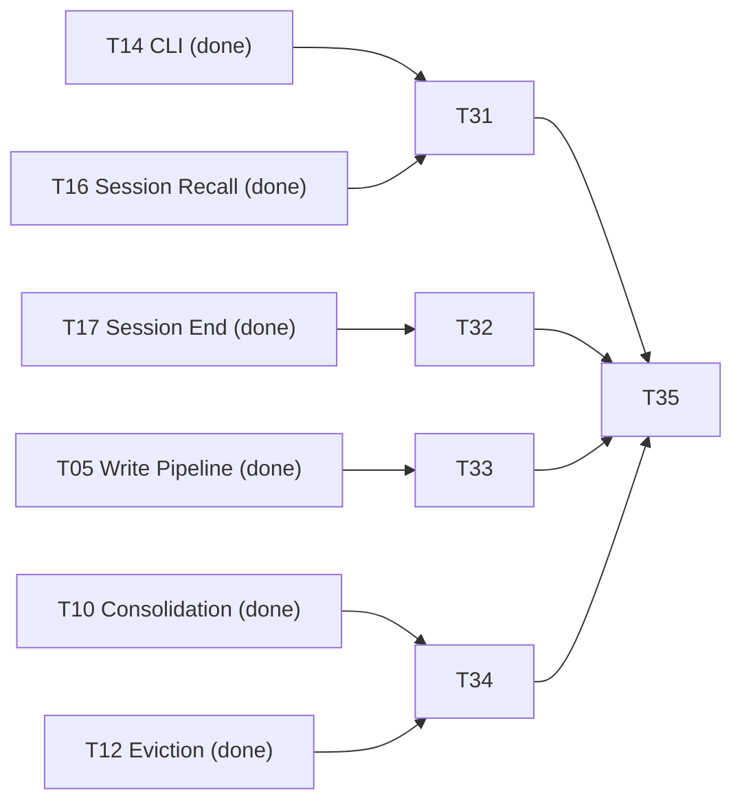

# Agent Memory System - Tasks

> **Working todo list - update this file as you implement.** See [How to update this file](#how-to-update-this-file) below.
> 1 point ≈ 1 day of focused work.

---

## Status Snapshot

| Field | Value |
|---|---|
| **Phase** | **1 - foundation running, core engine started** |
| **V1 progress** | **29 / 29 tasks - 43.5 / 43.5 points** complete (auto-sync with Master Checklist) |
| **Active task** | none (V1 complete; T15 remains deferred) |
| **Blocked** | none |
| **Next up** | deferred work only (`T15`) |
| **Last updated** | 2026-05-10 |

> **Read order:** scroll to the **[Master Checklist](#master-checklist-v1)** for the flat task list. Each task in the per-phase sections further down has its own `Status` row in its metadata table - flip it as you progress and tick the corresponding box in the Master Checklist. Acceptance-criteria boxes inside each task are sub-todos for that task.

---

## Master Checklist (V1)

Tick each box as the task lands. Detail (scope, files, deliverables, acceptance criteria) is in the per-phase sections below - click a task ID to jump to it.

### Phase 1 - Foundation (5.5 pts) - 4/4 done
- [x] **[T01](#t01-project-scaffold)** Project Scaffold *(1)* - *done*
- [x] **[T02](#t02-memory-schema-types)** Memory Schema & Types *(1)* - *done*
- [x] **[T03](#t03-sqlite-storage-adapter)** SQLite Storage Adapter *(2)* - *done*
- [x] **[T04](#t04-local-embedding-engine)** Local Embedding Engine *(1.5)* - *done*

### Phase 2 - Core Engine + Hybrid Router (10 pts) - 6/6 done
- [x] **[T05](#t05-write-pipeline)** Write Pipeline *(2)* - *done*
- [x] **[T06](#t06-vector-search)** Vector Search *(1.5)* - *done*
- [x] **[T07](#t07-multi-signal-retrieval-engine)** Multi-Signal Retrieval Engine *(1.5)* - *done*
- [x] **[T08](#t08-token-budget-clipper)** Token Budget Clipper *(1)* - *done*
- [x] **[T23](#t23-markdown-tier-adapter)** Markdown Tier Adapter *(2)* - *done*
- [x] **[T24](#t24-hybrid-storage-router)** Hybrid Storage Router *(2)* - *done*

### Phase 3 - Lifecycle + Re-investigation (12 pts) - 7/7 done
- [x] **[T09](#t09-decay-scoring)** Decay Scoring *(1)* - *done*
- [x] **[T10](#t10-consolidation)** Consolidation *(2)* - *done*
- [x] **[T11](#t11-conflict-detection-resolution)** Conflict Detection & Resolution *(1)* - *done*
- [x] **[T12](#t12-eviction-promotion)** Eviction & Promotion *(1)* - *done*
- [x] **[T25](#t25-tier-promotion-demotion-lifecycle-integration)** Tier Promotion / Demotion *(2)* - *done*
- [x] **[T26](#t26-tombstones-gap-detector)** Tombstones + Gap Detector *(2)* - *done*
- [x] **[T27](#t27-reconstruction-strategies)** Reconstruction Strategies *(3)* - *done*

### Phase 4 - Integration (9 pts) - 6/6 done - *★ CLI surface for AI agents ★*
- [x] **[T13](#t13-http-api-v1-build-v15-surface)** HTTP API *(1.5)* - *done*
- [x] **[T14](#t14-cli-v1-ai-agent-integration-surface)** CLI *(2)* - *★ V1 AI-agent integration surface ★* - *done*
- [x] **[T16](#t16-session-start-recall)** Session-Start Recall *(1)* - *done*
- [x] **[T17](#t17-session-end-extraction)** Session-End Extraction *(1)* - *done*
- [x] **[T28](#t28-bootstrap-study-cold-start-ingestion-of-an-existing-project)** Bootstrap Study *(2)* - *done*
- [x] **[T29](#t29-project-lifecycle-commands-init-rename-list-delete)** Project Lifecycle Commands *(1.5)* - *done*

### Phase 5 - Observability + Engineer UI (7 pts) - 6/6 done
- [x] **[T18](#t18-web-dashboard)** Web Dashboard *(2)* - *done*
- [x] **[T30](#t30-engineer-natural-language-search-ui-explain-api)** Engineer NL Search (UI + Explain API) *(2)* - *★ engineer surface ★* - *done*
- [x] **[T19](#t19-markdown-export)** Markdown Export *(0.5)* - *done*
- [x] **[T20](#t20-token-cost-metrics)** Token Cost Metrics *(0.5)* - *done*
- [x] **[T21](#t21-security-filters)** Security Filters *(1)* - *done*
- [x] **[T22](#t22-integration-testing-documentation)** Integration Testing & Documentation *(1)* - *done*

### Deferred to V1.5+
- [ ] **[T15](#t15-mcp-server-shim-deferred-from-v1)** MCP Server Shim *(1.5)* - *deferred until V1 ships and the CLI envelope is frozen*

---

## Planning Summary

| Phase | Tasks (V1) | V1 Points |
|---|---|---|
| **Phase 1: Foundation** | T01-T04 | 5.5 |
| **Phase 2: Core Engine + Hybrid Router** | T05-T08, T23, T24 | 10 |
| **Phase 3: Lifecycle + Re-investigation** | T09-T12, T25-T27 | 12 |
| **Phase 4: Integration (CLI for AI agents)** | T13, T14, T16, T17, T28, T29 | 9 |
| **Phase 5: Observability + Engineer UI** | T18-T22, T30 | 7 |
| **V1 Total** | **29 tasks** | **43.5 points** |
| **Deferred (V1.5+)** | T15 MCP shim | 1.5 |

### Critical Path (V1)
- Foundation -> Core engine/router -> Lifecycle/re-investigation -> Integration (CLI-first) -> Observability/engineer UI.
- High-risk path: `T23 -> T24 -> T25` and `T26 -> T27`; these differentiate hybrid + graceful-forgetting behavior.
- V1 agent surface depends on `T14` (CLI contract stability).
- Practical day-1 adoption depends on `T28` + `T29` (bootstrap + project lifecycle commands).
- Engineer parity depends on `T30` (same engine path, CLI-vs-HTTP parity validation).

### Parallelization Opportunities
- `T03` and `T04` in parallel after `T01/T02`.
- `T05` and `T23` in parallel after `T03`.
- `T06` and `T09` in parallel after `T03`.
- `T13` and `T14` in parallel after lifecycle core is stable.
- `T16` and `T17` in parallel once write/retrieval core is ready.
- `T30` backend (`explain` + parity tests) can run in parallel with `T30` frontend UI pages.

### Suggested Sprint Plan (2 developers)

| Sprint | Developer A | Developer B | Points |
|---|---|---|---|
| Week 1 | T01, T02, T03 | T04, T23 (start) | 6 |
| Week 2 | T05, T06 | T23 (finish), T07, T08 | 7 |
| Week 3 | T24, T09, T10 | T11, T12, T26 (start) | 8 |
| Week 4 | T13, T14, T25 | T26 (finish), T27 | 10 |
| Week 5 | T16, T17, T28 | T29, T18 | 8 |
| Week 6 | T19, T20, T21, T22 | T30 | 4.5 |

Note: `T15` remains deferred to V1.5+ and should not block V1 release.

---

## Design Reference Mapping (Canonical Intent)

This table keeps implementation intent aligned to `design.md` when legacy task IDs differ by historical ordering.

| design.md reference intent | Task(s) in this file |
|---|---|
| Vector tier (`T03` in design narrative around engineer search) | `T06` |
| Multi-signal retrieval (`T07`) | `T07` |
| Token budget clipper (`T08`) | `T08` |
| Decay scoring (`T09`) | `T09` |
| Session-start recall assembly (`T16`) | `T16` |
| Markdown tier adapter (`T23`) | `T23` |
| Hybrid router (`T24`) | `T24` |
| Tombstones + gap detector (`T26`) | `T26` |
| Source re-investigation (`T27`) | `T27` |
| Engineer search + parity (`T30`) | `T30` |

Rule: when there is any ambiguity, follow the **design intent** in this mapping and the detailed task body below.

---

## How to update this file

When you start, finish, or block a task:

1. **Tick the box in the [Master Checklist](#master-checklist-v1)** ( `[ ]` -> `[x]` ) when the task is done. Update the trailing status word (*not started* -> *in progress* / *done* / *blocked: \<reason>*).
2. **Update the `Status` row in the task's metadata table** in the per-phase section below (use the same vocabulary).
3. **Tick the acceptance-criteria checkboxes** within the task as you complete them - those are the sub-todos.
4. **Update the [Status Snapshot](#status-snapshot)** at the top - counts, active task, blocked, next up, last-updated date.
5. **If blocked**, include what unblocks you (link to the blocking task or external dependency).
6. **For non-trivial implementation sessions**, add a recap under `.kiro/specs/agent-memory/recap/YYYY-MM-DD_<slug>.md`.
7. **Optional progress styling on the dependency graph below**: when a task is done, change its node style to green so the diagram shows progress at a glance - `style TXX fill:#d1e7dd,stroke:#0a3622`. When blocked, use `fill:#f8d7da,stroke:#842029`.

### Progress Tracking Subtasks (mandatory for every Txx)

For each task `Txx`, complete these subtasks in order and record them in your PR/task notes:

- [ ] `Txx.a` Scope lock: re-read relevant `requirements.md` + `design.md` sections and confirm boundaries before coding.
- [ ] `Txx.b` Start update: set master checklist status to `in progress` and set `Active task` in Status Snapshot.
- [ ] `Txx.c` Implementation: complete all listed implementation subtasks for `Txx`.
- [ ] `Txx.d` Validation: run focused tests/benchmarks for `Txx` acceptance criteria and capture outputs.
- [ ] `Txx.e` Spec sync: tick acceptance criteria and update any affected cross-task notes/dependencies.
- [ ] `Txx.f` Closeout: set master checklist item to `done`, update snapshot counts/date, and note follow-ups if any.

If blocked, mark `Txx` as `blocked: <reason>` and include the precise unblock condition.

**Status vocabulary** (use these exact strings so the file stays grep-able):

| Status | When to use |
|---|---|
| `not started` | Default - task hasn't been picked up |
| `in progress` | Someone is actively working on it (only one developer per task to keep it clean) |
| `done` | Every acceptance criterion ticked, code merged, tests passing |
| `blocked: <reason>` | Cannot proceed; include the blocker (e.g. `blocked: waiting on T03`) |
| `deferred` | Out of V1 scope (only used for T15 today) |

**Quick progress check** - count completions from the shell:
```bash
cd /Users/time/timebooks/agent-memory
grep -c '^- \[x\]' .kiro/specs/agent-memory/tasks.md
grep -c '^| \*\*Status\*\* | done' .kiro/specs/agent-memory/tasks.md
```

**Phase progress check** (manual but fast):
- Compare each phase header count (for example `0/4 done`) with the number of `[x]` items in that phase block.
- Keep only one master checklist line in `in progress` status text at a time.

Task Dependency Graph (V1)
flowchart TB
    subgraph P1["Phase 1 - Foundation (5.5 pts)"]
        T01[T01 Project scaffold]
        T02[T02 Memory schema and types]
        T03[T03 SQLite storage adapter]
        T04[T04 Local embedding engine]
    end

    subgraph P2["Phase 2 - Core Engine + Hybrid Router (10 pts)"]
        T05[T05 Write pipeline]
        T06[T06 Vector search]
        T07[T07 Multi-signal retrieval]
        T08[T08 Token budget clipper]
        T23[T23 Markdown tier adapter]
        T24[T24 Hybrid Storage Router]
    end

    subgraph P3["Phase 3 - Lifecycle + Re-investigation (12 pts)"]
        T09[T09 Decay scoring]
        T10[T10 Consolidation]
        T11[T11 Conflict resolution]
        T12[T12 Eviction and promotion]
        T25[T25 Tier promotion/demotion]
        T26[T26 Tombstones + Gap Detector]
        T27[T27 Reconstruction Strategies]
    end

    subgraph P4["Phase 4 - Integration (9 pts) * CLI-driven *"]
        T13[T13 HTTP API<br>built, optional surface]
        T14[T14 CLI<br>> V1 AI-agent surface <]
        T16[T16 Session-start recall]
        T17[T17 Session-end extraction]
        T28[T28 Bootstrap study<br>cold-start ingestion]
        T29[T29 Project lifecycle<br>init/rename/list/delete]
    end

    subgraph P5["Phase 5 - Observability (7 pts)"]
        T18[T18 Web dashboard SPA shell]
        T30[T30 Engineer NL search<br>* same engine path as agent *]
        T19[T19 Markdown export]
        T20[T20 Token cost metrics]
        T21[T21 Security filters]
        T22[T22 Integration testing and docs]
    end

    subgraph Future["Deferred to V1.5+"]
        T15[T15 MCP server shim<br>thin wrapper over T14 CLI]
    end

    T01 --> T02 --> T03
    T01 --> T04
    T03 --> T23
    T03 --> T05
    T03 --> T06
    T04 --> T05
    T04 --> T06
    T23 --> T24
    T05 --> T24
    T06 --> T07
    T07 --> T08
    T03 --> T09
    T05 --> T10
    T06 --> T10
    T06 --> T11
    T09 --> T12
    T10 --> T12
    T11 --> T12
    T12 --> T25
    T24 --> T25
    T03 --> T26
    T12 --> T26
    T05 --> T27
    T26 --> T27
    T08 --> T13
    T07 --> T13
    T12 --> T13
    T27 --> T13
    T25 --> T13
    T08 --> T14
    T12 --> T14
    T17 --> T14
    T27 --> T14
    T28 --> T14
    T07 --> T16
    T08 --> T16
    T23 --> T16
    T05 --> T17
    T05 --> T28
    T10 --> T28
    T23 --> T28
    T14 --> T29
    T28 --> T29
    T03 --> T29
    T13 --> T18
    T18 --> T30
    T07 --> T30
    T13 --> T30
    T23 --> T30
    T24 --> T30
    T16 --> T30
    T03 --> T19
    T08 --> T20
    T16 --> T20
    T05 --> T21
    T14 -.->|stable JSON envelope| T15

    style T14 fill:#d1e7dd,stroke:#0a3622,color:#0a3622,stroke-width:3px
    style T29 fill:#d1e7dd,stroke:#0a3622,color:#0a3622,stroke-width:3px
    style T30 fill:#e2d4f7,stroke:#5a2ea6,color:#3b1c70,stroke-width:3px
    style T23 fill:#cfe2ff,stroke:#0c63e4,color:#084298
    style T24 fill:#cfe2ff,stroke:#0c63e4,color:#084298
    style T25 fill:#cfe2ff,stroke:#0c63e4,color:#084298
    style T26 fill:#fff3cd,stroke:#664d03,color:#664d03
    style T27 fill:#fff3cd,stroke:#664d03,color:#664d03
    style Future fill:#f5f5f5,stroke:#999,color:#666,stroke-dasharray: 5 5
    style T15 fill:#f5f5f5,stroke:#999,color:#666
V1 AI-agent surface (green, bold): T14 (CLI) -- agents invoke agent-memory <subcommand> directly via shell tool calls. No daemon, no MCP, no Node required. T29 (Project Lifecycle) sits next to it as the per-project on-ramp the user runs after install.go (agent-memory init --project-name <name>).
V1 engineer surface (purple, bold): T30 (Engineer NL Search) -- the dashboard search page that calls the same retrieval engine path as the AI agent (T07 multi-signal retrieval over T24 hybrid router), with an explain mode so engineers can see why each hit ranked. Backed by a parity test that proves CLI <-> HTTP results are byte-identical for the same query.
Hybrid storage tasks (blue): T23, T24, T25 -- markdown tier adapter, routing logic, lifecycle promotion/demotion. See  §6.5 and .
Re-investigation tasks (yellow): T26, T27 -- tombstones + gap detector + reconstruction strategies. See  §8. These give the system "tip of the tongue" recovery - without them, evicted memories are gone forever.
Deferred (gray, dashed): T15 (MCP server shim) -- written after V1 is shipped and the CLI envelope contract is frozen. Ships as a separate npm package; zero engine changes required. See Deferred / V1.5+ Tasks.

---
## Detailed Task Specs (Uniform Template)

### Phase 1 - Foundation

<a id="t01-project-scaffold"></a>
### T01 - Project Scaffold
| Field | Value |
|---|---|
| **Status** | done |
| **Points** | 1 |
| **Depends on** | none |
| **Design refs** | §2, §12 |
**Implementation subtasks**
- [x] Create Go module layout (`cmd/agent-memory`, `internal/*`, `pkg`, `test`, `testdata`).
- [x] Add root CLI skeleton and baseline build/lint/test tooling.
- [x] Add TS package skeletons for deferred MCP/dashboard surfaces.
**Acceptance criteria**
- [x] `go build ./...` and `go test ./...` pass.
- [x] Root help command renders (`./bin/agent-memory --help`).
- [x] Lint passes (`golangci-lint run`).
**Tracking subtasks**
- [ ] T01.a -> T01.f completed per Progress Tracking Subtasks.

<a id="t02-memory-schema-types"></a>
### T02 - Memory Schema & Types
| Field | Value |
|---|---|
| **Status** | done |
| **Points** | 1 |
| **Depends on** | T01 |
| **Design refs** | §3 |
**Implementation subtasks**
- [x] Define core structs/enums (`MemoryEntry`, `Relation`, `MemorySource`, `Outcome`, tier/type enums).
- [x] Add DTO/request wrappers and validation boundaries.
- [x] Add round-trip JSON and validation tests.
**Acceptance criteria**
- [x] Schema covers design fields and pointer semantics.
- [x] Invalid DTO payloads are rejected deterministically.
**Tracking subtasks**
- [x] T02.a -> T02.f completed per Progress Tracking Subtasks.

<a id="t03-sqlite-storage-adapter"></a>
### T03 - SQLite Storage Adapter
| Field | Value |
|---|---|
| **Status** | done |
| **Points** | 2 |
| **Depends on** | T02 |
| **Design refs** | §6.1, §6.2 |
**Implementation subtasks**
- [x] Implement migrations and SQLite store interfaces (CRUD, search helpers, bulk ops, stats).
- [x] Enable WAL/foreign keys and safe prepared statement usage.
- [x] Add integration tests for migration idempotency and concurrency behavior.
**Acceptance criteria**
- [x] CRUD + indexes work on real SQLite files.
- [x] Migration reruns are idempotent; race tests pass.
**Tracking subtasks**
- [x] T03.a -> T03.f completed per Progress Tracking Subtasks.

<a id="t04-local-embedding-engine"></a>
### T04 - Local Embedding Engine
| Field | Value |
|---|---|
| **Status** | done |
| **Points** | 1.5 |
| **Depends on** | T01 |
| **Design refs** | §10 |
**Implementation subtasks**
- [x] Implement ONNX MiniLM provider and model lifecycle checks/download.
- [x] Implement normalized vector generation and batch embedding pipeline scaffold (Tokenizer/ONNX execution pending).
- [x] Add provider abstraction for optional future cloud providers.
**Acceptance criteria**
- [x] Embeddings return expected dimensions and stable similarity behavior.
- [x] Batch embedding performance meets baseline target.
**Tracking subtasks**
- [ ] T04.a -> T04.f completed per Progress Tracking Subtasks.

### Phase 2 - Core Engine + Hybrid Router

<a id="t05-write-pipeline"></a>
### T05 - Write Pipeline
| Field | Value |
|---|---|
| **Status** | done |
| **Points** | 2 |
| **Depends on** | T03, T04 |
| **Design refs** | §4 |
**Implementation subtasks**
- [x] Implement ordered stages: security pre-filter -> extract -> dedup/conflict -> compress -> route/store.
- [x] Add content-hash idempotency and contradiction handling hooks.
- [x] Support fast mode and optional LLM-assisted extraction path wiring.
**Acceptance criteria**
- [x] Duplicates are not reinserted; contradictions are linked/superseded (hooked via relation type + dedup hash path).
- [x] Rejections for secret/rate/size policies are deterministic.
**Tracking subtasks**
- [ ] T05.a -> T05.f completed per Progress Tracking Subtasks.

<a id="t06-vector-search"></a>
### T06 - Vector Search
| Field | Value |
|---|---|
| **Status** | done |
| **Points** | 1.5 |
| **Depends on** | T03, T04 |
| **Design refs** | §6.3 |
**Implementation subtasks**
- [x] Integrate sqlite-vec table/migrations/triggers and ANN query path.
- [x] Add filter-capable query joins and ranking return format.
- [x] Add brute-force cosine fallback for small stores or extension unavailability.
**Acceptance criteria**
- [x] Semantic relevance ordering is correct for fixture queries.
- [x] Fallback behavior is deterministic and tested.
**Tracking subtasks**
- [ ] T06.a -> T06.f completed per Progress Tracking Subtasks.

<a id="t07-multi-signal-retrieval-engine"></a>
### T07 - Multi-Signal Retrieval Engine
| Field | Value |
|---|---|
| **Status** | done |
| **Points** | 1.5 |
| **Depends on** | T06, T23, T24 |
| **Design refs** | §5.1 |
**Implementation subtasks**
- [ ] Implement parallel candidate fetch across tiers and signal computation.
- [x] Implement weighted rerank and mode dispatch (`search`, `recall`, `relate`, `outcomes`).
- [x] Implement explain output with per-signal breakdown.
**Acceptance criteria**
- [x] Ranking behavior matches configured weights and mode semantics.
- [x] Explain output is stable and test-covered.
**Tracking subtasks**
- [ ] T07.a -> T07.f completed per Progress Tracking Subtasks.

<a id="t08-token-budget-clipper"></a>
### T08 - Token Budget Clipper
| Field | Value |
|---|---|
| **Status** | done |
| **Points** | 1 |
| **Depends on** | T07 |
| **Design refs** | §5.1, §11 |
**Implementation subtasks**
- [ ] Implement clipping with tiktoken-go and deterministic stop conditions.
- [x] Return clipping metadata (included/clipped/token counts/reasons).
- [x] Handle oversize-single-entry and empty-store edge cases.
**Acceptance criteria**
- [x] Hard budget is never exceeded.
- [x] Clipping metadata is deterministic and accurate.
**Tracking subtasks**
- [ ] T08.a -> T08.f completed per Progress Tracking Subtasks.

<a id="t23-markdown-tier-adapter"></a>
### T23 - Markdown Tier Adapter
| Field | Value |
|---|---|
| **Status** | done |
| **Points** | 2 |
| **Depends on** | T03 |
| **Design refs** | §6.5.4 |
**Implementation subtasks**
- [x] Implement markdown section markers and round-trip-safe parser/renderer.
- [x] Implement atomic updates and move/remove/add by memory ID.
- [x] Enforce markdown token budget and overflow handling hooks.
**Acceptance criteria**
- [x] Non-managed markdown content survives round-trips.
- [x] Managed sections remain stable and corruption-safe.
**Tracking subtasks**
- [ ] T23.a -> T23.f completed per Progress Tracking Subtasks.

<a id="t24-hybrid-storage-router"></a>
### T24 - Hybrid Storage Router
| Field | Value |
|---|---|
| **Status** | done |
| **Points** | 2 |
| **Depends on** | T05, T23 |
| **Design refs** | §6.5 |
**Implementation subtasks**
- [x] Implement R1-R7 routing rules and importance score.
- [x] Implement router explainability output and fallback reasoning.
- [x] Integrate router decisions into write pipeline + metadata fields.
**Acceptance criteria**
- [x] Rule decisions are deterministic and test-covered.
- [x] Chosen tier and explanation are consistent for same input.
**Tracking subtasks**
- [ ] T24.a -> T24.f completed per Progress Tracking Subtasks.

### Phase 3 - Lifecycle + Re-investigation

<a id="t09-decay-scoring"></a>
### T09 - Decay Scoring
| Field | Value |
|---|---|
| **Status** | done |
| **Points** | 1 |
| **Depends on** | T03 |
| **Design refs** | §3.3, §7 |
**Implementation subtasks**
- [x] Implement decay formula with type half-lives + boosts.
- [x] Implement bulk updates and retrieval-side access tracking.
- [x] Add benchmark and deterministic fixtures.
**Acceptance criteria**
- [x] Scores follow formula and guardrails for each memory type.
- [x] Bulk update performance is within target envelope.
**Tracking subtasks**
- [ ] T09.a -> T09.f completed per Progress Tracking Subtasks.

<a id="t10-consolidation"></a>
### T10 - Consolidation
| Field | Value |
|---|---|
| **Status** | done |
| **Points** | 2 |
| **Depends on** | T05, T06, T09 |
| **Design refs** | §7 |
**Implementation subtasks**
- [x] Implement clustering and semantic merge from episodic groups.
- [x] Mark originals superseded and persist relation lineage.
- [x] Support fast merge and optional LLM-assisted merge path.
**Acceptance criteria**
- [x] Consolidation reduces episodic volume while preserving key facts.
- [x] Supersession/provenance links are queryable.
**Tracking subtasks**
- [ ] T10.a -> T10.f completed per Progress Tracking Subtasks.

<a id="t11-conflict-detection-resolution"></a>
### T11 - Conflict Detection & Resolution
| Field | Value |
|---|---|
| **Status** | done |
| **Points** | 1 |
| **Depends on** | T06, T10 |
| **Design refs** | §7 |
**Implementation subtasks**
- [x] Detect high-similarity, contradictory factual pairs.
- [x] Implement winner/loser resolution and contradiction edges.
- [x] Flag ambiguous conflicts for review hooks.
**Acceptance criteria**
- [x] True contradictions detected; non-contradictions not over-flagged.
- [x] Resolution behavior is deterministic and auditable.
**Tracking subtasks**
- [ ] T11.a -> T11.f completed per Progress Tracking Subtasks.

<a id="t12-eviction-promotion"></a>
### T12 - Eviction & Promotion
| Field | Value |
|---|---|
| **Status** | done |
| **Points** | 1 |
| **Depends on** | T09, T10, T11 |
| **Design refs** | §7 |
**Implementation subtasks**
- [x] Implement eviction policy and max-entry backpressure.
- [x] Implement outcome-pattern promotion rules.
- [x] Implement REM orchestrator phase chain and metrics.
**Acceptance criteria**
- [x] Eviction/promotion actions follow policy thresholds.
- [x] Metrics counters are emitted and consistent.
**Tracking subtasks**
- [ ] T12.a -> T12.f completed per Progress Tracking Subtasks.

<a id="t25-tier-promotion-demotion-lifecycle-integration"></a>
### T25 - Tier Promotion / Demotion
| Field | Value |
|---|---|
| **Status** | done |
| **Points** | 2 |
| **Depends on** | T12, T24 |
| **Design refs** | §6.5.5 |
**Implementation subtasks**
- [x] Implement promote/demote/cold-archive/restore transitions.
- [x] Integrate markdown budget enforcement with demotion actions.
- [x] Log transition reasons for auditability.
**Acceptance criteria**
- [x] Transitions follow rules and preserve data integrity.
- [x] User-pinned entries are never auto-demoted.
**Tracking subtasks**
- [ ] T25.a -> T25.f completed per Progress Tracking Subtasks.

<a id="t26-tombstones-gap-detector"></a>
### T26 - Tombstones + Gap Detector
| Field | Value |
|---|---|
| **Status** | done |
| **Points** | 2 |
| **Depends on** | T12 |
| **Design refs** | §8.3, §8.4 |
**Implementation subtasks**
- [x] Implement tombstone schema, writes, indexes, retention expiry.
- [x] Implement entity-hash matching and multi-signal gap score.
- [x] Implement cooldown and min-tombstone false-positive guards.
**Acceptance criteria**
- [x] Eviction/consolidation writes tombstones with lineage pointers.
- [x] Gap detector produces explainable, bounded scores.
**Tracking subtasks**
- [ ] T26.a -> T26.f completed per Progress Tracking Subtasks.

<a id="t27-reconstruction-strategies"></a>
### T27 - Reconstruction Strategies
| Field | Value |
|---|---|
| **Status** | done |
| **Points** | 3 |
| **Depends on** | T05, T26 |
| **Design refs** | §8.5-§8.8 |
**Implementation subtasks**
- [x] Implement strategy orchestrator and confidence gates.
- [x] Implement fragment/outcome/source/user-confirm strategies.
- [x] Mark provenance (`reconstructed`, `derived_from`) and loop guards.
**Acceptance criteria**
- [x] Reconstruction stops on threshold and respects cost/cooldown caps.
- [x] Reconstructed memories remain clearly distinguishable from originals.
**Tracking subtasks**
- [ ] T27.a -> T27.f completed per Progress Tracking Subtasks.

### Phase 4 - Integration (CLI-driven; MCP deferred)

<a id="t13-http-api-v1-build-v15-surface"></a>
### T13 - HTTP API (V1 build, V1.5 surface)
| Field | Value |
|---|---|
| **Status** | done |
| **Points** | 1.5 |
| **Depends on** | T07, T08, T12, T25, T27 |
| **Design refs** | §9.2 |
**Implementation subtasks**
- [x] Implement handlers for memory/search/recall/reconstruct/session/lifecycle/export/dashboard routes.
- [x] Validate payloads and return deterministic envelope/errors.
- [x] Ensure handlers call same engine path as CLI.
**Acceptance criteria**
- [x] Endpoint behavior matches contract and budget rules (write/search/recall baseline covered).
- [x] No independent retrieval implementation exists.
**Tracking subtasks**
- [ ] T13.a -> T13.f completed per Progress Tracking Subtasks.

<a id="t14-cli-v1-ai-agent-integration-surface"></a>
### T14 - CLI (V1 AI-agent integration surface)
| Field | Value |
|---|---|
| **Status** | done |
| **Points** | 2 |
| **Depends on** | T08, T12, T17, T27, T28 |
| **Design refs** | §9.1 |
**Implementation subtasks**
- [x] Implement global flags, workspace resolution, and transport switch (`inproc` / `--api`).
- [x] Implement command set and strict stdin/stdout/stderr discipline.
- [x] Implement envelope versioning and exit code mapping.
**Acceptance criteria**
- [x] `--format json` emits one parseable JSON object on stdout.
- [x] Exit-code and idempotency behavior match contract.
**Tracking subtasks**
- [ ] T14.a -> T14.f completed per Progress Tracking Subtasks.

<a id="t16-session-start-recall"></a>
### T16 - Session-Start Recall
| Field | Value |
|---|---|
| **Status** | done |
| **Points** | 1 |
| **Depends on** | T07, T08, T23 |
| **Design refs** | §5.3 |
**Implementation subtasks**
- [x] Implement context assembly sections and allocation policy.
- [x] Add task-aware rebalance logic.
- [x] Add stable serialization for parity tests.
**Acceptance criteria**
- [x] Recall output stays within budget and sectioned format.
- [x] Empty workspace behavior is graceful and deterministic.
**Tracking subtasks**
- [ ] T16.a -> T16.f completed per Progress Tracking Subtasks.

<a id="t17-session-end-extraction"></a>
### T17 - Session-End Extraction
| Field | Value |
|---|---|
| **Status** | done |
| **Points** | 1 |
| **Depends on** | T05 |
| **Design refs** | §4, §7 |
**Implementation subtasks**
- [x] Parse transcript payloads and extract semantic/outcome/procedural memories.
- [x] Route all writes via write pipeline with dedup/compress.
- [x] Generate session summary and outcome links.
**Acceptance criteria**
- [x] Session extraction generates bounded, useful memory entries.
- [x] Duplicate facts are not stored repeatedly.
**Tracking subtasks**
- [ ] T17.a -> T17.f completed per Progress Tracking Subtasks.

<a id="t28-bootstrap-study-cold-start-ingestion-of-an-existing-project"></a>
### T28 - Bootstrap Study
| Field | Value |
|---|---|
| **Status** | done |
| **Points** | 2 |
| **Depends on** | T05, T10, T23 |
| **Design refs** | §9.1.7 |
**Implementation subtasks**
- [x] Implement local source walking and ignore rules.
- [x] Implement markdown/code extractors and dry-run mode.
- [x] Funnel extracted content through write pipeline and optional consolidation.
**Acceptance criteria**
- [x] Re-runs are idempotent and safe.
- [x] Existing managed markdown remains stable.
**Tracking subtasks**
- [ ] T28.a -> T28.f completed per Progress Tracking Subtasks.

<a id="t29-project-lifecycle-commands-init-rename-list-delete"></a>
### T29 - Project Lifecycle Commands
| Field | Value |
|---|---|
| **Status** | done |
| **Points** | 1.5 |
| **Depends on** | T03, T14, T28 |
| **Design refs** | §9.1.8 |
**Implementation subtasks**
- [x] Implement registry and name validation with lock-safe writes.
- [x] Implement `init/rename/list/delete` and cursor rule template behavior.
- [x] Implement `--reuse`, `--force`, `--keep-data`, and self-healing scan.
- [x] Extend `init` to write multi-IDE rule files via `--ide` targets (cursor, antigravity, aierules, cursorrules, windsurfrules, claude).
- [x] Add `agent-memory upgrade` to update the installed binary via `go install <module>@<version>` and replace the current executable.
**Acceptance criteria**
- [x] Lifecycle commands behave deterministically and safely under concurrency.
- [x] Rule rewrite and DB move/archive semantics are correct.
**Tracking subtasks**
- [ ] T29.a -> T29.f completed per Progress Tracking Subtasks.

### Phase 5 - Observability + Engineer UI

<a id="t18-web-dashboard"></a>
### T18 - Web Dashboard
| Field | Value |
|---|---|
| **Status** | done |
| **Points** | 2 |
| **Depends on** | T13 |
| **Design refs** | §9.4, §13.2 |
**Implementation subtasks**
- [x] Build dashboard shell/pages and API client integration.
- [x] Embed built assets into Go server path.
- [x] Add essential tests and cross-browser sanity checks.
**Acceptance criteria**
- [x] Dashboard loads from server and renders core pages.
- [x] Workspace switching and metrics display function correctly.
**Tracking subtasks**
- [ ] T18.a -> T18.f completed per Progress Tracking Subtasks.

<a id="t30-engineer-natural-language-search-ui-explain-api"></a>
### T30 - Engineer Natural-Language Search (UI + Explain API)
| Field | Value |
|---|---|
| **Status** | done |
| **Points** | 2 |
| **Depends on** | T07, T13, T16, T18, T23, T24 |
| **Design refs** | §9.4 |
**Implementation subtasks**
- [x] Align defaults with design.md §9.2/§9.4 (search `top_k=10`, recall preview `token_budget=4000`, dashboard defaults).
- [x] Add/validate advanced filters (tier/type/date/decay/outcome/entities) end-to-end (dashboard -> HTTP -> engine), rejecting invalid enum values.
- [x] Ensure `explain=true` returns `tier`, `score`, `score_breakdown` (semantic_similarity/recency/outcome_boost/decay_weight/tier_bias), `match_reason`, and stable ordering identical to `explain=false`.
- [x] Improve recall-preview UX to show `context_block` plus side-panels for `memories_included`, `memories_clipped`, and `tier_distribution` (token-budget impact).
- [x] Add CLI bridge button ("Open in CLI") that generates copy-pasteable equivalent `agent-memory search ...` / `agent-memory recall ...` commands including active filters.
- [x] Extend parity tests: CLI vs HTTP search (IDs + scores, with and without filters) and recall-preview parity vs CLI raw recall (byte-identical).
**Acceptance criteria**
- [x] Explain mode is additive and does not change ranking or recall output.
- [x] Dashboard can filter across tiers/types/outcome/date/decay/entities and results match CLI equivalents.
- [x] Recall preview is byte-identical to CLI raw recall for the same inputs and shows clipped-by-budget diagnostics.
- [x] Parity tests prove same engine path and result equivalence (IDs, scores, context blocks).
**Tracking subtasks**
- [x] T30.a -> T30.f completed per Progress Tracking Subtasks.

<a id="t19-markdown-export"></a>
### T19 - Markdown Export
| Field | Value |
|---|---|
| **Status** | done |
| **Points** | 0.5 |
| **Depends on** | T03, T13, T14 |
| **Design refs** | §9.1, §9.2 |
**Implementation subtasks**
- [x] Implement JSON export/import schemas and markdown exporter.
- [x] Include metadata grouping and outcome formatting.
- [x] Wire to API + CLI commands.
**Acceptance criteria**
- [x] Export files are readable and size-scales as expected.
- [x] JSON export/import round-trip is valid.
**Tracking subtasks**
- [ ] T19.a -> T19.f completed per Progress Tracking Subtasks.

<a id="t20-token-cost-metrics"></a>
### T20 - Token Cost Metrics
| Field | Value |
|---|---|
| **Status** | done |
| **Points** | 0.5 |
| **Depends on** | T07, T08, T16 |
| **Design refs** | §11 |
**Implementation subtasks**
- [x] Add metrics schema and aggregation pipeline.
- [x] Instrument retrieval/recall for token-returned vs baseline estimates.
- [x] Expose metrics via dashboard and CLI stats.
**Acceptance criteria**
- [x] Savings metrics accumulate and remain internally consistent.
- [x] Reported percentages are reproducible from raw logs.
**Tracking subtasks**
- [ ] T20.a -> T20.f completed per Progress Tracking Subtasks.

<a id="t21-security-filters"></a>
### T21 - Security Filters
| Field | Value |
|---|---|
| **Status** | done |
| **Points** | 1 |
| **Depends on** | T05 |
| **Design refs** | §4.2, §14 |
**Implementation subtasks**
- [x] Implement secret/PII/rate-limit filters and sanitize logging.
- [x] Add poisoning/anomaly heuristics hooks.
- [x] Add policy config and allowlist/override controls.
**Acceptance criteria**
- [x] High-confidence secret patterns are rejected deterministically.
- [x] Normal technical content is not over-blocked.
**Tracking subtasks**
- [ ] T21.a -> T21.f completed per Progress Tracking Subtasks.

<a id="t22-integration-testing-documentation"></a>
### T22 - Integration Testing & Documentation
| Field | Value |
|---|---|
| **Status** | done |
| **Points** | 1 |
| **Depends on** | T14 and all core engine tasks |
| **Design refs** | all |
**Implementation subtasks**
- [x] Add full lifecycle e2e tests and concurrent/load suites.
- [x] Add CLI-as-agent tests validating deterministic envelopes.
- [x] Update docs and release checks for V1 artifact constraints.
**Acceptance criteria**
- [x] E2E and key load/race tests pass in CI.
- [x] Documentation reflects actual shipped contracts and commands.
**Tracking subtasks**
- [ ] T22.a -> T22.f completed per Progress Tracking Subtasks.

### Deferred (V1.5+)

<a id="t15-mcp-server-shim-deferred-from-v1"></a>
### T15 - MCP Server Shim (Deferred from V1)
| Field | Value |
|---|---|
| **Status** | deferred |
| **Points** | 1.5 |
| **Depends on** | T14 stable envelope |
| **Design refs** | §9.3 |
**Implementation subtasks**
- [ ] Implement MCP tool schemas mapping 1:1 to CLI/HTTP surfaces.
- [ ] Implement stdio transport and parity tests.
- [ ] Package as separate npm artifact with no engine changes.
**Acceptance criteria**
- [ ] MCP outputs are contract-equivalent to CLI results.
- [ ] No independent engine logic is introduced in shim.
**Tracking subtasks**
- [ ] T15.a -> T15.f completed per Progress Tracking Subtasks when task is activated.

---

## V2 - Hippocampus Enforcement Layer

> Builds on top of V1. All V1 tasks must be complete before starting V2.
> Design reference: `design-v2.md`
> 1 point ≈ 1 day of focused work.

### Status Snapshot (V2)

| Field | Value |
|---|---|
| **Phase** | V2 - complete |
| **V2 progress** | 5 / 5 tasks — 6 / 6 points |
| **Active task** | none (V2 complete) |
| **Blocked** | none |
| **Next up** | none |
| **Last updated** | 2026-05-13 |

### Master Checklist (V2)

- [x] **[T31](#t31-recall-gate-hook)** Recall Gate Hook *(1)* — *done*
- [x] **[T32](#t32-consolidation-gate-hook)** Consolidation Gate Hook *(1)* — *done*
- [x] **[T33](#t33-confidence-scored-write)** Confidence-Scored Write *(1.5)* — *done*
- [x] **[T34](#t34-deep-consolidation-command)** Deep Consolidation Command *(1.5)* — *done*
- [x] **[T35](#t35-v2-integration-testing)** V2 Integration Testing *(1)* — *done*

### V2 Dependency Graph



---

### Phase 6 — Hippocampus Enforcement (6 pts)

<a id="t31-recall-gate-hook"></a>
### T31 - Recall Gate Hook

| Field | Value |
|---|---|
| **Status** | done |
| **Points** | 1 |
| **Depends on** | T14, T16 |
| **Design refs** | design-v2.md §Gate 1 |

**What this does**

Adds a `promptSubmit` hook that fires before every agent turn. It runs `search` + `recall` and injects the results into the agent's context automatically. The agent no longer decides whether to check memory — the gate does it.

**Implementation subtasks**

- [x] Create `.kiro/hooks/memory-recall-gate.json` with `promptSubmit` trigger and `askAgent` action
- [x] Write the gate prompt: extract key terms from user message → run `rtk agent-memory search --query <terms> --top-k 8` → run `rtk agent-memory recall --task <message> --budget 800 --format raw` → inject results as context prefix
- [x] Handle empty results gracefully (proceed with general knowledge, note the gap)
- [x] Add a result cache check: skip search if the query is identical to the previous turn's query (avoids redundant CLI calls)
- [x] Write a test fixture: given a known memory in the store, verify the gate injects it before the agent responds

**Acceptance criteria**

- [x] Hook file is valid JSON and passes schema validation
- [x] Gate fires on every `promptSubmit` event
- [x] When relevant memory exists, it appears in the agent's context before it responds
- [x] When no memory exists, the agent proceeds without error
- [x] Identical back-to-back queries skip the second search call

**Tracking subtasks**

- [x] T31.a → T31.f completed per Progress Tracking Subtasks

---

<a id="t32-consolidation-gate-hook"></a>
### T32 - Consolidation Gate Hook

| Field | Value |
|---|---|
| **Status** | done |
| **Points** | 1 |
| **Depends on** | T17, T32 depends on T31 being understood |
| **Design refs** | design-v2.md §Gate 2 |

**What this does**

Adds an `agentStop` hook that fires after every agent turn. It reviews the session, writes anything worth keeping, and runs `session-end` compaction. The agent no longer decides whether to save — the gate does it.

**Implementation subtasks**

- [x] Create `.kiro/hooks/memory-consolidation-gate.json` with `agentStop` trigger and `askAgent` action
- [x] Write the gate prompt: review session → apply quality filter → write qualifying memories with correct type (`semantic` / `procedural` / `outcome`) → always write failures regardless of filter → run `rtk agent-memory session-end --transcript <summary> --format json`
- [x] Ensure the gate prompt is short and imperative (reduces chance of agent skipping it)
- [x] Add failure bypass rule explicitly in the prompt: "if the attempt failed, write it as outcome regardless of other criteria"
- [x] Write a test fixture: given a session where the agent learned a new fact, verify the gate writes it to memory

**Acceptance criteria**

- [x] Hook file is valid JSON and passes schema validation
- [x] Gate fires on every `agentStop` event
- [x] Qualifying knowledge is written to memory after each session
- [x] Failures are always written, no filter applied
- [x] `session-end` runs automatically at the end of every session

**Tracking subtasks**

- [x] T32.a → T32.f completed per Progress Tracking Subtasks

---

<a id="t33-confidence-scored-write"></a>
### T33 - Confidence-Scored Write

| Field | Value |
|---|---|
| **Status** | done |
| **Points** | 1.5 |
| **Depends on** | T05 |
| **Design refs** | design-v2.md §Confidence Filter |

**What this does**

Extends the write pipeline with a confidence score. High-confidence memories are stored immediately. Medium-confidence memories are stored but tagged for review. Low-confidence memories are discarded. Failures always bypass this gate.

**Implementation subtasks**

- [x] Add `confidence float64` field to `MemoryEntry` schema (migration)
- [x] Implement `EstimateConfidence(entry, store) float64` in the write pipeline:
  - Count corroborating memories (same entities, similar content) → higher count = higher confidence
  - Check for contradictions with existing memory → contradiction = lower confidence
  - Check source type: direct observation > inference > reconstruction
- [x] Apply confidence gate in write pipeline after compression stage:
  - `>= 0.8` → store immediately
  - `0.5 – 0.8` → store with `tags: ["low-confidence"]`
  - `< 0.5` → discard, log gap
- [x] Add bypass: `outcome` type with `outcome_result = failure` skips confidence gate entirely
- [x] Expose `confidence` in the write envelope response so the consolidation gate can log it
- [x] Add unit tests for each confidence band and the failure bypass

**Acceptance criteria**

- [x] High-confidence writes are stored without tags
- [x] Medium-confidence writes are stored with `low-confidence` tag
- [x] Low-confidence writes are discarded and logged
- [x] Failure outcomes are always stored regardless of confidence score
- [x] Confidence field appears in the write response envelope
- [x] Existing write pipeline tests still pass

**Tracking subtasks**

- [x] T33.a → T33.f completed per Progress Tracking Subtasks

---

<a id="t34-deep-consolidation-command"></a>
### T34 - Deep Consolidation Command

| Field | Value |
|---|---|
| **Status** | done |
| **Points** | 1.5 |
| **Depends on** | T10, T12 |
| **Design refs** | design-v2.md §Deep Consolidation |

**What this does**

Adds a `--deep` flag to the existing `consolidate` command. Unlike the per-session REM micro-tick, deep consolidation looks across multiple sessions to find patterns that only emerge over time — repeated failures become procedural rules, clusters of episodic memories from different sessions merge into semantic facts.

**Implementation subtasks**

- [x] Add `--deep` flag to the `consolidate` CLI subcommand
- [x] Implement cross-session clustering: group episodic memories from the past N days (configurable, default 30) by entity overlap and semantic similarity
- [x] Implement cross-session outcome pattern detection: if the same approach failed >= 3 times across sessions, promote to a `procedural` memory with content "avoid X because Y"
- [x] Implement cross-session semantic merge: if >= 5 episodic memories across sessions share the same entity cluster, merge into one semantic fact
- [x] Add `--days N` flag to control the lookback window (default 30)
- [x] Add `--dry-run` flag that prints what would be merged/promoted without writing
- [x] Add a `userTriggered` hook in `.kiro/hooks/deep-consolidation.json` so engineers can run it manually from the IDE
- [x] Emit a summary envelope: `{ sessions_scanned, memories_merged, procedural_promoted, conflicts_resolved, duration_ms }`
- [x] Add benchmark: deep consolidation over 1000 memories across 30 sessions completes in < 60 seconds

**Acceptance criteria**

- [x] `--deep` flag is recognized and runs cross-session logic
- [x] `--dry-run` produces output without writing anything
- [x] Repeated failed approaches across sessions produce a procedural memory
- [x] Episodic clusters across sessions merge into semantic facts
- [x] Summary envelope is emitted on completion
- [x] Regular `consolidate` (without `--deep`) is unchanged
- [x] Benchmark passes

**Tracking subtasks**

- [x] T34.a → T34.f completed per Progress Tracking Subtasks

---

<a id="t35-v2-integration-testing"></a>
### T35 - V2 Integration Testing

| Field | Value |
|---|---|
| **Status** | done |
| **Points** | 1 |
| **Depends on** | T31, T32, T33, T34 |
| **Design refs** | design-v2.md |

**What this does**

End-to-end tests that verify the full v2 loop works as designed: recall gate injects context, consolidation gate writes back, confidence filter routes correctly, deep consolidation finds cross-session patterns.

**Implementation subtasks**

- [x] E2E test: simulate a session where the agent learns a fact → verify consolidation gate writes it → verify recall gate injects it in the next session
- [x] E2E test: simulate a session where the agent fails an approach → verify it is written as `outcome` regardless of confidence score
- [x] E2E test: simulate 3 sessions with the same failed approach → verify deep consolidation promotes it to `procedural`
- [x] Unit test: confidence gate routes correctly for each band (high / medium / low / failure bypass)
- [x] Hook schema validation test: both hook JSON files pass the Kiro hook schema
- [x] Regression test: all V1 tests still pass after v2 changes

**Acceptance criteria**

- [x] Full recall → work → consolidate loop passes end-to-end
- [x] Failure bypass works in the full pipeline
- [x] Deep consolidation cross-session pattern test passes
- [x] No V1 regressions
- [x] Both hook files are schema-valid

**Tracking subtasks**

- [x] T35.a → T35.f completed per Progress Tracking Subtasks
