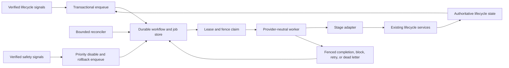
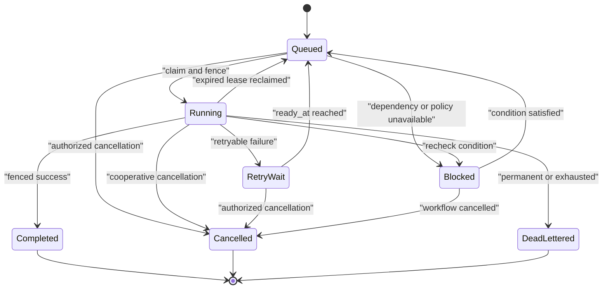
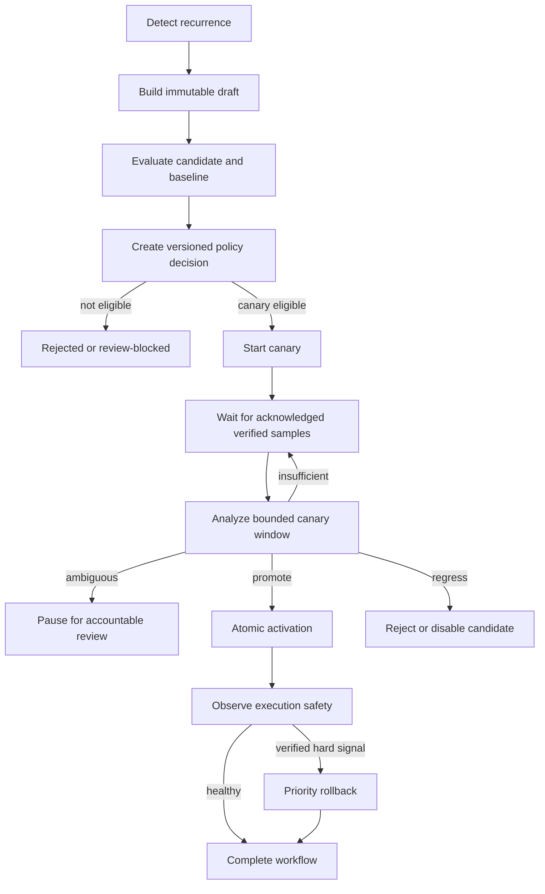

# Automatic Skill Background Orchestrator Design

## Context

The automatic skill lifecycle already provides immutable revisions, evaluation, policy decisions, deterministic canaries, exact-load acknowledgement, execution telemetry, activation/materialization, safety disablement, and rollback. Those components are callable services, not a continuously operating production loop. Verified lesson capture currently invokes recurrence detection synchronously, while evaluation, canary analysis, promotion, and safety observation require explicit calls.

This design adds a durable orchestration layer. It advances lifecycle work asynchronously while keeping the existing application services authoritative. Queue state proves what should run; lifecycle state proves what did run. Neither a worker nor a job payload may invent domain state.

## Architectural Decisions

1. **Database is the queue authority.** SQLite and PostgreSQL store workflows and jobs. Broker notifications, if introduced later, are wakeups only.
2. **Event enqueue plus reconciliation.** Domain transactions enqueue immediate successor work; bounded sweeps repair missing jobs and recheck blocked conditions.
3. **One provider-neutral worker core.** Standalone and hosted runtimes share claim, fence, execute, renew, classify, and finalize semantics.
4. **Lifecycle services remain authoritative.** Stage adapters load bound inputs and invoke existing services; they do not duplicate promotion or rollback policy.
5. **Lease plus fence, not lease alone.** Every ownership-changing claim increments a fence. Expired workers cannot complete or mutate job state.
6. **Blocked is not failed.** Missing samples, approval, budget, or readiness produce an explicit recheck condition without burning retry attempts.
7. **Safety has priority.** Verified safety signals disable allocation transactionally and enqueue rollback ahead of ordinary work.
8. **Automation is independently gated.** Detection, construction, evaluation, canary, activation, and safety automation can be enabled separately.
9. **No new broker dependency.** Existing database patterns are sufficient for the first production release and reduce standalone/hosted semantic drift.

## System Topology

### Standalone deployment

The normal standalone service owns one bounded worker loop and one installation-level reconciliation leader lease. It uses the exact configured SQLite database and registered project manager. Claiming occurs in short transactions; stage execution never holds a database write transaction open. A fixed worker pool processes jobs across registered workspaces with per-workspace limits.

If no Agent Memory service is running, work remains durable and resumes at the next service start. The CLI may run a deliberate one-shot `reconcile` or `drain`, but normal user commands do not spawn detached workers implicitly.

### Hosted deployment

A dedicated `agent-memory-skill-worker` deployment owns job execution. The existing reconciler deployment owns bounded global sweeps. APIs enqueue within tenant-scoped transactions and expose status, but cannot claim worker jobs. PostgreSQL claims use row locking with skip-locked semantics and RLS. Worker, reconciler, and API service identities receive distinct least-privilege capabilities.

## Component Responsibilities

### Signal router

The router converts verified domain events into stable enqueue intents. Sources include verified lessons, admitted candidates, published revisions, terminal evaluation pairs, policy decisions, canary sample changes, verified safety signals, and activation/materialization operations. It calculates an idempotency key and immutable input digest from authoritative identifiers.

The router does not decide whether a revision should pass. It only declares which bounded stage should re-evaluate current authoritative state.

### Workflow repository

The repository creates workflows, links dependencies, stores stage jobs, claims work, renews ownership, finalizes attempts, paginates status, and enforces tenant/workspace scope. Local and hosted adapters implement one contract and share behavior fixtures.

### Worker runtime

The worker performs a bounded `RunOnce` cycle:

1. claim ready jobs under quotas;
2. validate envelope version, scope, fence, and configuration;
3. start cancellation and lease-renewal supervision;
4. execute the registered stage adapter with a deadline;
5. classify the bounded result;
6. commit completion, block, retry, cancel, or dead letter using owner and fence;
7. emit content-free telemetry.

An adapter result cannot be finalized after lease loss. Domain operations are idempotent, so the next owner reconciles already-achieved state safely.

### Reconciler

The reconciler scans authoritative lifecycle and orchestration state with cursors. It repairs:

- expired running jobs;
- workflows missing the next required stage;
- blocked jobs whose recheck condition is now satisfied;
- activation operations requiring materialization recovery;
- safety signals lacking rollback jobs;
- terminal workflows with leftover non-terminal jobs;
- jobs bound to deleted, tombstoned, disabled, or superseded inputs;
- restored databases not yet admitted for automation.

It never synthesizes evaluation success, approval, or policy enablement.

### Stage registry

The registry maps versioned stage names to adapters, input validators, timeout policy, retry classifier, and required executor readiness. Unknown versions dead-letter safely. Mixed-version deployments claim only supported job contract versions.

### Control service

The control service exposes authorized status, pause, resume, reconcile, cancel, retry, and drain operations. It owns versioned configuration and accountable enablement references. It cannot directly mark a lifecycle revision active.

## Durable Data Model

### Workflow

| Field | Purpose |
|---|---|
| `id` | Opaque immutable workflow identity |
| `tenant_id`, `workspace_id`, `environment` | Authorization and execution scope |
| `skill_id` | Optional logical skill binding |
| `origin_kind`, `origin_id` | Verified signal that opened the workflow |
| `workflow_kind`, `contract_version` | Dependency graph and compatibility |
| `input_digest` | Immutable binding over origin and policy inputs |
| `state` | `open`, `paused`, `completed`, `cancelled`, `rejected`, `dead_lettered` |
| `current_stage`, `generation` | Optimistic orchestration progress |
| `configuration_version`, `policy_digest` | Enablement and policy custody |
| `created_at`, `updated_at`, `terminal_at` | Lifecycle timestamps |

Uniqueness covers scope, workflow kind, origin, and input digest so duplicate signals converge.

### Job

| Field | Purpose |
|---|---|
| `id`, `workflow_id`, `stage` | Stable stage attempt identity |
| `contract_version`, `input_digest` | Adapter compatibility and immutable inputs |
| `state`, `priority`, `ready_at` | Claim eligibility |
| `dependency_count`, `blocked_reason` | Dependency and evidence readiness |
| `attempt`, `max_attempts` | Retry custody |
| `lease_owner`, `lease_expires_at`, `fence` | Exclusive time-bounded execution |
| `timeout_at`, `cancel_requested_at` | Execution control |
| `result_kind`, `result_ids` | Bounded authoritative outputs |
| `failure_class`, `failure_code` | Safe diagnostics |
| `created_at`, `updated_at`, `completed_at` | Audit timestamps |

Ready-claim indexes begin with scope, state, ready time, priority, and creation order. Expired-lease indexes begin with running state and lease expiry. Result identifiers are bounded structured values, not arbitrary JSON content.

### Dependency

Dependencies link a child job to required parent jobs and accepted terminal outcomes. The child becomes ready only when every dependency is satisfied. Reconciliation derives readiness from stored dependencies rather than assuming notification order.

### Attempt audit

Every claim creates an immutable attempt record containing owner, fence, start/end timestamps, result class, failure code, and duration. Lease renewals may be summarized to a bounded count and final expiry rather than creating unbounded rows.

### Reconciliation cursor

Each sweep domain stores a cursor, last successful completion, configuration version, and bounded counters. Cursor state is advisory; repeated scanning is idempotent.

### Safety signal

Signals bind exact revision, source type, verifier, severity, evidence reference, deduplication digest, accepted policy version, disposition, and timestamps. They contain no raw customer content. Accepted hard signals transactionally set allocation-disabled state before rollback enqueue.

## State Machines

### Job state

### Automatic revision workflow

## Enqueue Transactions

Local enqueue writes the domain record and orchestration intent in one SQLite transaction where both repositories share the store. Hosted enqueue writes the domain record and orchestration job or outbox event in one tenant-scoped PostgreSQL transaction. If a service boundary prevents direct job insertion, a transactional outbox publishes a wakeup; reconciliation remains responsible for creating any missing job.

Idempotency keys include stage, scope, authoritative input IDs, input digest, and contract version. A new policy or evidence version creates a new job; delivery retries of the same version reuse the existing job.

## Stage Contracts

| Stage | Authoritative inputs | Existing service used | Successor condition |
|---|---|---|---|
| `detect` | verified lessons/episodes, detector policy | recurrence scheduler | new admitted candidate |
| `build` | candidate, active parent, proposed bounded content | revision builder | immutable draft published |
| `evaluate` | candidate/baseline digests, suite, evaluator environment | evaluation orchestrator | comparable terminal runs |
| `decide` | evaluation runs, immutable policy, approval | policy engine | canary/reject/review decision |
| `start_canary` | decision, testing revision, activation generation | canary start service | canary pointer committed |
| `analyze_canary` | exact acknowledged executions and window | canary analyzer | promote/pause/reject decision |
| `activate` | promote decision, expected generation, artifact | activation service | materialized active revision |
| `observe_safety` | authenticated revision-bound signal | safety observer | cooldown, disable, or rollback intent |
| `rollback` | accepted hard signal or authorized request | activation service | last-known-good restored |
| `reconcile_materialization` | operation ledger, digest, activation | materialization recovery | disk and registry agree |

Revision authoring is the only stage permitted to handle bounded proposed skill content. Job storage retains only the resulting candidate/revision identifiers and digests.

## Lease and Fence Protocol

- Default lease and renewal values are stage-specific and bounded by configuration.
- Claim increments the fence in the same transaction that assigns ownership.
- Renewal requires matching job, owner, fence, running state, and non-cancelled workflow.
- Finalization uses the same comparison and clears ownership.
- Domain calls receive a stable idempotency key derived from job and input digest.
- If renewal fails, the worker cancels the stage context and does not finalize.
- Non-cancellable external work may finish, but its result is ignored by the expired worker and reconciled by the current owner.

Short stages need no renewal when their timeout is strictly below lease duration. Evaluation and materialization stages require renewal supervision.

## Failure Classification and Retry Policy

| Class | State | Attempt effect | Example |
|---|---|---|---|
| contention | `retry_wait` | consumes attempt | SQLite busy, activation generation race requiring reload |
| dependency unavailable | `retry_wait` | consumes attempt | evaluator outage, temporary object/storage failure |
| insufficient evidence | `blocked` | no attempt burn while blocked | too few acknowledged canary samples |
| approval or policy missing | `blocked` | no attempt burn | automation disabled, approval absent |
| permanent validation | `dead_lettered` | terminal | invalid digest binding, unsupported job contract |
| safety rejection | `completed` with rejected result | terminal success of safety policy | prohibited candidate or hard regression |
| cancellation | `cancelled` | terminal | feature shutdown or operator cancellation |
| unknown internal | `retry_wait`, then `dead_lettered` | bounded attempts | unexpected safe internal code |

Backoff is exponential with deterministic jitter derived from job ID. The maximum delay, attempts, and elapsed retry age are bounded per stage. Retry cannot change immutable inputs. Dead-letter replay creates a successor job linked to the original and requires an authorized reason.

## Canary Timing

The canary start job schedules the first analysis at the minimum window end. Execution completion emits bounded wakeups that may move an analysis earlier only when the minimum time and sample requirements are both satisfied. A scheduled sweep guarantees eventual analysis without per-skill timers.

An insufficient result records the observed counts and next recheck time, then blocks or reschedules according to policy. It never lowers sample, verification, safety, or baseline requirements. A maximum canary age moves the workflow to accountable review; it does not promote.

## Safety and Rollback Path

Safety ingestion is intentionally shorter than the normal workflow:

1. authenticate and validate the signal;
2. bind it to exact workspace, skill, revision, and evidence;
3. deduplicate and classify under an immutable safety policy;
4. for an accepted hard signal, disable candidate allocation atomically;
5. enqueue highest-priority rollback using the current activation generation;
6. materialize and verify last-known-good;
7. finalize the signal or raise a critical rollback-failure state.

Detection, build, evaluation, canary analysis, and promotion claims for the affected revision are cancelled or blocked when allocation is disabled. Rollback cannot select a target other than the stored verified last-known-good revision.

## Reconciliation Strategy

Sweeps are divided into bounded domains so one failure cannot halt all recovery:

- lease recovery;
- dependency readiness;
- lifecycle-to-job parity;
- canary due analysis;
- safety-to-rollback parity;
- activation/materialization parity;
- blocked-condition rechecks;
- terminal workflow cleanup;
- retention and tombstone cleanup.

Standalone uses one leader lease per installation/database. Hosted uses one or more reconcilers claiming cursor partitions with skip-locked semantics. Every sweep records scanned, repaired, skipped, blocked, and failed counts with content-free reason codes.

## Configuration Contract

Configuration has an immutable version and digest. It contains:

- master mode: `disabled`, `shadow`, `manual`, `canary`, or `automatic_low_risk`;
- per-stage enabled flags;
- polling and reconciliation intervals;
- claim, worker, tenant, and workspace concurrency limits;
- stage lease, renewal, timeout, maximum attempts, and retry bounds;
- canary recheck and maximum-age bounds;
- evaluation/model budget and resource ceilings;
- drain timeout and stale-readiness threshold;
- required accountable approval and release-evidence references.

Secrets and credentials are provider configuration, not orchestrator configuration. A worker refuses claim when configuration is invalid, unsupported, unsigned where required, or inconsistent with the active promotion policy.

## Public and Operator Contracts

Status responses expose workflow/job identity, stage, safe state, attempts, ready/lease timestamps, bounded failure code, policy/configuration versions, and authoritative result IDs. They omit content and local paths.

Authorized operations include:

- inspect workflow/job status and history;
- pause/resume one workflow, workspace, stage, or installation;
- request reconciliation;
- cancel queued/blocked work;
- request cooperative cancellation of running work;
- retry eligible failed/dead-lettered work with reason;
- drain and report remaining claims;
- view readiness and bounded capacity metrics.

API, CLI, expanded MCP, and registered-project hosted adapters share schemas and idempotency semantics. Agents may inspect or suggest but cannot grant approval or enable automation.

## Security and Isolation

- Every repository query includes tenant/workspace scope; hosted PostgreSQL also enforces RLS.
- Worker claims are limited to configured tenant partitions and stage capabilities.
- Stage adapters receive identifiers, bounded metadata, and capability tokens, not general database or filesystem access.
- Evaluators receive declared resources and no inherited credentials.
- Local filesystem access resolves from registered roots and reuses descriptor-rooted custody boundaries.
- Fences, acknowledgement tokens, approval IDs, and safety evidence are non-interchangeable.
- Worker logs never include skill content, proposed files, prompts, raw evaluation output, customer identifiers in metric labels, or secrets.
- Job export/deletion follows lifecycle retention and legal hold. Deleting evidence blocks dependent unfinished work and preserves tombstoned lineage where required.

## Observability and SLO Model

Metrics are aggregated by stage, outcome, environment, and bounded failure class. Required measures include ready depth, oldest ready age, claim delay, running age, lease expiry, renewal failure, retries, blocked age, dead letters, stage duration, reconciliation drift/repair, canary wait age, safety-to-disable latency, and safety-to-rollback latency.

Initial numeric SLO targets are not invented in code. They are versioned production configuration approved with capacity evidence. The implementation must nevertheless support fixed measurable targets and fail release verification when a required target is absent.

Readiness checks configuration, migrations, repository access, supported job contracts, executor availability for enabled stages, and policy/evidence binding. Liveness checks only process health. A policy-blocked queue is ready but degraded; an unsupported contract or unavailable required evaluator is unready for the affected stage.

## Performance and Capacity

- Claims are short indexed transactions and never encompass stage execution.
- Workers process bounded batches with global, tenant, workspace, and stage semaphores.
- Fairness uses round-robin tenant/workspace partitions plus oldest-ready order inside a partition.
- Safety and rollback use a reserved concurrency lane so ordinary backlog cannot starve recovery.
- Reconciliation uses stable cursors and time budgets.
- Evaluation admission reserves workspace budget before claim and reconciles reservation with actual bounded usage.
- Queue growth triggers backpressure at enqueue; normal retrieval and legacy skill loading remain available.

Capacity testing covers steady state, burst enqueue, evaluator slowdown, a noisy tenant, lease churn, large-workspace reconciliation, database failover, and simultaneous safety rollback. Hosted tests prove horizontal scaling without duplicate finalization; standalone tests prove SQLite responsiveness during worker load.

## Failure Modes and Recovery

- **Duplicate signal:** uniqueness returns the existing workflow/job.
- **Crash before domain call:** lease expires and another worker replays.
- **Crash after domain call:** idempotent service or reconciliation observes achieved state and completes.
- **Crash after job completion before wakeup:** successor reconciliation creates the missing job.
- **Lease expires during work:** stale worker is fenced; current owner reconciles any side effect.
- **Database outage:** workers stop claims and renewals, cancel work on lease uncertainty, and recover through reconciliation.
- **Evaluator timeout:** job retries within policy; revision stays testing.
- **Insufficient canary traffic:** workflow remains blocked until sample or maximum-age review.
- **Stale activation generation:** promotion cancels and reloads; it never overwrites newer state.
- **Policy disabled mid-flight:** new ordinary claims stop; safety/rollback may drain; promotion revalidates before activation.
- **Restore from backup:** automatic stages remain paused until migration, lease, activation, and policy reconciliation pass.
- **Dead-letter growth:** alert and pause affected stage; do not bypass validation.
- **Rollback materialization failure:** keep revision disabled, surface critical state, and require recovery runbook.

## Alternatives and Trade-offs

### Synchronous request chaining

Rejected because long evaluation and canary windows cannot survive client disconnects or process restarts. It also turns normal solution capture into an availability dependency on the lifecycle pipeline.

### In-memory timers and goroutines

Rejected because they lose work across restart, create per-skill resource growth, and cannot coordinate hosted replicas.

### External workflow engine

Deferred. It could provide timers and retries, but introduces an operational dependency, complicates standalone parity, and risks making engine history authoritative over lifecycle data. The database-backed contract can later be adapted to an engine without changing domain services.

### Broker-authoritative queue

Rejected for the first version because standalone does not require a broker and broker retention/ack semantics would diverge from the lifecycle database. Broker wakeups remain optional.

### One universal job executor

Rejected. Stage-specific adapters, timeouts, retry classifiers, and capability sets reduce privilege and make failures auditable. The worker loop is shared; execution contracts are explicit.

## Migration and Compatibility

Migrations add workflow, job, dependency, attempt, signal, configuration, leader-lease, and reconciliation-cursor tables without altering existing lifecycle rows. Existing candidates, testing revisions, canaries, and incomplete activations are discovered in shadow reconciliation and reported before job creation is enabled.

No historical workflow is fabricated for completed lifecycle history. Imported active revisions remain active. Existing explicit lifecycle operations continue to work and may enqueue reconciliation hints once orchestration is enabled. Mixed deployments use contract-version claim filtering; old workers leave unsupported jobs untouched.

## Rollout Strategy

1. Add schemas, repositories, configuration validation, and read-only status with all stages disabled.
2. Run shadow reconciliation and deterministic standalone/hosted parity without executing lifecycle services.
3. Enable durable detection enqueue while retaining manual revision construction.
4. Enable automatic build and compare-only evaluation under strict budgets.
5. Enable opted-in low-risk canary start and analysis without automatic activation.
6. Enable safety ingestion and rollback lane; complete repeated crash/restore drills.
7. Enable low-risk automatic activation only with signed product-policy and release evidence.
8. Expand workspace cohorts and capacity only through versioned configuration changes.

Feature rollback disables ordinary claims, drains safety/rollback, cancels queued automatic activation, restores last-known-good materializations where required, and retains readable workflow history.

## Verification Strategy

Verification layers are:

- domain transition and validation tables;
- SQLite and PostgreSQL repository contract parity;
- deterministic worker/lease/fence tests;
- stage-adapter tests with real lifecycle services and restricted fake external dependencies;
- API/CLI/MCP/hosted schema and authorization tests;
- restart, duplicate, stale-fence, timeout, dead-letter, restore, and shutdown integration tests;
- two-tenant/two-workspace isolation and timing tests;
- capacity/fairness/backpressure evidence;
- permanent natural background-flow regressions for standalone and hosted;
- full Go, vet, MCP, dashboard, typecheck, build, migration, security, and embedded-dashboard gates.

The decisive release test starts from repeated verified work and uses only public capture plus a running orchestrator. It must produce a draft, evaluate, canary, automatically activate an explicitly approved low-risk revision, record exact use, accept a verified hard signal, and restore last-known-good after killing and restarting workers at controlled boundaries.
