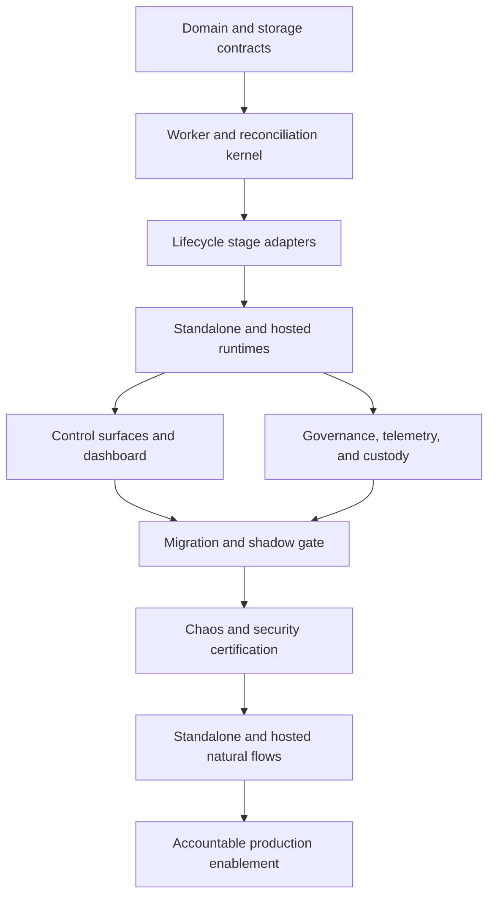

# Automatic Skill Background Orchestrator Implementation Plan

## Execution Rules

- Implement in dependency order and keep every task independently releasable behind disabled configuration.
- Use test-driven development for every behavior change.
- Reuse the existing lifecycle services; do not add direct lifecycle-table mutations to workers.
- Update this file's checkbox only after the task's acceptance and verification evidence pass.
- Keep automatic activation disabled until the final accountable release gate.

## Phase 1 — Durable Contracts and Storage

- [x] **Task 1: Define workflow, job, dependency, attempt, signal, and configuration domain contracts**
  - Acceptance: Versioned bounded types validate every state, transition, scope, input digest, fence, result, and failure class; invalid or content-bearing payloads fail closed.
  - Verify: table-driven validation, state-transition, size-bound, timestamp, contract-version, and redaction tests.
  - Dependencies: Existing automatic-skill lifecycle Tasks 1-28.
  - Files: `internal/core/skill_orchestrator.go`, focused tests, contract documentation.
  - Estimated scope: Medium.

- [x] **Task 2: Add standalone orchestration schema and migration**
  - Acceptance: SQLite stores workflows, jobs, dependencies, attempts, safety signals, configuration, leader leases, and reconciliation cursors with claim/recovery indexes and foreign-key lineage.
  - Verify: fresh and upgraded migration, rollback compatibility, constraint, index-plan, duplicate, retention, and concurrent-reader tests.
  - Dependencies: Task 1.
  - Files: SQLite migration, migration registry, migration tests.
  - Estimated scope: Medium.

- [x] **Task 3: Implement SQLite workflow repository contract**
  - Acceptance: Create/enqueue/block/cancel/claim/renew/finalize/retry/dead-letter/status operations are atomic, idempotent, generation-safe, and owner/fence protected.
  - Verify: duplicate enqueue, oldest-ready claim, expired reclaim, stale fence, renewal, cancellation, dependency, retry-wait, dead-letter, and pagination tests.
  - Dependencies: Task 2.
  - Files: SQLite repository, scanner helpers, focused tests.
  - Estimated scope: Medium.

- [x] **Task 4: Add hosted orchestration schema with RLS**
  - Acceptance: PostgreSQL tables mirror domain semantics, all rows are tenant/workspace scoped, RLS is fail-closed, and ready/expired/status indexes support bounded queries.
  - Verify: migration lint, RLS two-tenant isolation, forged scope, missing tenant context, index-plan, and rollback tests.
  - Dependencies: Tasks 1 and 2 contract freeze.
  - Files: hosted migration, RLS policy, migration tests.
  - Estimated scope: Medium.

- [x] **Task 5: Implement PostgreSQL workflow repository parity**
  - Acceptance: Hosted operations pass the shared repository contract and use skip-locked claim, owner/fence compare-and-swap, and tenant-scoped transactions.
  - Verify: shared parity fixtures plus concurrent claim, noisy tenant, lease takeover, stale worker, dead-letter, and timing-safe unknown-scope tests.
  - Dependencies: Tasks 3 and 4.
  - Files: PostgreSQL repository, shared fixture adapter, focused tests.
  - Estimated scope: Medium.

### Checkpoint A — Durable Queue Authority

- [x] SQLite and PostgreSQL satisfy one behavior contract.
- [x] Duplicate delivery and stale workers cannot duplicate job completion.
- [x] Hosted RLS and standalone workspace scope fail closed.
- [x] Schema upgrades preserve existing skill lifecycle state.

## Phase 2 — Enqueue, Worker, and Recovery Engine

- [x] **Task 6: Add transactional signal-to-job router**
  - Acceptance: Verified lifecycle signals create stable workflows/jobs with immutable digests and dependencies; duplicate signals converge and request paths do not execute long-running stages.
  - Verify: lesson, candidate, revision, evaluation, decision, canary, execution, safety, duplicate, tombstone, unauthorized, and transaction-rollback tests.
  - Dependencies: Checkpoint A.
  - Files: application router, repository interface, lifecycle integration adapters, focused tests.
  - Estimated scope: Medium.

- [x] **Task 7: Implement provider-neutral worker loop with lease fencing**
  - Acceptance: Bounded `RunOnce` claims jobs, validates contracts, supervises deadlines and renewals, invokes registered adapters, and finalizes only with current owner/fence.
  - Verify: success, lease loss, renewal loss, context cancellation, unsupported version, invalid payload, batch bounds, semaphore bounds, and stale completion tests.
  - Dependencies: Tasks 3, 5, and 6.
  - Files: worker core, registry contract, focused tests.
  - Estimated scope: Medium.

- [x] **Task 8: Add retry, blocked-condition, and dead-letter policy**
  - Acceptance: Stable failure classes drive bounded deterministic-jitter backoff, blocked rechecks avoid attempt burn, permanent failures dead-letter, and authorized replay creates a linked successor.
  - Verify: every failure class, delay bounds, maximum attempts/age, duplicate failure, replay authorization, immutable-input preservation, and content-leak tests.
  - Dependencies: Task 7.
  - Files: retry classifier, scheduler helper, repository integration, focused tests.
  - Estimated scope: Medium.

- [x] **Task 9: Add dependency resolution and successor scheduling**
  - Acceptance: Child jobs become ready only from authoritative parent outcomes; missing wakeups are harmless and incompatible terminal outcomes reject or block the workflow explicitly.
  - Verify: out-of-order delivery, duplicate completion, parent replay, rejected parent, cancelled workflow, multiple dependencies, and stale successor tests.
  - Dependencies: Tasks 6-8.
  - Files: dependency coordinator, repository queries, focused tests.
  - Estimated scope: Medium.

- [x] **Task 10: Implement bounded reconciliation engine**
  - Acceptance: Cursor-based sweeps repair expired leases, missing jobs, newly satisfied blocks, safety/rollback gaps, materialization drift, and terminal leftovers without inventing approval or success.
  - Verify: one fixture per sweep domain, cursor restart, concurrent reconcilers, time budget, partial failure, duplicate repair, restored database, and shutdown tests.
  - Dependencies: Tasks 6-9.
  - Files: reconciliation service, sweep registry, cursor adapter, focused tests.
  - Estimated scope: Medium.

### Checkpoint B — Restartable Orchestration Kernel

- [x] Worker crash before and after each side effect converges on one outcome.
- [x] Lease expiry, retry, dependency, and reconciliation semantics match across repositories.
- [x] Normal memory retrieval and skill resolution never wait for orchestration.
- [x] Unsupported or invalid jobs fail closed without blocking unrelated work.

## Phase 3 — Lifecycle Stage Adapters

- [x] **Task 11: Move recurrence detection behind durable enqueue**
  - Acceptance: Verified lesson capture commits normally and enqueues detection; synchronous request execution is removed, reconciliation repairs missing detection jobs, and candidate deduplication remains unchanged.
  - Verify: capture availability during worker outage, duplicate lessons, unauthorized evidence, suppressed evidence, restart, and existing recurrence regression tests.
  - Dependencies: Checkpoint B.
  - Files: solution service integration, detection adapter, router wiring, focused tests.
  - Estimated scope: Medium.

- [x] **Task 12: Add automatic revision-build adapter**
  - Acceptance: Eligible candidates build deterministic immutable drafts through the existing builder with protected sections, provenance, registered-root custody, and bounded authoring inputs.
  - Verify: create/revise/merge/split, missing parent, deleted evidence, unsafe content, duplicate build, lease replay, and filesystem failure tests.
  - Dependencies: Task 11.
  - Files: build adapter, bundle integration, focused tests.
  - Estimated scope: Medium.

- [x] **Task 13: Add queued evaluation and policy-decision adapters**
  - Acceptance: Candidate and baseline bind exact digests/suite/environment; executor readiness, timeout, cancellation, budget reservation, and immutable policy decisions remain enforced.
  - Verify: pass, regression, inconclusive, evaluator outage, timeout, budget exhaustion, stale suite, duplicate run, policy version change, and high-risk denial tests.
  - Dependencies: Tasks 8, 9, and 12.
  - Files: evaluation adapter, decision adapter, budget contract, focused tests.
  - Estimated scope: Medium.

- [x] **Task 14: Add canary-start and due-analysis adapters**
  - Acceptance: Eligible policy decisions start canary generation-safely; analysis schedules from bounded time/sample rules and never lowers thresholds for low traffic.
  - Verify: eligible low/approved medium/high denial, stale generation, insufficient samples, maximum age, ambiguous result, baseline regression, duplicate wakeup, and policy disablement tests.
  - Dependencies: Task 13.
  - Files: canary stage adapters, due scheduler, focused tests.
  - Estimated scope: Medium.

- [x] **Task 15: Add automatic activation adapter**
  - Acceptance: Only explicit promote decisions under enabled approved low-risk policy enqueue activation; existing activation/materialization saga remains authoritative and replay-safe.
  - Verify: feature disabled, missing approval reference, digest mismatch, stale generation, concurrent promotion, crash recovery, read-only root, duplicate job, and mixed configuration tests.
  - Dependencies: Task 14.
  - Files: activation adapter, enablement guard, materialization integration tests.
  - Estimated scope: Medium.

- [x] **Task 16: Add authenticated safety ingress and priority rollback adapter**
  - Acceptance: Revision-bound verified signals deduplicate, hard signals disable allocation before priority rollback, soft signals enter cooldown, and rollback restores only recorded last-known-good.
  - Verify: every accepted signal, forged/cross-scope signal, repeated signal, soft cooldown, rollback priority under backlog, lease replay, rollback failure, and oscillation tests.
  - Dependencies: Tasks 7-10 and 15.
  - Files: safety ingress, priority queue policy, rollback adapter, focused tests.
  - Estimated scope: Medium.

### Checkpoint C — Complete Domain Loop

- [x] Repeated verified work can reach canary without manual stage calls.
- [x] Automatic activation remains impossible without approved low-risk enablement.
- [x] Exact acknowledged execution evidence controls canary analysis.
- [x] Verified hard failures stop allocation and enqueue rollback ahead of ordinary work.

## Phase 4 — Standalone and Hosted Runtimes

- [x] **Task 17: Embed bounded standalone worker runtime**
  - Acceptance: The exact SQLite-backed service owns one leader sweep and bounded worker pool, resumes after restart, drains gracefully, and never creates a goroutine per skill.
  - Verify: disabled startup, wrong DB, leader contention, restart, SIGTERM drain, lease expiry, multiple workspaces, SQLite responsiveness, and feature-shutdown tests.
  - Dependencies: Checkpoint C.
  - Files: standalone runtime package, service wiring, runtime configuration, focused tests.
  - Estimated scope: Medium.

- [x] **Task 18: Add hosted skill-worker process**
  - Acceptance: A distinct least-privilege process validates configuration/readiness, claims tenant-safe work horizontally, renews leases, drains signals, and reserves rollback capacity.
  - Verify: configuration bounds, two replicas, worker loss, tenant fairness, RLS, readiness/liveness, SIGTERM drain, rollback lane, and no API-worker privilege overlap tests.
  - Dependencies: Checkpoint C and hosted Task 5.
  - Files: `internal/saas/skillworker/`, `cmd/agent-memory-skill-worker/`, configuration, focused tests.
  - Estimated scope: Medium.

- [x] **Task 19: Extend hosted reconciler for skill workflows**
  - Acceptance: Bounded tenant/workspace cursor partitions repair orchestration drift without blocking existing reconciliation domains or requiring global table scans.
  - Verify: partition claiming, cursor restart, concurrent replicas, one-domain failure isolation, tenant deletion, restore pause, and bounded-query tests.
  - Dependencies: Tasks 10 and 18.
  - Files: reconciler integration, hosted sweep adapter, focused tests.
  - Estimated scope: Medium.

- [x] **Task 20: Add deployment and least-privilege manifests**
  - Acceptance: Local Compose and Kubernetes define worker/reconciler identities, resources, shutdown grace, probes, network policy, database permissions, and default-disabled configuration without new secrets in source.
  - Verify: Compose profiles, Kubernetes schema/policy checks, service-account capability tests, secret inventory, rollout/rollback rendering, and non-root image checks.
  - Dependencies: Tasks 18 and 19.
  - Files: deployment manifests, permission migrations/policies, release tests.
  - Estimated scope: Medium.

### Checkpoint D — Operable Runtime Parity

- [x] Standalone and hosted execute identical workflow fixtures.
- [x] Horizontal hosted scaling and standalone restart preserve one logical outcome.
- [x] Worker, API, and reconciler privileges are separated.
- [x] All automation is disabled in default shipped configuration.

## Phase 5 — Control Surfaces and Product Visibility

- [x] **Task 21: Add standalone CLI and HTTP orchestration controls**
  - Acceptance: Status, history, pause, resume, cancel, reconcile, retry, dead-letter replay, and drain are authorized, paginated, stable, and idempotent.
  - Verify: success, stale generation, replay, unauthorized, unknown workspace, invalid target, running cancellation, drain timeout, and content-free output tests.
  - Dependencies: Tasks 17 and 19 contracts.
  - Files: CLI commands, local HTTP handler, request/response contracts, focused tests.
  - Estimated scope: Medium.

- [x] **Task 22: Add expanded MCP and registered-project hosted parity**
  - Acceptance: Expanded MCP and local-owner hosted adapters expose equivalent orchestration status/controls; legacy profiles and managed-hosted unavailable states remain unchanged.
  - Verify: MCP snapshots, two-workspace authorization, two-tenant isolation, path injection, idempotency, pagination, and capability-discovery tests.
  - Dependencies: Task 21.
  - Files: MCP schemas/mapping, hosted adapter, contract tests.
  - Estimated scope: Medium.

- [x] **Task 23: Upgrade Skills dashboard with orchestration state**
  - Acceptance: Authorized users can see workflow stage, queue/blocked/retry/dead-letter state, safe reasons, canary due state, policy/config version, and control actions without exposing content or implying approval.
  - Verify: every state, N/A evidence, stale action, authorization, keyboard, narrow layout, polling cancellation, standalone/hosted parity, and accessibility tests.
  - Dependencies: Tasks 21 and 22.
  - Files: gateway contracts, Skills orchestration panel, styles, dashboard tests.
  - Estimated scope: Medium.

### Checkpoint E — Public Operational Workflow

- [x] Operators can understand and control work without database access.
- [x] Agents can inspect but cannot approve or enable automation.
- [x] Legacy clients remain revision- and queue-unaware.
- [x] UI, CLI, HTTP, MCP, and hosted state agree.

## Phase 6 — Governance, Observability, and Data Lifecycle

- [x] **Task 24: Add versioned configuration and accountable enablement**
  - Acceptance: Backend-owned configuration validates every bound, audits changes, supports per-stage modes, and requires signed product-policy/release evidence before automatic low-risk activation claims.
  - Verify: invalid bounds, missing evidence, digest mismatch, staged modes, mid-flight disable, safety drain, configuration rollback, and separation-of-duty tests.
  - Dependencies: Tasks 15, 17, and 18.
  - Files: configuration service, storage adapters, authorization, focused tests.
  - Estimated scope: Medium.

- [x] **Task 25: Add bounded metrics, alerts, readiness, and runbooks**
  - Acceptance: Required queue/lease/retry/block/dead-letter/reconciliation/canary/safety/rollback metrics and alerts are content-free; readiness distinguishes stage degradation from process liveness.
  - Verify: metric registration/cardinality/content leak, alert fixtures, missing target, evaluator outage, stuck canary, rollback failure, and readiness/liveness tests.
  - Dependencies: Tasks 17-20 and 24.
  - Files: observability package, alert rules, readiness adapters, runbooks.
  - Estimated scope: Medium.

- [x] **Task 26: Add export, deletion, retention, legal-hold, and tombstone parity**
  - Acceptance: Orchestration configuration/history/signals follow lifecycle custody; deletion cancels dependent work, legal hold prevents removal, retention bounds attempts, and deleted evidence cannot be resurrected by reconciliation.
  - Verify: export round trip, selective deletion, active workflow deletion, held records, expired attempts, dead letters, tombstoned evidence, restore, and tenant isolation tests.
  - Dependencies: Tasks 2, 4, 10, and 24.
  - Files: portable/hosted export adapters, custody service, cleanup sweeps, focused tests.
  - Estimated scope: Medium.

- [x] **Task 27: Add capacity, fairness, budget, and cost controls**
  - Acceptance: Global/tenant/workspace/stage bounds, reserved rollback capacity, cursor budgets, and evaluation cost reservations prevent noisy-neighbor and budget overrun while preserving retrieval availability.
  - Verify: large workspace, many small workspaces, burst queue, slow evaluator, noisy tenant, rollback starvation, budget exhaustion, SQLite latency, and hosted horizontal-load tests.
  - Dependencies: Tasks 13, 17-20, and 25.
  - Files: quota coordinator, budget adapter, load fixtures, evidence report.
  - Estimated scope: Medium.

### Checkpoint F — Governed Production Runtime

- [x] Automatic activation cannot claim without signed enablement evidence.
- [x] Operational telemetry is bounded and content-free.
- [x] Data rights and retention cover every orchestration record.
- [x] Capacity evidence proves fairness, rollback priority, and retrieval isolation.

## Phase 7 — Migration and Release Evidence

- [x] **Task 28: Add shadow discovery and migration gate**
  - Acceptance: Existing candidates, testing revisions, canaries, and activation operations are reported without fabricated history; shadow jobs predict deterministic decisions but execute no domain mutation.
  - Verify: fresh/upgraded database matrix, empty/existing/incomplete lifecycle states, shadow parity, mixed versions, restore pause, and rollback tests.
  - Dependencies: Checkpoint F.
  - Files: migration verifier, shadow executor, representative fixtures, operator documentation.
  - Estimated scope: Medium.

- [x] **Task 29: Add crash, lease, and recovery chaos certification**
  - Acceptance: Injected failure before/after every domain side effect, renewal loss, duplicate enqueue, stale fence, database outage, evaluator timeout, cancellation, and worker restart converges without unsafe activation.
  - Verify: deterministic chaos suite for standalone and hosted plus signed bounded report.
  - Dependencies: Tasks 11-20 and 28.
  - Files: certification harness, fault adapters, report generator, focused tests.
  - Estimated scope: Medium.

- [x] **Task 30: Add independent isolation and security release gate**
  - Acceptance: Two-tenant/two-workspace review proves RLS, authorization, filesystem custody, worker privilege, forged IDs/tokens/signals, timing behavior, payload/log redaction, and least-privilege evaluation.
  - Verify: security suite plus independent accountable evidence receipt bound to build and migrations.
  - Dependencies: Tasks 20, 22, 24, 26, and 29.
  - Files: security fixtures, evidence collector, release documentation.
  - Estimated scope: Medium.

- [x] **Task 31: Add natural standalone background-flow regression**
  - Acceptance: Public verified work with a running standalone service automatically reaches draft, evaluation, canary, approved low-risk activation, exact-use measurement, verified hard signal, and last-known-good rollback without manual stage operations; controlled restarts preserve progress.
  - Verify: permanent fresh-workspace test using public capture/status surfaces and real embedded worker runtime.
  - Dependencies: Tasks 21-29.
  - Files: integration test, deterministic executor fixtures, release report.
  - Estimated scope: Medium.

- [x] **Task 32: Add hosted horizontal natural-flow regression**
  - Acceptance: Two workers and two tenants execute the same lifecycle with fairness, lease takeover, RLS isolation, policy enablement, rollback priority, and API/dashboard status parity.
  - Verify: permanent hosted integration journey with worker kill/restart and exact standalone outcome parity.
  - Dependencies: Tasks 19-30.
  - Files: hosted integration test, runtime fixtures, parity report.
  - Estimated scope: Medium.

- [x] **Task 33: Complete production rollout and shutdown certification**
  - Acceptance: Disabled → shadow → manual → canary → approved automatic-low-risk transitions have signed evidence; pause/drain/restore/shutdown procedures retain active skills and auditable history.
  - Verify: repeated staging drills, configuration/build/migration binding, rollback timing, alert routing, runbook execution, and accountable product approval.
  - Dependencies: Tasks 28-32.
  - Files: release gate, evidence bundle, runbooks, deployment verification.
  - Estimated scope: Medium.

### Final Checkpoint — Background Automation Release Gate

- [ ] All R1-R16 requirements have direct automated or accountable manual evidence.
- [x] Standalone and hosted natural flows require no manual stage calls.
- [x] Duplicate delivery, process loss, stale leases, and partial failure converge safely.
- [ ] Safety rollback meets the approved SLO under ordinary and saturated load.
- [x] No default configuration enables candidate generation, canary, activation, or rollback automation unexpectedly.
- [ ] Product review approves risk classes, thresholds, canary policy, retry/dead-letter policy, budgets, retention, SLOs, and automatic-low-risk enablement.
- [x] Full Go, vet, hosted, MCP, dashboard, typecheck, build, migration, security, capacity, chaos, and embedded-dashboard gates pass.

## Requirement Traceability

| Requirement | Primary tasks |
|---|---|
| R1 | 1-5 |
| R2 | 6, 9, 11-16 |
| R3 | 3, 5, 7 |
| R4 | 8, 21-22 |
| R5 | 10, 17-19, 28-29 |
| R6 | 7, 11-16 |
| R7 | 13-15, 24, 31-33 |
| R8 | 16, 25, 27, 29-33 |
| R9 | 17, 21, 31 |
| R10 | 4-5, 18-20, 32 |
| R11 | 17-18, 24, 33 |
| R12 | 4-5, 16, 20-22, 26, 30 |
| R13 | 21, 23, 25, 33 |
| R14 | 3, 5, 10, 17-19, 27 |
| R15 | 21-23, 28, 31-32 |
| R16 | 28-33 |

## Dependency Summary

## Parallelization Guidance

- After Task 1 freezes contracts, SQLite and PostgreSQL schema work may proceed independently.
- After repository parity, worker retry policy and transactional signal routing may proceed independently with shared contracts.
- Stage adapters must follow lifecycle dependency order; safety ingress may proceed alongside canary adapters after the worker kernel is stable.
- Standalone and hosted runtime wiring may proceed in parallel after stage contracts freeze.
- CLI/MCP/dashboard work may proceed in parallel only after status/control schemas freeze.
- Migration, chaos, security, and natural-flow certification must run against the integrated runtimes and remain sequential release gates.
