# Automatic Skill Revision Lifecycle Design

## Context and Diagnosis

Agent Memory currently stores one distilled-skill metadata row per workspace and name, writes one root `SKILL.md`, and uses `--force` to overwrite it. Solution summaries and tool lessons already have validation, version, provenance, and supersession concepts, but executable skill artifacts do not. How recall can surface a logical skill, yet the system cannot prove which revision was loaded or whether that revision improved the task.

The chosen architecture adds a revision registry and promotion controller around the current filesystem skill contract. Agent runtimes continue to discover one root skill file. Agent Memory owns immutable revisions, resolution, evaluation, activation, telemetry, and rollback.

## Architectural Principles

1. **Separate proposal from authority.** Agents and detectors may propose; policy and accountable approvals activate.
2. **Immutable publication.** A published bundle is content-addressed and never edited.
3. **One active default.** Each logical skill, workspace, and environment has one active revision enforced by storage constraints.
4. **A resolved skill is not a used skill.** Runtime acknowledgement is required for causal telemetry.
5. **Compatibility first.** Revision selection filters incompatible capabilities before considering recency or quality.
6. **Fail closed, roll back quickly.** Missing evidence pauses promotion; hard safety failures disable and restore last-known-good.
7. **Keep legacy hosts working.** Activation atomically materializes the selected revision at the existing root path.

## System Flow

```mermaid
flowchart LR
    Work["Validated solution episodes"] --> Detect["Bounded pattern detector"]
    Detect --> Candidate["Skill candidate"]
    Agent["Agent proposal"] --> Candidate
    Candidate --> Build["Immutable revision builder"]
    Build --> Test["Evaluation suite"]
    Test --> Policy["Promotion policy"]
    Policy -->|"eligible"| Canary["Canary allocation"]
    Policy -->|"approval required"| Review["Accountable review"]
    Review --> Canary
    Canary --> Analyze["Baseline comparison"]
    Analyze -->|"pass"| Activate["Atomic activation"]
    Analyze -->|"fail"| Reject["Pause or reject"]
    Activate --> Resolve["Runtime resolution"]
    Resolve --> Ack["Load acknowledgement"]
    Ack --> Measure["Execution outcome telemetry"]
    Measure -->|"hard failure"| Rollback["Automatic rollback"]
    Measure --> Detect
```

## Domain Model

### Logical skill

The logical skill is the stable object selected by retrieval and agents. It owns the normalized name, aliases, description, trigger conditions, declared capabilities, default risk tier, owner group, archive state, and current generation. Renaming affects display and lookup metadata, not identity or revision lineage.

### Skill candidate

A candidate represents a proposed `create`, `revise`, `merge`, or `split`. It references the source solution episodes, tool lessons, memories, skill executions, and parent revisions. It also stores similarity results, expected benefit, risk assessment, proposed suite changes, detector or agent identity, deduplication hash, and disposition.

Candidate records are safe summaries and identifiers; they do not duplicate source transcripts or hidden reasoning.

### Skill revision

A revision is an immutable bundle manifest plus content digest. It includes:

- logical skill and monotonically increasing revision number;
- parent revisions and originating candidate;
- bundle digest and bounded file manifest;
- compatibility constraints and required capabilities;
- protected-section preservation report;
- risk classification and provenance;
- lifecycle state and timestamps;
- evaluator and policy evidence references.

Revision state transitions are append-audited. Content does not change when the state changes.

### Evaluation suite and run

The suite is a versioned set of bounded case references. Cases are typed as positive trigger, negative trigger, regression, safety, compatibility, or expected artifact. Evaluation runs bind an exact revision digest, parent baseline digest, suite version, evaluator version, environment fingerprint, result metrics, failures, and verdict.

The first production implementation should use deterministic checks and task-verification adapters where possible. Model graders may contribute signals but cannot be the sole verifier for promotion.

### Activation

Activation is a scope record for logical skill, workspace, and environment. It points to the active revision and optional last-known-good and canary revisions, carries an optimistic generation, policy decision, approval, activation time, and materialization state.

The database guarantees at most one activation row per scope. The active pointer changes transactionally; filesystem materialization completes through a recoverable operation ledger.

### Execution record

An execution record has two phases:

1. Resolution records which revision was offered and why.
2. Acknowledgement records whether the runtime loaded that exact digest.

Completion adds safe task class, episode, timestamps, outcome, independent verification, token and tool counts when available, user feedback, and failure classification. Unacknowledged resolutions never count toward canary success or revision quality.

## Storage Design

### Local SQLite

Add normalized tables for:

- logical skills and aliases;
- immutable skill revisions and revision parents;
- candidate records and candidate source references;
- evaluation suites, cases, runs, and case results;
- promotion policies and immutable policy versions;
- approvals and policy decisions;
- scoped activations and activation-operation ledger;
- resolution, acknowledgement, and execution outcome records;
- rollback and disablement events.

Uniqueness constraints protect workspace/name, skill/revision number, bundle digest identity, candidate deduplication, activation scope, and idempotency keys. Foreign keys preserve lineage. Current distilled metadata is retained during migration and mapped to logical skill plus revision 1.

### Hosted PostgreSQL

Hosted storage mirrors the domain semantics with tenant included in every key and row-level access path. Job claiming uses bounded leases and skip-locked semantics. The service layer remains provider-neutral so local and hosted adapters share policy decisions, state transitions, and contract fixtures.

### Filesystem layout

Immutable bundles live under a revision-owned directory inside the registered project root. The existing root `.agents/skills/<name>/SKILL.md` remains the active compatibility artifact.

Activation writes the selected bundle to a contained temporary sibling, verifies file count, size, regular-file status, manifest digest, and parent-directory custody, then atomically renames it into the active location. Symlinks are not used. Supporting active assets are materialized by the same operation and manifest.

The database activation pointer is authoritative. An operation ledger makes incomplete materialization detectable and repairable after a crash. Resolution fails closed if the active artifact digest does not match the registry.

## Candidate Detection

The detector runs as a bounded lifecycle job after solution finalization and tool-lesson validation. It considers only authorized, non-suppressed, task-verified evidence. Candidate signals include repeated action subsequences, repeated tool capabilities, recurring manual corrections, repeated failed approaches, and consistent performance differences when a skill was acknowledged.

Candidate generation has three stages:

1. Generate bounded pattern clusters within one workspace.
2. Compare the cluster with existing skill descriptions, triggers, capabilities, revisions, and provenance.
3. Propose create, revise, merge, split, or no-action with confidence and supporting identifiers.

Thresholds control suggestions, not activation. A detector outage or low-confidence cluster produces no candidate and does not affect normal retrieval.

## Revision Construction

Construction starts from either an empty skill template or the active parent bundle. The builder loads only selected source records and the declared evaluation suite. It must preserve protected human sections and assets, explain removals, enforce content bounds, validate frontmatter and references, and produce a deterministic manifest and diff.

The existing `distill` command becomes an adapter that creates a candidate and draft revision. It no longer overwrites the active root. Manual packaging remains supported by importing a prepared bundle as a draft revision through the same admission and digest boundary.

## Evaluation and Comparison

Evaluation executes in a restricted environment with declared tools and resources. It produces comparable metrics for candidate and active baseline:

- independently verified task success;
- safety and policy violations;
- trigger precision and false activation;
- regression case pass rate;
- elapsed time and timeout rate;
- token and tool-call consumption;
- user corrections and harmful feedback;
- artifact correctness where applicable.

The policy uses absolute safety gates before relative performance gates. A faster revision cannot pass if it is less safe or materially less correct. Low-volume skills remain in testing or canary until evidence is sufficient; time alone never causes promotion.

## Risk Classification and Promotion

Risk is derived from declared and observed capabilities. Operations affecting deletion, deployment, credentials, production access, payments, identity, security controls, or regulated data are high risk unless a stricter policy applies.

- **Low risk:** automated testing, bounded canary, and automatic activation are permitted.
- **Medium risk:** automated evaluation and canary are permitted after policy-defined approval; automatic activation is disabled by default.
- **High risk:** accountable human approval is mandatory and automatic activation is forbidden.

Policies are immutable versions. A decision records the exact policy version, inputs, output, reason codes, evaluator evidence, and approval identity. Historical decisions are never recomputed under a new policy.

## Canary Allocation

Canary selection is deterministic from workspace, environment, task identity, logical skill, and policy version. Allocation is stable across retries and excludes tasks that are incompatible, explicitly pinned, high risk, or missing runtime acknowledgement support.

The canary controller uses bounded windows and minimum independent verification coverage. It promotes only when safety gates pass, outcome quality is non-inferior to baseline, and configured efficiency or capability goals are met. Hard failures terminate the canary immediately; soft regressions pause it for review.

## Resolution Contract

The agent selects a logical skill or asks retrieval to select one. The resolver then:

1. validates tenant, workspace, environment, principal, and requested capabilities;
2. applies authorized explicit or environment pins;
3. filters revisions by lifecycle and compatibility;
4. applies deterministic canary allocation when eligible;
5. otherwise returns the active revision;
6. includes the last-known-good fallback;
7. verifies the materialized artifact digest before returning success.

The response exposes the logical skill, exact revision and digest, resolution reason, policy version, compatibility decision, acknowledgement token, and fallback. The agent does not rank revision numbers or interpret lifecycle states.

## Activation and Rollback Transactions

Activation is a saga with an idempotent operation ID:

1. validate eligibility, approvals, expected activation generation, and artifact custody;
2. reserve the new activation generation and operation record;
3. materialize and digest-verify the active bundle atomically;
4. commit active, previous, and last-known-good pointers;
5. emit content-free audit and cache invalidation events.

Recovery reconciles reserved operations against disk digest and database state. It either completes the intended activation or restores the previous verified artifact. It never chooses a revision based on filesystem modification time.

Rollback uses the same mechanism with a policy or operator reason. Hard safety triggers may reserve rollback automatically. Repeated soft signals enter cooldown to prevent activation oscillation.

## Public Interfaces

The CLI and equivalent HTTP or expanded MCP contracts provide operations for:

- listing and inspecting logical skills and revisions;
- proposing a candidate or importing a draft bundle;
- running and inspecting evaluations;
- starting, pausing, or inspecting a canary;
- approving or rejecting eligible revisions;
- promoting, pinning, disabling, and rolling back;
- resolving a logical skill and acknowledging exact load;
- completing a skill execution with verified outcome;
- inspecting policies and decision history.

Legacy skill discovery remains file-based. Older clients see only the materialized active bundle and do not participate in canary or effectiveness measurement unless they gain acknowledgement support.

## Dashboard Design

The existing Skills panel becomes a lifecycle browser:

- skill list shows active revision, risk, canary state, recent quality, and alerts;
- revision timeline distinguishes latest from active and last-known-good;
- comparison view shows bounded diff, provenance, evaluation, approvals, and policy decision;
- canary view shows acknowledged sample coverage and baseline comparison;
- controls expose approve, reject, pause, activate, pin, disable, and rollback only when authorized;
- operation failures show recoverable state without implying activation succeeded.

The How History tree links executions and promotions to exact revision IDs. It does not infer skill use from textual similarity.

## Security and Privacy

- All source records and lifecycle objects are tenant- and workspace-scoped.
- Proposal and evaluation content passes the existing origin-aware admission pipeline.
- Filesystem operations use registered roots, descriptor-rooted custody checks, regular-file validation, bounded manifests, and digest verification.
- Evaluation sandboxes receive explicit capabilities and no inherited credentials by default.
- Runtime acknowledgement tokens are short-lived, scope-bound, and replay-protected.
- Metrics use bounded labels and exclude customer content, prompts, raw outputs, and hidden reasoning.
- Approval policy enforces separation between proposing identity and activation authority for medium- and high-risk revisions.

## Failure Modes

- **Concurrent promotion:** optimistic generation allows one winner; the loser reloads state.
- **Crash during activation:** operation recovery completes or restores the prior verified artifact.
- **Digest mismatch:** resolution fails, revision is disabled, and last-known-good is restored.
- **Insufficient canary traffic:** remain in canary; do not weaken thresholds automatically.
- **Evaluator unavailable:** remain in testing or canary and surface degraded readiness.
- **Poisoned or suppressed evidence:** exclude it and invalidate dependent pending evaluations.
- **Runtime never acknowledges:** exclude the resolution from effectiveness and canary samples.
- **No compatible active revision:** return an explicit unavailable result rather than the latest revision.
- **Feedback regression:** pause or roll back according to severity and policy cooldown.
- **Deleted source evidence:** retain tombstoned provenance and block new promotion if required evidence can no longer be verified.
- **Filesystem read-only:** keep registry unchanged, fail activation, and continue serving the prior verified active artifact when available.

## Performance and Scaling

- Candidate detection scans bounded finalized-episode windows and stores reusable cluster summaries.
- Evaluation jobs are queued, leased, backpressured, and limited per tenant and workspace.
- Resolver reads use a cache keyed by tenant, workspace, environment, skill, activation generation, and compatibility fingerprint.
- Activation invalidates only the affected scope.
- Execution telemetry is append-only, partitionable in hosted storage, and aggregated before long-term retention.
- Dashboard lists are paginated and load revision details, diffs, and case results lazily.
- Prometheus labels never include skill IDs or revision IDs; per-skill analysis remains in bounded database queries.

## Migration and Compatibility

Migration discovers registered root skills using the existing contained-file rules. Each valid current skill becomes a logical skill with immutable revision 1, an imported policy decision, and active activation for the local default environment. Existing provenance metadata attaches to revision 1.

Migration does not rewrite the root skill file. A post-migration digest confirms compatibility. Invalid, symlinked, oversize, or escaping skills are reported and left unmanaged rather than silently imported.

Existing `distill --force` invocations are accepted only through an explicit compatibility mode that produces a draft revision; they do not replace active content. API clients that only list skills continue receiving the active materialized view.

## Rollout Strategy

1. Ship additive schema, read-only revision inventory, and existing-skill import behind a disabled capability.
2. Enable shadow resolution and digest checks while legacy root files remain authoritative.
3. Make the registry authoritative for manual draft creation, evaluation, activation, and rollback.
4. Add runtime acknowledgement and execution telemetry without automatic promotion.
5. Enable bounded candidate suggestions and compare-only evaluation.
6. Enable canaries for explicitly opted-in low-risk workspaces.
7. Enable low-risk automatic promotion only after false-promotion, rollback, and isolation gates pass.
8. Retain mandatory approval for medium and high risk and expand automation only through versioned policy changes.

Rollback of the feature disables candidate generation and automatic promotion, restores the last-known-good materialized skills, and leaves immutable history readable.

## Alternatives Considered

### Always use the latest revision

Rejected because creation time does not prove correctness, compatibility, safety, or approval.

### Let the proposing agent activate directly

Rejected because it collapses proposal, evaluation, and authority into one unaccountable actor.

### Use Git history as revision storage

Rejected as the primary contract because Git state may be absent, shared across workspaces, rewritten, or unavailable to hosted services. Git remains an optional external audit source.

### Store revisions only in the database

Rejected because supporting assets and existing agent-host discovery are filesystem-oriented. The chosen model stores authoritative metadata and digests in the database with contained immutable bundles in the registered project.

### Expose all revisions directly to the agent

Rejected because it forces every runtime to reimplement lifecycle, compatibility, canary, and safety policy. The resolver returns one decision.

## Verification Strategy

Release gates include domain transition tables, migration round trips, concurrent activation, crash recovery, digest mismatch, path custody, admission adversaries, policy determinism, evaluation reproducibility, canary allocation stability, exact-use acknowledgement, automatic rollback, two-tenant isolation, legacy client compatibility, dashboard accessibility, and full Go, MCP, dashboard, typecheck, build, vet, and embedded-asset regression suites.

The decisive evaluation compares active-baseline and candidate revisions on verified task success, safety, trigger precision, repeated steps, elapsed time, tokens, tool calls, and human corrections. Automatic promotion remains disabled until the test corpus demonstrates bounded false promotion and reliable rollback.
