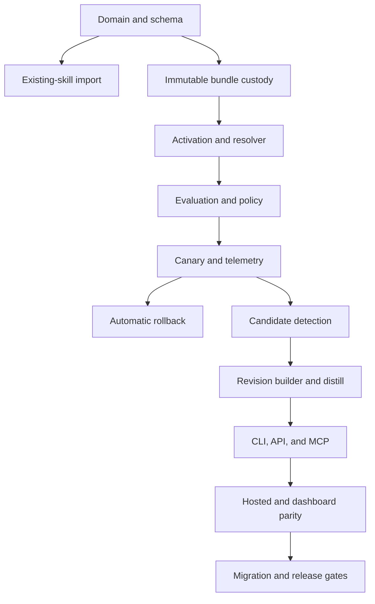

# Automatic Skill Revision Lifecycle Implementation Tasks

## Phase 1 — Revision Foundation

- [x] **Task 1: Add skill lifecycle domain contracts**
  - Acceptance: Logical skills, candidates, immutable revisions, suites, evaluations, policies, activations, resolutions, executions, approvals, and rollback events have bounded validation and explicit transition tables.
  - Verify: `go test ./internal/core -run 'TestSkill'`.
  - Dependencies: None.
  - Files: `internal/core/skill_lifecycle.go`, focused core tests.
  - Estimated scope: Medium.

- [x] **Task 2: Add additive SQLite revision registry schema**
  - Acceptance: Normalized tables and constraints preserve revision lineage, one activation per scope, idempotency, and foreign-key integrity without changing existing databases.
  - Verify: migration round-trip, uniqueness, rollback, and concurrent-open tests in `internal/storage/sqlite`.
  - Dependencies: Task 1.
  - Files: migrations, schema fixtures, focused migration tests.
  - Estimated scope: Medium.

- [x] **Task 3: Import existing skills as revision 1**
  - Acceptance: Valid contained root skills and existing distilled provenance import idempotently as active revision 1; invalid or escaping artifacts are reported and unchanged.
  - Verify: fresh, upgraded, duplicate, symlink, oversize, and missing-provenance fixtures.
  - Dependencies: Task 2.
  - Files: workspace importer, SQLite adapter, focused importer tests.
  - Estimated scope: Medium.

### Checkpoint A — Read-Only Compatibility

- [x] Existing workspaces migrate without changing root skill contents.
- [x] Revision inventory reproduces current logical skills and provenance.
- [x] Core and SQLite suites pass with migration downgrade/upgrade fixtures.

## Phase 2 — Immutable Bundles and Safe Activation

- [x] **Task 4: Implement contained immutable bundle storage**
  - Acceptance: Revision bundles are regular-file-only, bounded, content-addressed, descriptor-rooted, and immutable after publication.
  - Verify: replacement-parent, symlink, digest, size, duplicate, and crash-interruption tests.
  - Dependencies: Checkpoint A.
  - Files: workspace bundle store, custody helper, focused tests.
  - Estimated scope: Medium.

- [x] **Task 5: Implement active bundle materialization**
  - Acceptance: A verified revision bundle atomically materializes at the legacy root path with all declared assets; failure leaves the prior active bundle intact.
  - Verify: atomic rename, read-only filesystem, missing asset, digest mismatch, and recovery tests.
  - Dependencies: Task 4.
  - Files: materializer, operation ledger adapter, focused tests.
  - Estimated scope: Medium.

- [x] **Task 6: Deliver activation and rollback service**
  - Acceptance: Optimistic activation selects one active revision, preserves last-known-good, records immutable decisions, and rolls back idempotently through the same materialization boundary.
  - Verify: transition matrix, concurrent promotion, replay, stale generation, crash recovery, and automatic hard-failure rollback tests.
  - Dependencies: Tasks 2 and 5.
  - Files: application service, SQLite repository, audit mapping, focused tests.
  - Estimated scope: Medium.

- [x] **Task 7: Deliver deterministic revision resolution**
  - Acceptance: Resolution applies authorization, pins, compatibility, canary eligibility, active state, and fallback in fixed order and returns one digest-verified revision plus reason.
  - Verify: table-driven precedence, no-compatible-revision, disabled, stale materialization, and workspace-isolation tests.
  - Dependencies: Task 6.
  - Files: resolver, compatibility evaluator, focused tests.
  - Estimated scope: Medium.

### Checkpoint B — Safe Manual Revisions

- [x] A draft can be published as an immutable revision and manually activated.
- [x] Legacy clients load only the materialized active root bundle.
- [x] Concurrent activation and partial filesystem failures cannot expose two active revisions.
- [x] Rollback restores the prior verified artifact and registry state.

## Phase 3 — Evaluation and Policy Gates

- [x] **Task 8: Add versioned evaluation-suite management**
  - Acceptance: Authorized clients create immutable suite versions with positive, negative-trigger, regression, safety, compatibility, and artifact cases by bounded reference.
  - Verify: validation, supersession, missing-reference, cross-workspace, and deterministic digest tests.
  - Dependencies: Checkpoint B.
  - Files: core suite contracts, storage adapter, application service, focused tests.
  - Estimated scope: Medium.

- [x] **Task 9: Add restricted evaluation execution**
  - Acceptance: Candidate and active baseline run against the same suite and environment fingerprint with explicit independent verification and bounded resource use.
  - Verify: success, timeout, evaluator outage, sandbox denial, stale suite, and partial-result tests.
  - Dependencies: Task 8.
  - Files: evaluation orchestrator, runner interface, result adapter, focused tests.
  - Estimated scope: Medium.

- [x] **Task 10: Add immutable promotion-policy decisions**
  - Acceptance: Versioned policies derive risk, enforce absolute safety gates, compare baseline quality, and return promote, canary, approval-required, pause, or reject with reason codes.
  - Verify: low-, medium-, high-risk, stale evidence, non-inferiority, and historical-policy tests.
  - Dependencies: Task 9.
  - Files: policy engine, policy configuration, focused tests.
  - Estimated scope: Medium.

- [x] **Task 11: Add accountable approval workflow**
  - Acceptance: Medium/high-risk decisions require authorized, separation-of-duty approval; replay and revocation are audited and cannot alter historical decisions.
  - Verify: authorization, proposer-as-approver denial, stale revision, duplicate approval, revocation, and tenant-isolation tests.
  - Dependencies: Task 10.
  - Files: approval service, repository, API-neutral contracts, focused tests.
  - Estimated scope: Medium.

### Checkpoint C — Promotion Cannot Bypass Safety

- [x] Low-risk revisions can become canary-eligible only after complete evaluation.
- [x] Medium/high-risk revisions cannot activate without required approval.
- [x] Faster but less correct or less safe revisions fail closed.
- [x] Evaluator and policy evidence is reproducible from stored digests and versions.

## Phase 4 — Canary and Effectiveness Loop

- [x] **Task 12: Add deterministic canary allocation**
  - Acceptance: Eligible tasks receive a stable bounded allocation; retries stay on the same revision and incompatible or pinned tasks never enter canary.
  - Verify: allocation stability, percentage bounds, retry, pin, risk, and compatibility tests.
  - Dependencies: Checkpoint C.
  - Files: canary allocator, resolver integration, focused tests.
  - Estimated scope: Small.

- [x] **Task 13: Add resolution acknowledgement**
  - Acceptance: A short-lived scope-bound token records whether the runtime loaded the exact offered revision digest; replay and mismatch fail closed.
  - Verify: acknowledge, expiry, replay, wrong digest, wrong episode, and cross-workspace tests.
  - Dependencies: Tasks 7 and 12.
  - Files: acknowledgement service, token adapter, repository, focused tests.
  - Estimated scope: Medium.

- [x] **Task 14: Add skill execution outcome telemetry**
  - Acceptance: Acknowledged executions store safe outcome, verification, time, token/tool counts, and feedback while unacknowledged resolutions remain excluded from effectiveness metrics.
  - Verify: complete, partial, failed, duplicate, redacted, missing metric, and retention tests.
  - Dependencies: Task 13.
  - Files: execution service, repository, aggregation query, focused tests.
  - Estimated scope: Medium.

- [x] **Task 15: Add canary analysis and automatic promotion**
  - Acceptance: Versioned policy evaluates bounded acknowledged samples, automatically activates eligible low-risk revisions, pauses ambiguous results, and refuses high-risk automation.
  - Verify: successful promotion, insufficient sample, baseline regression, evaluator gap, high-risk denial, and idempotent replay tests.
  - Dependencies: Tasks 10, 12, and 14.
  - Files: canary analyzer, activation integration, scheduler adapter, focused tests.
  - Estimated scope: Medium.

- [x] **Task 16: Add automatic failure disablement and rollback**
  - Acceptance: Hard safety or digest failures immediately stop allocation, disable the revision, and restore last-known-good; soft failures enter cooldown without oscillation.
  - Verify: hard failure, harmful feedback, digest mismatch, cooldown, repeated signal, rollback failure, and recovery tests.
  - Dependencies: Tasks 6, 14, and 15.
  - Files: safety observer, rollback coordinator, focused tests.
  - Estimated scope: Medium.

### Checkpoint D — Closed Measurable Loop

- [x] Every canary sample proves which revision was actually loaded.
- [x] Automatic activation is limited to eligible low-risk revisions.
- [x] Hard failures restore last-known-good without operator intervention.
- [x] Baseline comparisons exclude unresolved, unacknowledged, and unverified executions.

## Phase 5 — Candidate Generation and Revision Authoring

- [x] **Task 17: Wire public tool-event and lesson capture**
  - Acceptance: CLI, HTTP, and expanded MCP can record safe tool events, derive validated lessons, and promote them through existing application services without direct storage access.
  - Verify: contract, idempotency, task verification, admission, authorization, and provenance tests.
  - Dependencies: Checkpoint D.
  - Files: CLI adapter, HTTP handler, MCP mapping, contract tests.
  - Estimated scope: Medium.

- [x] **Task 18: Add bounded recurrence detection**
  - Acceptance: The lifecycle scheduler clusters only validated authorized evidence, compares existing skills, and emits deduplicated create/revise/merge/split candidates without activation.
  - Verify: repeated success, repetition-only rejection, suppressed evidence, duplicate, low confidence, fairness, and bounded-scan tests.
  - Dependencies: Tasks 14 and 17.
  - Files: detector, candidate repository, scheduler integration, focused tests.
  - Estimated scope: Medium.

- [x] **Task 19: Add safe revision builder**
  - Acceptance: A candidate produces a draft immutable bundle with protected-section preservation, bounded explained diff, admission results, asset manifest, and source provenance.
  - Verify: new skill, revision, merge, split, protected content, unsafe deletion, oversize, injection, and deterministic digest tests.
  - Dependencies: Tasks 4 and 18.
  - Files: revision builder, diff validator, provenance adapter, focused tests.
  - Estimated scope: Medium.

- [x] **Task 20: Convert `distill` into draft-revision creation**
  - Acceptance: Existing focused seeds create candidates and draft revisions; `--force` no longer overwrites active content and compatibility output clearly reports the draft.
  - Verify: existing distill regression plus active-preservation, revision increment, provenance, and replay tests.
  - Dependencies: Task 19.
  - Files: workspace distill adapter, CLI command, focused tests.
  - Estimated scope: Medium.

### Checkpoint E — Agent-Proposed Improvement

- [x] Repeated validated work can produce a reviewable draft revision automatically.
- [x] An agent can explicitly propose a draft but cannot activate it.
- [x] Existing active skills remain unchanged until the promotion controller succeeds.
- [x] Revision content and provenance remain deterministic and bounded.

## Phase 6 — Product and Runtime Contracts

- [x] **Task 21: Expose standalone lifecycle APIs and CLI**
  - Acceptance: Public operations cover list, inspect, propose, evaluate, approve, canary, promote, resolve, acknowledge, complete, disable, pin, and rollback with stable JSON and idempotency.
  - Verify: CLI and API contract tests for successful, stale, unauthorized, partial, and replayed operations.
  - Dependencies: Checkpoint E.
  - Files: CLI skill commands, local API handlers, request mappings, focused tests.
  - Estimated scope: Medium.

- [x] **Task 22: Expose expanded MCP revision workflow**
  - Acceptance: Expanded profiles support logical skill resolution, acknowledgement, execution completion, proposal, and authorized review while legacy profiles remain unchanged.
  - Verify: `npm --prefix tools/agent-memory/mcp-server test` with legacy snapshot parity and expanded end-to-end fixtures.
  - Dependencies: Task 21.
  - Files: MCP tools, schemas, client mappings, focused tests.
  - Estimated scope: Medium.

- [x] **Task 23: Add registered-project hosted parity**
  - Acceptance: Hosted adapters provide equivalent lifecycle semantics using tenant/workspace identities and never accept arbitrary local paths or cross-project revision IDs.
  - Verify: two-tenant, two-workspace, unknown project, path injection, approval, canary, rollback, and timing tests.
  - Dependencies: Task 21.
  - Files: hosted contracts, local-project adapter, authorization tests.
  - Estimated scope: Medium.

- [x] **Task 24: Upgrade the Skills dashboard**
  - Acceptance: Users can see active versus latest, compare revisions, inspect provenance and evaluation, monitor canary, approve when authorized, and roll back with accessible responsive controls.
  - Verify: dashboard component tests for every lifecycle state, keyboard use, narrow layout, stale operation, authorization, and N/A evidence.
  - Dependencies: Tasks 21 and 23.
  - Files: gateway types/adapters, Skills panel, styles, component tests.
  - Estimated scope: Medium.

### Checkpoint F — Public Production Workflow

- [x] Standalone, expanded MCP, and registered-project hosted surfaces agree on lifecycle state.
- [x] Legacy agents still load the active root skill without revision awareness.
- [x] Users can distinguish latest, active, canary, disabled, and last-known-good.
- [x] All mutations are authorized, idempotent, and generation-safe.

## Phase 7 — Operations, Migration, and Release

- [x] **Task 25: Add bounded operational metrics and alerts**
  - Acceptance: Metrics cover candidates, evaluations, approvals, canaries, acknowledgements, promotions, materialization failures, disables, and rollbacks without unbounded skill labels or content.
  - Verify: metric registration, bounded-cardinality, alert fixture, and content-leak tests.
  - Dependencies: Checkpoint F.
  - Files: observability metrics, instrumentation adapters, focused tests.
  - Estimated scope: Medium.

- [ ] **Task 26: Add lifecycle export, deletion, and retention parity**
  - Acceptance: Export and deletion include revision lineage and telemetry according to retention, legal hold, and tombstone rules without resurrecting deleted evidence.
  - Verify: export round-trip, selective delete, held data, expired telemetry, deleted evidence, and tenant-isolation tests.
  - Dependencies: Tasks 2 and 14.
  - Files: export adapter, deletion service, retention cleanup, focused tests.
  - Estimated scope: Medium.

- [ ] **Task 27: Add migration and shadow-resolution release gate**
  - Acceptance: Representative existing projects import revision 1, shadow resolution matches legacy skill selection, and digest/materialization discrepancies block rollout.
  - Verify: fresh and upgraded database matrix, representative skill assets, shadow parity report, and rollback drill.
  - Dependencies: Tasks 3, 7, and 25.
  - Files: migration verifier, release fixture, operator documentation, focused tests.
  - Estimated scope: Medium.

- [ ] **Task 28: Add natural closed-loop acceptance regression**
  - Acceptance: A fresh workspace captures repeated work, proposes a revision, evaluates it against baseline, canaries it, automatically promotes low risk, acknowledges exact use, then triggers and recovers from a rollback scenario.
  - Verify: permanent standalone acceptance test plus full Go, vet, MCP, dashboard, typecheck, build, and embedded-dashboard gates.
  - Dependencies: Tasks 22-27.
  - Files: integration test, deterministic fixtures, release verification document.
  - Estimated scope: Medium.

### Final Checkpoint — Automatic Skill Learning Release Gate

- [ ] All requirements have direct automated or accountable manual evidence.
- [ ] No test path can activate an unverified or unauthorized revision.
- [ ] Automatic promotion is disabled by default until shadow, canary, rollback, and false-promotion evidence is approved.
- [ ] Full repository, hosted, MCP, dashboard, security, migration, and embedded-asset suites pass.
- [ ] Operator runbooks cover evaluator outage, stuck canary, digest mismatch, disablement, rollback, and feature shutdown.
- [ ] Product review approves risk classes, thresholds, canary allocation, approval policy, and retention before enabling automation.

## Dependency Summary

## Parallelization Guidance

- After Task 2, bundle custody and existing-skill import can proceed independently.
- After Task 8 freezes suite contracts, policy-engine work and restricted-runner adapters can proceed in parallel.
- After Task 21 freezes public contracts, MCP, hosted parity, and dashboard work can proceed in parallel.
- Activation schema, materialization, resolver precedence, and migration changes must remain sequentially coordinated.
