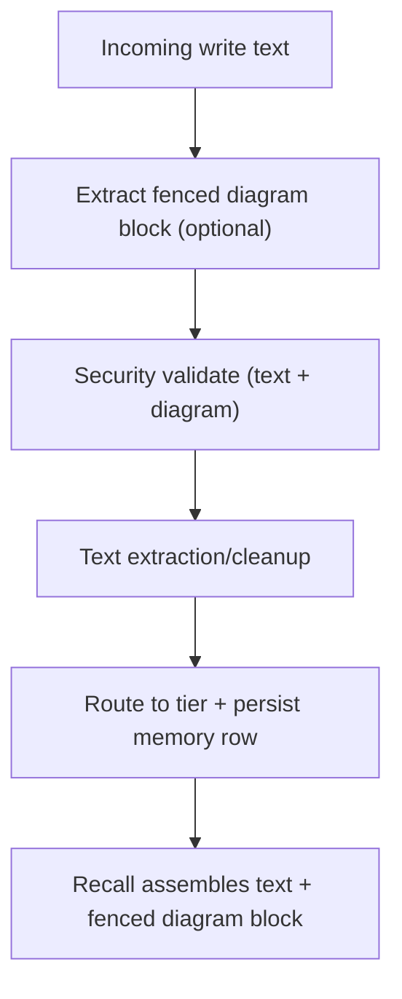

# Diagram Storage - Design

## Overview

Add structured diagram persistence to the memory model by storing diagram language + raw code in dedicated database columns, while keeping `content` focused on human-readable text. This preserves diagram fidelity, improves recall readability, and prevents diagram formatting from being destroyed by text normalization.

## Data Model

**Table:** `memories`

- `diagram_lang` (TEXT, default `''`)
- `diagram_code` (TEXT, default `''`)

**In-memory model**

- `MemoryEntry.diagram` with:
  - `lang`
  - `code`

## Write Path

- Detect the first fenced diagram block in the incoming text.
- Extract `diagram_lang` and `diagram_code`.
- Remove the diagram block from `content` prior to the normal extraction/cleanup step.
- Validate security policy against a combined view of text + diagram code.
- Persist diagram fields alongside the main memory entry.

## Recall Path

- When a memory has a diagram payload, append a fenced block to the recall output using `diagram_lang` and `diagram_code`.
- Token budgeting counts the rendered recall representation (text + diagram).

## Embedding / Retrieval

- The semantic embedding input includes both the textual content and the diagram code (so node labels and diagram vocabulary can influence recall ranking).

## Failure Modes & Edge Cases

- **Diagram-only input:** store with a minimal textual placeholder (e.g. “Diagram (mermaid)”) and diagram fields populated.
- **Unclosed fence:** do not extract; treat as normal text and rely on the existing pipeline validation.
- **Large diagrams:** subject to the existing content size/security constraints and recall token budgeting.

## Rollout Strategy

- Apply idempotent schema migration to add columns on existing databases.
- Keep existing memories unchanged; new writes populate diagram fields.

## Architecture Flowchart

