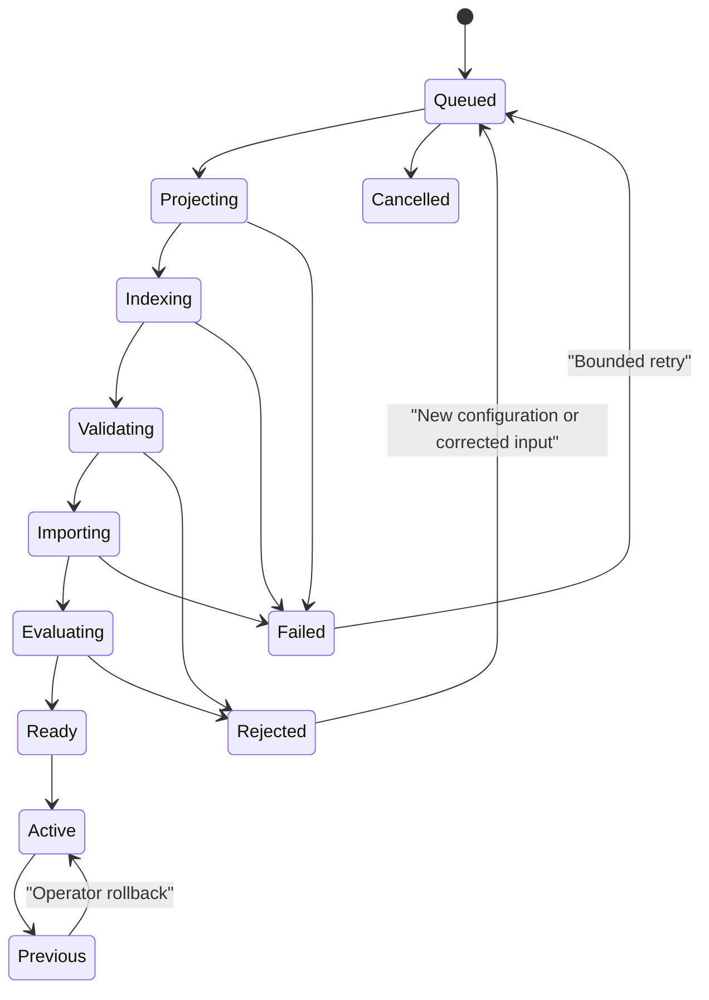
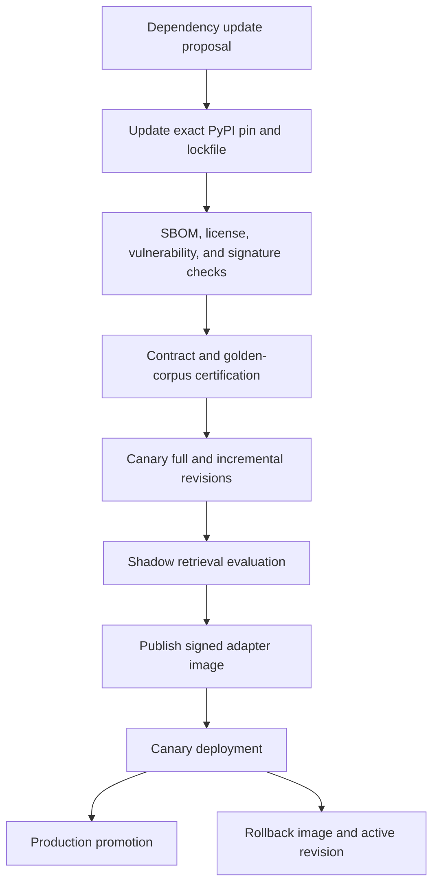

# GraphRAG Derived-Index Integration Design

## Status

Production architecture proposal for design review. This document deliberately defines the complete production boundary across standalone, self-managed, and hosted deployments. It does not define an MVP and does not permit GraphRAG to replace Agent Memory's online retrieval control plane.

## Context

Agent Memory already owns canonical memories, immutable source passages and citations, explicit knowledge edges, vector and term retrieval, retrieval feedback, decay and suppression, solution episodes, workspace authorization, tenant isolation, export, deletion, and operational evidence. Its current graph expansion uses Agent Memory memory relations but does not perform corpus-wide entity reconciliation, community detection, or community reporting.

Microsoft GraphRAG already performs LLM-assisted entity and relationship extraction, entity and relationship summarization, Leiden community detection, hierarchical community reporting, and incremental index updates. Reimplementing those indexing functions would add cost and long-term maintenance without improving Agent Memory's core product boundary.

The chosen architecture consumes Microsoft GraphRAG as a pinned build dependency of a dedicated indexing adapter. GraphRAG is never in the synchronous write or query path. Agent Memory projects eligible canonical records into immutable job inputs, GraphRAG produces revision-scoped output artifacts, and Agent Memory validates and imports those artifacts into its own derived-index schema. All online retrieval continues through Agent Memory.

## Architectural Goals

1. Connect knowledge learned across time and sources through evidence-backed derived entities, edges, communities, and reports.
2. Preserve immediate memory writes and current basic retrieval independently of graph readiness.
3. Make every derived relationship traceable to canonical Agent Memory evidence.
4. Provide local graph and global community retrieval without an online Python or GraphRAG dependency.
5. Support production operations across standalone, self-managed, and hosted deployments with equivalent domain semantics.
6. Make GraphRAG package upgrades controlled, testable, reversible, and isolated behind stable Agent Memory contracts.
7. Prevent inferred graph output from bypassing admission, authorization, review, retention, deletion, or feedback policy.

## Non-Goals

- GraphRAG does not become the canonical memory database.
- GraphRAG's query engine does not answer Agent Memory requests.
- GraphRAG's Parquet schemas do not become public Agent Memory API contracts.
- Community reports do not become direct evidence or quotations.
- Shared entities or community membership do not prove authorship, causality, source membership, or factual support.
- The integration does not copy, fork, vendor, submodule, or patch Microsoft GraphRAG source inside this repository.
- The design does not require graph enrichment for every direct factual query.

## Chosen Decisions

### Dependency acquisition

The adapter consumes the published `graphrag` PyPI package. The initial certified dependency is `graphrag==3.1.2`, which currently requires Python 3.11 through 3.13. The adapter owns an independent Python project and a committed `uv.lock` containing the exact transitive dependency graph and artifact hashes.

Production builds use frozen dependency resolution. CI builds a wheelhouse or equivalent immutable dependency layer, verifies package hashes, generates an SBOM and license inventory, scans the complete Python dependency graph, and produces a signed adapter image pinned by digest in deployment manifests. Runtime containers and local indexing jobs do not access PyPI or GitHub.

The adapter release gate applies the versioned repository license policy to normalized identifiers in every CycloneDX component expression. The default production policy rejects AGPL-1.0/3.0, SSPL-1.0, BUSL-1.1, and Commons-Clause identifiers; changing that policy is a reviewed release-policy change, not an automatic dependency update. The evidence report hashes both the inventory and policy so a later policy substitution cannot validate an earlier release.

Upgrading GraphRAG requires an explicit dependency-upgrade change that updates the exact package pin and lockfile, rebuilds compatibility fixtures, runs full and incremental index certification, compares normalized artifacts and retrieval evaluation, generates a migration/rollback report, and publishes a new signed adapter image. Automatic floating upgrades are prohibited.

### Why the repository is not cloned

Cloning or submoduling upstream would expose Agent Memory to upstream repository layout, development-only packages, prompt changes, and unreviewed source updates. Vendoring would make Agent Memory responsible for merging security and compatibility fixes. A pinned package plus a narrow adapter preserves reproducibility and creates a replaceable supplier boundary.

### Index-only use

The production integration uses GraphRAG's indexing and incremental-update capabilities only. Agent Memory does not call GraphRAG Local Search, Global Search, DRIFT Search, question generation, or answer synthesis online. This preserves one retrieval policy, one authorization boundary, one feedback system, and one grounding contract.

### Production completeness

The release is complete only when standalone, self-managed, and hosted deployments support projection, scheduling, full index, incremental update, validation, import, activation, local graph retrieval, global community retrieval, review, feedback, deletion, export, backup/restore, upgrade, rollback, observability, and operational runbooks. Implementation phases are delivery order, not reduced product tiers.

### Default indexing method

Standard GraphRAG is the production correctness baseline because it provides explicit entity and relationship descriptions suitable for review and downstream graph exploration. FastGraphRAG remains a supported policy option only after it passes the same provenance, quality, and isolation gates for a workspace profile. Switching indexing method creates a new incompatible graph configuration version and requires a full revision rebuild.

### Trust policy

LLM-derived entities, aliases, descriptions, edges, and community findings enter as proposed derived records. Deterministic source membership and citation bindings created directly from canonical Agent Memory identifiers may be approved automatically because they do not depend on GraphRAG inference. GraphRAG-derived aliases cannot influence write-time relationship inference until approved.

## System Overview

```mermaid
flowchart LR
    CW["Canonical writes and source publication"] --> CP["Agent Memory canonical plane"]
    CP --> OE["Committed outbox or local change journal"]
    OE --> GC["Graph job coordinator"]
    GC --> PM["Immutable projection manifest"]
    PM --> GA["Pinned Microsoft GraphRAG adapter"]
    GA --> AO["Revision-scoped GraphRAG artifacts"]
    AO --> VI["Validator and normalized importer"]
    VI --> DI["Agent Memory derived graph index"]
    DI --> QR["Agent Memory retrieval orchestrator"]
    CP --> QR
    QR --> AC["Grounded bounded answer context"]
```

The canonical plane and retrieval orchestrator remain usable when every component between the change journal and derived graph index is unavailable.

## Component Architecture

### Canonical change journal

Standalone SQLite records an additive graph-change journal in the same transaction as eligible canonical mutations. Hosted PostgreSQL writes existing transactional outbox events after source publication and memory changes. Events contain only stable identifiers, fingerprints, workspace scope, change kind, and timestamps; content is loaded later through authorized projection readers.

At-least-once delivery is expected. Idempotency is enforced by the tuple of workspace, canonical subject identity, canonical fingerprint, projection policy version, and graph configuration version.

### Graph job coordinator

The coordinator coalesces changes by workspace and graph configuration. It creates a stable cutoff watermark, resolves the authorized eligible record set, produces an immutable projection manifest, assigns a graph revision, and dispatches one indexing job.

The default production scheduling policy is:

- Start an incremental update when 50 eligible changed records accumulate.
- Start an update when the oldest eligible change waits 15 minutes, even below the count threshold.
- Permit an operator-requested immediate update.
- Permit only one running revision and one coalesced successor per workspace and graph configuration.
- Apply per-tenant and global concurrency limits before projection.
- Target 95 percent graph freshness within 30 minutes and 99 percent within two hours when configured model providers and workers are healthy.

These are configuration defaults with bounded operator overrides. Reducing thresholds below safe cost and concurrency limits requires explicit policy approval.

### Projection builder

The projection builder reads canonical content under the requesting workspace and principal/service capability. It emits one immutable input bundle containing documents, text units, metadata, provenance sidecars, configuration, and a manifest.

Projection documents are synthetic GraphRAG inputs, not new canonical documents. Each projected text unit carries an opaque stable correlation token that resolves server-side to an Agent Memory memory, passage, solution summary, or approved derived knowledge record. User-controlled paths, filenames, prompt locations, and output directories are never accepted.

The projection policy excludes deleted, quarantined, unauthorized, expired, suppressed-for-safety, raw-reasoning, secret-bearing, and non-exportable records. It also applies maximum record, workspace, and job sizes before any model call.

### Microsoft GraphRAG adapter

The adapter is a small Python package owned by Agent Memory under a dedicated tool directory. It imports the pinned GraphRAG public Python APIs and exposes an Agent Memory-owned command contract for readiness, full index, incremental update, cancellation checkpoints, and artifact finalization.

The adapter accepts only validated manifest paths rooted in an assigned job directory. It does not accept arbitrary GraphRAG roots, shell fragments, prompt paths, model endpoints, output paths, or database paths from callers. Settings and prompts are generated from reviewed Agent Memory templates plus bounded policy values. Secrets are supplied through runtime secret references and are not written to generated `.env` files.

The adapter writes only to a revision-specific staging directory. Completion creates a content-addressed artifact manifest after all expected outputs are closed and hashed. It never activates a revision or writes Agent Memory canonical tables.

### Execution topology

Standalone uses a supervised local adapter process launched for an indexing job. The Go coordinator creates a private temporary job directory, passes fixed arguments without shell evaluation, applies time and resource limits, captures bounded structured status, and terminates the process group on cancellation or timeout. Python and the locked adapter environment are optional installation components; their absence marks graph indexing unavailable without degrading Agent Memory.

Self-managed and hosted deployments run a dedicated `agent-memory-graphrag-worker` image. The worker consumes graph job envelopes from the existing queue boundary, resolves inputs from approved object storage, invokes the same adapter package, writes revision artifacts to a workspace-scoped staging prefix, and emits a completion or failure event. The image runs as a non-root service identity with no canonical database write capability.

The hosted graph worker is a separate deployment from the API, general worker, and reconciler. This isolates the Python dependency surface, model-call concurrency, memory consumption, and upgrade cadence. No synchronous API request waits for this worker.

### Artifact storage

Standalone artifacts reside under a configured Agent Memory data directory using descriptor-rooted, non-following, private directories. Hosted and self-managed artifacts use the existing object-store custody boundary with tenant/workspace/revision prefixes and service-specific capabilities.

GraphRAG-native outputs are staging artifacts. Agent Memory online retrieval does not read them. After normalized import and activation, raw projection inputs, model caches, and native outputs follow bounded retention:

- Successful raw projection inputs: delete within 24 hours after activation.
- Model caches containing workspace-derived content: delete within seven days, or earlier under workspace policy.
- Native outputs for the active and immediately previous revision: retain for rollback and audit, capped at 30 days.
- Older inactive native outputs: delete after 30 days unless a legal or investigation hold applies.
- Normalized derived records and community reports: retain according to their canonical source membership and workspace retention policy.

Policies may shorten these durations. Extending them requires explicit operator and privacy approval.

### Artifact validator

GraphRAG output is untrusted external computation. Validation occurs before database import and includes:

- Adapter and GraphRAG version compatibility.
- Expected file allowlist and schema fingerprints.
- Regular-file, size, count, and containment checks.
- Manifest hash verification.
- Parquet/schema type and required-field validation.
- Referential integrity among documents, text units, entities, relationships, communities, and reports.
- Correlation-token resolution to the exact projected canonical fingerprint.
- Workspace and revision scope consistency.
- Numeric range, string length, Unicode, and collection bounds.
- Rejection of missing, duplicate, cyclic-invalid, cross-workspace, or evidence-free records.
- Admission checks on generated descriptions and reports before persistence.

Any required-artifact or integrity failure rejects the entire revision. Optional claim extraction may be absent only when disabled in the graph configuration manifest.

### Normalized importer

The importer converts validated GraphRAG outputs into Agent Memory-owned contracts in a single staging transaction. GraphRAG UUIDs and human-readable IDs remain revision-scoped external identifiers and never become stable public identities.

Stable Agent Memory identities are assigned through evidence-aware reconciliation:

1. Exact prior stable identity with compatible normalized name, type, and evidence membership.
2. Approved alias match with compatible type and workspace scope.
3. High-confidence proposed merge when name/type/evidence overlap is compatible.
4. New derived entity when identity is ambiguous or incompatible.

Proposed merges do not collapse existing entities until reviewed. Same-name entities with incompatible evidence remain separate. Split and merge lineage is persisted.

Relationship import preserves the external description and normalized kind independently. Known semantic kinds map to Agent Memory edge classes only when the mapping is unambiguous. Unknown or compound relationships remain bounded external-kind proposals. Evidence bindings always point through revision text units to canonical memories or passages.

### Derived-index persistence

SQLite and PostgreSQL implement equivalent logical tables:

| Contract | Purpose |
|---|---|
| `graph_configurations` | Versioned indexing method, model routes, prompts, projection policy, schema compatibility, and package identity. |
| `graph_revisions` | Immutable revision lifecycle, cutoff watermark, manifests, status, counts, cost, timing, and active/previous relationship. |
| `graph_jobs` | Idempotent scheduling, lease, retries, cancellation, failure class, and dead-letter state. |
| `graph_entities` | Stable Agent Memory derived entity identity and current trust/lifecycle state. |
| `graph_entity_versions` | Revision-specific name, type, description, frequency, degree, and external identifiers. |
| `graph_entity_evidence` | Canonical memory/passage bindings with fingerprints and occurrence metadata. |
| `graph_edges` | Stable derived relationship identity, normalized/external kind, trust, review, and lifecycle state. |
| `graph_edge_versions` | Revision-specific description, weight, endpoints, and external identifiers. |
| `graph_edge_evidence` | Canonical evidence bindings and correlation tokens for each relationship. |
| `graph_communities` | Stable hierarchical community identity and active revision metadata. |
| `graph_community_members` | Revision-specific entity, edge, and text-unit membership. |
| `graph_reports` | Versioned derived community title, summary, findings, rank, admission state, and staleness. |
| `graph_reviews` | Human and policy review actions independent from canonical memory feedback. |
| `graph_feedback` | Retrieval feedback targeted to paths, entities, edges, reports, and routes. |
| `graph_change_journal` | Standalone committed canonical change watermark and processing state. |

Every derived record carries tenant/workspace scope, graph configuration, first and last revision, source classification, and timestamps. Online reads always join through the active revision or a stable entity/edge record explicitly carried forward into it.

### Atomic activation

Import creates a complete inactive normalized revision. Activation verifies counts, evidence resolution, policy admission, review carry-forward, and evaluation preconditions, then atomically switches the workspace's active revision pointer. Readers see either the previous complete revision or the new complete revision.

The prior active revision becomes rollback-eligible. Rollback atomically restores its pointer without rerunning GraphRAG. Canonical changes after its watermark remain visible through basic retrieval and cause graph freshness to report stale until a new valid revision activates.

## Data Contracts

### Projection manifest

The immutable projection manifest contains:

- Contract and projection-policy versions.
- Tenant and workspace opaque identifiers.
- Graph configuration identity.
- Graph revision and job identities.
- Full versus incremental mode.
- Base revision for an incremental update.
- Canonical cutoff watermark and event-time range.
- Document/text-unit counts, byte totals, and content hashes.
- Correlation-token map hash and encrypted or server-resolved location.
- Model route identities without credentials.
- Prompt bundle fingerprint.
- Retention and sensitivity classifications.
- Creation time, expiry, and producer identity.

### Artifact manifest

The adapter artifact manifest contains:

- Adapter package/version and GraphRAG package/version.
- Python runtime and locked-environment fingerprint.
- Input manifest hash.
- GraphRAG configuration and prompt fingerprints.
- Indexing method and full/update mode.
- Output allowlist with byte size, row count, schema fingerprint, and content hash.
- Model identities, request counts, tokens, cost estimates, cache statistics, timings, and retry counts when available.
- Completion, cancellation, or failure status with a bounded content-free error class.
- Adapter signature or workload identity attestation.

### Imported trust states

Derived records use proposed, reviewed, approved, rejected, superseded, quarantined, stale, and deleted states. State transitions are audited and version checked. A graph revision cannot reactivate rejected records merely because upstream output emits them again; stable evidence-backed identity carries the rejection forward until explicitly reconsidered.

## Indexing Lifecycle

Retries reuse the same immutable input manifest when safe. A changed canonical fingerprint, projection policy, GraphRAG package, prompt, model route, or graph configuration requires a new job and revision identity.

## Incremental Update Semantics

An incremental update begins from the active revision and a stable canonical cutoff. The projection includes the complete current representation required by GraphRAG's update contract plus explicit additions, changes, supersessions, restorations, and tombstones from Agent Memory.

GraphRAG update output is not assumed to preserve stable community or entity IDs. Agent Memory reconciliation maps new revision output to stable identities using evidence membership and approved aliases. Community identity is carried forward only when membership similarity, hierarchy, and evidence coverage pass configured thresholds; otherwise a new community is created and the old report becomes superseded.

A full rebuild is mandatory when:

- GraphRAG major version or incompatible output schema changes.
- Indexing method changes.
- Entity extraction or relationship prompt semantics change materially.
- Projection policy changes eligibility or identity rules.
- Model route changes are classified as meaning-changing.
- Reconciliation detects structural corruption.
- An operator requests recovery from an untrusted artifact history.

## Online Retrieval Design

### Basic route

The basic route is the existing Agent Memory vector, term, metadata, observation, and solution-path retrieval. It does not read graph tables and must preserve current ranking and latency behavior.

### Local graph route

Local graph retrieval starts with several diverse Agent Memory seeds, not a single nearest memory. It resolves active derived entity mentions for those seeds, expands bounded typed edges, retrieves neighboring canonical evidence, and returns candidate paths to the existing ranking and clipping pipeline.

Traversal policy is relation-aware:

- Approved support, elaboration, application, derivation, and explicit membership receive positive traversal weight.
- Proposed edges have capped influence and visible inference state.
- Similarity and co-occurrence generate candidates but cannot support factual claims.
- Contradiction and challenge populate a conflict channel.
- Supersession controls which canonical memory is current.
- Temporal edges contribute only to sequence-oriented questions.
- Path depth, fan-out, per-entity degree, candidate count, latency, and token contribution are bounded.

The final score combines existing retrieval signals with seed relevance, path confidence, review state, evidence quality, path length, graph freshness, source diversity, feedback, decay, suppression, and supersession. Graph score cannot override hard authorization, rejection, harmful suppression, or evidence failure.

### Global community route

Global retrieval embeds or term-indexes admitted active community reports inside Agent Memory's existing vector/term infrastructure. It retrieves a bounded diverse set of reports, loads their community membership and original evidence, and uses Agent Memory's configured model gateway for map-reduce synthesis.

Community reports guide coverage but are not evidence. Final claims must cite resolved canonical memories or passages selected from community membership. Reports with stale membership, unresolved evidence, rejected findings, or insufficient source diversity are excluded or explicitly downgraded.

### Query routing

Callers may choose Auto, Basic, Local Graph, or Global. Auto uses a deterministic, testable intent classifier plus bounded signals such as corpus-scope language, entity specificity, and relationship intent. The route decision and fallback are returned in retrieval metadata and logged without content.

Graph routes are enabled per workspace only after shadow evaluation. A graph-index read failure, stale-beyond-policy revision, or budget exhaustion falls back to Basic and reports degraded graph context. Explicit graph-required calls fail with a typed error instead of silently pretending graph coverage.

## Day-1 Book A and Day-10 Memory Behavior

Book A passages are canonical source evidence with explicit edition, asset, passage, and locator identity. A Day-1 memory derived from Book A retains citation provenance. A Day-10 memory is an independent canonical memory with its own author/source identity.

After graph update, both records may bind to compatible derived entities and proposed relationships. Retrieval may report that the Day-10 memory elaborates on, applies to, challenges, or shares an entity with Book A knowledge. It may not report that Book A authored the Day-10 memory or that the Day-10 memory belongs to Book A unless an explicit canonical source relationship says so.

The graph path includes the Day-1 citation, Day-10 memory identity, entity reconciliation reason, relationship origin, confidence/review state, graph revision, and evidence resolution state.

## Authorization and Isolation

All graph operations are single-workspace. Hosted records include tenant scope in primary and unique keys, repository methods, queue subjects, object-store prefixes, cache keys, metrics boundaries, and audit events.

The graph worker receives only the service capabilities needed to read authorized projections and write its assigned staging artifacts. It cannot read arbitrary canonical tables, activate revisions, change reviews, export data, or delete canonical records. The Go validator/importer owns activation under a separate capability.

Remote APIs accept workspace identities and operation parameters only. They never accept local paths, executable names, package versions, prompt paths, GraphRAG roots, object-store keys, model endpoints, or database paths. Hosted resolution is server-side.

Two-tenant timing and content isolation tests cover scheduling, batching, cache reuse, model calls, artifact storage, import, retrieval, error messages, metrics, deletion, backup/restore, and upgrade canaries.

## Model and Prompt Boundary

GraphRAG uses Agent Memory-approved OpenAI-compatible model routes through the existing model-gateway policy. Hosted workers use workload credentials to call an internal gateway; they do not receive customer or platform provider API keys. Local installations may configure an approved local or remote route through the same policy model.

Extraction and report prompts are immutable versioned assets owned by the adapter package. Prompt tuning is a controlled operator workflow that creates a new prompt bundle fingerprint and graph configuration; GraphRAG-generated `.env` files are not used. User content remains data and cannot select or alter system prompts.

Model retention, region, purpose, maximum input, maximum output, rate, and cost policies are validated before a job begins. Provider failure cannot expose partial revisions.

## Failure Modes and Recovery

| Failure | Required behavior |
|---|---|
| Adapter not installed | Graph status is disabled/unavailable; canonical operations and Basic retrieval continue. |
| Python or package version mismatch | Readiness fails before projection; no job starts. |
| Model provider unavailable | Job retries with bounded backoff; freshness degrades; Basic retrieval continues. |
| Projection admission failure | Subject is rejected or quarantined with a safe reason; unrelated eligible subjects continue in a new bounded job. |
| Worker crash or lease loss | Job is reclaimed idempotently; incomplete staging artifacts are never imported. |
| Timeout or cancellation | Process group/workload stops, staging revision is cancelled, and previous active revision remains. |
| Malformed or unexpected GraphRAG artifact | Entire revision is rejected; artifact is quarantined for bounded operator inspection. |
| Evidence correlation failure | Entire revision is rejected because grounding cannot be proven. |
| Import transaction failure | Transaction rolls back; revision remains inactive and retryable. |
| Activation failure | Previous active revision remains visible. |
| Stale graph | Basic retrieval remains current; graph routes warn, downgrade, or fall back by policy. |
| Graph read failure | Basic fallback unless graph-only was explicitly required. |
| Poison job | Dead-letter after bounded attempts with safe operator guidance. |
| Deletion during indexing | Cutoff semantics prevent mixed state; deletion journal forces successor repair before the new revision can become current. |
| Upstream package regression | Compatibility gate blocks image promotion; active production revision and prior adapter image remain available. |
| Incorrect derived edge | Review rejection suppresses it immediately and carries to successor revisions. |

## Deletion and Retention

Canonical deletion writes a graph change in the same transaction. Online retrieval immediately excludes deleted canonical records even if the active graph revision still references them. The next update removes or tombstones affected mentions, edges, memberships, and reports.

Workspace or tenant deletion revokes graph query access first, cancels jobs, deletes staging and retained native artifacts, deletes normalized graph records, records content-free completion evidence, and verifies that no artifact prefix or cache entry remains. Old revision artifacts cannot be used to resurrect deleted content.

Backup and restore include normalized graph metadata only when it can be restored with matching canonical evidence and configuration identities. Native GraphRAG artifacts are optional rebuildable caches; production disaster recovery must succeed by rebuilding from canonical records.

## Capacity and Scaling

Graph indexing is isolated from API capacity. Worker concurrency is controlled at global, tenant, workspace, model-route, and object-store levels. Fair scheduling prevents one large workspace from starving small workspaces.

Projection and validation stream bounded records rather than loading an entire large corpus into Go memory. Artifact sizes and row counts are checked before allocation. Imports use batched transactions into inactive revisions. Online graph reads use indexes on workspace, active revision, stable entity/edge identity, evidence target, review state, and community level.

High-degree entities apply fan-out caps and diversity sampling. Community report retrieval is paged and capped by level, relevance, source coverage, and token budget. Query caches include workspace, active revision, route, policy, and query fingerprint; activation and review changes invalidate them.

Capacity planning must model full rebuild peak memory, CPU, temporary storage, model tokens, output storage, import I/O, and deletion repair. Hosted admission rejects work that exceeds tenant plan or platform safety headroom before model calls begin.

## Performance and Quality Targets

- Basic retrieval: no GraphRAG runtime call and no graph-table read; p95 latency regression must remain below two percent against the pre-integration baseline.
- Local graph index lookup and candidate expansion: p95 service-side overhead below 75 milliseconds at the certified workspace size, excluding final model answer generation.
- Global community candidate retrieval: p95 service-side overhead below 250 milliseconds at the certified workspace size, excluding final model synthesis.
- Freshness: 95 percent of eligible changes active within 30 minutes and 99 percent within two hours under healthy dependencies.
- Grounding: 100 percent of graph-derived answer claims must resolve to authorized canonical evidence in acceptance evaluation.
- Relational quality: at least ten percentage-point improvement in gold supporting-fact coverage over Basic with no statistically meaningful citation-correctness regression.
- Global quality: at least fifteen percentage-point improvement in gold corpus-pattern coverage over Basic with explicit source-coverage reporting.
- Direct factual quality: no more than one percentage-point precision regression when Auto routing is enabled.
- Isolation: zero cross-workspace or cross-tenant records, artifacts, paths, cache hits, citations, or timing disclosures in adversarial suites.

Certified workspace-size tiers and cost ceilings are release configuration, not hard-coded domain constants. A route or tier that misses its gate remains disabled in production.

## Observability and Audit

Metrics cover queue delay, batch size, freshness lag, job state, model calls/tokens/cost, cache use, adapter duration, artifact bytes, validation rejection, import duration, activation, entity/edge/community counts, proposed/rejected ratios, retrieval route, graph overhead, fallback, stale use, evidence failures, and deletion completion.

Traces correlate canonical change, job, revision, adapter run, import, activation, and retrieval request using opaque identifiers. Logs never contain projected text, GraphRAG descriptions, community reports, credentials, prompts with user content, or raw provider errors.

Audits record configuration changes, rebuild/update requests, cancellation, activation, rollback, review, export, deletion, package upgrade, prompt upgrade, model route change, and policy override using content-free metadata.

Operator dashboards expose current and previous revision, configuration fingerprint, cutoff watermark, freshness, pending changes, job state, safe error class, cost, capacity, active route policy, and rollback eligibility.

## Production Deployment

### Standalone

The optional GraphRAG component installs a private locked Python environment and adapter assets under Agent Memory-managed data paths. Readiness verifies exact versions and hashes. The local job supervisor uses private job directories, bounded resources, and no network except approved model routes. The dashboard and CLI expose status, update, rebuild, cancel, review, and rollback.

### Self-managed

Kubernetes manifests include the dedicated graph worker, service account, queue subscription, object-store prefix policy, model-gateway route, resource requests/limits, disruption budget, network policy, autoscaling policy, observability, and secret references. Operators can disable graph workloads without disabling Agent Memory.

### Hosted

The hosted graph worker is deployed as a separately signed image and scales from queue depth subject to cost and tenant fairness limits. PostgreSQL stores job and normalized graph state; object storage holds immutable staging artifacts. NATS carries content-free job and completion envelopes. Tenant plan and purpose policy are checked before projection and model use.

All three modes expose equivalent domain status and operations even though execution transports differ.

## Dependency Upgrade and Rollback

Upgrade certification compares normalized entities, edges, evidence bindings, community membership, reports, costs, latency, and retrieval outcomes rather than comparing raw Parquet byte identity. Major or schema-incompatible upgrades require full rebuilds into new inactive revisions. Minor upgrades may use incremental update only after compatibility tests prove semantic safety.

Deployment promotion pins the adapter image digest and accepted GraphRAG package identity in Agent Memory configuration. Rollback restores both the prior worker image and the prior compatible active graph revision. Canonical data never requires rollback.

## Rollout Strategy

The complete system is built in production-oriented phases, but no phase is labeled or released as an MVP:

1. Freeze provider-neutral contracts, schemas, projection fixtures, output validators, and exact dependency supply chain.
2. Deliver immutable revision persistence, standalone journal/coordinator, pinned adapter execution, validation, import, and rollback.
3. Deliver hosted/self-managed outbox, queue, object custody, graph worker, PostgreSQL import, isolation, deletion, and disaster recovery.
4. Deliver review workflows, graph status/processing UI, export, feedback, and operator controls across all modes.
5. Deliver Agent Memory Local Graph and Global Community retrieval behind shadow evaluation.
6. Run full production certification for quality, security, privacy, cost, scaling, reliability, backup/restore, deletion, and dependency upgrade/rollback.
7. Enable graph routes gradually per workspace and route only after their gates pass; retain immediate kill switches and Basic fallback.

No phase may weaken canonical behavior. Production availability requires completion of every requirement and release gate.

## Alternatives Considered

### Clone or Git submodule Microsoft GraphRAG

Rejected. It couples builds to upstream repository layout and history, complicates security patching, encourages local modification, and makes reproducible upgrades harder. A Git commit pin is reproducible but does not provide the clean package and SBOM boundary required here.

### Vendor GraphRAG source

Rejected. It transfers maintenance and merge responsibility to Agent Memory, obscures upstream provenance, and increases review surface.

### Install an unpinned PyPI range

Rejected. Compatible-version ranges can resolve different transitive graphs across builds and can introduce breaking schemas or security regressions without an explicit change.

### Use only a prebuilt third-party GraphRAG container

Rejected as the primary supply boundary. It hides the dependency graph and build provenance. Agent Memory builds and signs its own adapter image from the exact package lock.

### Call GraphRAG CLI directly from Go

Rejected as the core contract. CLI output and filesystem conventions are not a stable application interface, error contracts are weaker, and safe structured cancellation/progress is harder. The adapter uses public Python APIs behind Agent Memory-owned manifests and status contracts.

### Use GraphRAG query engine online

Rejected. It would create a second ranking, authorization, feedback, token budgeting, and answer-grounding path and would put Python availability into online retrieval.

### Reimplement GraphRAG indexing in Go

Rejected. It duplicates mature extraction and community algorithms and creates long-term divergence without product benefit.

### Store only GraphRAG-native Parquet and query it directly

Rejected. It exposes online behavior to upstream schemas, prevents consistent SQLite/PostgreSQL semantics, complicates authorization and deletion, and weakens stable identity and review carry-forward.

## Testing and Verification

### Supply-chain gates

- Exact package and Python version verification.
- Frozen lock and artifact hash verification.
- SBOM and license generation.
- Vulnerability policy with no unresolved critical or high exploitable findings.
- Signed image and provenance attestation verification.
- Runtime no-network dependency installation test.

### Adapter contract gates

- Readiness, full index, incremental update, cancellation, timeout, malformed input, bounded progress, and artifact finalization.
- Golden small, medium, multilingual, contradictory, same-name, and high-degree corpora.
- GraphRAG output schema compatibility and unknown-field tolerance policy.
- Full-versus-incremental normalized parity.

### Persistence gates

- Additive SQLite and PostgreSQL migrations.
- Concurrent job idempotency and lease recovery.
- Immutable revisions, atomic activation, rollback, and review carry-forward.
- Evidence referential integrity and deletion repair.
- Backup/restore and rebuild from canonical records.

### Security and privacy gates

- Secret, prompt injection, raw-reasoning, oversize, malformed Unicode, and unsafe procedural projection fixtures.
- Symlink, path traversal, replacement, special-file, artifact bomb, and unexpected-file attacks.
- Cross-workspace and cross-tenant queue, storage, cache, import, retrieval, timing, error, export, and deletion attacks.
- Model-purpose, retention, region, and credential isolation.
- Non-root container, read-only filesystem where possible, network policy, seccomp/capability reduction, and resource exhaustion.

### Retrieval gates

- Basic ranking and latency non-regression.
- Multi-seed local traversal, typed edge policy, contradictions, supersession, feedback suppression, freshness, and clipping.
- Global community coverage, report staleness, evidence drill-down, diversity, and map-reduce grounding.
- Auto routing confusion matrix and explicit route overrides.
- Day-1 Book A and Day-10 memory provenance acceptance.

### Operational gates

- Queue backlog and worker autoscaling.
- Provider outage, object-store outage, database failover, worker crash, poison job, and cancellation drills.
- Full rebuild and incremental update at certified size tiers.
- Adapter package upgrade, incompatible schema block, canary, rollback, and old-revision restore.
- Tenant/workspace deletion with artifact absence verification.
- Disaster recovery from canonical data without native GraphRAG artifacts.

### Required commands

- Go contract and storage: `go test ./internal/core ./internal/storage/sqlite ./internal/application ./internal/engine`
- Library and grounding: `go test ./internal/library ./internal/readingroom ./internal/retrieval`
- Standalone API and CLI: `go test ./internal/api ./internal/cli`
- Hosted graph, source, outbox, and isolation: `go test ./internal/saas/...`
- Full Go verification: `go test ./...`
- Static verification: `go vet ./...`
- Dashboard: `npm --prefix tools/agent-memory/dashboard test`
- Dashboard type check: `npm --prefix tools/agent-memory/dashboard run typecheck`
- Dashboard production build: `npm --prefix tools/agent-memory/dashboard run build`
- Adapter environment: `uv sync --project tools/graphrag-adapter --frozen`
- Adapter tests: `uv run --project tools/graphrag-adapter pytest`
- Adapter lint: `uv run --project tools/graphrag-adapter ruff check .`
- Adapter type check: `uv run --project tools/graphrag-adapter pyright`
- Dependency audit, SBOM, container, Kubernetes, scale, and end-to-end commands will be fixed to repository scripts in `tasks.md` after design approval.

## Project Structure

- `tools/graphrag-adapter/`: independent Python project, exact GraphRAG dependency, lockfile, prompts, normalized command contract, validators local to upstream API calls, tests, and packaging.
- `internal/core/`: provider-neutral graph revision, entity, edge, community, report, job, freshness, review, and feedback contracts.
- `internal/application/graphindex/`: projection, scheduling, manifests, validation orchestration, reconciliation, import, activation, rollback, deletion repair, and status.
- `internal/engine/`: graph route classification, local traversal, global candidate selection, ranking, deduplication, clipping, and evaluation.
- `internal/storage/sqlite/`: standalone graph journal, job, revision, normalized index, review, and feedback repositories.
- `internal/saas/graphindex/`: PostgreSQL repositories, outbox/queue contracts, worker coordination, object custody, tenant isolation, and operator operations.
- `internal/api/` and `internal/cli/`: status, update, rebuild, cancel, rollback, review, and retrieval route contracts.
- `tools/agent-memory/dashboard/`: processing, freshness, relationship review, provenance path, route control, and operator UI.
- `deploy/saas/`: signed graph-worker image build, Compose/Kubernetes deployment, service identity, network policy, secrets, resources, autoscaling, and observability.

## Risks and Mitigations

| Risk | Impact | Mitigation |
|---|---|---|
| Upstream maintenance mode or breaking changes | High | Exact pin, adapter isolation, normalized contracts, compatibility certification, replaceable provider boundary. |
| Expensive indexing | High | Batch/coalesce, quotas, cost admission, Standard/Fast policy profiles, cache bounds, capacity planning. |
| Hallucinated relationships | High | Proposed default, evidence binding, review state, contradiction channel, feedback suppression, no direct authority. |
| Cross-tenant leakage | Critical | Single-workspace jobs, scoped keys/prefixes, least privilege, no shared content caches, adversarial isolation gates. |
| Artifact schema drift | High | Allowlisted schema fingerprints, fail-closed validation, inactive import, explicit upgrade workflow. |
| Python dependency vulnerabilities | High | Dedicated image, lock/hashes, SBOM, scans, non-root isolation, signed supply chain, rapid rollback. |
| Stale graph misleads retrieval | Medium | Freshness metadata, Basic remains current, route downgrade/fallback, staleness thresholds. |
| Entity over-merge | High | Evidence-aware reconciliation, proposed merges, type/scope compatibility, split/merge lineage. |
| Deletion resurrection | Critical | Canonical read filtering, deletion journal, artifact expiry, repair revisions, absence verification. |
| Large-corpus resource exhaustion | High | Pre-admission, streaming, limits, isolated workers, fan-out caps, autoscaling and fairness. |
| Duplicate ranking systems | High | GraphRAG index-only boundary; Agent Memory owns all online ranking and answer assembly. |

## Resolved Product Defaults

1. Complete production parity is required; there is no MVP acceptance state.
2. GraphRAG is installed as the exact PyPI dependency `graphrag==3.1.2` in an independent locked adapter project, not cloned or vendored.
3. Standard GraphRAG is the production correctness default; FastGraphRAG requires separate certification.
4. GraphRAG is indexing-only; Agent Memory owns online Local Graph and Global Community retrieval.
5. Default batching is 50 eligible records or 15 minutes, with 30-minute p95 freshness under healthy dependencies.
6. Only deterministic canonical provenance bindings may be auto-approved; GraphRAG inference is proposed.
7. Production UI exposes Auto, Basic, Local Graph, and Global routes subject to workspace policy and shadow gates.
8. Raw inputs are removed within 24 hours after activation, caches within seven days, and native active/previous artifacts within 30 days by default.
9. Graph-derived aliases do not affect write-time inference until approved.
10. Production completion includes dependency upgrade and rollback certification.

## References

- Microsoft GraphRAG repository and maintenance guidance: `https://github.com/microsoft/graphrag`
- Official installation guidance for the `graphrag` PyPI package: `https://microsoft.github.io/graphrag/get_started/`
- Official indexing overview and Python API direction: `https://microsoft.github.io/graphrag/index/overview/`
- Official indexing methods: `https://microsoft.github.io/graphrag/index/methods/`
- Official output schemas: `https://microsoft.github.io/graphrag/index/outputs/`
- Official CLI/update behavior: `https://microsoft.github.io/graphrag/cli/`
