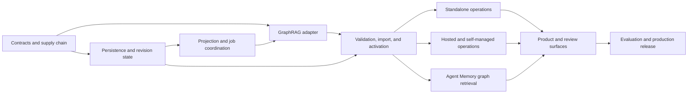

# GraphRAG Derived-Index Integration Tasks

## Delivery Contract

This plan implements the approved production architecture in `requirements.md` and `design.md`. Delivery phases are dependency order, not reduced product tiers. The feature is not complete until standalone, self-managed, and hosted deployments pass the final production gate.

For every task:

- Start with a failing test or contract fixture when behavior changes.
- Keep GraphRAG outside canonical write success and all synchronous online query execution.
- Preserve tenant/workspace scope, canonical provenance, deletion, retention, and review semantics.
- Update this checklist in the same change that completes a task.
- Run the focused verification listed for the task plus `go test ./...`, `go vet ./...`, and `git diff --check` before closing its phase.
- Treat listed files as expected touchpoints. If implementation needs more than five files, split the task before coding.

## Dependency Map

## Phase 1 — Stable Contracts and Reproducible Supply Chain

- [x] 1. Define provider-neutral graph-index domain contracts and lifecycle invariants.
  - **Scope:** Add versioned types for configurations, jobs, revisions, entities, edges, evidence, communities, reports, trust states, watermarks, and activation. Keep GraphRAG-specific IDs and schemas behind adapter DTOs.
  - **Acceptance:** Illegal state transitions fail closed; every record requires one workspace and optional hosted tenant; canonical writes and basic retrieval compile without a graph provider.
  - **Verification:** `go test ./internal/core ./internal/contracts`
  - **Dependencies:** None.
  - **Expected touchpoints:** `internal/core/graph_index.go`, `internal/core/graph_index_test.go`, `internal/contracts/graph_index.go`, `internal/contracts/graph_index_test.go`.

- [x] 2. Freeze versioned projection and artifact manifest schemas with golden fixtures.
  - **Scope:** Specify immutable input, correlation, completion, cost, schema-fingerprint, hash, and attestation fields; set explicit size/count/string bounds and forward-compatibility rules.
  - **Acceptance:** Golden valid manifests round-trip deterministically; missing scope, hashes, versions, or evidence maps fail validation; unknown required versions fail closed.
  - **Verification:** `go test ./internal/contracts -run 'Graph(Project|Artifact)Manifest'`
  - **Dependencies:** Task 1.
  - **Expected touchpoints:** `internal/contracts/graph_manifest.go`, `internal/contracts/graph_manifest_test.go`, `internal/contracts/testdata/graph_projection_v1.json`, `internal/contracts/testdata/graph_artifact_v1.json`.

- [x] 3. Create the isolated, hash-locked Python adapter project.
  - **Scope:** Add an independent Python package pinned to `graphrag==3.1.2`, Python `>=3.11,<3.14`, a committed `uv.lock`, license metadata, and commands for readiness, full index, incremental update, cancellation, and artifact finalization.
  - **Acceptance:** Frozen install performs no dependency resolution; adapter imports only supported public GraphRAG APIs; repository contains no GraphRAG clone, submodule, or vendored source.
  - **Verification:** `uv sync --project tools/graphrag-adapter --frozen && uv run --project tools/graphrag-adapter pytest`
  - **Dependencies:** Tasks 1–2.
  - **Expected touchpoints:** `tools/graphrag-adapter/pyproject.toml`, `tools/graphrag-adapter/uv.lock`, `tools/graphrag-adapter/src/agent_memory_graphrag/__main__.py`, `tools/graphrag-adapter/tests/test_contract.py`, `tools/graphrag-adapter/README.md`.

### Checkpoint A — Contract and dependency approval

Approve contract versions, the exact dependency lock, license inventory, public-API usage, and the no-clone/no-runtime-download boundary before persistence work merges.

## Phase 2 — Equivalent SQLite and PostgreSQL Persistence

- [x] 4. Add SQLite graph configuration, revision, job, and change-journal persistence.
  - **Scope:** Create additive migrations and revision-safe repositories for configuration identity, job leases, retry/dead-letter state, canonical watermarks, inactive/active/previous revision pointers, and local change journal entries.
  - **Acceptance:** Existing databases migrate forward without enabling GraphRAG; duplicate idempotency keys do not create jobs; compare-and-swap activation admits only a complete inactive revision.
  - **Verification:** `go test ./internal/storage/sqlite -run 'Graph(Configuration|Revision|Job|ChangeJournal|Migration)'`
  - **Dependencies:** Task 1.
  - **Expected touchpoints:** `internal/storage/sqlite/migrations.go`, `internal/storage/sqlite/graph_control.go`, `internal/storage/sqlite/graph_control_test.go`, `internal/storage/sqlite/migrations_test.go`.

- [x] 5. Add SQLite normalized graph, evidence, community, review, and feedback persistence.
  - **Scope:** Persist stable identities separately from revision versions; enforce evidence references, trust lifecycle, community hierarchy, report staleness, review carry-forward, and graph-targeted retrieval feedback.
  - **Acceptance:** Same revision import is idempotent; evidence-free edges cannot become queryable; rejected stable records remain excluded after a later revision emits them again.
  - **Verification:** `go test ./internal/storage/sqlite -run 'Graph(Entity|Edge|Evidence|Community|Report|Review|Feedback)'`
  - **Dependencies:** Task 4.
  - **Expected touchpoints:** `internal/storage/sqlite/graph_index.go`, `internal/storage/sqlite/graph_index_test.go`, `internal/storage/sqlite/graph_review.go`, `internal/storage/sqlite/graph_review_test.go`, `internal/storage/sqlite/migrations.go`.

- [x] 6. Add equivalent PostgreSQL graph control and normalized-index migrations.
  - **Scope:** Implement tenant/workspace-scoped PostgreSQL tables, constraints, indexes, row-level authorization integration, lease behavior, active-revision reads, and down migrations matching the logical SQLite contract.
  - **Acceptance:** Cross-tenant foreign keys are impossible; concurrent activation selects one winner; migration rollback removes only derived graph state and preserves canonical records.
  - **Verification:** `go test ./internal/saas/postgres -run 'Graph|Migration'`
  - **Dependencies:** Tasks 4–5.
  - **Expected touchpoints:** `internal/saas/postgres/migrations/0029_graph_index.up.sql`, `internal/saas/postgres/migrations/0029_graph_index.down.sql`, `internal/saas/postgres/migrate_test.go`, `internal/saas/postgres/graph_index_test.go`.

- [x] 7. Implement PostgreSQL repositories with SQLite parity tests.
  - **Scope:** Add graph control, import, active-read, review, feedback, deletion, and rollback repositories; run the same behavior matrix against both stores.
  - **Acceptance:** State transitions and query results are logically equivalent across databases; every hosted operation requires tenant and workspace scope; cancellation and lease expiry are restart-safe.
  - **Verification:** `go test ./internal/storage/sqlite ./internal/saas/postgres ./internal/integration -run 'GraphStoreParity'`
  - **Dependencies:** Task 6.
  - **Expected touchpoints:** `internal/saas/postgres/graph_index.go`, `internal/saas/postgres/graph_index_test.go`, `internal/integration/graph_store_parity_test.go`, `internal/contracts/graph_repository.go`.

### Checkpoint B — Persistence safety

Review additive migrations, downgrade behavior, tenant isolation, active-pointer atomicity, idempotency, and backup visibility before any indexer writes artifacts.

## Phase 3 — Projection, Journaling, and Scheduling

- [x] 8. Implement deterministic, policy-filtered canonical graph projection.
  - **Scope:** Project eligible memories, passages, citations, source membership, solution summaries, and approved derived knowledge using opaque stable correlation tokens and content fingerprints.
  - **Acceptance:** Secrets, raw reasoning, quarantined, deleted, expired, unauthorized, and suppressed records are excluded; Book/source membership is explicit; identical inputs produce byte-stable manifests.
  - **Verification:** `go test ./internal/application ./internal/validation -run 'GraphProjection'`
  - **Dependencies:** Tasks 1–2.
  - **Expected touchpoints:** `internal/application/graph_projection.go`, `internal/application/graph_projection_test.go`, `internal/validation/graph_projection.go`, `internal/validation/graph_projection_test.go`.

- [x] 9. Connect committed canonical mutations to graph change events without coupling writes.
  - **Scope:** Add SQLite journal writes in canonical transactions and hosted outbox event creation after successful mutations for create, update, supersede, restore, delete, and source publication.
  - **Acceptance:** Rolled-back canonical writes emit no graph work; graph scheduling failure never rolls back canonical data; repeated events coalesce by subject fingerprint, projection version, and configuration.
  - **Verification:** `go test ./internal/storage/sqlite ./internal/saas/outbox ./internal/engine -run 'Graph(Change|Outbox|WriteIndependence)'`
  - **Dependencies:** Tasks 4, 6, and 8.
  - **Expected touchpoints:** `internal/storage/sqlite/graph_change.go`, `internal/storage/sqlite/graph_change_test.go`, `internal/saas/outbox/graph_events.go`, `internal/saas/outbox/graph_events_test.go`, `internal/engine/write_pipeline.go`.

- [x] 10. Implement coalescing coordination, bounded leases, watermarks, and backpressure.
  - **Scope:** Batch by workspace/configuration, default to 50 changes or 15 minutes, permit one running revision plus one successor, enforce cost/size/concurrency admission, and expose freshness targets.
  - **Acceptance:** Bursts do not create one run per memory; poison work dead-letters after bounded retries; a stalled lease is safely reclaimed without duplicate activation.
  - **Verification:** `go test ./internal/application -run 'Graph(Coordinator|Lease|Backpressure|Freshness)'`
  - **Dependencies:** Tasks 7 and 9.
  - **Expected touchpoints:** `internal/application/graph_coordinator.go`, `internal/application/graph_coordinator_test.go`, `internal/application/graph_limits.go`, `internal/application/graph_limits_test.go`.

- [x] 11. Build immutable, custody-safe projection bundles for local and object storage.
  - **Scope:** Materialize bounded job directories/prefixes, private permissions, non-following containment, signed manifests, correlation sidecars, expiry, and cleanup without accepting caller-selected filesystem locations.
  - **Acceptance:** Symlink/replacement attacks and cross-workspace prefixes fail closed; completed bundles are immutable; content-bearing temporary material follows the 24-hour projection retention limit.
  - **Verification:** `go test ./internal/application ./internal/saas/objectcustody -run 'Graph(Bundle|ProjectionCustody)'`
  - **Dependencies:** Tasks 8 and 10.
  - **Expected touchpoints:** `internal/application/graph_bundle.go`, `internal/application/graph_bundle_test.go`, `internal/saas/objectcustody/graph_bundle.go`, `internal/saas/objectcustody/graph_bundle_test.go`.

### Checkpoint C — Write independence and custody

Demonstrate immediate basic retrieval after a write while graph services are absent, then review projection exclusions, deterministic manifests, queue bounds, and object/filesystem custody.

## Phase 4 — GraphRAG Adapter Execution and Artifact Validation

- [x] 12. Implement adapter readiness and reviewed settings/prompt generation.
  - **Scope:** Validate Python/package compatibility, exact GraphRAG version, locked-environment fingerprint, model routes, bounded configuration, storage readiness, and reviewed prompt fingerprints without persisting credentials.
  - **Acceptance:** Unsupported versions or configuration schemas fail before model calls; generated settings contain no secrets; readiness clearly distinguishes disabled, unavailable, incompatible, and ready states.
  - **Verification:** `uv run --project tools/graphrag-adapter pytest -k 'readiness or settings or prompts'`
  - **Dependencies:** Tasks 2–3 and 11.
  - **Expected touchpoints:** `tools/graphrag-adapter/src/agent_memory_graphrag/readiness.py`, `tools/graphrag-adapter/src/agent_memory_graphrag/settings.py`, `tools/graphrag-adapter/tests/test_readiness.py`, `tools/graphrag-adapter/tests/test_settings.py`.

- [x] 13. Implement full and incremental GraphRAG indexing through public Python APIs.
  - **Scope:** Run standard indexing as the correctness baseline; bind incremental updates to an explicit base revision and immutable cutoff; report structured progress, model usage, retries, and bounded failures.
  - **Acceptance:** Full and incremental golden corpora complete without online query calls; cancellation reaches safe checkpoints; retry never mutates a finalized revision directory.
  - **Verification:** `uv run --project tools/graphrag-adapter pytest -k 'full_index or incremental_index or cancellation'`
  - **Dependencies:** Task 12.
  - **Expected touchpoints:** `tools/graphrag-adapter/src/agent_memory_graphrag/indexer.py`, `tools/graphrag-adapter/src/agent_memory_graphrag/progress.py`, `tools/graphrag-adapter/tests/test_indexer.py`, `tools/graphrag-adapter/tests/fixtures/book_day10/manifest.json`.

- [x] 14. Finalize a content-addressed artifact manifest and adapter attestation.
  - **Scope:** Allowlist outputs; record hashes, byte/row counts, schema fingerprints, versions, prompts, models, tokens, estimated cost, timings, cache use, status, and workload/build identity after all files close.
  - **Acceptance:** Any post-finalization modification changes verification; partial/cancelled jobs cannot claim completion; output contains no credentials or unrestricted source text in errors.
  - **Verification:** `uv run --project tools/graphrag-adapter pytest -k 'artifact_manifest or attestation or redaction'`
  - **Dependencies:** Task 13.
  - **Expected touchpoints:** `tools/graphrag-adapter/src/agent_memory_graphrag/artifacts.py`, `tools/graphrag-adapter/src/agent_memory_graphrag/attestation.py`, `tools/graphrag-adapter/tests/test_artifacts.py`, `tools/graphrag-adapter/tests/test_attestation.py`.

- [x] 15. Validate artifact containment, hashes, schemas, references, bounds, and admission in Go.
  - **Scope:** Treat every adapter output as untrusted; validate allowlists, regular files, containment, sizes, schema versions, numeric/string bounds, referential integrity, correlation fingerprints, evidence presence, and generated-text admission.
  - **Acceptance:** Malformed, cyclic-invalid, duplicate, cross-workspace, evidence-free, oversized, or schema-drifted output rejects the entire revision before import; optional artifacts are absent only when configuration disables them.
  - **Verification:** `go test ./internal/validation -run 'GraphArtifact'`
  - **Dependencies:** Tasks 2 and 14.
  - **Expected touchpoints:** `internal/validation/graph_artifact.go`, `internal/validation/graph_artifact_test.go`, `internal/validation/testdata/graph_artifact_valid`, `internal/validation/testdata/graph_artifact_malicious`.

- [ ] 16. Produce the signed adapter image and supply-chain evidence.
  - **Scope:** Build from the frozen lock/wheelhouse, run non-root, remove package managers and build credentials, generate SBOM/license/vulnerability reports, sign by digest, and prohibit runtime network dependency acquisition.
  - **Acceptance:** CI fails on lock drift, prohibited license, unresolved release-blocking vulnerability, unsigned image, or runtime package download; deployment references an immutable digest.
  - **Current evidence gap:** The frozen local image passed the non-root, no-network, read-only, package-manager-removal, readiness, and worker-presence container gate on 2026-08-27. The build/sign/scan workflow and digest-bound evidence publisher are implemented, but no registry image signed under a trusted release identity and no retained SBOM/license/vulnerability/signature bundle for that immutable release digest is present in the workspace. Do not check this task from local-image or static workflow validation alone.
  - **Verification:** `make graphrag-adapter-supply-chain && make graphrag-adapter-container-test`
  - **Dependencies:** Tasks 3 and 12–15.
  - **Expected touchpoints:** `tools/graphrag-adapter/Dockerfile`, `tools/graphrag-adapter/Makefile`, `.github/workflows/graphrag-adapter.yml`, `deploy/saas/kubernetes/base/deployments.yaml`, `deploy/saas/kubernetes/base/kustomization.yaml`.

### Checkpoint D — Untrusted supplier boundary

Approve golden full/update output, cancellation behavior, schema drift rejection, redaction, SBOM/license/vulnerability results, image signature, and the absence of runtime dependency fetching.

## Phase 5 — Reconciliation, Import, Activation, and Lifecycle Repair

- [x] 17. Reconcile stable entities with evidence-aware merge and split lineage.
  - **Scope:** Resolve exact identities, approved aliases, compatible proposed merges, ambiguity, same-name conflicts, occurrence evidence, aliases, and merge/split history independently of revision-local GraphRAG IDs.
  - **Acceptance:** Day-1 and Day-10 references can converge on one entity when evidence is compatible; incompatible same-name entities remain separate; deterministic re-import creates no duplicate stable identities.
  - **Verification:** `go test ./internal/application -run 'GraphEntityReconciliation'`
  - **Dependencies:** Tasks 5, 7, and 15.
  - **Expected touchpoints:** `internal/application/graph_entities.go`, `internal/application/graph_entities_test.go`, `internal/core/graph_reconciliation.go`, `internal/core/graph_reconciliation_test.go`.

- [x] 18. Normalize relationship kinds and import evidence-bound proposed edges.
  - **Scope:** Preserve external descriptions while mapping only unambiguous known kinds; retain unknown/compound kinds; distinguish support, contradiction, challenge, supersession, temporal, causal, membership, and similarity semantics.
  - **Acceptance:** Inferred edges start proposed; deterministic provenance bindings may be approved; unresolved or unauthorized evidence quarantines the edge; contradictions never count as supporting paths.
  - **Verification:** `go test ./internal/application -run 'GraphEdgeImport'`
  - **Dependencies:** Task 17.
  - **Expected touchpoints:** `internal/application/graph_edges.go`, `internal/application/graph_edges_test.go`, `internal/core/graph_relationship.go`, `internal/core/graph_relationship_test.go`.

- [x] 19. Import hierarchical communities and versioned, stale-aware reports.
  - **Scope:** Preserve levels, membership, source coverage, unresolved evidence counts, report findings/ranks, model/prompt identity, admission state, and staleness triggers.
  - **Acceptance:** Reports never resolve as direct evidence or quotations; changed membership/evidence/model/prompt/review state marks the report stale; invalid hierarchy rejects revision import.
  - **Verification:** `go test ./internal/application -run 'GraphCommunit(y|ies)|GraphReport'`
  - **Dependencies:** Tasks 17–18.
  - **Expected touchpoints:** `internal/application/graph_communities.go`, `internal/application/graph_communities_test.go`, `internal/core/graph_community.go`, `internal/core/graph_community_test.go`.

- [x] 20. Import inactive revisions transactionally and activate or roll back atomically.
  - **Scope:** Stage all normalized records, verify counts/evidence/admission/review carry-forward/evaluation preconditions, atomically switch active pointers, retain one rollback revision, and expose stale watermarks.
  - **Acceptance:** Readers see only a complete old or new revision; import failure preserves the old active revision; rollback requires no GraphRAG execution and does not hide newer canonical memories from basic retrieval.
  - **Verification:** `go test ./internal/application ./internal/integration -run 'Graph(Import|Activation|Rollback|ConcurrentRead)'`
  - **Dependencies:** Tasks 17–19.
  - **Expected touchpoints:** `internal/application/graph_import.go`, `internal/application/graph_import_test.go`, `internal/application/graph_activation.go`, `internal/application/graph_activation_test.go`, `internal/integration/graph_activation_test.go`.

- [x] 21. Carry review state forward and apply immediate trust corrections.
  - **Scope:** Approve, reject, supersede, annotate, and reconsider graph records with version checks; carry compatible decisions by stable evidence identity; surface ambiguous carry-forward cases.
  - **Acceptance:** Rejection removes a record from candidate reads immediately; later upstream output cannot silently reactivate it; approved Agent Memory relationships survive upstream omission.
  - **Verification:** `go test ./internal/application -run 'GraphReview'`
  - **Dependencies:** Task 20.
  - **Expected touchpoints:** `internal/application/graph_review.go`, `internal/application/graph_review_test.go`, `internal/core/graph_review.go`, `internal/core/graph_review_test.go`.

- [x] 22. Implement deletion repair, retention cleanup, export, and canonical rebuild.
  - **Scope:** Tombstone/remove affected projections and normalized records, schedule bounded repair, prevent old artifact resurrection, export graph metadata only when requested, enforce artifact TTLs/holds, and rebuild entirely from eligible canonical records.
  - **Acceptance:** Memory/source/workspace deletion removes queryability within policy; canonical export/deletion works when GraphRAG is down; backup restore plus canonical rebuild produces a valid graph without native artifacts.
  - **Verification:** `go test ./internal/application ./internal/portable ./internal/saas/deletion -run 'Graph(Deletion|Retention|Export|Rebuild)'`
  - **Dependencies:** Tasks 20–21.
  - **Expected touchpoints:** `internal/application/graph_lifecycle.go`, `internal/application/graph_lifecycle_test.go`, `internal/portable/graph_export.go`, `internal/portable/graph_export_test.go`, `internal/saas/deletion/graph_cleanup_test.go`.

### Checkpoint E — Derived-index integrity

Demonstrate deterministic re-import, Day-1/Day-10 reconciliation, explicit ambiguity, proposed-edge trust, atomic activation/rollback, review persistence, deletion repair, and canonical-only rebuild.

## Phase 6 — Standalone Production Operations

- [x] 23. Add the supervised local adapter runner and resource controls.
  - **Scope:** Launch fixed arguments without shell evaluation in private job directories; enforce process-group cancellation, deadlines, CPU/memory/disk bounds, bounded structured output, and optional-component readiness.
  - **Acceptance:** Missing Python/adapter degrades graph only; timeout/cancel terminates descendants; user-controlled paths, flags, prompts, endpoints, and shell fragments cannot escape reviewed configuration.
  - **Verification:** `go test ./internal/application ./internal/integration -run 'LocalGraphRunner'`
  - **Dependencies:** Tasks 11, 14–16, and 20.
  - **Expected touchpoints:** `internal/application/graph_local_runner.go`, `internal/application/graph_local_runner_test.go`, `internal/integration/graph_local_runner_test.go`, `internal/config/graph.go`.

- [x] 24. Expose standalone readiness, status, update, rebuild, cancel, retry, disable, and rollback operations.
  - **Scope:** Add equivalent CLI and local API lifecycle semantics with idempotency, authorization, safe error categories, active revision/freshness/pending counts, and no arbitrary storage roots.
  - **Acceptance:** Overlapping operations are rejected or coalesced predictably; disabling graph leaves basic recall intact; every mutation is audited and revision checked.
  - **Verification:** `go test ./internal/cli ./internal/api -run 'Graph(Index|Status|Operation)'`
  - **Dependencies:** Tasks 10, 20, and 23.
  - **Expected touchpoints:** `internal/cli/graph.go`, `internal/cli/graph_test.go`, `internal/api/graph_handler.go`, `internal/api/graph_handler_test.go`.

- [x] 25. Prove the standalone indexing and lifecycle journey.
  - **Scope:** Exercise immediate basic search, delayed full/incremental indexing, explicit Book membership, normalized entity/edge evidence, review, deletion repair, restart, cancellation, rollback, and canonical rebuild without relying on graph retrieval.
  - **Acceptance:** The Day-10 memory can be reconciled to Book A entities without falsely attributing it to the book; normalized evidence resolves correctly; graph failure never prevents canonical operations.
  - **Verification:** `go test ./internal/integration -run 'GraphRAGStandaloneIndexLifecycle'`
  - **Dependencies:** Tasks 22–24.
  - **Expected touchpoints:** `internal/integration/graphrag_standalone_test.go`, `internal/integration/testdata/graphrag_book_a.md`, `internal/integration/testdata/graphrag_day_10.json`, `internal/integration/testdata/graphrag_expected_paths.json`.

### Checkpoint F — Standalone production journey

Run the journey against the packaged adapter, not a fake extractor, and retain bounded evidence for restart, cancellation, rollback, deletion, and canonical-only recovery.

## Phase 7 — Hosted and Self-Managed Production Operations

- [x] 26. Implement the dedicated graph worker queue and object-custody flow.
  - **Scope:** Consume scoped job envelopes, resolve approved object prefixes server-side, invoke the same adapter, write staging artifacts, emit completion/failure events, and grant no canonical database write capability.
  - **Acceptance:** At-least-once delivery is idempotent; credentials are least privilege; cross-workspace prefix or replay attempts fail; worker loss leaves a reclaimable job.
  - **Verification:** `go test ./internal/saas/graphworker ./internal/saas/objectcustody -run 'GraphWorker|GraphObjectCustody'`
  - **Dependencies:** Tasks 10–16.
  - **Expected touchpoints:** `internal/saas/graphworker/worker.go`, `internal/saas/graphworker/worker_test.go`, `internal/saas/objectcustody/graph_artifacts.go`, `internal/saas/objectcustody/graph_artifacts_test.go`.

- [x] 27. Add hosted importer, activation service, and authorized operator API.
  - **Scope:** Validate completion events, import through PostgreSQL repositories, activate atomically, expose lifecycle controls/status, and enforce tenant/workspace capabilities and idempotency.
  - **Acceptance:** Remote callers cannot supply database/artifact paths; stale or forged events fail; graph operations have standalone-equivalent semantics and content-free audit records.
  - **Verification:** `go test ./internal/saas/api ./internal/saas/graphindex ./internal/saas/postgres -run 'Graph(Index|Import|Activation|Operator)'`
  - **Dependencies:** Tasks 7, 15, 20–22, and 26.
  - **Expected touchpoints:** `internal/saas/graphindex/service.go`, `internal/saas/graphindex/service_test.go`, `internal/saas/api/graph_handler.go`, `internal/saas/api/graph_handler_test.go`.

- [x] 28. Deploy the isolated worker in self-managed and hosted topology.
  - **Scope:** Add non-root service identity, digest-pinned image, secret references, network policy, resource quotas, disruption policy, autoscaling bounds, queue/object capabilities, and provider-neutral Compose/Kubernetes documentation.
  - **Acceptance:** API/general worker cannot assume graph-worker write credentials; graph worker cannot write canonical DB; manifests validate with GraphRAG disabled and enabled; scaling remains bounded by model/cost policy.
  - **Verification:** `make saas-kubernetes-validate && docker compose -f deploy/saas/compose.yaml config --quiet`
  - **Dependencies:** Tasks 16 and 26–27.
  - **Expected touchpoints:** `deploy/saas/kubernetes/base/accounts.yaml`, `deploy/saas/kubernetes/base/deployments.yaml`, `deploy/saas/kubernetes/base/network-policy.yaml`, `deploy/saas/kubernetes/base/kustomization.yaml`, `deploy/saas/kubernetes/README.md`.

- [x] 29. Prove hosted indexing isolation, rights, deletion, export, backup, and restore.
  - **Scope:** Exercise two tenants through full/update indexing, artifact/failure paths, review, delete/export/rebuild, credential revocation, backup restore, and object retention before online graph routes are enabled.
  - **Acceptance:** Zero cross-tenant identifiers/content/count/timing leaks within approved thresholds; deletion survives restore; restored canonical data can rebuild graph when every native artifact is absent.
  - **Verification:** `go test ./internal/saas/... -run 'Graph(TenantIsolation|Deletion|Export|BackupRestore)'`
  - **Dependencies:** Tasks 22 and 26–28.
  - **Expected touchpoints:** `internal/saas/isolationreview/graph_test.go`, `internal/saas/deletion/graph_test.go`, `internal/saas/export/graph_test.go`, `internal/saas/backup/graph_restore_test.go`, `internal/saas/objectcustody/graph_retention_test.go`.

### Checkpoint G — Deployment and isolation

Review service capabilities, network paths, immutable image identity, resource limits, two-tenant evidence, credential revocation, deletion/export, and disaster recovery before enabling any hosted graph query route.

## Phase 8 — Agent Memory-Owned Hybrid Retrieval

- [x] 30. Add explicit Auto, Basic, Local Graph, and Global query routing contracts.
  - **Scope:** Accept caller-forced modes, classify intent for Auto, keep Basic as safe default, apply workspace policy and freshness, and prohibit any online call into Python or GraphRAG query APIs.
  - **Acceptance:** Direct questions remain Basic unless policy/caller selects graph; unavailable/stale graph falls back with an explicit indicator; required graph mode returns a bounded route error rather than fabricating context.
  - **Verification:** `go test ./internal/retrieval ./internal/application -run 'Graph(Route|Intent|Fallback)'`
  - **Dependencies:** Tasks 1, 7, and 20.
  - **Expected touchpoints:** `internal/retrieval/graph_router.go`, `internal/retrieval/graph_router_test.go`, `internal/application/recall.go`, `internal/application/recall_test.go`.

- [x] 31. Implement multi-seed typed local graph expansion.
  - **Scope:** Start from diverse vector/term/entity seeds; traverse bounded reviewed/proposed edges by kind, confidence, evidence quality, direction, depth, fan-out, and workspace; record concise hop reasons.
  - **Acceptance:** One misleading top seed cannot monopolize expansion; rejected/stale/deleted records are excluded; conflict edges are separated; every returned hop resolves to authorized canonical evidence.
  - **Verification:** `go test ./internal/engine ./internal/retrieval -run 'Graph(Local|Expand|Path)'`
  - **Dependencies:** Tasks 18, 20–21, and 30.
  - **Expected touchpoints:** `internal/retrieval/graph_local.go`, `internal/retrieval/graph_local_test.go`, `internal/engine/retrieval.go`, `internal/engine/retrieval_test.go`.

- [x] 32. Add hybrid reranking, diversity, conflict handling, deduplication, and clipping.
  - **Scope:** Combine direct relevance, entity/term match, path quality, trust, evidence, feedback, recency/decay, suppression, supersession, source diversity, and freshness while preferring original evidence over duplicated derived text.
  - **Acceptance:** Contradictions never boost support; the same content cannot consume budget through memory/text-unit/entity/report duplicates; basic ranking regression stays within the approved gate.
  - **Verification:** `go test ./internal/retrieval ./internal/engine -run 'Graph(Rerank|Dedup|Conflict|Clip)'`
  - **Dependencies:** Task 31.
  - **Expected touchpoints:** `internal/retrieval/graph_rerank.go`, `internal/retrieval/graph_rerank_test.go`, `internal/retrieval/context_budget.go`, `internal/retrieval/context_budget_test.go`.

- [x] 33. Implement global community retrieval and grounded synthesis inputs.
  - **Scope:** Index report summaries in Agent Memory search, select diverse authorized communities by level/coverage/freshness, map findings to canonical evidence, and reduce bounded candidates through the existing model gateway.
  - **Acceptance:** Global answers expose coverage and unresolved-evidence counts; report text alone cannot ground a claim; no GraphRAG query/answer synthesis executes online.
  - **Verification:** `go test ./internal/retrieval ./internal/saas/modelgateway -run 'GraphGlobal|CommunityRetrieval'`
  - **Dependencies:** Tasks 19–20, 30, and 32.
  - **Expected touchpoints:** `internal/retrieval/graph_global.go`, `internal/retrieval/graph_global_test.go`, `internal/saas/modelgateway/graph_synthesis.go`, `internal/saas/modelgateway/graph_synthesis_test.go`.

- [x] 34. Extend recall output, cache invalidation, and targeted feedback.
  - **Scope:** Separate canonical memories, source evidence, graph paths, community context, conflicts, route/freshness/fallback, and feedback targets; invalidate by active revision, review, deletion, and configuration.
  - **Acceptance:** Existing recall clients remain compatible; graph read failure after Basic succeeds returns Basic plus degradation; feedback can independently target request, route, path, entity, edge, report, and memory.
  - **Verification:** `go test ./internal/application ./internal/engine ./internal/storage/sqlite -run 'Graph(Recall|Cache|Feedback)'`
  - **Dependencies:** Tasks 30–33.
  - **Expected touchpoints:** `internal/application/recall.go`, `internal/application/recall_test.go`, `internal/engine/query_cache_key_test.go`, `internal/storage/sqlite/graph_feedback.go`, `internal/storage/sqlite/graph_feedback_test.go`.

### Checkpoint H — Retrieval policy

Review route decisions, path explainability, conflict semantics, deduplication, token budgets, failure fallback, cache invalidation, and proof that online retrieval reads only Agent Memory-owned stores.

## Phase 9 — Product, Review, and Processing Surfaces

- [x] 35. Add graph configuration, readiness, freshness, and processing status to CLI/API/UI.
  - **Scope:** Show enabled state, compatible adapter, active/config revision, indexed watermark, pending records, queue age, last success, current job, cost, stale/degraded state, and authorized operations.
  - **Acceptance:** Safe states cover queued/running/completed/failed/cancelled/stale/disabled/unavailable; failures expose bounded remediation without content; local and hosted surfaces use equivalent semantics.
  - **Verification:** `go test ./internal/api ./internal/saas/api && npm --prefix tools/agent-memory/dashboard test`
  - **Dependencies:** Tasks 24 and 27.
  - **Expected touchpoints:** `internal/api/graph_handler.go`, `internal/saas/api/graph_handler.go`, `tools/agent-memory/dashboard/src/lib/knowledgeGateway.ts`, `tools/agent-memory/dashboard/src/ui/workspace/ActivityView.tsx`, `tools/agent-memory/dashboard/src/ui/workspace/GraphSettings.tsx`.

- [x] 36. Add entity, relationship, community, evidence-path, and review experiences.
  - **Scope:** Inspect provenance and hop reasons; distinguish inferred/reviewed/approved/rejected/stale/superseded; approve, reject, annotate, supersede, and reconsider with optimistic version checks.
  - **Acceptance:** The UI never presents a community report as source evidence; ambiguous merge carry-forward is visible; rejected items disappear from candidate views without waiting for reindex.
  - **Verification:** `go test ./internal/api ./internal/saas/api -run 'GraphReview' && npm --prefix tools/agent-memory/dashboard test`
  - **Dependencies:** Tasks 21 and 34–35.
  - **Expected touchpoints:** `internal/api/graph_handler.go`, `internal/saas/api/graph_handler.go`, `tools/agent-memory/dashboard/src/ui/workspace/GraphExplorer.tsx`, `tools/agent-memory/dashboard/src/ui/workspace/GraphReview.tsx`, `tools/agent-memory/dashboard/tests/graph.test.mjs`.

- [x] 37. Add Ask route selection and graph-context presentation.
  - **Scope:** Expose Auto/Basic/Local Graph/Global selection, route/fallback/freshness indicators, canonical citations, graph paths, community coverage, conflicts, and targeted feedback with accessible responsive behavior.
  - **Acceptance:** Basic remains the default; forced route is explicit; a Day-10 relationship to Book A shows association without false authorship; keyboard/mobile flows retain evidence visibility.
  - **Verification:** `npm --prefix tools/agent-memory/dashboard test && npm --prefix tools/agent-memory/dashboard run typecheck && npm --prefix tools/agent-memory/dashboard run build`
  - **Dependencies:** Tasks 30–36.
  - **Expected touchpoints:** `tools/agent-memory/dashboard/src/ui/workspace/AskView.tsx`, `tools/agent-memory/dashboard/src/ui/workspace/GraphContext.tsx`, `tools/agent-memory/dashboard/src/lib/knowledgeGateway.ts`, `tools/agent-memory/dashboard/tests/graph.test.mjs`, `tools/agent-memory/dashboard/src/app.css`.

### Checkpoint I — Human trust and usability

Complete desktop/mobile/accessibility walkthroughs for status, Ask, evidence paths, conflicts, review, cancellation, rollback, and degraded operation with product, security, privacy, and operations reviewers.

## Phase 10 — Observability, Evaluation, Upgrade, and Release

- [x] 38. Add metrics, traces, audit, cost accounting, alerts, and content-safe diagnostics.
  - **Scope:** Measure queue age, coalescing, projection/extraction/rejection counts, indexing/query latency, tokens/cost/cache, revision age/freshness/fallback, dead letters, storage, and per-route quality while excluding source/report text.
  - **Acceptance:** Per-workspace limits trigger before model calls; alert routes cover freshness, failures, cost, capacity, and artifact rejection; trace/log identifiers cannot disclose tenant content.
  - **Verification:** `go test ./internal/observability ./internal/saas/telemetry -run 'Graph' && make observability-validate`
  - **Dependencies:** Tasks 10, 14–16, 24, 27, and 34.
  - **Expected touchpoints:** `internal/observability/graph.go`, `internal/observability/graph_test.go`, `internal/saas/telemetry/graph.go`, `deploy/saas/observability/graph-alerts.yaml`, `deploy/saas/observability/graph-dashboard.json`.

- [x] 39. Build deterministic production journeys, quality, cost, and shadow-evaluation suites.
  - **Scope:** Run standalone and two-tenant hosted/self-managed Day-1 Book A / Day-10 journeys; cover direct, relational, global, contradiction, ambiguity, deletion, cache/failure paths, multilingual, adversarial, and large-corpus cases; compare Basic versus shadow Local/Global without affecting live ranking.
  - **Acceptance:** Graph claims are 100% grounded; relational quality improves by at least 10 percentage points, global by at least 15, direct precision regresses no more than one point; Basic p95 regresses under 2%, local overhead stays below 75 ms p95, global selection below 250 ms p95, and cost stays within approved budgets.
  - **Verification:** `go test ./internal/evaluation -run 'GraphRAG' && make graphrag-evaluate`
  - **Dependencies:** Tasks 25, 29, and 30–38.
  - **Expected touchpoints:** `internal/evaluation/graphrag.go`, `internal/evaluation/graphrag_test.go`, `internal/evaluation/testdata/graphrag_gold.json`, `tools/evaluation/graphrag-report`, `Makefile`.

- [ ] 40. Run capacity, chaos, security, privacy, and recovery certification.
  - **Scope:** Test provider outage, queue saturation, worker crash, corrupt/malicious artifacts, object/DB outage, cancellation, credential revocation, tenant attacks, deletion during indexing, restore, and canonical-only rebuild at production scale.
  - **Acceptance:** Writes and Basic retrieval remain available; no partial revision activates; recovery meets approved RTO/RPO/freshness targets; no unresolved high/critical finding or privacy blocker remains.
  - **Verification:** `make graphrag-chaos-test graphrag-security-test graphrag-recovery-test graphrag-capacity-test`
  - **Dependencies:** Tasks 25, 28–29, 38–39.
  - **Expected touchpoints:** `tools/graphrag-certification/Makefile`, `tools/graphrag-certification/chaos.sh`, `tools/graphrag-certification/security.sh`, `tools/graphrag-certification/recovery.sh`, `tools/graphrag-certification/capacity.sh`.

- [ ] 41. Automate GraphRAG dependency upgrade and rollback certification.
  - **Scope:** Require exact pin/lock bump, SBOM/license/vulnerability review, schema/golden/determinism tests, canary full/update runs, normalized diff, shadow evaluation, signed image, deployment canary, and rollback report.
  - **Acceptance:** Floating or automated unreviewed upgrades are impossible; incompatible schema/prompt/model changes require a new graph configuration and rebuild; rollback restores prior image digest and active revision.
  - **Verification:** `make graphrag-upgrade-certify`
  - **Dependencies:** Tasks 16 and 38–40.
  - **Expected touchpoints:** `tools/graphrag-certification/upgrade.sh`, `tools/graphrag-certification/upgrade-policy.yaml`, `.github/workflows/graphrag-upgrade.yml`, `docs/operations/graphrag-upgrade.md`, `Makefile`.

- [ ] 42. Complete production runbooks, reversible rollout, and final acceptance.
  - **Scope:** Document install/readiness, budgets, enable/disable, full/update, stale graph, poison jobs, cancellation, review, deletion, backup/restore, dependency incident, rollback, and removal; roll out shadow → explicit Local → Auto Local → explicit Global → approved Auto Global with per-workspace kill switches.
  - **Acceptance:** Standalone, self-managed, and hosted matrices pass; operations/security/privacy/product owners approve evidence; default-route changes meet Task 39 thresholds over the approved observation window; disabling/removing GraphRAG preserves all canonical data and Basic retrieval.
  - **Verification:** `make graphrag-production-gate && go test ./... && go vet ./... && git diff --check`
  - **Dependencies:** Tasks 1–41.
  - **Expected touchpoints:** `docs/operations/graphrag.md`, `docs/operations/graphrag-incident.md`, `docs/operations/graphrag-removal.md`, `docs/release/graphrag-production-gate.md`, `Makefile`.

### Checkpoint J — Production approval

GraphRAG may affect default retrieval only after all production evidence is current and approved. A partial topology, an adapter-only demonstration, or a successful local corpus run does not satisfy this specification.

## Completion Evidence

The final release record must bind:

1. Exact GraphRAG package, Python runtime, lockfile, adapter image digest, SBOM, license inventory, vulnerability result, and signature.
2. Contract/schema/configuration/prompt/model fingerprints and full plus incremental golden results.
3. SQLite/PostgreSQL parity, atomic activation, rollback, deletion, export, retention, backup/restore, and canonical rebuild evidence.
4. Standalone and two-tenant hosted/self-managed Day-1 Book A / Day-10 journeys.
5. Retrieval grounding, relational/global quality, direct-regression, latency, cost, capacity, chaos, security, privacy, and accessibility results.
6. Shadow observation window, route enablement decision, operator approvals, kill switches, runbooks, and dependency rollback proof.

## Requirements Traceability

| Requirement | Primary tasks |
|---|---|
| R1 Optional derived-index boundary | 1, 3, 12–16, 30 |
| R2 Graph projection contract | 2, 8, 11, 15 |
| R3 Asynchronous scheduling | 4, 6, 9–10, 23, 26 |
| R4 Full and incremental update | 10, 13–15, 20, 24, 27 |
| R5 Derived entity import | 5, 7, 17, 20 |
| R6 Derived relationship import | 5, 7, 18, 20 |
| R7 Memory and source association | 8, 15, 17–18, 25, 39 |
| R8 Communities and reports | 5, 7, 19, 33 |
| R9 Query intent and routing | 30, 33–34, 37 |
| R10 Hybrid candidate assembly | 31–34 |
| R11 Recall and grounding | 31–34, 37, 39 |
| R12 Review, correction, and trust | 5, 18, 21, 36 |
| R13 Deletion, retention, and rebuild | 11, 22, 25, 29, 40 |
| R14 Standalone and hosted isolation | 6–7, 11, 23, 26–29, 39–40 |
| R15 Configuration and readiness | 3, 10, 12, 24, 27, 35 |
| R16 Processing and operator controls | 10, 24, 27, 35 |
| R17 Observability, cost, and backpressure | 10, 14, 23, 26, 38–40 |
| R18 Compatibility and rollout | 4, 6, 16, 20, 39–42 |
| Reliability and recovery | 4–7, 9–10, 20, 22–29, 40, 42 |
| Performance and scaling | 10, 16, 23, 26, 31–34, 38–40 |
| Security and privacy | 8, 11–12, 15–16, 22–23, 26–29, 36, 38, 40 |
| Operability and maintainability | 3, 10, 16, 20, 24, 27–29, 35, 38, 41–42 |
