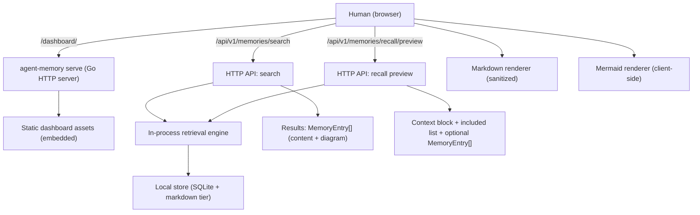

# Human Dashboard (React) - Design
## 1. Overview
This feature upgrades the human dashboard into a React + TypeScript single-page app (SPA) that renders memory content as sanitized Markdown and displays diagram payloads with Mermaid rendering support. The dashboard continues to be served by the existing Go `serve` mode as embedded static assets, and it continues to use the same in-process engine-backed HTTP APIs as the CLI for parity.

## 2. Approach
### 2.1 Architecture Choice
**Chosen approach:** React + TypeScript SPA, built to static assets and embedded under `internal/api/dashboard/` (served via `go:embed`).

Rationale:
- Preserves the existing local-only distribution model (single Go binary).
- Enables richer UI composition (tables, filters, split panes, rendering modes).
- Keeps all interactions through the existing HTTP API surface (no direct DB access from the browser).

### 2.2 API Strategy
Search responses already return full `MemoryEntry` objects (including `content` and optional `diagram`), which is sufficient for rich rendering.

Recall preview currently returns an assembled `context_block` plus metadata about included/clipped items. To enable a recall “result table” that can render Markdown/diagrams per memory, the API should optionally return included memories as full `MemoryEntry` objects.

The design adds an optional request flag to recall preview:
- `include_memories: boolean` (default `false`)

When `true`, the response includes:
- `memories_included_full: MemoryEntry[]`

This preserves backward compatibility and avoids inflating payloads when not needed.

## 3. UI Information Architecture
### 3.1 Pages / Panels
- **Workspace selector**: choose active workspace.
- **Search**: natural-language query input + optional filters (types, tiers, outcome result, confidence/decay thresholds, date range) + explain toggle.
- **Results table**: ranked memories with expandable row details:
  - Markdown rendering of `content`
  - Diagram section (raw + rendered if Mermaid)
  - Metadata (type, tier, confidence, timestamps, entities/tags)
- **Recall preview**: task input + budget/top-k + explain toggle; show:
  - `context_block` (raw text)
  - included memories table (full entries when requested)
  - clipped list + clipping stats

### 3.3 Conversation UI (Claude-like)
- The primary interaction model is a **message thread**:
  - User message: the natural-language query/task.
  - Assistant message: summary + rendered results (Markdown + diagrams) or recall preview output.
- A bottom **composer** is always present:
  - Enter sends; Shift+Enter inserts newline.
  - `Advanced` toggle reveals filters/budget/explain controls without cluttering the default flow.

### 3.2 Rendering Modes
- **Markdown**: render `content` as sanitized HTML with safe link handling.
- **Diagram**:
  - Always show raw `diagram.code` when `diagram` exists.
  - If `diagram.lang === "mermaid"`, offer a rendered view using Mermaid.
  - If Mermaid render fails, fall back to raw view and show an error state.

## 4. Data Contracts
### 4.1 Search
**Request:** `POST /api/v1/memories/search`
- `workspace: string`
- `query: string`
- `top_k?: number`
- `mode?: "search" | "recall"`
- `explain?: boolean`
- `filters?: { types?: string[]; tiers?: string[]; outcome_result?: string; min_confidence?: number; min_decay_score?: number; entities?: string[]; date_from?: string; date_to?: string }`

**Response (existing):**
- `results: MemoryEntry[]` (includes `content`, optional `diagram`)
- `total_tokens: number`
- `search_time_ms: number`

### 4.2 Recall Preview
**Request:** `POST /api/v1/memories/recall/preview`
- `workspace: string`
- `task_description: string`
- `top_k?: number`
- `token_budget?: number`
- `explain?: boolean`
- `include_memories?: boolean`

**Response (incremental):**
- `context_block: string`
- `memories_included: { id; type; tier; score; tokens; score_breakdown? }[]`
- `memories_included_full?: MemoryEntry[]` (only when `include_memories: true`)
- `memories_clipped: { id; reason; would_add_tokens }[]`
- `clipping: { used_tokens; budget; clipped; ... }`

## 5. Security Considerations
- **XSS protection**: Markdown rendering must sanitize HTML output (allowlist-based) and never use unsanitized `dangerouslySetInnerHTML` without a sanitizer.
- **Link handling**: External links open in a new tab with `rel="noreferrer noopener"`.
- **Local-only assumption**: No auth is added; UI should clearly indicate it is an inspection surface and rely on localhost serving defaults.
- **Content sensitivity**: UI must not add telemetry or external network calls.

## 6. Performance Considerations
- Render Markdown/diagrams only for expanded rows (virtualized or progressive rendering optional), avoiding rendering heavy diagrams for every row by default.
- Keep Mermaid initialization singleton and re-render diagrams on demand.
- Avoid copying large JSON blobs into the DOM unless requested (optional “raw JSON” disclosure).

## 7. Failure Modes & Edge Cases
- **Mermaid parse/render errors**: show raw diagram code and an inline error banner.
- **Large Markdown blocks**: collapse with “expand” UI to keep the table scannable.
- **API errors**: show request error payload; keep last successful results visible until replaced.
- **Mixed tiers**: treat `storage_tier` as a label; rendering behavior is content-driven.

## 8. Alternatives Considered
- **Keep the current vanilla HTML dashboard**: lowest complexity but limits maintainability and rich rendering; Markdown + Mermaid rendering becomes messy.
- **Serve React from a separate dev server**: better DX but breaks the single-binary distribution goal and complicates installation.
- **Render Mermaid server-side**: increases backend complexity and introduces SVG sanitization concerns; client-side rendering is simpler and keeps parity with raw diagram storage.

## 9. Rollout Strategy
- Implement the new embedded dashboard behind the same `/dashboard/` route by replacing embedded assets.
- Keep API changes backward-compatible (optional flags; additive response fields).
- Validate with existing API tests plus focused new tests for the recall preview payload extension.

## 10. Architecture Flowchart

