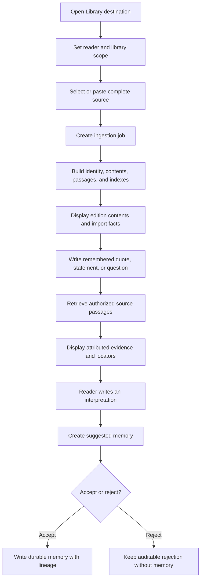

# Library Dashboard Flow Design

## 1. Decision

Add a Library destination to the notebook shell and implement the book workflow in a dedicated `LibraryWorkspace` component. Keep the existing Living Knowledge Library backend contracts authoritative. The dashboard is a client and workflow surface; it does not create a second book store or reinterpret retrieval results as model truth.

## 2. User flow

## 3. Component boundaries

`NotebookWorkspace` owns destination selection and passes the current project name into `LibraryWorkspace`. The library component owns transient form, import, structure, query, and review state. The API module owns JSON contracts and transport. Backend handlers remain responsible for workspace resolution, authorization, ingestion, citations, and durable-memory transitions.

This separation avoids growing the already large notebook component with book-specific state and permits a future full Book/Reading Room route without changing the initial shell contract.

## 4. State and identity

The current workspace is selected by the existing project picker. Reader principal, library ID, library kind, and organization ID are user-entered client preferences. They are stored in browser local storage under application-specific keys and never inferred from a filesystem path or OS username.

The current edition and import summary are session state. Because the backend does not yet expose library or edition listing endpoints, a reload does not attempt to reconstruct a complete catalog. Adding catalog listing is a follow-up contract, not a reason to fabricate client-side authority.

## 5. Data contracts

The client adds typed contracts matching the existing endpoints:

- import request and job result
- structural-node response
- passage retrieval result with locator payload
- book-memory proposal and review response

The common API response decoder continues to handle errors and non-JSON responses. Organization queries include the selected organization ID; personal queries omit organization scope.

## 6. Conversation and epistemic labeling

The query endpoint currently returns authorized passages and an optional memory proposal; it does not run a hosted language model. The UI therefore calls its output “grounded evidence,” never a generated author explanation. The reader's question or analogy is labeled reader input. Retrieved passages are labeled source evidence. Editable proposed content is labeled interpretation and remains suggested until explicit review.

This preserves the key invariant: an analogy such as “all roads lead to Rome” applied to astronomy remains the reader's interpretation unless a cited book passage supports a separately attributed author claim.

## 7. Import and indexing representation

Import is presented as a pipeline rather than a single upload event. The completed job shows stable work/edition/asset identities and counts. The structure panel shows ordered nodes. Supporting copy explains the three storage planes:

- original source under policy control
- passages and indexes as rebuildable retrieval data
- accepted summaries, quotes, and interpretations as durable memory

The UI shall not claim support for browser binary PDF or EPUB upload through the Markdown endpoint. Those adapters exist in the backend ingestion layer, but require format-aware transport endpoints before being exposed here.

## 8. Failure modes

- Missing workspace: disable import and query actions.
- Missing personal identity or library ID: preserve input and show validation.
- Organization without organization ID: reject before network access.
- Malformed or unsupported source: retain the form and show API error.
- Unauthorized query: display no evidence without leaking source existence.
- Unanswerable query: show an explicit no-evidence state and do not allow an evidence-backed proposal.
- Proposal review failure: leave proposal visible and retryable.
- Stale edition after reload: request a fresh import or future catalog selection.

## 9. Security and privacy

Authorization remains server-side and is applied before ranking. Client-side identity fields are routing inputs, not authentication proof. The dashboard does not persist source text in local storage. It only holds imported text in component memory until navigation or reload. No source passage is automatically copied into notes or durable memories.

## 10. Performance and scaling

The component requests a bounded number of evidence passages and renders a bounded structure list for the current edition. Large-source ingestion remains job-based at the API boundary, although the current Markdown implementation often completes synchronously. Catalog pagination, streaming job progress, virtualized contents, and cross-book scope selection are future slices.

## 11. Alternatives considered

Embedding the flow inside Ask was rejected because ordinary memory recall and source-grounded book retrieval have different authorization, evidence, and retention semantics. Adding a separate top-level application was rejected because it would duplicate project selection and navigation. Generating prose from raw passages in the browser was rejected because it would bypass the model-independent reading-room verifier and blur source evidence with interpretation.

## 12. Rollout and recovery

The Library destination uses the already default-enabled backend feature with its existing emergency-off environment switch. If the server disables the route, the dashboard surfaces the not-enabled response while Notes remains usable. Embedded assets are rebuilt only after source tests, typecheck, and build pass. Rollback is the additive removal of the destination/component/API methods; no schema rollback is required.
