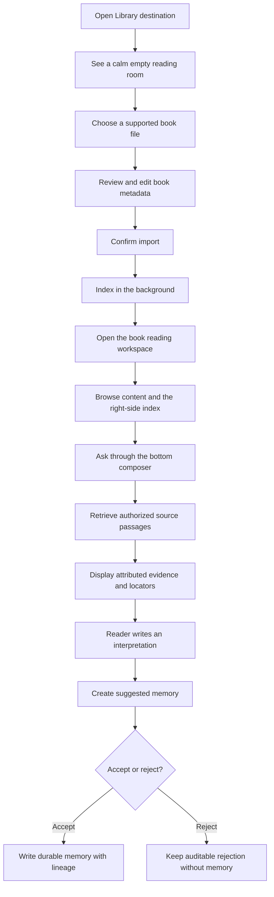

# Library Dashboard Flow Design

## 1. Decision

Add a Library destination to the notebook shell and implement the book workflow in a dedicated `LibraryWorkspace` component. Keep the existing Living Knowledge Library backend contracts authoritative. The dashboard is a client and workflow surface; it does not create a second book store or reinterpret retrieval results as model truth.

## 2. User flow

## 3. Component boundaries

`NotebookWorkspace` owns destination selection and passes the current project name into `LibraryWorkspace`. The library component owns transient form, import, structure, query, and review state. The API module owns JSON contracts and transport. Backend handlers remain responsible for workspace resolution, authorization, ingestion, citations, and durable-memory transitions.

This separation avoids growing the already large notebook component with book-specific state and permits a future full Book/Reading Room route without changing the initial shell contract.

## 4. State and identity

The current workspace is selected by the existing project picker. The server derives stable reader and library IDs when the dashboard omits them. Library kind remains dashboard state, and organization ID is collected only for organization scope. No reader or library identifiers are stored in browser local storage or inferred from a filesystem path or OS username.

The current edition and import summary are session state. Because the backend does not yet expose library or edition listing endpoints, a reload does not attempt to reconstruct a complete catalog. Adding catalog listing is a follow-up contract, not a reason to fabricate client-side authority.

## 5. Data contracts

The client adds typed contracts matching the existing endpoints:

- import request and job result
- structural-node response
- passage retrieval result with locator payload
- book-memory proposal and review response

The common API response decoder continues to handle errors and non-JSON responses. Organization queries include the selected organization ID; personal queries omit organization scope.

## 6. Conversation and epistemic labeling

The query endpoint currently returns authorized passages and an optional memory proposal; it does not run a hosted language model. The chat transcript therefore presents the reader prompt followed by grounded excerpts, never a fabricated author explanation. Retrieved passages are labeled source evidence. Editable proposed content is labeled interpretation and remains suggested until explicit review.

The composer is structurally anchored beneath the reading viewport so it behaves like a familiar chat input rather than a form section. The transcript scrolls inside the reading body while the composer remains reachable. Submission uses a single free-form prompt; optional interpretation and memory review are progressive disclosures after evidence exists.

This preserves the key invariant: an analogy such as “all roads lead to Rome” applied to astronomy remains the reader's interpretation unless a cited book passage supports a separately attributed author claim.

## 7. Import and indexing representation

Import begins as a single file action. Selection opens an inline preparation sheet containing customer-recognizable metadata. The user may correct the inferred title, choose edition and language, and then confirm. The source is not submitted before confirmation.

After confirmation, ingestion and structure loading are represented by a compact background status in the Library header. The status progresses through reading, indexing, and ready language, but the page never becomes a numbered wizard. The completed job's internal identities and counts move into a secondary details disclosure. Supporting copy may still explain the three storage planes:

- original source under policy control
- passages and indexes as rebuildable retrieval data
- accepted summaries, quotes, and interpretations as durable memory

The existing multipart transport supports binary PDF and EPUB while JSON transport preserves pasted Markdown compatibility. The redesigned primary flow uses file selection; pasted text remains an unobtrusive secondary option for compatibility.

## 8. Failure modes

- Missing workspace: disable import and query actions.
- Missing personal identity or library ID: preserve input and show validation.
- Organization without organization ID: reject before network access.
- Malformed or unsupported source: retain the form and show API error.
- Unauthorized query: display no evidence without leaking source existence.
- Unanswerable query: show an explicit no-evidence state and do not allow an evidence-backed proposal.
- Proposal review failure: leave proposal visible and retryable.
- Stale edition after reload: request a fresh import or future catalog selection.

## 9. Security and privacy

Authorization remains server-side and is applied before ranking. Client-side identity fields are routing inputs, not authentication proof. The dashboard does not persist source text in local storage. It only holds imported text in component memory until navigation or reload. No source passage is automatically copied into notes or durable memories.

## 10. Performance and scaling

The component requests a bounded number of evidence passages and renders a bounded structure list for the current edition. Large-source ingestion remains job-based at the API boundary, although the current Markdown implementation often completes synchronously. Catalog pagination, streaming job progress, virtualized contents, and cross-book scope selection are future slices.

## 11. Alternatives considered

Embedding the flow inside Ask was rejected because ordinary memory recall and source-grounded book retrieval have different authorization, evidence, and retention semantics. Adding a separate top-level application was rejected because it would duplicate project selection and navigation. Generating prose from raw passages in the browser was rejected because it would bypass the model-independent reading-room verifier and blur source evidence with interpretation.

## 12. Rollout and recovery

The Library destination uses the already default-enabled backend feature with its existing emergency-off environment switch. If the server disables the route, the dashboard surfaces the not-enabled response while Notes remains usable. Embedded assets are rebuilt only after source tests, typecheck, and build pass. Rollback is the additive removal of the destination/component/API methods; no schema rollback is required.

## 13. Sidebar destination presentation

The existing explorer-open state also controls the width and presentation of the primary navigation rail. With the explorer closed, the rail stays compact and exposes icon-only destination buttons; accessible names and native hover titles preserve meaning for assistive technology and pointer users. With the explorer open, the rail widens and places each destination name below the same icon, keeping the navigation order and click targets unchanged.

Inline SVG icons are preferred over letter abbreviations because they remain recognizable across locales without adding a runtime icon dependency or remote asset. The mobile bottom navigation remains icon-only so labels do not overflow narrow screens. Reduced-motion behavior continues to disable rail transitions. The main risks are horizontal space loss and breakpoint drift; a single rail-width variable is used by the desktop grid, explorer overlay offset, and context overlay calculation to keep those contracts aligned.

## 14. Adaptive canvas tracks

The desktop notebook grid is composed from mounted regions rather than a fixed four-column template. The rail is always present. Explorer and context tracks are added only when their corresponding panels render; this prevents an unoccupied context track from appearing as a right-side gap on Library, Search, Ask, and Activity.

Below the context breakpoint, context remains an overlay and never consumes a grid track. Below the explorer breakpoint, explorer also remains an overlay. The mobile bottom-navigation layout continues to override every desktop track variant.

Library uses a centered responsive content track with a wide but bounded measure. Cards fill that track, while long-form explanatory copy retains its readable character measure. This makes large screens useful without stretching text or controls to the viewport edges.

Keeping a fixed context column for every destination was rejected because it produces empty space where no context component exists. Making Library entirely edge-to-edge was rejected because form controls and evidence passages become difficult to scan on ultrawide displays.

## 15. Customer reading-room composition

The ready Library uses a three-region composition inside one bounded surface: a book header across the top, a long-form reading and conversation body on the left, and a table of contents on the right. The chat composer spans the reading column at the bottom and stays visible without covering excerpts. This creates a single place to read, navigate, and ask instead of three disconnected workflow cards.

The empty state is intentionally sparse: title, short explanation, supported formats, and one import button. Selecting a file replaces it with an inline metadata preparation surface. The indexing state reuses the book shell with skeleton-like content and a compact live status, reducing layout shift when the ready state arrives.

The content body initially uses the grounded passages returned by conversation as its real readable material because the current structure endpoint returns hierarchy but not full node bodies. Before the first query, it shows a composed invitation to ask about the book and may surface structural chapter titles. It shall not invent quotations or random excerpts that are absent from the API response.

On wide screens the index remains on the right with independent overflow. At tablet widths it becomes a collapsible horizontal or stacked region above the body. On mobile it stacks below the book header while the composer remains above the notebook bottom navigation. Focus order follows header, reading body, index, then composer; visual placement must not create a contradictory keyboard order.

Alternatives considered: a full-screen import wizard was rejected because it exposes implementation sequence and delays access to the reading room. Three vertical cards were rejected because they imply required linear completion and separate chat from its evidence. A floating chat bubble was rejected because it hides the primary action and reduces room for cited answers. A permanent metadata sidebar was rejected because metadata matters during preparation but becomes secondary while reading.

Failure modes include unsupported files, failed metadata confirmation, import errors, structure-loading errors after successful import, no returned evidence, and rejected memory proposals. Each failure remains local to its surface, preserves user input, and allows retry without clearing the selected book. If structure loading fails after import, the reading shell remains open with a recoverable index error rather than discarding the imported result.

Performance remains bounded by rendering at most the current structure response and eight retrieved passages. The index receives its own overflow container to avoid increasing the full page height. No virtualization is introduced until catalog or structure sizes demonstrate a need. The redesign adds no dependencies or remote assets.

Rollout reuses the existing Library destination and API endpoints, so no storage migration or feature-flag expansion is required. Source and embedded bundles must remain synchronized. Rollback consists of reverting the Library component and styles; imported books and accepted memories remain intact because their contracts and persistence are unchanged.

## 16. Imported-book note bridge

`NotebookWorkspace` remains the owner of note creation, explorer refresh, note opening, and destination changes. `LibraryWorkspace` reports a successfully prepared book through a typed callback containing the confirmed customer metadata, import result, and structural-node count. This avoids teaching the Library component about the broader tab, revision, indexing, and Trash state machines.

The parent creates one Markdown note under the `Library/` folder. Its body is intentionally readable: book title, edition, language, format, indexed section/passage counts, and guidance that the Library reading room remains the grounded conversation surface. Stable work, edition, and source-asset identifiers are stored in note properties rather than foregrounded in prose. The note uses the existing note indexer like every other note.

Active-note paths are checked before creation. The preferred path is `Library/<safe title>.md`; collisions add a human-readable numeric suffix. A trashed note does not reserve the active path because storage already permits reuse when `deleted_at` is present. Re-importing therefore creates a distinct active note without overwriting user edits.

The callback runs after import and structure loading reach ready state. Note creation failure is a secondary partial failure: the imported book remains usable and retrying the entire ingestion is not implied. The UI reports that it could not create the note. A successful callback returns the note identity so the reading-room header can expose “Open note”; opening delegates back to the parent, which uses the existing tab loader and switches to Notes.

Removal does not delete the imported book, source asset, passages, or durable memories. It invokes the established recoverable note Trash action. Coupling note trash to source deletion was rejected because it would combine two retention domains, create unexpected data loss, and exceed the current API contract. Backend-created notes inside the import transaction were also rejected because note creation is a dashboard workflow concern and would make API clients receive notes they did not request.

The main risks are duplicate paths, partial success, and stale explorer state. Numeric path allocation, separate error handling, and awaiting the existing explorer refresh mitigate them. No schema migration or new endpoint is required. Rollback removes the callback bridge and leaves already-created notes as ordinary user-removable notes.
