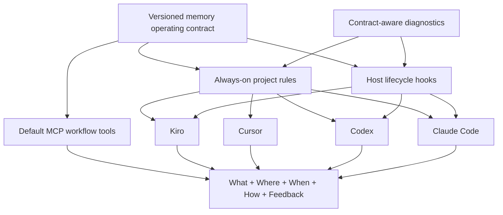

# Multi-client memory enforcement design

## Goals and non-goals

The upgrade creates one canonical operating contract and installs it through the native project surfaces of Kiro, Cursor, Codex, and Claude Code. It also makes the complete solution workflow available through the default MCP profile and provides diagnostics that can prove whether a project is current.

The system does not attempt to capture private chain-of-thought. It stores bounded, user-safe summaries of actions, observations, decisions, rationale, outcomes, references, and continuation state. It also does not claim that a text instruction can cryptographically force model behavior.

## Architecture

### Canonical contract

`internal/workspace` owns a public contract-version marker and a single generated policy body. Client-specific wrappers may add front matter, but they do not independently restate the workflow. This prevents Cursor and generic rules from drifting.

The canonical body also owns CLI resolution policy. Connected projects invoke `agent-memory` through `PATH`; they never infer `./bin/agent-memory`, because that relative artifact exists only after building the Agent Memory source repository. A missing PATH command is an installation/connection failure to report and repair, not a reason to probe or invent project-local binary paths. Changing this policy increments the operating-contract marker so diagnostics can identify and refresh stale projects.

The contract separates trivial durable memory from non-trivial solution episodes. It directs agents to store concise rationale summaries, never hidden reasoning. A non-trivial episode begins before substantial work, appends only meaningful steps, checkpoints during long work, transitions to a terminal status, and is compacted by session-end. How-oriented retrieval uses solution recall before ordinary research when appropriate; promotion occurs only for verified reusable knowledge.

### Enforcement levels

| Client | Rule surface | Lifecycle surface | Enforcement statement |
|---|---|---|---|
| Kiro | Generated project rule via its hook prompts | Prompt-submit and agent-stop hooks | Host invokes prompts; agent executes contract |
| Cursor | Always-applied MDC rule | No compatible managed project hook | Instruction-enforced |
| Codex | Managed section in `AGENTS.md` | Managed lifecycle hooks | Host-enforced observation plus instruction contract |
| Claude Code | Managed section in `CLAUDE.md` | Managed lifecycle hooks | Host-enforced observation plus instruction contract |

Generic rule targets receive instruction enforcement only.

### Installer and connection model

`init` and `reinstall` remain the canonical project-wide installers. The `all` target explicitly includes every supported target, including Kiro. Detection includes `.kiro/`.

Codex permission selection is user-authoritative. With no user selection, the managed block selects the generated `agent-memory-workspace` profile. When user-authored configuration already selects `sandbox_mode` or `default_permissions`, regeneration preserves that choice and writes the Agent Memory profile without a managed `default_permissions` selector. Rules and lifecycle hooks still refresh, and `--ide all` continues to subsequent clients. Removing the user selection and reinstalling restores the managed default selector deterministically.

Connection adapters are responsible for a complete usable connection, not just MCP registration. Codex and Claude therefore verify their rules and hooks together. Cursor and Kiro adapters use owned project artifacts and expose the same connect/verify/disconnect lifecycle. Shared files use bounded managed sections; owned files can be removed directly. Disconnect never deletes a parent directory.

### MCP profiles

Solution workflow tools are normal agent work, not operator diagnostics, so they move into the default profile. Health and session-listing remain expanded-only. Both profiles continue to use the same strict schemas and backend authorization.

### Diagnostics

Diagnostics identify client signals, validate current contract markers, and validate host hooks where supported. A missing current rule is an actionable failure for a detected client. Cursor reports rule enforcement without implying hook coverage. Diagnostics remain local and never execute an agent.

## Data contracts

- Contract marker: stable ASCII text with a monotonically increasing version.
- Rule section boundary: existing `## agent-memory (MANDATORY)` marker.
- Solution capture: existing solution episode, step, checkpoint, transition, handoff, recall, and promotion API contracts.
- Client kinds: `codex`, `claude`, `cursor`, `kiro`, and `other`.
- Tool profiles: `default` includes memory plus solution workflow; `expanded` adds operator diagnostics.

No database migration is required.

## Alternatives considered

### Duplicate client-specific policies

Rejected because policy drift already occurred between Cursor and generic rules. A shared body with thin wrappers is easier to test and upgrade.

### Capture every token or hidden thought

Rejected for privacy, safety, cost, and quality reasons. Structured summaries provide replayable decisions without persisting private reasoning.

### Keep solution tools expanded-only

Rejected because an ordinary agent cannot follow a mandatory How contract if the required tools are absent from its default MCP surface.

### Claim universal hard enforcement

Rejected because Cursor and generic clients expose instruction surfaces, not guaranteed executable policy gates. The design reports enforcement level precisely.

## Failure modes and recovery

- **Stale generated rule:** doctor reports the mismatched contract; `reinstall --ide <client>` refreshes it.
- **Malformed shared config:** installation fails without overwriting the file; the user fixes syntax or restores a backup.
- **Partial multi-client installation:** each written artifact is reported; rerunning reinstall is idempotent and completes missing targets.
- **Hook command unavailable:** host hook fails visibly and doctor reports configuration; agent instructions still explain the manual CLI workflow.
- **Agent guesses a repository-relative CLI path:** the always-on contract explicitly rejects `./bin/agent-memory` outside source-repository development and directs the agent to report or repair missing PATH installation.
- **MCP service unavailable:** tools return transport failure; generated rules direct the agent to report the gap rather than fabricate recall.
- **Concurrent shared-file update:** existing atomic/managed-section mechanisms are retained; no broad deletion occurs.
- **Explicit Codex permission selection:** preserve it, omit only Agent Memory's competing default selector, retain the managed permission profile for inspection or later use, and continue the reinstall.

## Security and privacy

- Rules prohibit chain-of-thought capture and request concise rationale summaries.
- Existing workspace, principal, tenant, and sensitivity controls remain authoritative.
- Disconnect operations remove only exact owned files or bounded managed sections.
- Paths stay within the selected workspace and existing symlink protections remain in force.

## Performance and scaling

Generated rules are small static files. Hook overhead remains one bounded local command per supported event. Exposing more MCP schemas increases tool-discovery payload size but does not invoke backend work until a tool is called. Solution checkpoints remain bounded by current API limits and TTLs.

## Rollout strategy

1. Introduce the versioned shared contract and target normalization behind existing commands.
2. Update adapters and verification without changing stored memory schemas.
3. Expand the default MCP workflow surface and client kinds.
4. Update diagnostics, dashboard copy, and documentation.
5. Run isolated natural verification, regressions, and builds.
6. Reinstall the incremented contract across every registered project and verify the managed rule surfaces contain the PATH-only instruction.

Rollback restores the prior generated contract and MCP default set; stored solution episodes remain compatible and are not deleted.
