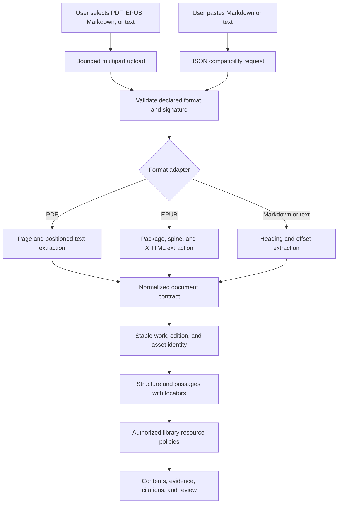

# Multi-format Book Import Design

## 1. Decision

Add a format-neutral persistence importer above the existing deterministic adapters. Keep the legacy Markdown importer as a compatibility wrapper, and add production EPUB and native-text PDF extraction paths. The API accepts both legacy JSON and multipart form data; the dashboard uses multipart when a file is selected.

## 2. Flow

## 3. Extraction contract

The format-neutral importer consumes source bytes plus title, edition label, language, format, and policy. An extractor returns normalized text, structural nodes, passages, parser version, and normalization version. Extraction runs before publication so malformed sources cannot create partial library records.

PDF extraction uses an in-process, pure-Go parser that opens uploaded bytes and returns positioned text elements per page. Each page becomes a structural node. Contiguous text elements become citable blocks with page and bounding-box locators. A page with no native text remains a page node and is marked `requires_ocr`; no passage is fabricated for it.

EPUB extraction uses the existing ZIP/XML adapter, with package metadata and spine order authoritative. Final passage identities are rebound to the stable edition and asset rather than provisional extraction identities.

## 4. Persistence and identity

The byte fingerprint detects exact asset re-import. The normalized content fingerprint identifies an edition of a work. Work identity uses normalized title. Asset identity uses exact bytes. Before persistence, every node and passage is validated against the final edition and asset IDs.

Writes follow the existing order: work, edition, asset, structure, passages, then library resource policies. Existing storage methods remain the source of truth. A future transaction boundary can make publication fully atomic across all records; this slice ensures extraction and validation complete before the first write.

## 5. HTTP contract

`POST /api/v1/library/imports` supports:

- `application/json` with the existing `markdown` field, interpreted as Markdown unless `format: text` is supplied.
- `multipart/form-data` with metadata fields and one `source` file.

The upload limit is enforced before multipart parsing. The handler does not trust filename extensions alone: PDF and EPUB adapters validate their signatures/containers. The response remains the existing import-job envelope, extended with the imported source format.

## 6. Dashboard behavior

The file input accepts all supported local formats. Selecting Markdown/text loads editable text for compatibility; selecting PDF/EPUB retains the `File` object and displays filename, format, and size without decoding bytes into component text. The API client constructs `FormData` and lets the browser set the multipart boundary.

## 7. Failure modes

- Unsupported extension or format: reject before persistence.
- Malformed EPUB/PDF: failed job response with parser context.
- Encrypted or unsupported PDF: fail explicitly; do not silently import partial text.
- Native-text PDF with some scanned pages: import native passages and retain OCR-required page nodes.
- Entirely scanned PDF: reject as requiring configured OCR because it has no searchable native passages.
- Oversized upload: return HTTP 413.
- Duplicate bytes: return the existing edition/asset counts and refresh source policy.

## 8. Security, performance, and rollout

The request limit bounds memory/disk exposure. Multipart temporary files are removed after parsing. Parsing stays local and does not send copyrighted source bytes to hosted services. PDF pages and EPUB spine items are processed in source order; indexing remains synchronous for this slice but preserves the job response contract for later background execution.

The new path is additive. Rollback removes multipart handling and format registration while leaving existing imported editions readable. Parser versions on assets and locators support later re-indexing without changing durable citations silently.

## 9. Alternatives

Requiring Poppler was rejected because installation must work across client devices without a separately managed executable. Browser-side PDF parsing was rejected because it would duplicate backend provenance logic and make API/CLI imports inconsistent. Treating every binary as plain text was rejected because it destroys reading order and citation locators.
