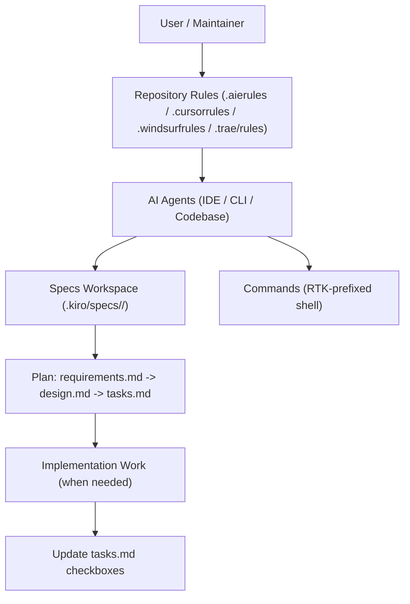

# Design Document

## Overview

This design sets a lightweight but enforceable baseline for how `agent-memory` is managed by AI agents across editors/tools. The goal is to make the repository “spec-ready” from day one: planning is done in Kiro specs, progress is tracked in spec tasks, and agents consistently use RTK-prefixed shell commands.

## Goals

- Establish a single specs-first workflow that applies across AI agents.
- Ensure every spec has a readable system/architecture flowchart.
- Reduce token waste by standardizing RTK-prefixed shell commands.
- Keep the repository minimal and avoid unnecessary files.

## Non-Goals

- Building application runtime code or services.
- Introducing CI/CD, release pipelines, or deployment automation as part of this setup.

## Architecture / System Flowchart (Mermaid)

## Spec Workflow

### Specs-first sequence

1. Requirements define what must be true (EARS acceptance criteria).
2. Design describes architecture, alternatives, trade-offs, and failure modes.
3. Tasks convert the design into an actionable checklist and track progress.

### When a spec is required

- Any non-trivial feature or bugfix should have a spec directory under `.kiro/specs/<feature>/`.
- If it is unclear whether the work is trivial, treat it as non-trivial and create a spec.

## Data Contracts and Interfaces

This repository currently stores rules/specs and has no runtime interfaces. The primary “contracts” are:

- Spec directory shape: `.kiro/specs/<feature>/{requirements.md,design.md,tasks.md}`
- Mermaid safety rule: quote all node labels
- Shell command format: always `rtk <cmd>`

## Alternatives Considered

### Alternative A: No specs, rules-only

- Pros: minimal files, lowest overhead.
- Cons: no durable planning artifacts; harder to coordinate and audit changes.

### Alternative B: Specs as the primary SSOT (chosen)

- Pros: consistent workflow for agents; clear intent and progress tracking; easy to extend.
- Cons: requires some discipline to keep specs updated.

## Risks and Mitigations

- Risk: Specs diverge from reality.
  - Mitigation: require checkbox updates in `tasks.md` and treat spec updates as part of finishing work.
- Risk: Mermaid diagrams break due to syntax issues.
  - Mitigation: enforce quoted node labels.
- Risk: Rules fragment across tools.
  - Mitigation: keep rule text consistent across `.aierules`, `.cursorrules`, `.windsurfrules`, and `.trae/rules`.

## Rollout Strategy

- Create this initial setup spec and treat it as the baseline.
- For every subsequent feature, create a new spec directory and follow the same workflow.
