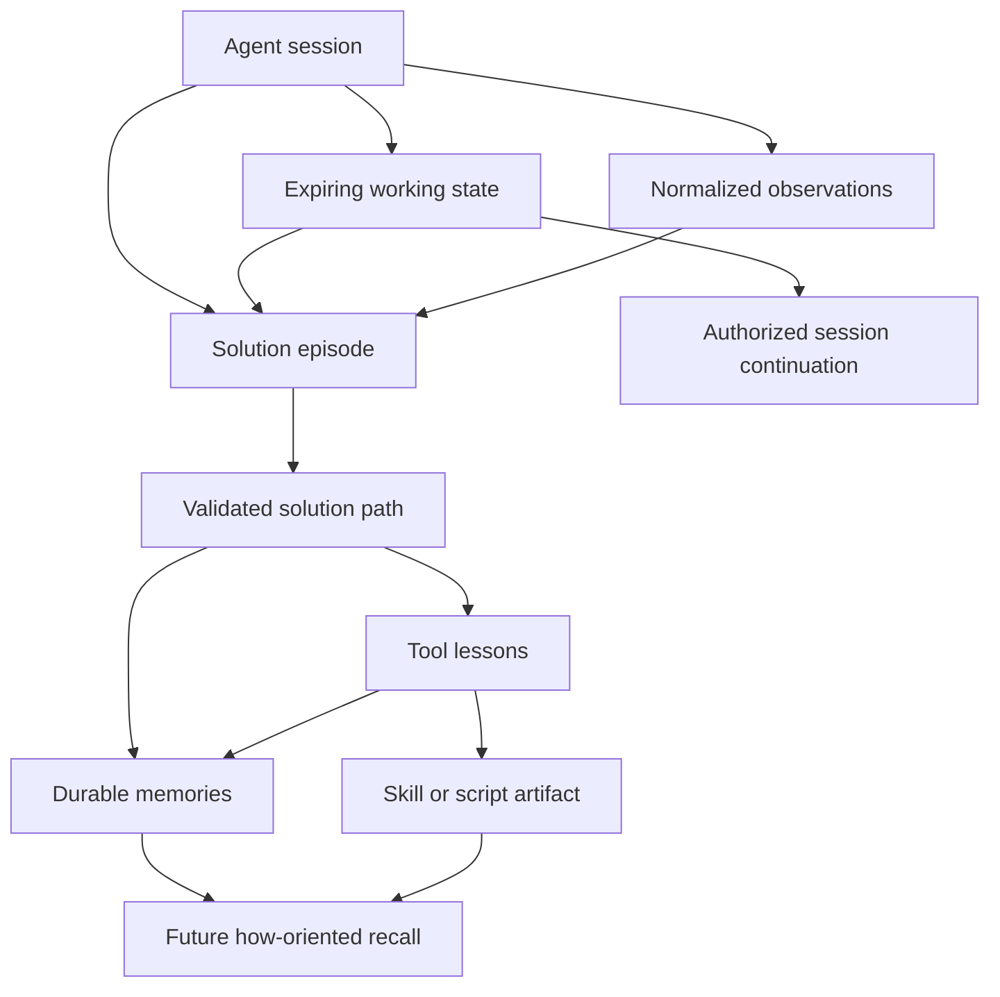
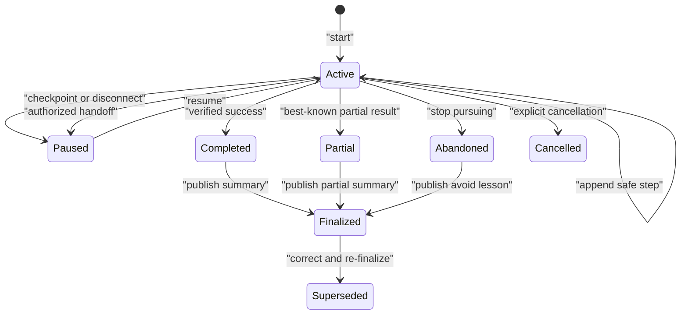
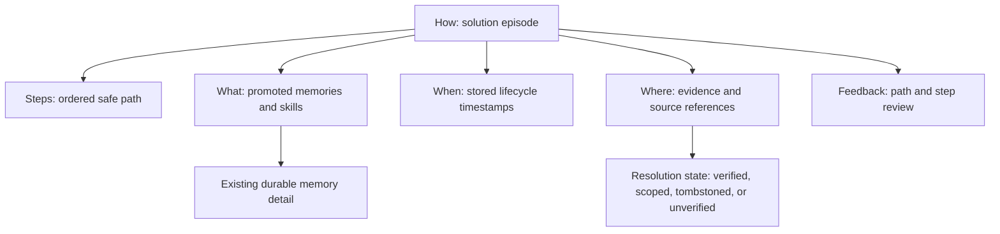

# Solution-Path Memory Design

## Context and Diagnosis

Agent Memory already has four durable memory types, outcome metadata, sessions, normalized observations, observation-to-memory provenance, retrieval feedback, consolidation, and skill distillation. These pieces preserve facts, conclusions, some procedures, and a chronological activity stream. They do not represent the task-level causal structure connecting a goal to attempts, decisions, evidence, validation, and a final result.

Adding more prose to outcome memory would not close the gap. It would collapse ordering, failed branches, tool evidence, active state, and promotion lineage into one untyped field. Treating raw transcripts or model reasoning as the missing representation would create privacy, security, portability, quality, and token-cost problems. The chosen architecture adds a structured solution-episode layer between observations and durable memory.

## Chosen Domain Model

The model has four layers with different lifecycle rules:

1. **Working state** is mutable and expiring. It exists to resume the current task.
2. **Observations** are normalized evidence of externally visible events. Existing observation storage remains authoritative for captured client events.
3. **Solution episodes and steps** organize meaningful observations and client summaries into a task-level path.
4. **Durable memories and skills** are promoted, validated reusable knowledge.

This is not a fifth durable memory type. Episodes are provenance-rich work records; existing memory types retain their established retrieval and decay semantics.

## Episode State Machine

An episode starts in `active`. It may move to `paused`, return to `active`, or enter a terminal `completed`, `partial`, `abandoned`, or `cancelled` state. A handoff keeps the episode non-terminal and changes the active session or principal only through an authorized transition. Finalization operates on a terminal snapshot and publishes a versioned solution-path summary. A corrected finalization supersedes the prior summary without mutating it.

## Data Contracts

### Solution Episode

The episode carries stable identity, workspace and tenant scope, creating principal and client, originating session, goal summary, status, capture policy, version, timestamps, retention class, finalization status, and an optional superseding episode. Goal text is concise and passes admission before storage.

The episode does not contain the entire path as one JSON document. Steps are independently addressable so append operations, evidence links, pagination, feedback, and redaction remain bounded.

### Solution Step

Each step carries an episode ID, server-assigned monotonic ordinal, kind, summary, status, source, timestamps, confidence, sensitivity, and schema version. Optional references identify parent steps, observations, memories, files, tests, tools, skills, and artifacts.

The summary is the externalizable explanation a competent collaborator would give: what was tried or decided and why the available evidence supported it. It is not an internal token trace. Parent references allow a failed branch or decision dependency without requiring an unrestricted reasoning graph.

### Tool Invocation and Tool Lesson

Invocation records attach to action or observation steps and contain logical tool identity, operation, capability intent, safe input summary, result class, latency, and bounded evidence references. Payload hashes can support deduplication without retaining payload bodies.

A tool lesson is a versioned derived record referencing one or more steps. It records the demonstrated capability, preconditions, limitations, known failure modes, safer fallback, confidence, validation state, and promotion targets. A considered or failed tool remains evidence but cannot be advertised as a successful capability.

### Working State

Working state is a single current document per episode generation, stored separately from steps. It contains bounded fields for goal, constraints, plan items, completed items, open questions, next action, and artifact references. It carries a generation counter, expiry, sensitivity, and updater identity.

Updates use compare-and-swap semantics. A stale generation receives a conflict plus current metadata; the server never silently merges prose or lists. Clients can refetch and intentionally reconcile.

### Solution-Path Summary

Finalization creates a compact, versioned summary containing outcome, decisive steps, useful failed approaches, verification evidence, tool lessons, unresolved risks, and next-time guidance. The summary references its source steps and observations. It may be embedded for retrieval, while full step detail remains relational and lazy-loaded.

### Promotion Provenance

Promotion records link an episode or summary to an existing memory or skill path. They store promotion kind, target identity, source step identities, reviewer or automated policy identity, validation state, and time. Existing memory provenance remains intact; the new record extends rather than replaces observation-to-memory provenance.

## Storage Architecture

SQLite gains normalized tables for episodes, steps, step references, working state, tool lessons, solution summaries, promotions, and retrieval feedback. Foreign keys protect episode ownership and summary lineage. Server-assigned ordinals use a transaction that validates the current episode version, increments it, and inserts the step atomically.

Indexes support workspace/status/updated-time episode listing, episode/ordinal step paging, expiry cleanup, validated-summary retrieval, tool identity lookup, and promotion-target lookup. Large payload bodies are excluded from these tables. Existing per-workspace database placement preserves local isolation; hosted storage follows tenant/workspace authorization and equivalent contracts.

Schema migration is additive. Old binaries ignore new tables. New binaries tolerate workspaces with no episode records and preserve every existing memory and observation query.

## Capture and Orchestration

Clients use explicit lifecycle operations rather than relying solely on transcript parsing. Start declares the goal and capture policy. Checkpoint updates working state and may append one or more safe steps. Tool hooks continue to emit normalized observations; clients or a bounded correlation service link relevant observations to a step using session, time, tool identity, and explicit external event identifiers.

Automatic correlation may propose links but cannot invent rationale or causal certainty. Ambiguous events stay unlinked. The client remains able to reference an observation explicitly.

Session-end becomes an integration point, not the authoritative episode parser. When an active episode exists, session-end requests final checkpoint or terminal status and may invoke finalization. When no episode exists, current heuristic memory extraction remains unchanged.

## Safe Rationale and Admission

The write boundary names its accepted field `rationale_summary` in transport contracts and describes it as concise, externalizable justification. It does not offer fields named scratchpad, internal reasoning, hidden state, or chain-of-thought.

Admission applies four stages:

1. Structural validation enforces types, lengths, references, ordering, and idempotency.
2. Content classification detects secrets, personal data, prompt injection, unsafe instructions, and explicit raw-reasoning submissions.
3. Origin-aware policy selects allow, review, quarantine, or reject.
4. Persistence writes the accepted safe record and content-free audit outcome atomically where required.

Redaction replaces unsafe content with a typed redaction marker and reason class; it never leaves an apparently complete but altered rationale. Provider prompts and raw completions are operational telemetry at most and are not domain records.

## Finalization Pipeline

Finalization loads a consistent terminal episode snapshot, excludes expired or disallowed working fields, resolves authorized evidence, and validates referenced observations and artifacts. A deterministic assembler can produce a summary from already structured steps. An optional model can propose compression, selection, or tool lessons against the immutable packet.

Model proposals pass schema, citation, entailment, admission, and duplication checks. Accepted outputs and promotions are committed with an idempotency key. If a durable memory write fails, finalization reports partial publication with exact target states and can retry safely. No successful promotion is rolled back merely because a later optional promotion failed.

Repeated successful tool lessons are candidates for existing consolidation and skill distillation. Repetition alone does not prove safety; each candidate retains its success evidence and review state.

## Retrieval and Recall

How-oriented retrieval uses a two-stage process. Candidate generation searches solution summaries, tool lessons, procedural memories, successful outcomes, and authorized current working state. Ranking then considers task similarity, outcome, evidence quality, validation state, feedback, recency, and workspace scope.

Recall assembly emits separate sections for current work, prior solution paths, reusable procedures or skills, and failed-approach warnings. It first allocates budget to compact summaries. Decisive step detail is fetched only when budget remains or the caller asks for an episode. This avoids flooding context with tool chronology.

Solution-path feedback is recorded independently because a path can be misleading even when one promoted procedural memory is useful. Harmful or rejected paths are suppressed from default recall and enter review without deleting historical audit lineage.

## How History Knowledge Tree

The Knowledge surface adds a How History view backed by stored provenance rather than UI-side similarity guesses. Activity continues to answer "what happened recently?" while How History answers "how was this knowledge produced and why should I trust it?" The episode is the root because it owns the goal, ordered path, finalization version, and lifecycle state.

The list contract remains compact: episode identity, goal, state, summary, validation, counts, and timestamps. Opening a root lazy-loads one bounded detail packet. The detail packet extends the existing Activity episode contract with resolved promotion targets and path feedback; it does not duplicate memory bodies in episode storage. A resolved memory child contains the existing memory identifier, type, bounded content summary, confidence, pin state, and provenance. Non-memory, pending, failed, unauthorized, or deleted targets expose only their promotion kind and state.

The tree uses five stable child groups. Steps sort by server ordinal. What sorts published targets before pending or failed targets, then by promotion time. When renders the episode creation and last-update times and the final summary creation time when available; these values come directly from persisted lifecycle records. Where deduplicates the summary and step references by kind, target identity, locator, and resolution while preserving first-seen order. Feedback sorts newest first and keeps step reviews distinguishable from solution-retrieval outcomes. Standalone memories with no promotion edge are not forced into a synthetic How root; the existing memory explorer presents them as Ungrouped memories.

Empty optional branches use one shared presentation contract: a visible `N/A` badge followed by a bounded explanation of the absent stored relationship. This preserves narrow-layout consistency and avoids blank sections. For backward compatibility, absence is reported as repository state rather than attributed to an agent decision; existing episodes require no migration. A future explicit applicability declaration can extend the detail contract without changing these legacy semantics.

Path feedback and memory feedback remain separate data contracts. The UI may display both within one expanded root only when their stored target identities establish the relationship. It must not imply that feedback on one promoted child validates the entire episode.

### Tree Failure Modes

- **Promotion target was deleted:** retain the promotion node with a deleted or unavailable label; do not resurrect memory content.
- **Promotion is partial or failed:** show its state and bounded error class without hiding the otherwise valid episode.
- **Evidence is tombstoned:** preserve the Where node and resolution state so historical trust can be reassessed.
- **Feedback target is superseded:** show the historical outcome on the original version and link to the successor when available.
- **Large episode:** load only the compact root list initially; cap detail children and paginate or disclose truncation instead of constructing an unbounded DOM tree.
- **Hosted target is unauthorized:** return no target content and a generic unavailable state without revealing cross-scope existence.
- **Legacy memory has no provenance:** keep it in Ungrouped memories; never assign it by semantic similarity.

### Tree Performance and Scaling

Episode listing continues to use the workspace/status/update indexes. Detail assembly performs bounded indexed lookups for steps, promotions, reviews, and feedback, then resolves only published memory targets in the same authorized workspace. Target resolution should batch IDs to avoid one query per child. The UI loads one root at a time, memoizes expanded detail for the current view, and uses semantic disclosure controls rather than rendering all descendant records eagerly.

### Tree Alternatives and Trade-offs

**Replace Activity with the tree:** rejected because operational events and knowledge provenance answer different questions; combining them makes both harder to scan.

**Infer trees from semantic similarity:** rejected because similarity is not provenance and would fabricate causal relationships.

**Make How a fifth memory type:** rejected because the episode lifecycle, steps, reviews, and promotions already form the authoritative aggregate.

**Chosen: dedicated How History view plus Ungrouped memories:** adds a gateway/detail contract and one navigation surface, but preserves existing memory behavior, makes provenance inspectable, and supports standalone and hosted parity.

## Authorization and Privacy

Workspace access does not automatically grant access to another principal's active working state. Working-state reads require the owning principal, an explicitly authorized handoff, or an operator policy with audited purpose. Completed safe solution paths follow workspace knowledge permissions after finalization.

Local-owner APIs accept registered workspace identity and resolve database and root server-side. Hosted APIs validate tenant, workspace, principal, and capability for every record. Correlation never crosses a workspace or session boundary. Export omits expired working state and honors redactions; deletion removes episodes and derived records according to retention while preserving only policy-required content-free audit data.

## Failure Modes and Edge Cases

- **Client disconnects before checkpoint:** previously accepted steps remain; working state may be stale and eventually expires.
- **Duplicate client retry:** idempotency returns the original record and ordinal.
- **Concurrent step append:** one transaction wins; the other retries against the new episode version without ordinal collision.
- **Stale working-state update:** return a conflict and current generation; do not merge automatically.
- **Missing observation:** retain the step with reduced evidence quality and an unresolved reference state only when policy permits.
- **Observation later deleted:** preserve a tombstoned reference and reduce confidence rather than fabricating evidence.
- **Tool succeeded but validation failed:** record the invocation outcome separately from task verification; do not promote a success lesson.
- **Episode ends without success:** finalize a partial or avoid-path summary if useful; do not label it successful.
- **Finalizer crash:** resume from the immutable episode snapshot and idempotency key.
- **Expired working state races with recall:** query-time expiry filtering is authoritative even before physical cleanup.
- **Secret found after persistence:** quarantine or redact the affected record, suppress derived summaries, and review promotions through lineage.
- **Cross-workspace reference:** reject the write without revealing whether the target exists.
- **Oversized episode:** enforce per-step, per-episode active-step, and reference limits; require checkpoint compaction before further append.
- **Clock skew:** server time sets ordinals, timestamps used for lifecycle decisions, and expiry.

## Performance and Scaling

Step append is constant-sized and transactional. Episode detail uses ordinal cursor pagination. Finalization loads a bounded terminal snapshot and streams or pages older non-decisive steps. Summary embeddings, not every tool event, drive default semantic retrieval.

Working-state lookup uses one keyed row and query-time expiry. Cleanup scans an expiry index in bounded batches. Correlation consumes only a bounded session window. Tool lessons index normalized logical identity rather than provider-specific display names.

Metrics cover append latency, conflicts, rejected content classes, active episode count, expiry backlog, finalization duration, partial promotion, summary size, how-recall latency, path feedback, and path-to-skill promotion. Metrics and traces exclude customer content.

## Alternatives and Trade-offs

### Store the Full Transcript

Rejected. It is high-volume, difficult to retrieve, likely to contain secrets and private reasoning, weakly structured, and coupled to client formatting.

### Store Raw Chain-of-Thought

Rejected. Hidden model reasoning is not a stable or appropriate product contract. It creates privacy and security risk without guaranteeing faithful explanation. Concise rationale summaries plus evidence provide the useful operational value.

### Add a Fifth Durable Memory Type

Rejected. A solution episode has mutable state, ordered children, evidence links, finalization, and promotion lifecycle that do not fit one memory row. Existing durable types remain the correct promoted knowledge forms.

### Expand Outcome Memory Only

Rejected. Outcome metadata can summarize approach and reason but cannot represent branching attempts, current work, tool evidence, ordering, or independent feedback.

### Infer Everything at Session End

Rejected as the primary mechanism. Transcript heuristics lose explicit intent, causal links, idempotency, and live handoff. Session-end inference remains a compatibility fallback.

### Chosen: Structured Episodes with Promotion

This adds schema and client complexity but produces a provider-independent, inspectable, bounded record. It also preserves the distinction between temporary work, evidence, validated path, durable knowledge, and executable skill.

## Rollout Strategy

1. Add domain and storage contracts behind a disabled capability flag.
2. Ship explicit CLI and MCP lifecycle operations for local workspaces.
3. Add working-state continuation and how-oriented recall without automatic promotion.
4. Add deterministic finalization and promotion through the existing write pipeline.
5. Add tool lessons and skill-distillation provenance.
6. Add Activity inspection, correction, redaction, and feedback.
7. Add hosted parity, tenant isolation gates, and bounded model-assisted proposals.
8. Evaluate retention, recall usefulness, and false promotion before enabling automatic suggestions.
9. Add How History as a read-first provenance tree, retain Activity and ungrouped memory compatibility, then evaluate tree size and comprehension before adding bulk tree actions.

Rollback disables episode capture and how-oriented recall. Additive tables remain inert; no existing memory data requires reversal.

## First-release product decisions

- Working state expires after 24 hours by default and callers may shorten it or extend it to a hard maximum of seven days. Query-time expiry is authoritative.
- Completed steps remain append-only in the first release. Finalization reads a bounded 500-step snapshot and produces a size-bounded summary; destructive step compaction is deferred until retention evidence supports it.
- Deterministic finalization is the default. Model-assisted proposals remain explicitly requested and must pass the same schema, citation, admission, and duplication checks before publication.
- Editing is limited to superseding summary correction, misleading-step feedback, typed redaction, pinning, episode supersession, and deletion. Stored historical steps are not silently rewritten.

## Verification and Release Gates

Release requires domain invariant tests, migration round trips, concurrent append tests, stale working-state conflicts, expiry tests with a controllable clock, policy rejection and redaction fixtures, idempotent finalization, partial promotion recovery, provenance integrity, local registered-project routing, hosted two-tenant isolation, CLI/MCP contracts, dashboard accessibility, import/export compatibility, and full regression tests.

The decisive product evaluation compares a baseline agent with an episode-enabled agent on interrupted-task resume, similar-task reuse, tool selection, failed-approach avoidance, token consumption, and harmful-path suppression. Success requires better completion or fewer repeated steps without increased secret retention or cross-scope exposure.

## Executable Workflow Completion

### Recall composition

Standalone recall remains backward compatible by retaining the existing memory retrieval result as the primary response. A deterministic, case-insensitive intent classifier identifies explicit method-seeking language such as “how”, “steps”, “workflow”, “process”, and “approach”. Only those requests invoke solution-path recall. The bounded How context is appended as a separately labeled section and its structured result is returned alongside existing hits and clipping metadata. This avoids perturbing factual ranking while making the stored path discoverable through the command and dashboard contracts agents already use.

Expanded MCP exposes direct How recall for clients that want to declare intent structurally. Legacy MCP profiles do not gain new tools. Retrieval identities remain distinct: legacy feedback applies to memory hits, while solution-path feedback applies to path targets.

### Promotion boundary

Promotion is a command/API adapter over `SolutionService.Promote`; no adapter writes memories directly. The request contains the authorized episode and summary identities, one to eight typed targets, optional content, explicit source-step identities, and an idempotency key. The response preserves per-target published or failed state and the aggregate partial flag. CLI, standalone HTTP, and expanded MCP share this contract. Registered-project hosted promotion resolves the project server-side before invoking the same local service and never accepts a database path.

### Dashboard routing and runtime selection

The embedded server mounts the SPA at both `/dashboard/` and the workspace route prefix `/w/`. The `/w/` handler accepts only GET and HEAD and delegates missing client routes to the embedded index document; assets continue to use their existing dashboard asset URLs. API namespaces retain precedence in the HTTP multiplexer.

For a fixed standalone workspace, `Service.DBPath` is an optional exact database binding. Resolution uses it only when the requested workspace equals the fixed workspace. Daemon and alternate-workspace resolution continue through the registered-project manager, preventing the exact-path option from becoming a remote arbitrary-file surface.

Hosted dashboard reuse remains the default convenience behavior. `--force-local` is an explicit operator override that skips hosted discovery, validates the requested loopback listener, and starts the child with the resolved exact database configuration. The flag does not weaken the local request boundary.

### Failure modes, performance, and rollout

- If How recall fails after legacy recall succeeds, the request fails rather than returning an apparently complete answer that silently omits the requested method.
- If no validated path fits the budget, legacy recall is returned with an empty structured How result.
- Promotion validation fails before writes for invalid types or unauthorized source steps; per-target write failures remain explicit partial results.
- Exact database binding is scoped to one fixed workspace and cached by both workspace and resolved path, so existing lazy-store behavior and scale remain unchanged.
- SPA fallback never handles mutations, API paths, or unknown non-client prefixes.
- The acceptance workflow uses a temporary directory and deterministic local inputs, requires no running Floci service, and leaves no persistent user data.

The rollout is additive: ship public adapters and route/runtime fixes behind existing solution capabilities, retain default hosted reuse, then use the permanent acceptance test as a release regression. Rollback removes the adapters and fallback while leaving stored episodes and promoted memories readable by earlier versions.
