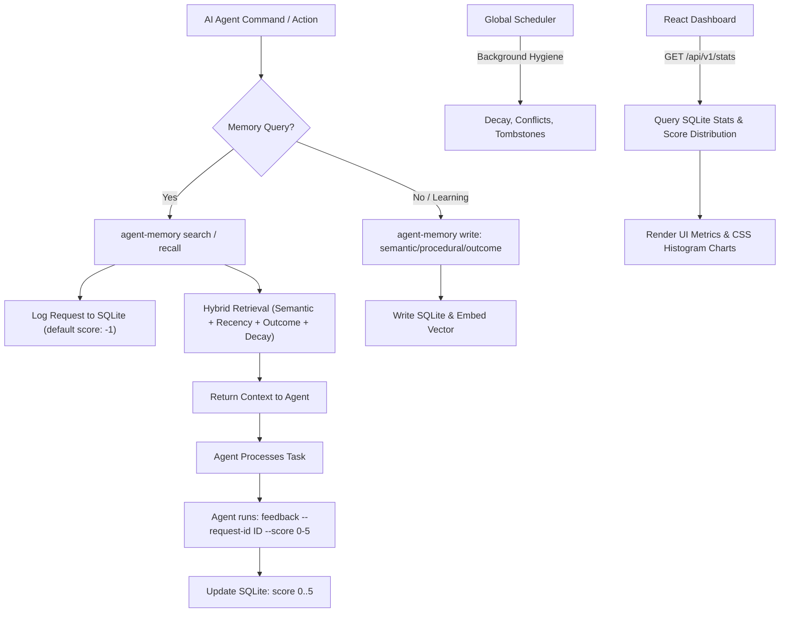

# Agent Memory & Benchmark System

This directory contains the end-to-end benchmark pipeline and documentation for the **Agent Memory** system.

---

## Why We Need This Memory System (The Problem It Solves)

AI coding agents often struggle with three critical limitations:
1. **Context Window Amnesia**: Agents forget how they solved a problem in a previous session, leading to duplicate effort and repeating past mistakes.
2. **Context Window Bloat**: Feeding entire files or logs into LLM contexts is extremely expensive, slow, and causes "lost in the middle" attention degradation.
3. **Lack of Self-Improvement and Feedback**: Agents have no mechanism to package repeatable workflows (skills) or evaluate how helpful their retrieved knowledge actually was.

### The Solution: Agent Memory
This system provides a persistent, self-governing memory castle. It introduces:
* **Hybrid Retrieval**: Computes relevance using semantic similarity, recency bias, outcome relevance, and exponential decay.
* **Closed-Loop Feedback**: Forces agents to score the quality of each search or recall on a `0` (useless) to `5` (extremely helpful) scale, logging metrics directly to a local SQLite database.
* **Self-Aware Skill Packager**: Automatically packages recurring patterns, scripts, and workflows into reusable skills.
* **Global Hygiene Scheduler**: Runs in the background to handle memory consolidation, decay updates, conflict resolution, and memory eviction.

---

## Core System Architecture



---

## Most Valuable Features

* **Strict Honest Feedback Scoring**: Forces agents to score context usefulness dynamically. The rules explicitly instruct agents to score `0` for irrelevant queries and `5` for direct solutions, preventing lazy high-score bias.
* **Real-time Web Dashboard**: Visualizes memory metrics, active workspaces, and weekly/monthly/yearly rolling feedback score averages with a built-in CSS histogram/chart.
* **Mac OS Safe Self-Upgrades**: Atomic replacement logic safely unlinks active binary inodes before renaming, preventing codesigning violations (AMFI SIGKILL/Exit code 137) on macOS.
* **Multi-Client Rules Auto-Deployment**: Automatically generates custom rules files for **all** popular AI clients/IDEs (Cursor, Claude Code, Trae, Windsurf, VSCode, Kiro hooks) in a single command.

---

## Installation Guide

### 1. Build and Install Locally
Compile the Go binary with the embedded dashboard assets:
```bash
make embed-dashboard
make build
```

Copy the compiled binary to your local bin path and apply codesigning (crucial for macOS):
```bash
rm -f ~/.local/bin/agent-memory
cp bin/agent-memory ~/.local/bin/agent-memory
codesign --force --sign - ~/.local/bin/agent-memory
```

### 2. Deploy Rule Files to Workspace Projects
Deploy rule files for **all** editor targets (Cursor, Windsurf, Trae, Claude CLI, Kiro hooks) in your project workspace:
```bash
cd /path/to/your/project
agent-memory reinstall --ide all
```

---

## Commands to Use (CLI Reference)

### Query Memory
* **Semantic Search**: Find relevant context across the workspace:
  ```bash
  agent-memory search --query "keychain autofill fix"
  ```
* **Task Recall**: Recover details on how a past task was implemented:
  ```bash
  agent-memory recall --task "configure textContentType on securefields"
  ```

### Give Feedback
* **Submit Score**: Rate the usefulness of the returned `request_id` from `0` to `5`:
  ```bash
  agent-memory feedback --request-id "316ac5f0-52b4-4cd8-8875-b81a2b726dd8" --score 5
  ```

### Write Memory
* **Semantic Fact**:
  ```bash
  agent-memory write --type semantic --content "Master password fields need textContentType(nil) on macOS."
  ```
* **Outcome Log**:
  ```bash
  agent-memory write --type outcome --content "Attempted Keychain Autofill fix (result: success, approach: nil content type, reason: avoids sandbox violations)."
  ```

### Background Daemon & UI
* **Start Server**: Run the API daemon and launch the dashboard:
  ```bash
  agent-memory serve --start
  ```
* **Stop Server**:
  ```bash
  agent-memory serve --stop
  ```

---

## E2E Benchmark Pipeline

This directory contains deterministic validation tools to run quality tests on the memory retrieval system.

### Dataset Shape
* `200` prior-session fixtures
* `10,000` labeled test cases across `25` topic clusters

### Benchmark Workflow
1. **Generate Labeled Inputs**:
   ```bash
   python3 benchmark/generate_benchmark.py
   ```
2. **Run Validation Slice (25 Cases)**:
   ```bash
   bash benchmark/run_benchmark.sh --run-id check --case-limit 25 --skip-build
   python3 benchmark/score.py --run-dir benchmark/results/check --db benchmark/results/check/benchmark.db --ingest
   ```
3. **Clean Benchmark History**:
   ```bash
   python3 benchmark/clean_results.py
   ```
4. **Run Labeled Test Suite**:
   ```bash
   python3 -m unittest benchmark.test_benchmark
   ```
