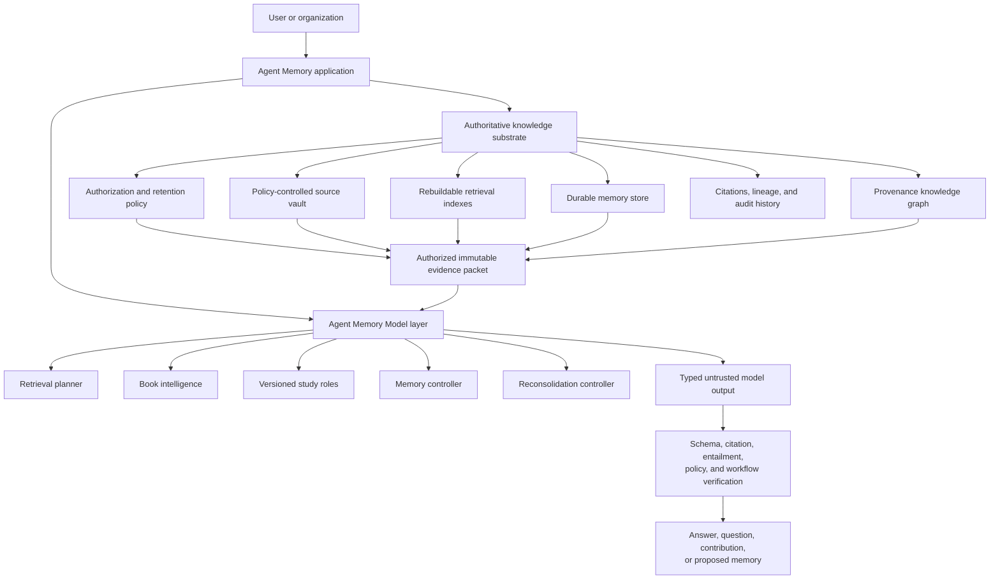

# Agent Memory Model: System and Training Design

**Status:** Approved direction; foundation implementation started  
**Principle:** Do not put the library inside the model. Build a model that knows how to operate the library.  
**Related:** [Living Knowledge Library](living-knowledge-library-design.md), [Whole-Book Ingestion](whole-book-ingestion-and-study.md), [Implementation Backlog](living-knowledge-library-tasks.md)

## 1. Objective

Build a provider-independent Agent Memory Model layer that learns how to retrieve, study, discuss, verify, retain, and reconsolidate knowledge while the external Agent Memory substrate remains authoritative.

The model layer may:

- plan authorized retrieval across books, memories, graphs, conversations, and projects
- execute narrow study roles against bounded evidence
- propose typed claims, summaries, questions, connections, and syntheses
- propose memories and consolidation actions
- learn from verified and human-reviewed outcomes

The model layer may not:

- treat its weights as the database for user or organization knowledge
- grant itself access to sources or memories
- create verified citations by assertion
- directly perform privileged workflow transitions
- silently promote its outputs to approved organizational knowledge

Success means the system can replace model providers without migrating knowledge, train specialized models from consented verified examples, and evaluate every model output against deterministic provenance and authorization contracts.

## 2. Architectural Boundary



The knowledge substrate remembers. The model reasons over explicitly supplied evidence. Model output is data until validated.

## 3. Model Capabilities

### 3.1 Retrieval planner

Input:

- question or task
- authorized scope identities
- available evidence kinds
- conversation and study mode
- latency and token budgets

Output:

- query intent
- required source scopes
- memory types and knowledge forms
- lexical, semantic, structural, and graph retrieval operations
- diversity and evidence thresholds
- requested workflow template

The planner cannot broaden authorization. Storage and retrieval validate every requested scope independently.

### 3.2 Book intelligence

Against source-addressable passages, the model can propose:

- claims and arguments
- definitions and concepts
- entities and examples
- short-quote spans
- section and chapter summaries
- study questions
- provisional relationships

Authoritative quote text is copied from resolved source spans after selection. The model never supplies final verified quote text from memory.

### 3.3 Memory controller

The controller recommends whether an interaction should become:

- conversation archive only
- episodic memory
- proposed semantic or procedural knowledge
- an open question
- a clarification, contradiction, or supersession of existing memory

Retention policy and human or curator review decide whether the proposal becomes durable.

### 3.4 Role executor

One model may execute multiple isolated versioned profiles:

```text
scholar       → faithfully represent the source position
critic        → test assumptions and identify counterarguments
questioner    → produce comprehension and reflection questions
domain expert → add separately attributed external context
connector     → relate authorized books, concepts, and projects
synthesizer   → combine verified contributions without erasing disagreement
```

Role identity, profile version, evidence-packet fingerprint, model version, and output schema are recorded with every contribution.

### 3.5 Reconsolidation controller

The model may propose:

- duplicate grouping
- clarification
- contradiction
- supersession
- compact synthesis
- stale-knowledge review

It cannot overwrite historical memory or delete citation lineage. Reconsolidation produces new versioned records and derivation edges.

## 4. Model Request and Response Contracts

Provider adapters implement a narrow inference boundary:

```go
type Model interface {
    Generate(ctx context.Context, request Request) (Response, error)
}

type Request struct {
    Task           TaskKind
    Profile        ProfileRef
    EvidencePacket EvidencePacket
    OutputSchema   SchemaRef
    Budget         Budget
}

type Response struct {
    Contributions []Contribution
    Usage         Usage
    Model          ModelIdentity
}
```

Requests contain immutable evidence references and bounded content. Responses contain typed proposals. Neither provider-specific prompts nor raw completion payloads become domain models.

Every request records:

- task kind and workflow node
- principal and authorization-snapshot fingerprint
- evidence-packet fingerprint
- profile and schema versions
- model provider, family, and version
- sampling and budget parameters
- idempotency key and trace ID

Every response records:

- typed contributions
- citations and derivations claimed by the model
- confidence and uncertainty
- usage, latency, and finish reason
- validation and verification outcomes

## 5. Deterministic Responsibilities

The following remain outside generative models:

- file and passage fingerprinting
- work, edition, source, and locator identity
- source-span resolution
- exact quotation comparison
- quote-length policy enforcement
- authorization and tenant isolation
- deletion and retention enforcement
- workflow transitions and retry limits
- idempotency and audit history
- schema validation
- index versioning and rebuilds

Learned rerankers and entailment classifiers may assist verification, but their verdicts remain versioned records subject to policy thresholds and evaluation.

## 6. Training Strategy

### 6.1 Train methods, retrieve private facts

Shared model weights learn how to plan, classify, extract, question, synthesize, and consolidate. Private user and organization facts remain external and arrive through authorized evidence packets at inference time.

Private books, conversations, notes, and memories are excluded from shared training by default.

### 6.2 Training example classes

High-value examples include:

| Input | Supervision |
|---|---|
| Question and available scopes | Accepted retrieval plan |
| Passage | Verified claim and attribution |
| Passage and unsupported proposal | Rejection and entailment verdict |
| Passage and quote span | Exact resolved quote and locator |
| Conversation | Accepted, edited, or rejected memory proposal |
| Conflicting contributions | Derivation-preserving synthesis |
| Retrieved memory | Later helpful, ignored, rejected, or harmful outcome |
| Existing and new memory | Duplicate, clarification, contradiction, or supersession label |

Negative examples are essential. The model must learn when evidence is insufficient and when no durable memory should be created.

### 6.3 Data eligibility

Every potential training example carries:

- owner and organization
- consent and permitted training purpose
- source license and retention constraints
- sensitivity classification
- de-identification status
- provenance and verification state
- dataset and example version
- revocation and deletion linkage

Only examples passing an explicit dataset policy enter training exports. Organization-specific adaptation remains isolated from shared improvement datasets.

### 6.4 Training progression

1. Use provider models behind the stable contract and collect verified outcomes.
2. Train narrow classifiers and rerankers with measurable targets.
3. Fine-tune a multi-task role and memory-controller model.
4. Distill expensive verified workflows into smaller operational models.
5. Consider organization-specific adapters for method and vocabulary, not private fact storage.

Pretraining a general foundation model is not required for this product direction.

## 7. Evaluation

### 7.1 Retrieval planning

- authorized-scope precision and recall
- evidence coverage
- unnecessary retrieval operations
- latency and token budget adherence
- zero unauthorized scope expansion

### 7.2 Extraction and study

- claim entailment
- attribution accuracy
- quote-span exactness
- definition and entity accuracy
- hierarchical-summary faithfulness
- graph-edge acceptance rate

### 7.3 Memory control

- proposal acceptance and edit rates
- duplicate and conflict classification accuracy
- later retrieval usefulness
- harmful or misleading memory rate
- citation-lineage preservation

### 7.4 Role workflows

- profile compliance
- unsupported-contribution rejection
- disagreement preservation
- question usefulness and difficulty
- synthesis faithfulness
- cost and latency by role and workflow

Model upgrades require regression evaluation against fixed, licensed or synthetic corpora and shadow comparison against the active model before promotion.

## 8. Runtime Routing

Use the smallest workflow that can answer reliably:

```text
Simple lookup
retrieval → scholar → verifier

Interpretation
retrieval → scholar + critic → verifier → synthesis

Cross-book study
retrieval per book → scholars → connector → verifier → synthesis

Assessment
questioner → learner response → evaluator → learning-gap proposal
```

Routing considers task complexity, evidence conflict, requested mode, model availability, cost, and policy. Users may explicitly request deeper study. The controller cannot choose a workflow whose roles require unavailable evidence or permissions.

## 9. Failure and Safety Model

- Fail closed when authorization or evidence identity is missing.
- Preserve partial role contributions with explicit incomplete status.
- Bound retries, fan-out, wall time, and token usage.
- Never repair an unsupported citation silently.
- Label model background knowledge separately from source-grounded claims.
- Prevent cached responses from crossing authorization or evidence-packet fingerprints.
- Keep source content out of default logs and traces.
- Make model-provider outages degrade to retrieval-only results where useful.

## 10. Tech Stack and Project Structure

The first implementation uses the existing Go module and SQLite storage. Model providers remain behind interfaces and require no new dependency for the contract slice.

```text
internal/core/          attribution, knowledge form, derivation, policy
internal/intelligence/  provider-neutral model and task contracts
internal/readingroom/   profiles, evidence packets, workflows, verification
internal/retrieval/     authorized retrieval planning and execution
internal/engine/        memory proposals and reconsolidation
internal/storage/sqlite audit, feedback, and training-example eligibility
evaluation/             fixed model and workflow evaluation corpora
docs/                   architecture, training, operation, and policy
```

Commands:

```bash
go test ./internal/core ./internal/intelligence ./internal/readingroom
go test ./...
go vet ./...
go build ./...
```

## 11. Code Style

Domain code uses explicit string enums, validation at trust boundaries, provider-independent interfaces, contextual errors, and JSON-compatible contracts:

```go
type KnowledgeForm string

const (
    KnowledgeClaim     KnowledgeForm = "claim"
    KnowledgeQuote     KnowledgeForm = "quote"
    KnowledgeSynthesis KnowledgeForm = "synthesis"
)

func (p Provenance) Validate() error {
    // Reject incomplete or epistemically invalid combinations.
}
```

Tests assert outcomes rather than provider call sequences. Fakes are preferred over mocks at inference boundaries.

## 12. Testing Strategy

- Unit tests: enums, validation, canonicalization, routing, policy, and state transitions
- Integration tests: provider fake → typed output → verification → memory proposal
- Security tests: authorization, cache isolation, training eligibility, deletion, and tenant leakage
- Evaluation tests: retrieval, extraction, entailment, role compliance, memory usefulness, cost, and latency
- End-to-end tests: import book → ask → verify → propose memory → accept → recall later

Every behavior change begins with a failing test. Provider-network tests are not required for domain contract verification.

## 13. Engineering Boundaries

Always:

- keep the model replaceable and the knowledge substrate authoritative
- validate model output before it influences retrieval, memory, or workflow state
- preserve attribution, citations, derivation, authorization, and model version
- capture explicit human and verifier outcomes suitable for evaluation

Ask first:

- add a hosted provider or external model dependency
- export private or organization data for training
- enable automatic memory promotion
- introduce organization-specific fine-tuning
- change retention or deletion defaults

Never:

- train shared weights on private content without explicit eligible consent
- represent model confidence as verification
- allow model-generated IDs to grant access
- store unrestricted books in ordinary memory or training exports
- erase historical lineage during consolidation

## 14. Ordered Implementation Plan

### Stage 1: Epistemic and trust contracts

1. Separate attribution, knowledge form, and derivation.
2. Add principals, authorization scope, and retention policy.
3. Add claim-evidence verification records.
4. Add versioned profile enforcement.
5. Add canonical evidence-packet fingerprints.

### Stage 2: Provider-neutral intelligence boundary

1. Define task, request, response, model identity, usage, and budget contracts.
2. Implement an in-process fake model for deterministic tests.
3. Add schema-validation and audit envelopes.
4. Implement simple workflow routing.

### Stage 3: Verified runtime workflows

1. Implement direct-study retrieval and scholar execution.
2. Gate claims and quotes through verification.
3. Propose memories through retention policy.
4. Add seminar roles and bounded workflow execution.
5. Record helpful, edited, rejected, and harmful outcomes.

### Stage 4: Dataset and evaluation pipeline

1. Define training-example eligibility and revocation.
2. Export consented verified examples without restricted content leakage.
3. Build fixed evaluation corpora and release thresholds.
4. Compare provider and specialized model versions in shadow mode.

### Stage 5: Specialized models

1. Train retrieval-intent and memory-action classifiers.
2. Train evidence rerankers and entailment models.
3. Fine-tune a multi-role model against typed evidence packets.
4. Distill verified workflows into smaller models.

## 15. Initial Slice Success Criteria

The first code slice is complete when:

- attribution, knowledge form, and derivation are separate validated types
- a direct quote without cited source attribution is rejected
- an author claim without a citation is rejected
- a synthesis without derivation links is rejected
- existing memory types and lifecycle behavior remain unchanged
- reading-room contributions use the corrected provenance contract
- focused tests, vet, and build pass

## 16. Open Decisions

- initial inference provider adapters
- first narrow model selected for fine-tuning
- dataset consent UI and organization administrator policy
- evaluation thresholds required before automatic retention
- whether organization adapters use LoRA, prompt/profile packages, or retrieval-only customization
- deployment targets for local and hosted inference

