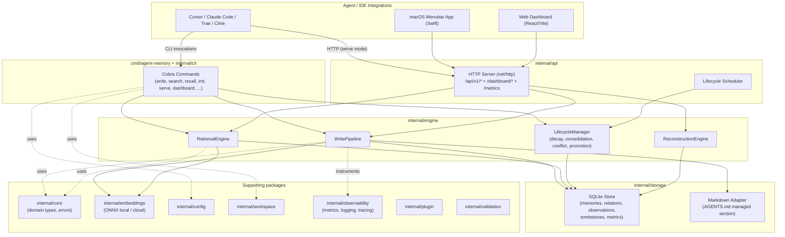

# agent-memory — System Design & Project Review

*Reviewed: local repository at `$HOME/timebooks/agent-memory` (Go 1.26, module `github.com/taimufuraiyaa/agent-memory`)*

---

## Part 1 — System Design

### 1. Purpose

`agent-memory` is a local-first, persistent memory layer for AI coding agents (Cursor, Claude Code, Trae, Cline, etc.). It runs as a single Go binary that exposes a CLI, an embedded HTTP API + dashboard, and writes to per-workspace SQLite databases under `~/.agent-memory/`. Its job is to let an agent "remember" facts, procedures, outcomes, and episodic context across sessions, retrieve the most relevant subset under a token budget, and let that memory decay/consolidate/forget over time like a biological memory system.

### 2. High-Level Architecture



### 3. Domain Model (`internal/core`)

The canonical record is `MemoryEntry`, with these key axes:

- **Memory types** (different decay half-lives): `episodic` (7d), `semantic` (30d), `procedural` (90d), `outcome` (60d).
- **Storage tiers**: `markdown` (always-loaded, zero retrieval cost), `vector` (SQLite + embeddings), `vector+graph` (vector + relationship traversal), `document` (cold FTS5 archive), `cold` (tombstoned/evicted).
- **Relations**: typed graph edges (`calls`, `depends_on`, `contains`, `contradicts`, `supersedes`, `led_to`, `derived_from`) with weights and metadata.
- **Lifecycle fields**: `DecayScore`, `SalienceScore`, `SuppressionScore`, access/feedback counters (`UsefulCount`, `IgnoredCount`, `RejectedCount`, `HarmfulCount`), `Pinned`, `SupersededBy`, `PromotedAt`/`DemotedAt`.
- **Tombstones**: compact breadcrumbs left after eviction, used by the `ReconstructionEngine` for "tip of the tongue" recovery.
- **Errors**: sentinel + typed errors (`ErrNotFound`, `WorkspaceError`, `StorageError`, `EmbeddingError`, `RetrievalError`, `ValidationError`) wrapped with `%w` throughout.

### 4. Module Map

| Package | Approx. size | Responsibility |
|---|---|---|
| `cmd/agent-memory` | tiny | Entry point, delegates to `internal/cli` |
| `internal/cli` | ~196 KB, 26 files | Cobra command tree: write/search/recall/session-end/study/export/import/stats/tuning/config/init/list/delete/serve/dashboard/upgrade |
| `internal/api` | ~194 KB, 12 files | `net/http` server (`server.go`, 83 KB single file), DTOs, scheduler, ops dashboard HTML, visualization endpoints |
| `internal/engine` | ~255 KB, 48 files | Write pipeline, retrieval/scoring, decay, consolidation (shallow + deep), conflict resolution, recall gating/assembly, token clipper, reconstruction, export, query cache |
| `internal/storage/sqlite` | ~149 KB, 18 files | SQLite persistence: memories, relations, observations, sessions, tombstones, token/LLM usage metrics, benchmark runs, migrations |
| `internal/storage/markdown` | (small) | Atomic, budget-aware `AGENTS.md` managed section |
| `internal/embeddings` | ~59 KB, 16 files | Provider interface; local ONNX (all-MiniLM-L6-v2) + tokenizer; OpenAI/cloud stub; mock for tests |
| `internal/workspace` | ~51 KB, 2 files | Workspace registry (`~/.agent-memory/workspaces.json`), init/rename/delete, IDE rule file generation |
| `internal/config` | ~45 KB, 6 files | Unified `Config` struct, YAML load/merge/validate, adaptive tuning policy |
| `internal/observability` | ~27 KB, 4 files | Prometheus metrics (28 metrics), structured `slog` logging, OpenTelemetry tracing |
| `internal/plugin` | ~38 KB, 7 files | Plugin registry + lifecycle hooks + embedding-provider plugin interface |
| `internal/validation` | ~20 KB, 4 files | Workspace-name/path/content/diagram validation, anti path-traversal |
| `internal/bootstrap` | ~22 KB, 4 files | Model download, ONNX runtime install, dashboard install (used by `install.go`) |
| `pkg` | 1 file (`doc.go` only) | Empty placeholder, currently unused |
| `tools/agent-memory/dashboard` | React + Vite + D3/Cytoscape | Dashboard frontend (`App.tsx` is 134 KB / `styles.css` 88 KB) |
| `tools/agent-memory/menubar` | Swift | macOS menubar controller wrapping the CLI/service |
| `tools/agent-memory/mcp-server` | scaffold only | "Deferred V1.5+ MCP shim package scaffold" (just a `package.json`) |
| `examples/plugins` | 2 examples | `audit-logger` (lifecycle plugin), `custom-embedder` (embedding plugin) |
| `benchmark/` | Python + shell + Swift | Recall/token-savings benchmark harness, scorer, results |
| `.kiro/` | specs/steering/guides | Spec-driven development artifacts ("specs-first" workflow enforced via `CLAUDE.md`) |

### 5. Key Data Flows

**Write path** (`engine.WritePipeline.Write`):
1. Validate workspace name, content length, diagram code (`internal/validation`).
2. Extract a Mermaid/PlantUML/Graphviz fenced diagram out of the content if present.
3. Run `SecurityFilter` (regex-based redaction/rejection of secrets/PII via `redact.go`/`security.go`).
4. Run the chosen `Extractor` (`fast` = whitespace/fence normalization; `llm-assisted` currently falls back to `fast`).
5. Estimate confidence (`EstimateConfidence`); reject low-confidence writes, tag medium-confidence ones.
6. Compute a content hash; `HybridRouter.Decide` picks the storage tier (markdown / vector / vector+graph / document) and importance.
7. Insert into SQLite (dedup via content hash → `ErrDuplicateContent`).
8. If an embedder is configured, embed the memory text and upsert the vector; roll back the insert on embedding failure.
9. If routed to `markdown`, upsert into the `AGENTS.md` managed section via the atomic markdown adapter.
10. **`inferRelationships`**: synchronously scans session memories (temporal `calls` edges within 1h), all workspace memories (entity-overlap `depends_on` edges via Jaccard similarity), and session outcomes (`led_to` edges from failures to a following success).
11. Invalidate the shared `QueryCache` for the workspace.

**Search / Recall path** (`engine.RetrievalEngine.Retrieve`, exposed via CLI `search`/`recall` and HTTP `/api/v1/memories/search`, `/recall`, `/recall/preview`):
1. Generate a candidate set via vector similarity (`VectorSearcher`) plus optional filters (type, tier, confidence, entities, date range).
2. Score each candidate with weighted signals: semantic similarity, recency, decay (inverted), outcome boost, tier bias, salience, suppression — weights vary per mode (`search`, `recall`, `relate`, `outcomes`, `graph-expand`).
3. Bucket results into `strong_hits` / `weak_hits` / `suppressed_hits` using configurable thresholds (`min_semantic_score`, `min_total_score`, `relative_cutoff`).
4. **Recall mode** additionally: runs `DecideRecallGate` (continuation-prompt detection + "is search alone sufficient" probe), optionally augments with `ReconstructionEngine` output for tombstone-backed gaps, rebalances hits (`RebalanceRecallHits`), and clips to a token budget via `TokenClipper`, returning a stable, sectioned `context_block` plus a `clipping` report of what was dropped and why.
5. `explain=true` returns a full score breakdown (`semantic_similarity`, `recency`, `outcome_boost`, `decay_weight`, `tier_bias`, `salience`, `suppression`, `activation`, `relative_to_best`, `total`).

**Lifecycle / "REM cycle"** (`engine.LifecycleManager`, invoked via CLI `agent-memory consolidate`/lifecycle commands or the API scheduler):
- **Decay engine**: `decay = exp(-ln2 * age / halfLife)` adjusted by access/pin/outcome boosts.
- **Consolidation engine**: clusters similar episodic memories above an overlap threshold and merges them into semantic facts with `derived_from` edges.
- **Deep consolidation engine**: cross-type pattern mining (repeated failure patterns, procedural extraction).
- **Conflict engine**: detects `contradicts` relations, resolves by confidence/recency/feedback, marks the loser `superseded_by`.
- **Promotion/demotion**: moves memories between tiers based on value, enforces the markdown-tier token budget, and evicts fully decayed memories to `cold` with a tombstone.

**Reconstruction**: on a "tip of the tongue" query (no strong hits but a matching tombstone), proposes a lower-confidence reconstructed semantic memory from tombstone + related memories, with loop-prevention via `reconstruction_lineage`.

### 6. Storage & File Layout

```
~/.agent-memory/
├── config.yaml                 # user-level config
├── agent-memory.env             # toggle-on/off, run-label (written by --toggle-on/off)
├── workspaces.json               # registered workspaces
├── models/all-MiniLM-L6-v2/      # local ONNX embedding model (downloaded on first use)
├── onnxruntime/                  # ONNX runtime binaries
└── <workspace>.db                # one SQLite DB per workspace (WAL mode)

<project-root>/
├── .agent-memory.yaml            # optional per-workspace config override
├── AGENTS.md (or similar)        # markdown tier managed section
└── .cursor/rules/agent-memory.mdc, .trae/rules/..., CLAUDE.md, etc. (generated IDE rule files)
```

SQLite tables: `memories`, `memory_relations`, `memory_outcomes`, `memory_documents` (FTS5), `tombstones`, `reconstruction_lineage`, `observations`, `sessions`, `llm_usage_metrics`, `benchmark_runs`, plus `schema_migrations`.

### 7. Distribution & Tooling

- **CLI binary** via `go install ./cmd/agent-memory`, a Homebrew "source tap" Formula, or `install.go` (+ `install_unix.go`/`install_windows.go`) which downloads the ONNX model and runtime.
- **Dashboard**: React/Vite app under `tools/agent-memory/dashboard`, pre-built and embedded into the Go binary via `go:embed` (`internal/api/dashboard`), served at `/dashboard/`. CLI `agent-memory dashboard` starts/stops a background server with PID files.
- **Menubar app**: Swift package under `tools/agent-memory/menubar` that wraps the CLI/service for a macOS tray icon.
- **MCP server**: currently just a scaffold package (`tools/agent-memory/mcp-server/package.json`), marked "Deferred V1.5+".
- **Observability**: `/metrics` (Prometheus), `/health`, OpenTelemetry tracing (stdout exporter by default), structured `slog` logging.
- **Release pipeline**: `.github/workflows/release.yml` cross-builds 4 platform binaries on tag push and attaches them to a GitHub Release. There is **no CI workflow that runs `go test`/`golangci-lint` on PRs/pushes**, despite a `.golangci.yml` and `.pre-commit-config.yaml` existing.

### 8. Cross-Cutting Concerns

- **Config precedence** (intended): defaults < `~/.agent-memory/config.yaml` < `.agent-memory.yaml` (workspace) < env vars < CLI flags. Implemented in `internal/config/config.go` (see correctness issue below).
- **Security/Privacy**: local-first, no telemetry; `internal/engine/redact.go` + `security.go` scan for secrets (`sk-`, `ghp_`, etc.), private keys, credit cards, emails on write; dashboard binds `127.0.0.1` by default; `SECURITY.md` + `docs/security.md` document the threat model.
- **License**: custom non-commercial license (`LicenseRef-Non-Commercial`), copyright Duong Nhat Thinh / timebooks.io / in2blockchain.com.

---

## Part 2 — Findings & Suggestions

### A. Correctness issues (fix first)

1. **Config boolean-merge bug silently disables features once any config file exists.** In `internal/config/config.go`, `merge*` functions use patterns like:
   ```go
   if other.AutoVacuum != c.Storage.AutoVacuum {
       c.Storage.AutoVacuum = other.AutoVacuum
   }
   ```
   Because Go's zero value for an unset YAML boolean is `false`, and several defaults are `true` (`Enabled`, `Storage.AutoVacuum`, `Embeddings.CacheEnabled`, `Dashboard.Enabled`, `Server.EnableCORS`, `Observe.Enabled`, `Adaptive.Enabled`), **loading *any* config.yaml — even one that never mentions these fields — flips every one of these flags to `false`.** The top-level `Enabled` merge has an extra guard (`&& other.Enabled == false`) but it has the *same* effect: any file load sets `Enabled = false` unless the file explicitly contains `enabled: true`. Net effect: running `agent-memory config init` and then using the resulting config file likely disables the whole memory system, auto-vacuum, CORS, caching, observability, and adaptive tuning at once.
   - **Fix**: switch `Config`'s boolean (and other zero-value-ambiguous) fields in the *file-overlay* struct to pointer types (`*bool`, `*int` where 0 is a valid override) so "absent" can be distinguished from "explicitly false/zero", or parse into a `map[string]any`/`yaml.Node` and only set fields that were present in the document.
   - Add a regression test that loads a config file containing only `dashboard.port: 9999` and asserts every other default is preserved.

2. **`/dashboard/` route is permanently dead/stubbed despite "Task 3.4: dashboard embedding — COMPLETED".** `internal/api/dashboard/assets.go` correctly implements `go:embed` + `GetEmbeddedHandler()`, and `internal/api/dashboard/dist/` contains built assets — but `internal/api/server.go`'s `serveDashboard()` is still a placeholder:
   ```go
   func serveDashboard() http.Handler {
       // return http.StripPrefix("/dashboard/", dashboard.GetEmbeddedHandler())
       return http.StripPrefix("/dashboard/", http.HandlerFunc(func(w http.ResponseWriter, r *http.Request) {
           http.Error(w, "Dashboard assets not yet embedded. Run: make build-with-dashboard", http.StatusNotFound)
       }))
   }
   ```
   So every request to `/dashboard/*` returns 404 regardless of whether assets are embedded. **Fix**: wire `serveDashboard()` to `dashboard.GetEmbeddedHandler()` (with a fallback message only if `dashboard.HasEmbeddedAssets()` is false), add an HTTP test hitting `/dashboard/` and asserting a 200.

3. **`debug-dashboard-scheduler-sync.md` documents an apparently-unresolved or partially-resolved live bug** (dashboard `/api/v1/stats` reporting `scheduler: null` due to PID-path mismatches between `internal/api/server.go`'s fallback and `internal/cli/serve_command.go`'s actual PID filenames, plus a workspace-scoped `serve` binding to the wrong placeholder DB path causing `ping sqlite: unable to open database file (14)`). The "Applied Fix" section only addresses the dashboard CLI's PID fallback for `--status`/`--stop`, not the two server-side root causes (`externalServePIDCandidates` path/name mismatch in `server.go`, and `listManagedWorkspaces()` returning the placeholder `DBPath`). **Verify both root causes are actually fixed in `server.go`/`serve_command.go`**, add regression tests for "dashboard reports scheduler enabled when `serve` is running externally", then delete this scratch file from the repo.

4. **`internal/cli/commands.go` parity with `internal/api/server.go` recall handlers**: `/api/v1/memories/recall` and `/api/v1/memories/recall/preview` (and its alias `/recall-preview`) duplicate ~150 lines of identical gating/reconstruction/rebalancing logic. Any future bug fix (e.g., item 3 above, or recall-gate tuning) has to be applied twice — a likely source of drift. **Fix**: extract a shared `runRecall(ctx, svc, ws, params) (*RecallResult, error)` helper used by both handlers (and by the CLI `recall_runtime.go`, which likely has a third copy).

### B. Repository hygiene — files to remove or `.gitignore`

The working tree currently carries **~91 MB of binary/build artifacts and several scratch/debug files** that don't belong in source control:

| Path | Size | Notes |
|---|---|---|
| `/agent-memory` (repo root) | 22.0 MB | Compiled binary at repo root — **not covered by `.gitignore`** (only `bin/`, `.build`, `*.out` are ignored; a bare `agent-memory` file isn't). Remove and verify it isn't tracked (`git rm --cached agent-memory` if it is). |
| `/install.go.backup`, `/install.go.backup-final` | 32.6 KB + 32.9 KB | Pre-refactor copies of `install.go` left over from Task 1.2. Pure clutter — delete. |
| `/err.log`, `/out.log` | tiny | Leftover dashboard stdout/stderr capture from a manual debugging session. `*.log` *is* gitignored, but they shouldn't be sitting in the repo root at all — delete and/or write debug logs to a tmp dir. |
| `/debug-dashboard-scheduler-sync.md` | 3.95 KB | Scratch debugging notes (see A.3) — resolve and delete, or move into `.kiro/` debugging area if you want to keep the trail. |
| `/test_cli.swift`, `/test_race.sh` | 2.0 KB + 0.3 KB | Ad-hoc manual test scripts for the menubar binary and a dashboard start/stop race-condition probe, sitting at repo root in a Go project. If still useful, move into `tools/agent-memory/menubar/scripts/` or `scripts/debug/`; otherwise delete. |
| `/.build/checksums.go`, `/.build/test-binary` | 1 KB + 21.5 MB | One-off SHA256-checker for downloaded model files plus a 21 MB test binary. `.build` is gitignored, so this won't bloat the repo, but the `checksums.go` script looks like genuinely useful tooling (verifying model/runtime downloads) that's currently stranded in a gitignored, easy-to-lose directory — consider promoting it to `scripts/verify-model-checksums.go` if it's part of the supported workflow. |
| `/bin/agent-memory` (26.6 MB), `/benchmark/bin/agent-memory-benchmark` (21.3 MB) | — | Both under gitignored `bin/` dirs — fine, but worth a `make clean` / `.gitignore` audit to ensure neither ever gets committed accidentally (a 22 MB root-level binary suggests it has happened before). |
| `/benchmark/__pycache__/` | — | Not covered by any existing `.gitignore` rule (`__pycache__/`, `*.pyc` aren't listed). Add them. |

### C. Architecture / code-quality

1. **`internal/api/server.go` is an 83 KB, single-file HTTP server** registering ~25 routes inline inside one giant `NewMux` function, with large anonymous closures duplicating request-parsing/validation logic (search filters, recall, recall-preview, observe, etc.). **Suggestion**: split into per-domain files (`server_memories.go`, `server_recall.go`, `server_projects.go`, `server_observe.go`, `server_scheduler.go`, `server_stats.go`, `server_visualizations.go`), each registering its own routes via a small `Register(mux *http.ServeMux, svc *Service)` function called from `NewMux`. This is a pure refactor (no behavior change) but will make the recall-duplication fix in A.4 much easier and make the file reviewable.

2. **`internal/cli/commands.go` is 64 KB** — likely one file per Cobra command would mirror the existing pattern already used for `config_command.go`, `reembed_command.go`, `serve_command.go`, `tuning_command.go`, `upgrade_command.go`, etc. Splitting `commands.go` into `write_command.go`, `search_command.go`, `recall_command.go`, `export_command.go`, `import_command.go`, `stats_command.go`, `feedback_command.go`, etc. would bring it in line with the rest of the package and shrink the largest file by an order of magnitude.

3. **`tools/agent-memory/dashboard/src/ui/App.tsx` is 134 KB (and `styles.css` is 88 KB)** — a single React component file. This is hard to maintain, slow to hot-reload, and risks merge conflicts. **Suggestion**: split into feature-based components/hooks (e.g., `SearchPanel`, `RecallPreview`, `GraphView`, `DecayTimeline`, `TokenStats`, `WorkspaceSwitcher`, each with its own CSS module or scoped Tailwind/CSS-in-JS), with `App.tsx` reduced to layout/routing. The visualization backend (graph/decay-timeline/entity-network) already exists per `TASKS.md` 4.2 — pairing the frontend split with implementing those views would also close out that "ready for implementation" item.

4. **`pkg/` contains only a `doc.go`** and appears unused by any import. Either remove the directory (Go convention: `internal/` is correct for a CLI tool with no public library surface) or, if the intent is to expose a stable Go API for embedders/plugins, document that and move the relevant public interfaces (e.g., the plugin SDK types) there.

5. **`tools/agent-memory/mcp-server`** is a one-file scaffold (`package.json` whose `build` script just prints "ok"). If MCP support is genuinely deferred to "V1.5+", consider moving it out of the main tree (e.g., a `future/` or separate branch) so it doesn't appear as a half-finished surface to contributors; otherwise, track it explicitly in `TASKS.md`/`.kiro/specs`.

### D. Performance

1. **`WritePipeline.inferRelationships` runs synchronously on every write** and includes a full scan of *all* workspace memories via `ListMemoryLightweightForInference` for entity co-occurrence (`O(N)` per write, and the resulting bidirectional `AddRelation` calls are `O(N)` more DB writes in the worst case). For workspaces with thousands of memories, this turns every `agent-memory write` into an increasingly expensive operation, directly impacting the "fast inline write" use case the tool is designed for. **Suggestions**:
   - Cap the comparison set (e.g., only the most recently active N memories, or only memories sharing at least one entity via an indexed lookup rather than an in-memory scan).
   - Move relationship inference to the lifecycle/consolidation pass (async/batched) rather than the synchronous write path, or make it explicitly opt-in/feature-flagged for large workspaces.
   - Add a benchmark (the package already has `benchmark_test.go`) specifically for `Write` on a workspace with 10k+ memories to catch this regression going forward.

2. **Embedding failure rolls back via `DeleteByIDs` after relations may already be partially written** — `inferRelationships` runs *after* the embedding step succeeds, so this specific ordering is currently safe, but the write path overall isn't wrapped in a single DB transaction (insert memory → upsert vector → markdown upsert → infer relationships are four separate operations with manual best-effort rollback only for the first two). A crash between steps can leave a memory without its vector/relations or a markdown entry without its DB row. Consider wrapping steps 1–3 (and ideally 4) in `store.InTransaction` as the `doc.go` for `storage` describes is supported.

### E. Testing & CI

1. **No CI workflow runs `go test`, `go vet`, or `golangci-lint`** — `.github/workflows/release.yml` only builds release binaries on tag push. Given the project has 40+ benchmarks and extensive `_test.go` coverage (per `TASKS.md`), this is low-hanging fruit: add `.github/workflows/ci.yml` running `make test` (or `go test ./...`), `go vet ./...`, and `golangci-lint run` on every push/PR, plus `gofmt -l .` checks. This also gives the pre-commit hooks a server-side backstop for contributors who skip `pre-commit install`.
2. Consider adding a coverage gate (`go test -coverprofile`) and surfacing coverage % in PRs, since `.gitignore` already anticipates `coverage.out`/`coverage.html`.

### F. Documentation / project-management hygiene

1. **`TASKS.md` (33 KB) reports "100% complete (19/19 tasks)"** for what reads as the project's original cleanup backlog. Now that it's done, consider archiving it (e.g., `.kiro/progress/2026-tasks-complete.md` or `docs/changelog/`) and keeping `TASKS.md`/root-level docs focused on *current* open work, so new contributors aren't met with a 33 KB "everything is done" file at the project root.
2. **`.kiro/` contains `MERGE-COMPLETE.md`, `PROJECT-COMPLETE.md`, `final-project-summary.md`, `session-summary.md`** alongside the active `specs/`, `steering/`, `guides/`, `hooks/`, `progress/`, `templates/` directories. These status/summary files read as point-in-time session artifacts; if they're not living documents, move them under `.kiro/progress/archive/` (mirroring the `specs/archive/` pattern already established in Task 3.6) to keep `.kiro/`'s top level focused on the active spec-driven workflow described in `CLAUDE.md`.
3. **README is solid** but could link out to `docs/configuration.md`, `docs/security.md`, `docs/error-handling-guide.md`, etc. more prominently — currently they're only discoverable by browsing `docs/`.

### G. Security / privacy

1. `Server.AllowedOrigins` defaults to `"*"` with `EnableCORS: true` — combined with the dashboard binding to `127.0.0.1` this is low-risk for a local tool, but if `serve --addr` is ever bound to a non-loopback address (the CLI does support `--addr`), a wildcard CORS origin on an API that can read/write/delete memories and trigger lifecycle runs is worth tightening (default `AllowedOrigins` to `http://127.0.0.1:*`/`http://localhost:*` and require an explicit opt-in for `*`).
2. The redaction filter (`internal/engine/redact.go`/`security.go`) is regex-based; document its known limitations (e.g., it won't catch secrets in non-standard formats) in `docs/security.md` if not already covered, and consider adding it as a pre-write *and* pre-export check (export currently re-serializes raw `Content`, which should already be redacted at write time — confirm there's no path where un-redacted content can enter the DB, e.g., via `/api/v1/memories/import`).
3. `/api/v1/memories/import` accepts an `ExportBundle` and calls `UpsertMemory` for each entry without running it back through the `WritePipeline`'s security filter/validation — an imported bundle from an untrusted source could inject unredacted secrets or oversized content directly into the store, bypassing the protections in `validation.go` and `redact.go`. Consider routing imports through (or re-validating against) the same checks as `Write`.

### H. Other enhancements worth considering

1. **Finish the visualization frontend** (`TASKS.md` 4.2 says backend is done, frontend "ready for implementation") — the 3 new endpoints (`/visualizations/graph`, `/decay-timeline`, `/entity-network`) currently have no UI consumer.
2. **`internal/embeddings` OpenAI/cloud provider** is documented in `doc.go` as an option but the package listing shows only `local.go`/`onnx_*` — confirm whether a cloud provider implementation actually exists; if not, either implement it or adjust `doc.go`/`config.go` (which validates `provider` as `"local"` or `"openai"`) so the documented option matches reality, and add a clear error when `provider: openai` is selected but unimplemented.
3. **Adaptive config (`internal/config/adaptive_tuning.go`) vs. `internal/core/adaptive_tuning.go`** — there appear to be two adaptive-tuning files in different packages; confirm there's no duplication/drift between them (one may be the legacy pre-consolidation version per Task 2.2's "optional future enhancement: migrate existing code to use unified config").
4. Given the **non-commercial license**, double-check that all third-party dependencies (Go modules in `go.mod`, npm packages in the dashboard's `package.json`, the ONNX runtime, and the `all-MiniLM-L6-v2` model weights) have licenses compatible with redistribution under `LicenseRef-Non-Commercial` — some (e.g., model weights, ONNX runtime binaries) may carry their own license terms that should be listed in `SECURITY.md`/`LICENSE`/a `THIRD_PARTY_LICENSES` file.

---

## Quick-Win Checklist (highest impact / lowest effort first)

1. Fix the config boolean-merge bug (A.1) — likely affects every user who runs `config init`.
2. Wire up `serveDashboard()` to the already-built embedded assets (A.2) — one-line-ish fix, immediately makes a "completed" feature actually work.
3. Delete root-level scratch/binary files (B): `agent-memory` (22 MB), `install.go.backup*`, `err.log`, `out.log`, `test_cli.swift`, `test_race.sh`, `debug-dashboard-scheduler-sync.md` (after confirming its fix landed).
4. Add a CI workflow running `go test ./...`, `go vet`, and `golangci-lint` (E.1).
5. Add `__pycache__/`, `*.pyc` to `.gitignore` (B).
6. Route `/api/v1/memories/import` through validation/redaction (G.3).
