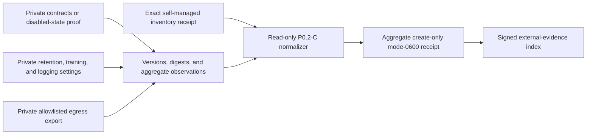

# External-integration data-purpose review evidence

P0.2-C applies only to the three explicit external business integrations:
payment processing, transactional email, and optional model APIs. Core
infrastructure remains self-managed. This collector validates evidence against
the exact enabled states in a self-managed platform inventory.



Exactly payment, email, and model must appear, and each enabled flag must match
the inventory. Disabled integrations must show zero approved fields and zero
requests. Enabled integrations require positive approved-field and sampled-
request coverage. Enabled but unsampled traffic is inconclusive. Any customer-
content bytes, unapproved fields, unallowlisted destinations, provider training,
or general logging fails readiness while remaining valid-unready evidence.

Keep provider names, endpoints, contracts, settings exports, traffic samples,
accounts, invoices, messages, prompts, passages, credentials, people, and
signatures in private immutable custody. Only opaque versions, SHA-256 digests,
fixed states, and aggregate counts enter the normalized files.

```sh
make saas-external-integration-check \
  PLATFORM_INVENTORY=/private/platform-inventory.json \
  EXTERNAL_INTEGRATION_INPUT=/private/external-integration-review.json \
  EXTERNAL_INTEGRATION_RECEIPT=/private/external-integration-receipt.json
```

Exit `0` is ready, `3` valid-unready, `2` invalid usage, and `1` invalid
evidence or I/O failure. The example proves shape only. P0.2-C remains open
until the exact installed contracts/settings and real egress exports are
retained immutably and Privacy and Security sign the dossier.
