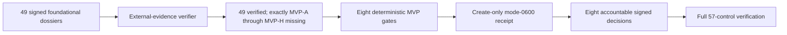

# Final MVP readiness evidence

This collector closes the repository-support gap between the 49 foundational
P0-P12 controls and the eight final MVP decisions. It does not approve launch.
It independently reruns the signed external-evidence verifier, derives eight
content-free gates, and creates the receipt that accountable owners review and
sign for MVP-A through MVP-H.



The ready pre-final state is intentionally not a ready full index. Every
non-MVP control must verify, while exactly the eight MVP controls must still be
missing. A fully ready index is rejected here because consuming it would make
the final MVP proof circular.

The gates bind these fixed groups:

- MVP-A: all 49 foundational controls.
- MVP-B: staging clients, all formats, internal alpha, and privacy journey.
- MVP-C: isolation, retrieval risk, penetration, and finding closure.
- MVP-D: recovery, integrations, identity, notice, deletion, operational, and
  repeated GA drills.
- MVP-E: cost envelope, load, capacity, billing, public-beta cost, and GA
  economics.
- MVP-F: launch scope, legal review, integration purpose, notice, retention,
  and privacy approval.
- MVP-G: deployment, rollback, game days, alerts, capacity, support, launch
  assets, public-beta approval, and GA approval.
- MVP-H: penetration, finding closure, blocker review, production integrity,
  public-beta gate, and GA approval.

Each gate digest covers its sorted prerequisite control IDs, availability
states, and verified dossier digests. Missing foundational decisions produce
an inconclusive valid-unready receipt; rejected or expired foundations fail
affected gates. Unsafe files, invalid signatures, changed dossiers, catalog
substitution, and contradictory expected readiness fail collection.

The shared path-based canonical verifier hashes and decodes catalog, index, and
trust JSON from their exact validated opened bytes, hashes and decodes approvals
from one stable directory/member snapshot, verifies signatures and all dossiers,
then revalidates those sources before returning the foundational report and four
source digests. The final-MVP collector consumes that single result instead of
reopening or independently hashing evidence metadata. Input JSON uses the same
exact-byte descriptor/path checks. If any source changes during collection,
exit `1` is returned and the completed immutable package must be retried.

```sh
make saas-mvp-readiness-check \
  EXTERNAL_EVIDENCE_CATALOG=/private/external-control-catalog.json \
  EXTERNAL_EVIDENCE_INDEX=/private/pre-final-index.json \
  EXTERNAL_EVIDENCE_ARTIFACTS_ROOT=/private/evidence-root \
  EXTERNAL_EVIDENCE_TRUST=/private/trust.json \
  EXTERNAL_EVIDENCE_APPROVALS_DIR=/private/approvals \
  MVP_READINESS_INPUT=/private/final-mvp-readiness.json \
  MVP_READINESS_RECEIPT=/private/final-mvp-readiness-receipt.json
```

Exit `0` means the 49-control foundation is ready, `3` means valid-unready, `2`
means invalid command usage, and `1` means invalid or unsafe evidence. The
receipt excludes dossier paths, evidence references, owners, people,
signatures, keys, and private contents.

After exit `0`, retain the receipt immutably and obtain eight current approvals
for MVP-A through MVP-H, each binding the receipt digest. Add those eight
entries and decisions to the external-evidence package and rerun the unchanged
57-control verifier. Only that final successful verification closes MVP.
