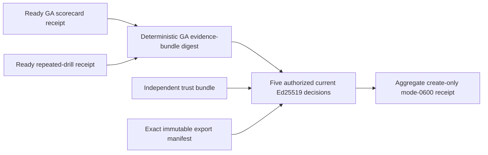

# Signed GA approval export evidence

P12.2-C verifies five current Ed25519 decisions—product, security, privacy,
legal, and operations—from a complete immutable export and independently
managed trust bundle. It reloads ready P12.2-A and P12.2-B receipts and derives
one digest from both; every approval must bind that same digest.



```sh
make saas-ga-approval-export-check \
  GA_SCORECARD_RECEIPT=/private/ga-scorecard-receipt.json \
  GA_DRILLS_RECEIPT=/private/ga-drills-receipt.json \
  APPROVER_TRUST_BUNDLE=/private/trust.json \
  GA_APPROVALS_DIR=/private/approvals \
  GA_APPROVAL_MANIFEST=/private/manifest.json \
  GA_APPROVAL_INPUT=/private/input.json \
  GA_APPROVAL_RECEIPT=/private/receipt.json
```

Exit `0` is ready, `3` valid-unready, `2` invalid usage, and `1` invalid
evidence or I/O failure. Examples prove shape only. Keep keys, signatures,
owners, evidence references, and the authoritative export outside application
storage and logs. Export reconciliation, file hashing, approval decoding, and
signature verification consume the same exact file bytes from one stable
directory snapshot; concurrent export changes fail closed and require a retry.
