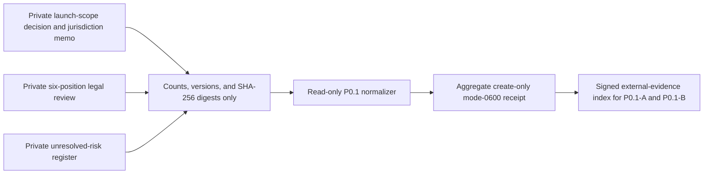

# Launch-scope and legal-position evidence

P0.1-A and P0.1-B require authoritative Product, Counsel, and Privacy decisions.
This read-only normalizer validates their content-free shape; it does not choose
a country, interpret law, author legal text, or approve a launch.



The private dossier must contain the actual launch-country list, selected
minimum age, support languages, notice jurisdictions, exact policy and copy
versions, legal analysis, risk descriptions, and accountable decisions. The
normalized input records only positive counts, the numeric minimum age, opaque
versions, fixed outcomes, timestamps, and artifact digests.

Exactly six legal positions cover rights attestation, source retention, rights
notice, deletion, backup, and audit retention. Exactly eight checks cover scope
approval, jurisdiction-memo completeness, minimum age, support coverage,
notice routing, legal-position review, risk reconciliation, and joint
Product/Counsel/Privacy review. Zero blocking and unowned risks plus all-passed
positions and checks are required for readiness. Complete failed or
inconclusive evidence remains valid-unready.

```sh
make saas-launch-scope-check \
  LAUNCH_SCOPE_INPUT=/private/launch-scope-input.json \
  LAUNCH_SCOPE_RECEIPT=/private/launch-scope-receipt.json
```

Exit `0` is ready, `3` valid-unready, `2` invalid usage, and `1` invalid
evidence or I/O failure. Store the receipt beside the authoritative artifacts,
then add separate signed external-evidence dossiers for `P0.1-A` and `P0.1-B`.
The repository example proves shape only and closes neither control.
