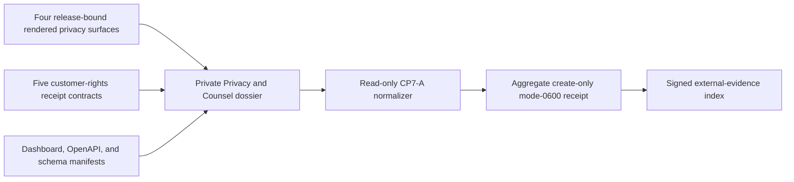

# Privacy and Counsel review evidence

CP7-A requires Privacy and Counsel to review the released customer-facing
retention and rights experience. Product tests do not constitute that approval.
This command normalizes a content-free private review manifest; it does not
render the UI, interpret law, sign a decision, or close CP7-A.



The fixed surfaces are `privacy_overview`, `source_custody`, `source_details`,
and `source_deletion`. The fixed contracts are `rights_attestation`,
`privacy_overview`, `source_deletion`, `account_deletion`, and
`portable_export`. The private dossier retains the rendered artifacts, exact
copy, schemas, compatibility and accessibility reviews, signatures, and signer
identity. The normalized receipt retains only opaque versions, timestamps,
outcomes, counts, and SHA-256 references.

Run the collector only after both reviews are complete:

```sh
make saas-privacy-review-check \
  PRIVACY_REVIEW_INPUT=/private/privacy-review-input.json \
  PRIVACY_REVIEW_RECEIPT=/private/privacy-review-receipt.json
```

Exit `0` means ready, `3` means valid-but-unready, `2` means invalid usage, and
`1` means invalid evidence or I/O failure. Output never includes copy, schemas,
paths, signers, signatures, keys, routes, payloads, or customer data. The local
input is decoded and hashed from the same bounded regular file descriptor whose
identity and size are checked before and after reading, so path replacement,
partial reads, unknown fields, and trailing JSON fail closed. The local
example proves only the normalizer shape; CP7-A stays open until a real released
bundle is reviewed, retained immutably, signed by Privacy and Counsel, and added
to the external-evidence dossier.
