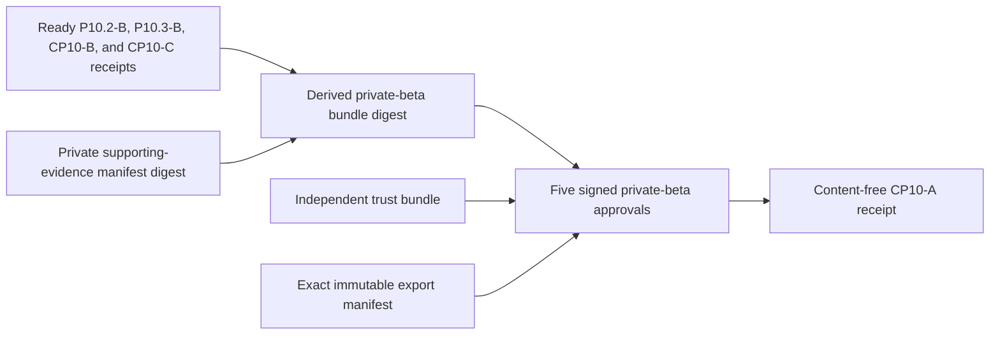

# Private-beta accountable approval export

CP10-A requires Legal, Operations, Privacy, Product, and Security to approve the
same invited-user evidence bundle. This collector verifies the immutable export
without reading staging, private dossiers, or customer data.



## Prepare evidence

1. Retain the four ready prerequisite receipts and private supporting dossier
   immutably. Hash the supporting-evidence manifest; do not copy its contents
   into the normalized input.
2. Compute the canonical evidence-bundle digest using the repository collector
   or equivalent canonical algorithm. Each approval must use gate
   `private_beta`, one of `legal_review`, `operations_review`, `privacy_review`,
   `product_review`, or `security_review`, and that same bundle digest as its
   `evidence_sha256`.
3. Export every approval JSON file into one dedicated directory. Declare every
   regular file and its digest in a manifest shaped like
   `private-beta-approval-export-manifest.example.json`.
4. Keep the Ed25519 trust bundle under independent custody. Each key must be
   scoped to the exact gate and control it may approve.
5. Create the aggregate review input from
   `private-beta-approval-export.example.json`. Example digests are synthetic;
   the private-beta bundle value must be recomputed from the exact four receipt
   bytes and supporting-manifest digest.

## Normalize

```sh
make saas-private-beta-approval-check \
  SECURITY_CLOSURE_RECEIPT=/private/security-closure-receipt.json \
  ALERT_EVIDENCE_RECEIPT=/private/alert-routing-receipt.json \
  BLOCKER_EVIDENCE_RECEIPT=/private/blocker-review-receipt.json \
  CAPACITY_EVIDENCE_RECEIPT=/private/capacity-receipt.json \
  APPROVER_KEYS=/private/trust.json \
  PRIVATE_BETA_APPROVALS_DIR=/private/approvals \
  PRIVATE_BETA_APPROVAL_MANIFEST=/private/export-manifest.json \
  PRIVATE_BETA_APPROVAL_INPUT=/private/review-input.json \
  PRIVATE_BETA_APPROVAL_RECEIPT=/private/cp10-a-receipt.json
```

Exit `0` means ready, `3` means structurally valid but missing/rejected/expired
approval evidence, `2` means usage error, and `1` means malformed, unsafe, or
operational failure. The receipt is create-only mode `0600`; stdout contains
counts only.

The collector rejects symlinks, undeclared or missing export files, digest
substitution, unsafe names, unknown JSON fields, unauthorized or ambiguous
signatures, post-export decisions, stale review evidence, and mismatched staging
release identities. Manifest reconciliation, hashing, and strict approval
decoding use the same exact file bytes under one stable directory snapshot; a
concurrent addition, removal, replacement, size change, or modification fails
closed and must be retried. It never emits owners, keys, signatures, filenames,
evidence references, or private dossier contents.

Repository examples and tests do not close CP10-A. Retain the real receipt,
export, trust bundle, supporting dossier, and current accountable decisions in
the signed external-evidence index.
