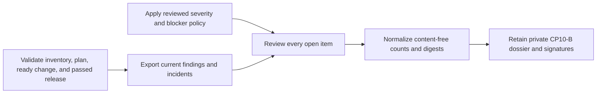

# Private-beta incident and launch-blocker review evidence

This workflow normalizes CP10-B evidence that a current installed-release
finding and incident register has no severity-one incident or unresolved launch
blocker and that every open item was reviewed. It does not query operational
systems or approve a release.



Retain finding and incident exports, classification policy, and review decision
privately. The normalized input contains only their digests, opaque versions,
timestamps, fixed outcomes, and bounded aggregate counts. Never include item or
ticket IDs, summaries, rule/vulnerability names, customers, people, comments,
remediation text, logs, traces, or content.

Copy `private-beta-blocker-review.example.json`, replace illustrative values,
and run:

```sh
make saas-blocker-evidence-check \
  PLATFORM_INVENTORY=/private/staging-inventory.json \
  PLATFORM_PLAN=/private/staging-plan.json \
  PLATFORM_CHANGE=/private/staging-change.json \
  STAGING_RELEASE=/immutable/passed-release.json \
  BLOCKER_EVIDENCE_INPUT=/private/blocker-review.json \
  BLOCKER_EVIDENCE_RECEIPT=/immutable/blocker-review-receipt.json
```

The snapshot must follow the bound deployment, the review must follow the
snapshot, and normalization must occur within 24 hours. Ready requires all five
checks, zero severity-one and launch-blocker signals, and reviewed count equal
to total open findings plus incidents. Honest blockers remain valid-unready.

Publication is create-only, atomic, and mode `0600`. Exit `0` is ready, `3` is
valid-unready, `2` is usage failure, and `1` is invalid or operational failure.
CP10-B closes only when the exact dossier receives current Incident Commander
and Product signatures through the external evidence index.
