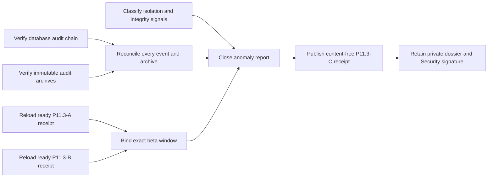

# Production beta isolation and audit-integrity evidence

This P11.3-C workflow verifies that no tenant-isolation or audit-integrity
signal remains unexplained during the exact production beta window already
accepted by P11.3-A and P11.3-B. It consumes content-free exports and never
queries production databases, object storage, logs, traces, dashboards, or
security systems.



Before the window, Security approves the residual-risk and classification
policy. After the window, export and retain outside the application database:

- the database audit-chain verification report;
- immutable archive reconciliation;
- isolation and audit-integrity signal exports;
- the closed anomaly report;
- the residual-risk decision and accountable Security review.

The normalizer receives only opaque versions, timestamps, aggregate counts,
and SHA-256 digests. Never include tenant, event, finding, incident, request,
trace, source, credential, archive-object, rule, operator, or reviewer IDs;
queries; endpoints; messages; signatures; logs; traces; payloads; or raw output.

Every audit event must be chain-checked and represented in archive
reconciliation. Verified, missing, and checksum-mismatched archive counts must
equal the expected population. Explained, unexplained, and unclassified counts
must reconcile for both signal classes. Closed plus open findings must equal
the anomaly population. A zero-event export is invalid because absence cannot
be inferred from a failed or empty collection.

Copy `production-beta-integrity.example.json`, replace illustrative values,
validate it against the input schema, and run:

```sh
make saas-beta-integrity-check \
  PLATFORM_INVENTORY=/private/production-inventory.json \
  PLATFORM_PLAN=/private/production-plan.json \
  PLATFORM_CHANGE=/private/production-change.json \
  PRODUCTION_RELEASE=/immutable/production-release.json \
  BETA_SLO_RECEIPT=/immutable/beta-slo-receipt.json \
  BETA_OPERATIONS_RECEIPT=/immutable/beta-operations-receipt.json \
  BETA_INTEGRITY_INPUT=/private/beta-integrity.json \
  BETA_INTEGRITY_RECEIPT=/immutable/beta-integrity-receipt.json
```

Publication is atomic, create-only, and mode `0600`. Exit `0` is ready, `3` is
valid-unready, `2` is usage failure, and `1` is invalid or operational failure.
Explained signals may remain in a ready review, but any chain break, archive
gap or checksum mismatch remains unready even when explained. Only real
production exports, a closed anomaly dossier, full chain/archive verification,
and signed Security residual-risk review close P11.3-C.
