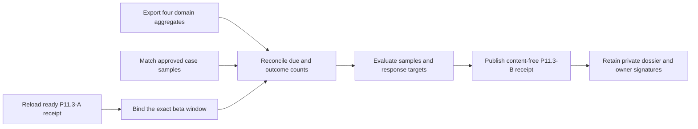

# Production beta trust-operations evidence

This P11.3-B workflow verifies whether deletion, rights-notice, anomaly-alert,
and support-case operations met approved targets during the exact elapsed
production window already accepted by P11.3-A. It reads exported, content-free
aggregates; it never queries production databases, audit stores, support tools,
logs, or customer content.



Before the beta window, Privacy, Security, and Support approve the target and
sample policies. After the window, export deletion receipts, rights-notice
cases, anomaly-alert cases, and support cases from their authoritative systems.
Retain those private exports and the sample manifest outside the application
database. The normalized input carries only aggregate counts, maximum integer
durations, opaque versions, timestamps, and SHA-256 digests.

For each fixed domain, `within + late + overdue-open` must equal `due`.
Non-empty domains require a bounded positive sample; every sampled case must
match its authoritative export. A genuinely empty domain must have zero case,
sample, and observed-duration values but still binds an immutable export.
Late or overdue work must produce a failed domain check and valid-unready
receipt. Contradictory green claims fail closed.

Copy `production-beta-operations.example.json`, replace every illustrative
value, validate it against the input schema, and run:

```sh
make saas-beta-operations-check \
  PLATFORM_INVENTORY=/private/production-inventory.json \
  PLATFORM_PLAN=/private/production-plan.json \
  PLATFORM_CHANGE=/private/production-change.json \
  PRODUCTION_RELEASE=/immutable/production-release.json \
  BETA_SLO_RECEIPT=/immutable/beta-slo-receipt.json \
  BETA_OPERATIONS_INPUT=/private/beta-operations.json \
  BETA_OPERATIONS_RECEIPT=/immutable/beta-operations-receipt.json
```

Publication is atomic, create-only, and mode `0600`. Exit `0` is ready, `3` is
valid-unready, `2` is usage failure, and `1` is invalid or operational failure.
The support aggregate is intentionally an external export because the product
does not yet own a first-class support-case store. Only real same-window
exports, sampled private cases, approved policies, and signed
Privacy/Security/Support review close P11.3-B.
