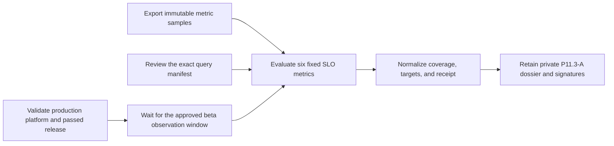

# Production beta SLO observation evidence

This workflow normalizes P11.3-A evidence that a real production beta met the
six provisional non-functional targets for one agreed elapsed observation
window. It never queries Prometheus, dashboards, databases, logs, or traces.



Before the window starts, Product and Operations approve its minimum duration.
Retain the immutable metric export, exact reviewed query manifest, window and
SLO-definition decisions, and private review. The normalized input contains
only opaque versions, digests, aggregate integer values and sample counts, and
timestamps. Never include PromQL, endpoints, labels, time-series rows, tenant or
request IDs, people, credentials, logs, traces, payloads, or source content.

The fixed targets are:

| Metric | Target |
|---|---:|
| API availability | at least 999,000 ppm |
| Search p95 | at most 800,000 µs |
| Memory-write p95 | at most 300,000 µs |
| Status/metadata p95 | at most 300,000 µs |
| Upload-acceptance p95 | at most 2,000,000 µs |
| Native-text indexing started within 60 seconds | at least 950,000 ppm |

Copy `production-beta-slo.example.json`, replace every illustrative value,
validate it against the input schema, and run:

```sh
make saas-beta-slo-check \
  PLATFORM_INVENTORY=/private/production-inventory.json \
  PLATFORM_PLAN=/private/production-plan.json \
  PLATFORM_CHANGE=/private/production-change.json \
  PRODUCTION_RELEASE=/immutable/production-release.json \
  BETA_SLO_INPUT=/private/beta-slo.json \
  BETA_SLO_RECEIPT=/immutable/beta-slo-receipt.json
```

The approved minimum is between one and 31 days. The window starts after the
bound deployment, fully elapses, and is evaluated within 24 hours. Every
observed sample count must equal its expected count. Honest coverage or target
shortfalls remain valid-unready.

Publication is atomic, create-only, and mode `0600`. Exit `0` is ready, `3` is
valid-unready, `2` is usage failure, and `1` is invalid or operational failure.
Only a real elapsed production window signed by Product and Operations closes
P11.3-A.
