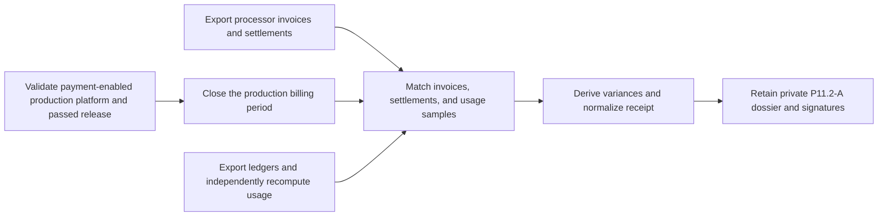

# Production billing reconciliation evidence

This workflow normalizes P11.2-A evidence that processor invoices and
settlements agree with the authoritative invoice and usage ledgers for a real
closed limited-production period. It does not access the processor or database.



The production inventory must explicitly enable `payment`. Retain processor and
ledger exports, the usage recomputation, webhook-ordering report, and approved
variance decision privately. Never include customer, subscription, tenant,
invoice, settlement, event, or usage-row identifiers; payment instruments;
pricing/tax terms; payloads; credentials; logs; traces; SQL; or source content.

Copy `production-billing-reconciliation.example.json`, replace every
illustrative value, validate it against the input schema, and run:

```sh
make saas-billing-reconciliation-check \
  PLATFORM_INVENTORY=/private/production-inventory.json \
  PLATFORM_PLAN=/private/production-plan.json \
  PLATFORM_CHANGE=/private/production-change.json \
  PRODUCTION_RELEASE=/immutable/production-release.json \
  BILLING_RECONCILIATION_INPUT=/private/billing-reconciliation.json \
  BILLING_RECONCILIATION_RECEIPT=/immutable/billing-reconciliation-receipt.json
```

The approved targets precede the period. The period starts after deployment,
lasts at most 31 days, closes before reconciliation, and is normalized within
24 hours. All sample counts are positive and fully matched. Invoice, settlement,
and usage variances are derived and compared with positive approved ceilings.
Honest mismatches remain valid-unready.

Publication is atomic, create-only, and mode `0600`. Exit `0` is ready, `3` is
valid-unready, `2` is usage failure, and `1` is invalid or operational failure.
Only a real production dossier signed by Finance and Engineering closes P11.2-A.
