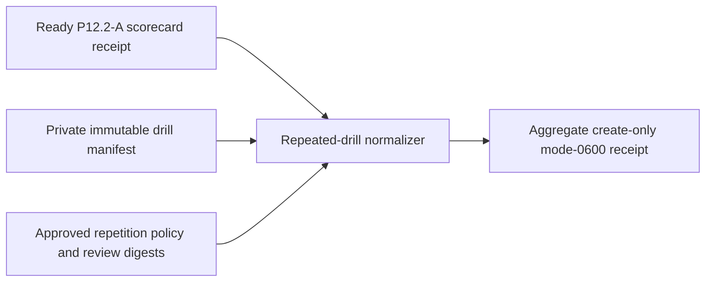

# Repeated production GA drill evidence

P12.2-B cannot be satisfied by one recent database row per scenario. This
normalizer binds a complete drill manifest to the ready P12.2-A receipt and
requires at least two restore, deletion, credential, and notice drills on
distinct UTC dates inside that exact GA window.



Every drill ID and evidence digest is globally unique. A drill must have a
positive duration no longer than 24 hours. Complete failed or inconclusive
drill sets are retained as valid-unready; replay, missing repetitions,
same-date repetitions, outside-window evidence, and contradictory claims fail.

```sh
make saas-ga-drills-check \
  GA_SCORECARD_RECEIPT=/private/ga-scorecard-receipt.json \
  GA_DRILLS_INPUT=/private/ga-drills.json \
  GA_DRILLS_RECEIPT=/private/ga-drills-receipt.json
```

Exit `0` is ready, `3` valid-unready, `2` invalid usage, and `1` invalid
evidence or I/O failure. The example is shape-only and does not close P12.2-B.
Keep drill reports, policy decisions, and accountable review in private
immutable custody.
