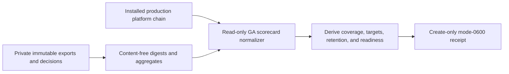

# Production GA scorecard evidence

This P12.2-A repository boundary normalizes a private, immutable GA scorecard
without receiving production query authority or customer content. It requires
an approved elapsed window of 28–93 days and binds the result to the installed
production inventory, ready plan/change, and passed release.



The thirteen fixed metrics cover availability, search and write latency,
exploitable security findings, tenant isolation, deletion, audit integrity,
billing, restore RPO/RTO, cost per active tenant, support response, and
retention deletion compliance. Every metric needs positive expected and
observed sample counts. Cost uses the approved input target; all other targets
are fixed by the implementation.

Run the normalizer with real private paths:

```sh
make saas-ga-scorecard-check \
  PLATFORM_INVENTORY=/private/inventory.json \
  PLATFORM_PLAN=/private/plan.json \
  PLATFORM_CHANGE=/private/change.json \
  PRODUCTION_RELEASE=/private/release.json \
  GA_SCORECARD_INPUT=/private/ga-scorecard.json \
  GA_SCORECARD_RECEIPT=/private/ga-scorecard-receipt.json
```

Exit `0` is ready, `3` is a valid but unready scorecard, `2` is invalid CLI
usage, and `1` is invalid evidence or an I/O failure. The command prints only
aggregate counts and state. The example file demonstrates shape only; its
placeholder digests do not close P12.2-A. Keep the source exports, target and
window decisions, and accountable reviews in private immutable custody.
