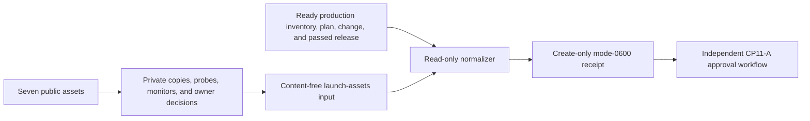

# Production public launch-asset evidence

This workflow normalizes the external evidence for CP11-A. It does not fetch a
URL, retain public copy, accept credentials, or sign an approval. Product,
Counsel, Support, Operations, and Security produce the private source artifacts;
the normalizer accepts only their digests, fixed classifications, timestamps,
status/count observations, and outcomes.



## Prepare and collect

1. Verify the exact production inventory, plan, applied change, and passed
   release receipts. Hash the release receipt bytes without rewriting it.
2. From an external probe system, capture at least one probe per asset. Every
   green asset needs HTTP 200, all probes successful, and an observation no
   more than 900 seconds before `snapshot_at`.
3. Preserve immutable private copies of the rendered pages, monitor
   configuration, route tests, and accountable owner decisions. Put only their
   SHA-256 digests in the input.
4. Copy `production-launch-assets.example.json`, replace all illustrative IDs,
   digests, timestamps, counts, and outcomes, then run:

```sh
make saas-launch-assets-check \
  PLATFORM_INVENTORY=/secure/production-inventory.json \
  PLATFORM_PLAN=/secure/production-plan.json \
  PLATFORM_CHANGE=/secure/production-change.json \
  PRODUCTION_RELEASE=/secure/production-release.json \
  LAUNCH_ASSETS_INPUT=/secure/launch-assets-input.json \
  LAUNCH_ASSETS_RECEIPT=/secure/launch-assets-receipt.json
```

Exit 0 means the normalized evidence is ready; 3 is valid but unready; 2 is a
usage error; 1 means invalid, contradictory, unsafe, or unpublishable evidence.
The destination must not already exist.

## Retention and approval

Store the receipt and the referenced immutable private artifacts under the
external evidence retention policy. Do not place actual URLs, page text,
contacts, probe output, logs, or monitoring destinations in the receipt. A
repository example or local test never closes CP11-A: closure still requires
the real externally reachable assets and current signed accountable approvals.
