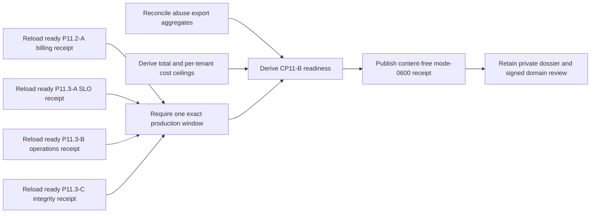

# Production public-beta shared-window gate evidence

This CP11-B workflow proves that SLO, deletion/notice/anomaly/support, audit
integrity, billing, abuse, and observed cost gates describe one exact
production window. The normalizer has no production query authority. It
strictly reloads previously normalized receipts and accepts only content-free
abuse and cost aggregates plus immutable artifact digests.



## Required external artifacts

Retain outside application storage:

- the exact ready billing, beta-SLO, beta-operations, and beta-integrity
  receipts;
- an immutable signup-abuse export covering the same window;
- an immutable observed-cost export with positive active-tenant coverage;
- the approved total and per-active-tenant cost targets;
- the accountable cross-domain review and its signed decision.

The billing period must equal the SLO window exactly. The operations and
integrity receipts must already bind that SLO receipt. Closed, open
nonblocking, open launch-blocking, and unclassified abuse counts must reconcile
to the finding population. Ready evidence requires no launch-blocking or
unclassified finding. Actual per-active-tenant cost is derived with ceiling
division, then both the total and per-tenant approved ceilings must pass.

Do not include tenant, account, finding, attempt, invoice, event, operator, or
reviewer identifiers; URLs; queries; contacts; signatures; credentials; logs;
traces; payloads; or raw exports in the input or receipt.

## Normalize

Copy `production-public-beta-gate.example.json`, replace every illustrative
identifier, digest, timestamp, count, and target, validate it against the input
schema, then run:

```sh
make saas-public-beta-gate-check \
  PLATFORM_INVENTORY=/private/production-inventory.json \
  PLATFORM_PLAN=/private/production-plan.json \
  PLATFORM_CHANGE=/private/production-change.json \
  PRODUCTION_RELEASE=/immutable/production-release.json \
  BILLING_RECONCILIATION_RECEIPT=/immutable/billing-receipt.json \
  BETA_SLO_RECEIPT=/immutable/beta-slo-receipt.json \
  BETA_OPERATIONS_RECEIPT=/immutable/beta-operations-receipt.json \
  BETA_INTEGRITY_RECEIPT=/immutable/beta-integrity-receipt.json \
  PUBLIC_BETA_GATE_INPUT=/private/public-beta-gate.json \
  PUBLIC_BETA_GATE_RECEIPT=/immutable/public-beta-gate-receipt.json
```

Publication is create-only and mode `0600`. Exit `0` is ready, `3` is valid
but unready, `2` is usage failure, and `1` is invalid, unsafe, contradictory,
or operational failure. Repository examples and local tests do not close
CP11-B. Closure requires the real same-window receipts and exports, approved
targets, and current signed domain-owner review in the external-evidence index.
