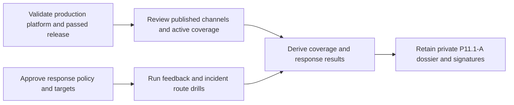

# Production support-channel staffing evidence

This workflow normalizes P11.1-A evidence that customer-feedback and security-
incident channels are published, covered by primary and backup staffing, and
exercise the approved response policy. It never accesses provider systems.



Retain the published channel inventory, active coverage roster, response policy,
approved targets, and private escalation-test report. The normalized input must
contain only opaque versions, digests, aggregate minutes and slot counts, and
causal timestamps. Never include destinations, staff identities, schedules,
messages, customer/case/incident IDs, credentials, payloads, logs, or content.

Copy `production-support-staffing.example.json`, replace every illustrative
value, validate it against the input schema, and run:

```sh
make saas-support-evidence-check \
  PLATFORM_INVENTORY=/private/production-inventory.json \
  PLATFORM_PLAN=/private/production-plan.json \
  PLATFORM_CHANGE=/private/production-change.json \
  PRODUCTION_RELEASE=/immutable/production-release.json \
  SUPPORT_EVIDENCE_INPUT=/private/support-staffing.json \
  SUPPORT_EVIDENCE_RECEIPT=/immutable/support-staffing-receipt.json
```

Primary and backup coverage must each meet the required minutes. Both fixed
drills derive delivery and acknowledgement duration from causal timestamps and
compare them with approved targets. Honest shortfalls remain valid-unready.

Publication is atomic, create-only, and mode `0600`. Exit `0` is ready, `3` is
valid-unready, `2` is usage failure, and `1` is invalid or operational failure.
The input is decoded and hashed from the same bounded regular file descriptor
whose identity and size were validated. Symlinks, validate-then-open or
read-time replacement, partial reads, unknown fields, and trailing JSON fail
closed.
Only real production artifacts signed by Support and Operations close P11.1-A.
