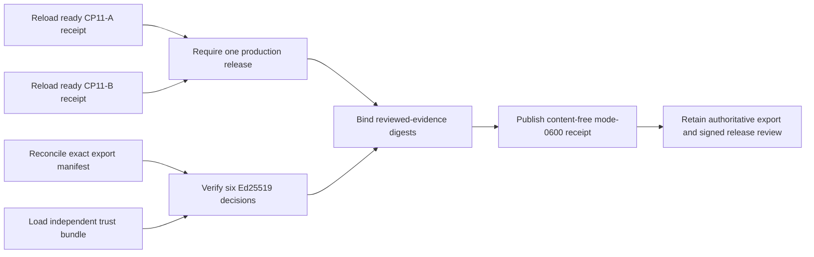

# Signed public-beta approval export evidence

CP11-C proves that the six public-beta release decisions in one declared
immutable export are signed, authorized, current, and bound to the exact ready
CP11-A and CP11-B receipts for one production release. The collector has no
application, database, network, signing-key, or production query authority.



## Prepare the export

Export the complete public-beta decision history from the independently
controlled evidence system into one immutable directory. It must contain only
regular, non-symlink `.json` approval artifacts. Produce a manifest listing
every base filename and exact file SHA-256; do not place the manifest itself in
the approval directory. Validate it against
`api/evidence/v1/public-beta-approval-export-manifest.schema.json`.

The six required controls are `beta_readiness`, `external_signup`,
`legal_pages`, `security_contact`, `status_page`, and `support_policy`. The
current approved `beta_readiness` artifact must use the CP11-B receipt SHA-256
as `evidence_sha256`. The other five current approved artifacts must use the
CP11-A receipt SHA-256. Generate artifacts with
`agent-memory-release-approval`; private keys never enter this workflow.

An export manifest and directory digest prove exactly which files the collector
inspected. They do not prove that an untrusted exporter omitted no newer
decision. Restrict and audit the authoritative export operation, retain the
immutable source export, and attach the Product/Release Authority review through
the external-evidence index.

The collector hashes and strictly decodes each approval from one read of one
stable directory snapshot. It revalidates directory identity, sorted
membership, and every member's identity, size, and modification time before
returning. If the export changes while normalization is running, exit `1` is
returned and the completed immutable export must be retried; decisions are
never loaded from a second directory generation after its digest is fixed.

## Normalize

Copy both example files, replace all illustrative values, validate them against
their schemas, and run:

```sh
make saas-approval-export-check \
  LAUNCH_ASSETS_RECEIPT=/immutable/launch-assets-receipt.json \
  PUBLIC_BETA_GATE_RECEIPT=/immutable/public-beta-gate-receipt.json \
  APPROVER_TRUST_BUNDLE=/release-control/approver-trust.json \
  PUBLIC_BETA_APPROVALS_DIR=/immutable/public-beta-approvals \
  PUBLIC_BETA_APPROVAL_MANIFEST=/private/public-beta-approval-manifest.json \
  PUBLIC_BETA_APPROVAL_INPUT=/private/public-beta-approval-review.json \
  PUBLIC_BETA_APPROVAL_RECEIPT=/immutable/public-beta-approval-receipt.json
```

Publication is create-only and mode `0600`. Exit `0` means ready, `3` means a
valid but unready result, `2` means usage failure, and `1` means invalid,
unsafe, contradictory, or operational failure. Missing, rejected, and expired
decisions are reported only as aggregate counts. Owners, key IDs, public keys,
evidence references, filenames, and signatures are excluded from the receipt
and command report.

Repository examples and tests do not close CP11-C. Closure requires the real
complete immutable export, independently managed trust bundle, current signed
decisions, and signed Product/Release Authority review.
