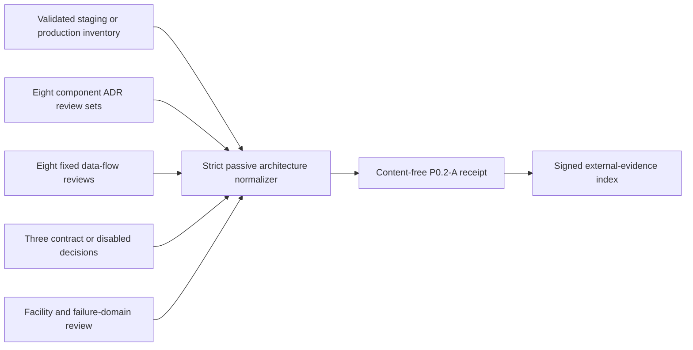

# Self-managed architecture and topology review evidence

P0.2-A requires accountable review of the real self-managed installation, not
only a structurally valid inventory. This workflow normalizes the private
architecture dossier without reading infrastructure or exposing topology.



The input conforms to
`api/evidence/v1/self-managed-architecture-review-input.schema.json`. It binds
the exact inventory digest, topology/service ADR manifests, facility inventory,
physical/failure-domain review, data-flow manifest, integration contract
manifest, and joint Architecture/Security/Privacy/Operations review.

Every one of the eight inventory components carries exactly six review outcomes:
ownership, custody, capacity, failure isolation, cost, and incident response.
Exactly eight closed data flows cover edge/identity, ingestion, authoritative
storage, async processing, retrieval/model routing, audit/export,
deletion/backup, and external integrations. Payment, email, and model entries
must match inventory enablement: enabled means `approved_contract`; disabled
means `disabled_decision`. Disabled integrations are still reviewed.

Production requires at least two reviewed independently operated failure
domains; staging requires at least one. Detailed facility names, diagrams,
contracts, data-flow content, costs, people, and signatures stay in private
immutable custody. The portable input contains only counts, closed IDs,
outcomes, timestamps, and SHA-256 values.

Run within 24 hours of generating the reviewed input and choose a receipt path
that does not exist:

```sh
make saas-architecture-evidence-check \
  PLATFORM_INVENTORY=/evidence/platform-inventory.json \
  ARCHITECTURE_EVIDENCE_INPUT=/private/architecture-review-input.json \
  ARCHITECTURE_EVIDENCE_RECEIPT=/evidence/architecture-review-receipt.json
```

Exit `0` means ready, `3` valid-but-unready, `2` invalid command usage, and `1`
malformed, unsafe, or operational failure. The receipt is create-only mode
`0600`; stdout contains aggregate counts only.

Retain the exact inventory, input, receipt, service/topology ADRs, facility and
failure-domain evidence, data-flow analysis, integration contracts or disabled
decisions, and joint review in the immutable P0.2-A dossier. Repository fixtures
never prove physical independence or close P0.2-A.
