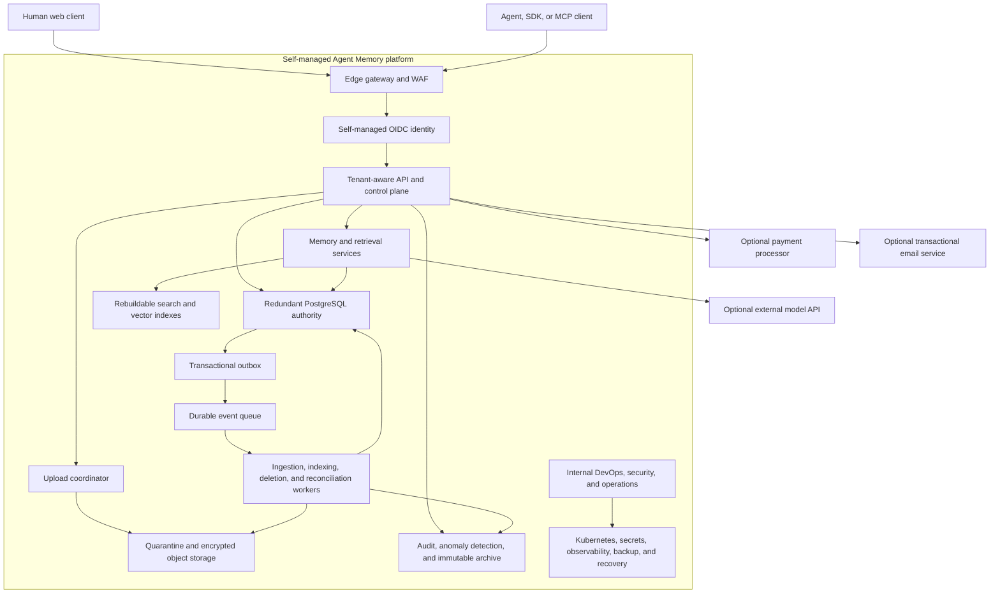

# Self-Managed SaaS Architecture

Agent Memory is a multi-tenant SaaS product whose core infrastructure is
deployed and operated by the product organization. Development, staging, and
production do not depend on AWS, Azure, GCP, or another external cloud provider.

## Ownership boundary

The organization owns and operates compute, networking, Kubernetes, identity,
PostgreSQL, object storage, queues, secrets, observability, backups, and disaster
recovery. Production runs in one self-managed site spanning at least two
independently operated failure domains. Development, staging, and production
use separate administrative domains, identities, secrets, databases, buckets,
queues, and network policy.

Payment processing, transactional email, and model APIs are optional external
business integrations. They sit behind replaceable adapters, receive only the
minimum data approved for their purpose, and do not own authoritative Agent
Memory state. A deployment remains functional without model generation: cited
retrieval can return source evidence without synthesized text.

## Operational consequence

Avoiding an external cloud provider removes cloud account, service, and spend
authorization from the product configuration. It does not remove infrastructure
cost or release evidence. Internal teams must supply hardware/facility capacity,
patching, certificate and key custody, replication, monitoring, on-call response,
backup retention, restore drills, and failure-domain recovery. The configurable
monthly infrastructure budget is a planning and alerting limit only; it neither
deploys resources nor authorizes spending.

## Release boundary

Local and Floci profiles prove application behavior and fail-safe wiring. They
do not prove production capacity or operations. Release approval still requires
externally retained, signed evidence from the real self-managed staging and
production systems: immutable image releases, network isolation, backup/restore,
credential and identity recovery, deletion reconciliation, load, alerts,
security review, and accountable-owner decisions. Evidence from an optional
payment, email, or model integration is required only when that integration is
enabled for the release.
