# Self-managed aged-backup expiry drill

This runbook collects the P7.4-A receipt only after a real production backup
has aged through the complete retention interval installed on the self-managed
platform. The collector validates evidence; it never lists, restores, deletes,
or changes backups and never receives infrastructure credentials.

## Boundary

Start with the exact production platform inventory, infrastructure plan, ready
applied-change, and installed retention-inventory receipts. The collector
re-hashes all opened receipt bytes, revalidates their bindings, and reads the
`backups` policy version and duration from the retention receipt. The duration
entered in the drill must match; it cannot shorten the derived deadline.

Keep the backup manifest, proof that the selected backup contained the test
record, deletion receipt, backup-retention configuration, expiry schedule,
post-deadline catalog/storage results, denied or unavailable restore result,
and key-expiry result in the private immutable Operations dossier. Put only
their SHA-256 values in the drill JSON. Never include tenant/account/workspace
or record IDs, object or backup paths, manifests, keys, credentials, endpoints,
provider/database names, SQL, rows, customer content, logs, or raw output.

## Operational flow

```mermaid
flowchart LR
    Chain["Validate production inventory, plan, and applied change"] --> Policy["Collect installed retention inventory"]
    Policy --> Backup["Create and verify a test-bearing backup"]
    Backup --> Delete["Delete the test record and retain its receipt"]
    Delete --> Wait["Wait through the complete installed backup interval"]
    Wait --> Absence["Prove backup absence after the derived deadline"]
    Absence --> Restore["Prove the expired backup cannot be restored"]
    Restore --> Key["Prove cryptographic material expired"]
    Key --> Receipt["Hash private evidence and publish the sanitized receipt"]
```



The selected backup must predate deletion and must privately prove that it
contained the later-deleted test record. Verification cannot start before
`deletion_completed_at + installed backup duration`. Do not accelerate the
production clock or use a synthetic timestamp. A failed absence, restore, or
key check is still valuable evidence: mark it failed and retain the resulting
valid-unready receipt for incident handling.

The timestamps and digests in
`docs/saas/self-managed-backup-expiry-drill.example.json` are illustrative.
Replace them with the exact production receipt identities and current private
artifact hashes.

## Collect

```sh
make saas-backup-expiry-check \
  PLATFORM_INVENTORY=/private/production-inventory.json \
  PLATFORM_PLAN=/private/production-plan.json \
  PLATFORM_CHANGE=/private/production-change.json \
  RETENTION_INVENTORY_RECEIPT=/immutable/retention-inventory.json \
  BACKUP_EXPIRY_DRILL=/private/aged-backup-drill.json \
  BACKUP_EXPIRY_RECEIPT=/immutable/aged-backup-receipt.json
```

The destination must not already exist. Publication is mode `0600`. Exit `0`
means all seven checks passed after the derived deadline; `3` means the drill
is valid but one or more checks failed; `2` means invalid arguments; and `1`
means unsafe, malformed, misbound, early/stale, or operational failure.
Standard output contains only aggregate check counts and derived durations.

## Approval and retention

Store the exact input, normalized receipt, all four bound receipts, and private
raw evidence outside the application database under immutable retention. Bind
the dossier digest to current signed P7.4-A Privacy and Operations approval in
the external-evidence index.

A time-shifted fixture, local/Floci run, disposable database, or passing unit
test proves collector behavior only. It does not prove that a production backup
really survived and then disappeared across the full interval, and therefore
does not close P7.4-A.
