# Self-managed PostgreSQL restore drill

This runbook collects the content-free CP3-B receipt after Operations performs
a real restore against the self-managed staging or production platform. The
collector validates evidence; it never receives database credentials and never
runs `pg_dump`, PITR, SQL, or infrastructure commands.

## Boundary

The input must bind the exact platform inventory, infrastructure plan, and
ready applied-change receipts. Use the schema at
`api/evidence/v1/self-managed-postgres-restore-drill.schema.json` and start from
`docs/saas/self-managed-postgres-restore-drill.example.json`.

Keep backup manifests, restore logs, reconciliation queries/results, audit
proof, tombstone proof, and cleanup output in the private immutable Operations
dossier. Put only each artifact's SHA-256 in the drill JSON. Do not put
credentials, endpoints, database names, tenant IDs, object/backup paths, SQL,
row contents, logs, or raw command output in the collector input or receipt.

## Operational flow

```mermaid
flowchart LR
    Inventory["Validate platform inventory"] --> Plan["Validate infrastructure plan"]
    Plan --> Change["Confirm applied change is ready and drift-free"]
    Change --> Backup["Select and verify a real backup"]
    Backup --> Impair["Record impairment start and recovery point"]
    Impair --> Restore["Restore into an isolated target"]
    Restore --> Reconcile["Reconcile schema, tenants, rows, outbox, and audit chain"]
    Reconcile --> Tombstones["Replay tombstones and prove deleted data stays absent"]
    Tombstones --> Ready["Measure service readiness and RPO/RTO"]
    Ready --> Dispose["Dispose the isolated restore target"]
    Dispose --> Receipt["Hash private evidence and publish the sanitized receipt"]
```



The provisional targets are RPO ≤ 300 seconds and RTO ≤ 3,600 seconds. The
collector derives both from timestamps; do not enter measured values manually.
All ten fixed checks need a private evidence artifact. A failed check or target
breach is still a valid drill: set `ready` to `false` and retain the failed
receipt for review.

## Collect

```sh
make saas-postgres-restore-check \
  PLATFORM_INVENTORY=/private/inventory.json \
  PLATFORM_PLAN=/private/plan.json \
  PLATFORM_CHANGE=/private/change.json \
  POSTGRES_RESTORE_DRILL=/private/restore-drill.json \
  POSTGRES_RESTORE_RECEIPT=/immutable/restore-receipt.json
```

The destination must not already exist. A successful publication is mode
`0600`. Exit `0` means ready, `3` means valid but unready, `2` means invalid
arguments, and `1` means unsafe/malformed evidence or an operational error.
Standard output contains only aggregate check counts and measured durations.

## Approval and retention

Store the exact input, normalized receipt, and raw private evidence outside the
application database under the self-managed immutable retention policy. Bind
their dossier digest to signed Operations approval through the external-evidence
index. A passing local fixture or disposable PostgreSQL restore proves only the
repository implementation; it does not close CP3-B.
