# Self-managed retention inventory

This runbook collects the content-free CP4-B inventory from the PostgreSQL
service installed on the self-managed staging or production platform. It reads
only the global active retention-policy table. It does not run migrations,
change policy, query tenant data, or emit database configuration.

## Boundary

Use the same exact platform inventory, infrastructure plan, and ready applied-
change receipts used by the other self-managed evidence collectors. The
command rejects an unapplied, rolled-back, or drifted chain. Configure a
read-only PostgreSQL identity through `AGENT_MEMORY_POSTGRES_URL`; do not put a
connection URL or credential in command-line flags, receipt JSON, logs, or the
external evidence dossier.

The database identity needs only `CONNECT`, schema `USAGE`, and `SELECT` on
`saas_retention_policies`. It must not have tenant-table access, migration
authority, DDL authority, or credential administration.

## Collection flow

```mermaid
flowchart LR
    Inventory["Validate exact platform inventory bytes"] --> Plan["Validate bound infrastructure plan"]
    Plan --> Change["Require ready applied change and clean drift"]
    Change --> Database["Read twelve active retention policies"]
    Database --> Coverage["Validate exact classes and governance fields"]
    Coverage --> Canonical["Sort policies and hash canonical JSON"]
    Canonical --> Receipt["Publish create-only mode-0600 receipt"]
    Receipt --> Review["Retain private proof and request Privacy approval"]
```



Before collection, independently retain the private query authorization,
database audit evidence, migration ledger, and policy-row export in the
immutable Privacy dossier. These private artifacts must not be copied into the
normalized receipt.

## Collect

```sh
export AGENT_MEMORY_POSTGRES_URL='postgres://read-only-identity@private-database/agent_memory?sslmode=verify-full'

make saas-retention-inventory-collect \
  PLATFORM_INVENTORY=/private/inventory.json \
  PLATFORM_PLAN=/private/plan.json \
  PLATFORM_CHANGE=/private/change.json \
  RETENTION_INVENTORY_RECEIPT=/immutable/retention-inventory.json
```

The destination must not already exist. A successful receipt is mode `0600`
and conforms to
`api/evidence/v1/self-managed-retention-inventory.schema.json`. Standard output
contains only readiness and policy count. Exit `0` means the complete inventory
was published, `2` means invalid arguments, and `1` means unsafe input,
incomplete policy, missing configuration, or operational failure.

## Approval and retention

Privacy reviews every purpose, trigger, duration, deletion method, and policy
version against the private installed-state proof and customer-facing privacy
surface. Store the exact receipt and private proof outside the application
database, then bind their dossier digest to a current signed CP4-B Privacy
decision through the external-evidence index.

A repository test, local/Floci environment, disposable PostgreSQL database, or
unsigned receipt proves only the implementation. It does not close CP4-B or
Checkpoint 7.
