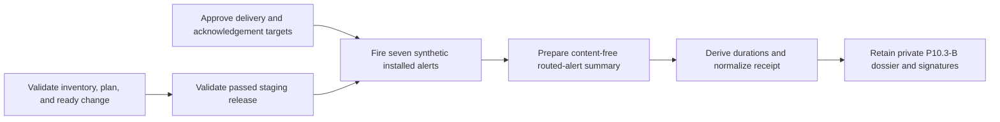

# Staging SLO and cost alert-routing evidence

This workflow normalizes P10.3-B evidence that all seven reviewed SLO and cost
alerts reached an installed route, escalated, were acknowledged by a rostered
owner slot, and resolved within externally approved targets. It does not fire
alerts, inspect private routing systems, approve targets, or prove delivery by
itself.

## Evidence boundary

Operations retains the exact deployed rule and route exports, owner roster, and
private synthetic drill report. Operations and Finance retain the approved
target decision. The content-free summary binds those artifacts to the staging
inventory, reviewed plan, ready change, and passed release.



Use opaque versions for rules, routes, rosters, targets, and owner slots. Do not
include route URLs or names, receiver names, people, schedules, phone or email
addresses, chat or ticket identifiers, credentials, logs, traces, or customer
content.

## Normalize

Copy `staging-alert-routing.example.json`, replace every illustrative value,
validate it against the input schema, and run:

```sh
make saas-alert-evidence-check \
  PLATFORM_INVENTORY=/private/staging-inventory.json \
  PLATFORM_PLAN=/private/staging-plan.json \
  PLATFORM_CHANGE=/private/staging-change.json \
  STAGING_RELEASE=/immutable/passed-release.json \
  ALERT_EVIDENCE_INPUT=/private/alert-routing-summary.json \
  ALERT_EVIDENCE_RECEIPT=/immutable/alert-routing-receipt.json
```

The bundle starts after the bound deployment, lasts no more than 24 hours, and
is normalized within 24 hours. Each fixed rule requires its reviewed page or
ticket severity and a causal trigger, delivery, escalation, acknowledgement,
and resolution timeline. Delivery and acknowledgement durations are derived
from timestamps. A known target breach must be `failed`; honest failures and
inconclusive drills remain valid-unready.

The destination must not exist and is atomically published with mode `0600`.
Exit `0` means all seven drills pass; `3` means valid-unready; `2` means invalid
arguments; and `1` means malformed, unsafe, stale, contradictory, misbound, or
operational failure. Output contains aggregate counts and durations only.

## Retention and approval

Build the P10.3-B dossier from the exact platform and release inputs, installed
exports, roster, target decision, private drill report, content-free input, and
normalized receipt. Operations and Finance sign its digest through the external
evidence index. Repository rule checks or placeholder Alertmanager routes cannot
close P10.3-B.
