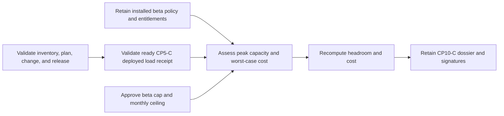

# Private-beta capacity and worst-case economics evidence

This workflow normalizes CP10-C evidence that the installed platform supports a
specific private-beta account cap and approved monthly worst-case cost. It does
not query infrastructure, launch policy, entitlements, telemetry, billing, or
providers, and it does not approve spending.

## Evidence boundary

Retain the installed launch-policy and entitlement snapshots, private capacity
report, worst-case economics report, and approved beta-cap/cost decision in
immutable external storage. Bind them to the exact platform chain, passed
release, and ready CP5-C load receipt.



Do not include provider/facility/region/host/endpoint names, people, tenant or
customer identifiers, pricing terms, invoices, usage rows, model details,
credentials, topology, logs, traces, SQL, content, or raw output.

## Normalize

Copy `staging-capacity-economics.example.json`, replace every illustrative
value, and run:

```sh
make saas-capacity-evidence-check \
  PLATFORM_INVENTORY=/private/staging-inventory.json \
  PLATFORM_PLAN=/private/staging-plan.json \
  PLATFORM_CHANGE=/private/staging-change.json \
  STAGING_RELEASE=/immutable/passed-release.json \
  RETRIEVAL_LOAD_RECEIPT=/immutable/retrieval-load-receipt.json \
  CAPACITY_EVIDENCE_INPUT=/private/capacity-summary.json \
  CAPACITY_EVIDENCE_RECEIPT=/immutable/capacity-receipt.json
```

The assessment begins after the deployed load receipt, lasts no more than seven
days, and is normalized within 24 hours. The normalizer checks measured
concurrent-tenant and sustained-request capacity against planned demand. It
derives monthly worst-case cost as fixed site cost plus beta account cap times
variable per-tenant cost, rejects overflow, and compares the result with the
approved positive ceiling. Shortfalls remain valid-unready when labels agree.

The destination is create-only and mode `0600`. Exit `0` means all eight
outcomes and metrics pass; `3` means valid-unready; `2` means usage error; and
`1` means invalid, unsafe, stale, contradictory, misbound, or operational
failure. Output is aggregate-only.

## Approval

Build `cp10_c` from every exact bound artifact and have Operations, Finance, and
Product sign its digest through the external-evidence index. The configurable
local $1,000 planning preference is not a billing limit, operating ceiling,
capacity result, or authorization to spend and must never populate this input.
