# Staging four-format ingestion evidence

This workflow collects the content-free CP4-C receipt after QA and Operations
run PDF, EPUB, Markdown, and plain-text fixtures through a real self-managed
staging release. The collector does not authenticate, upload, query, delete, or
read source content. Use synthetic or explicitly authorized private fixtures;
do not use customer books for this drill.

## Private evidence boundary

Start from `docs/saas/staging-format-ingestion.example.json` and validate the
input against `api/evidence/v1/staging-format-ingestion.schema.json`. Bind it to
the exact passed staging release ID and opened-file SHA-256.

For each format, retain these raw records in the private immutable dossier:

- upload acceptance and trace evidence;
- authoritative source-version publication receipt;
- terminal ingestion-job receipt;
- full-text and vector projection receipts, including document counts;
- final source-ready evidence; and
- deletion receipt proving the temporary staging source was cleaned up.

Hash each private artifact and put only the digest in the input. Never put
fixture bytes, extracted text, filenames, titles, source checksums, tenant,
account or workspace IDs, object keys, paths, URLs, credentials, headers,
queries, results, logs, or raw records in the collector input or receipt.

## Flow

```mermaid
flowchart LR
    Release["Select one passed staging release receipt"] --> Fixtures["Create four authorized synthetic fixtures"]
    Fixtures --> Upload["Upload PDF, EPUB, Markdown, and text"]
    Upload --> Version["Verify authoritative source versions"]
    Version --> Job["Verify ingestion jobs succeeded"]
    Job --> Projections["Verify full-text and vector projections"]
    Projections --> Ready["Verify every source reached ready"]
    Ready --> Delete["Delete every temporary staging source"]
    Delete --> Hash["Hash private records and assemble content-free input"]
    Hash --> Collect["Validate and publish normalized receipt"]
    Collect --> Approve["Retain dossier and obtain QA/Operations approval"]
```



Each run begins after the release completes, lasts no more than six hours, and
all runs fit within one 24-hour bundle. Collect within 24 hours of input
generation. Use canonical UUID-v4 source/job IDs and a unique lowercase
32-character hexadecimal trace ID per run.

The seven fixed checks are `upload_accepted`, `source_version_published`,
`ingestion_job_succeeded`, `fulltext_projection_ready`,
`vector_projection_ready`, `source_ready`, and `source_deleted`. A failed check
is retained with `ready: false`; do not rewrite an operational failure as a
malformed receipt.

## Collect

Choose a receipt path that does not exist:

```sh
make saas-staging-format-collect \
  STAGING_RELEASE=/absolute/private/staging-release.json \
  STAGING_FORMAT_INPUT=/absolute/private/staging-format-input.json \
  STAGING_FORMAT_RECEIPT=/absolute/immutable/staging-format-receipt.json
```

The command writes a create-only mode-`0600` receipt conforming to
`api/evidence/v1/staging-format-ingestion-receipt.schema.json`. Standard output
contains only aggregate format and check counts. Exit `0` means all four runs
are ready and cleaned up; `3` means valid but unready; `2` means invalid
arguments; `1` means unsafe/malformed evidence or publication failure.

## Retain and approve

Retain the passed release receipt, exact input, normalized receipt, private raw
records, and QA/Operations review outside the application database under the
external-evidence retention policy. Bind the dossier digest through the signed
external-evidence index.

Mock inputs and local Compose/Floci lifecycle runs prove only the collector and
product behavior. They do not close CP4-C or Checkpoint 4.
