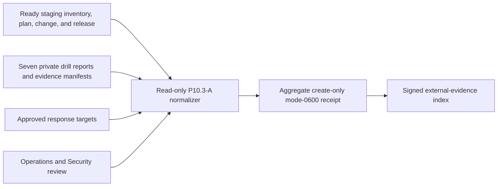

# Release-bound operational game-day evidence

P10.3-A requires real operational failures and accountable response on the
installed self-managed staging release. `readiness.RunDrill` and the local-alpha
gate remain useful rehearsals, but neither is external launch evidence. This
normalizer is passive: it never injects a fault, reads service data, or pages a
responder.



The required scenarios are database failover, queue backlog, failure of all
eight self-managed component kinds, outage/degraded handling for enabled
external integrations plus disabled-state continuity, credential leak,
cross-tenant attempt, and incomplete source/account deletion. Every drill must
start after the bound release and retain a causal sequence from failure through
detection, alert, acknowledgement, containment, recovery, and completion.

Private custody retains reports, alert deliveries, incident timelines,
responder identity, commands, logs, traces, target decisions, and review
signatures. The accountable-review bundle check must reference the same SHA-256
digest as the declared Operations/Security review artifact. The normalized
receipt contains only opaque versions, timestamps, derived integer durations,
counts, outcomes, and SHA-256 references.

```sh
make saas-game-day-evidence-check \
  PLATFORM_INVENTORY=/evidence/platform-inventory.json \
  PLATFORM_PLAN=/evidence/platform-plan.json \
  PLATFORM_CHANGE=/evidence/platform-change.json \
  STAGING_RELEASE=/evidence/staging-release.json \
  GAME_DAY_EVIDENCE_INPUT=/private/game-day-input.json \
  GAME_DAY_EVIDENCE_RECEIPT=/evidence/game-day-receipt.json
```

Exit `0` is ready, `3` is valid-but-unready, `2` is invalid usage, and `1` is
invalid evidence or I/O failure. A target breach or failed reviewed outcome is
preserved as valid-unready; omissions, cross-release substitution, impossible
chronology, aggregate contradictions, path replacement, partial reads, unknown
fields, or trailing JSON fail closed. The input is decoded and hashed from the
same bounded regular file descriptor whose identity and size are checked before
and after reading. Repository fixtures cannot close P10.3-A. Closure requires
real staging faults, installed alerts,
accountable responders, immutable private artifacts, approved targets, and a
current signed Operations/Security dossier.
