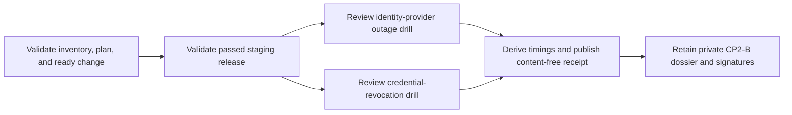

# Staging identity-safety drills

This workflow normalizes the two deployed demonstrations required by CP2-B:
identity-provider outage response and agent-credential revocation. It does not
impair an identity provider, page responders, issue or revoke credentials, or
approve a release.

## Evidence boundary

Use the exact staging inventory, reviewed plan, ready applied change, and
passed Kubernetes release. Conduct both exercises in that release epoch and
retain the private evidence immutably.



For each drill record impairment, detection, real alert delivery, containment,
and recovery times. Set a positive approved RTO target no greater than 86,400
seconds and include the SHA-256 of that private approval. The normalizer derives
detection, alert, containment, and RTO durations and marks an otherwise valid
target breach unready.

The outage drill proves cached-key continuity and fail-closed unknown or invalid
trust; it does not claim all new login remains available. The revocation drill
proves deterministic abuse detection, independent approval, production-path
revocation, and denial after revocation. Both prove real alert delivery,
containment, immutable audit retention, and absence of customer content.

Every check stores only `passed`, `failed`, or `inconclusive` and a private
evidence digest. Keep provider and responder identities, tenants, credentials,
tokens, keys, alert routes, incidents, tickets, audit rows, logs, traces,
endpoints, queries, raw output, and customer data out of the JSON.

## Normalize

Copy `staging-identity-safety-drills.example.json`, replace all illustrative
values, and validate against the input schema. Then run:

```sh
make saas-identity-safety-check \
  PLATFORM_INVENTORY=/private/staging-inventory.json \
  PLATFORM_PLAN=/private/staging-plan.json \
  PLATFORM_CHANGE=/private/staging-change.json \
  STAGING_RELEASE=/immutable/passed-release.json \
  IDENTITY_SAFETY_DRILLS=/private/identity-safety-drills.json \
  IDENTITY_SAFETY_RECEIPT=/immutable/identity-safety-receipt.json
```

Drills must begin after the passed release, finish within four hours, and be
normalized within 24 hours. The destination must not exist and is atomically
published with mode `0600`. Exit `0` means all 15 checks passed within their
targets; `3` means valid-unready; `2` means invalid arguments; and `1` means
malformed, unsafe, stale, misbound, or operational failure. Output contains
aggregate counts and maximum measured/target RTO only.

## Retention and approval

Retain the five bound inputs, drill input, normalized receipt, private alert,
containment, recovery, audit, target-approval, and content-absence evidence.
Build the `cp2_b` dossier from those unchanged artifacts and have authorized
Security and Operations owners sign its exact digest through the external-
evidence index. Local-alpha rehearsals and repository tests do not close CP2-B.
