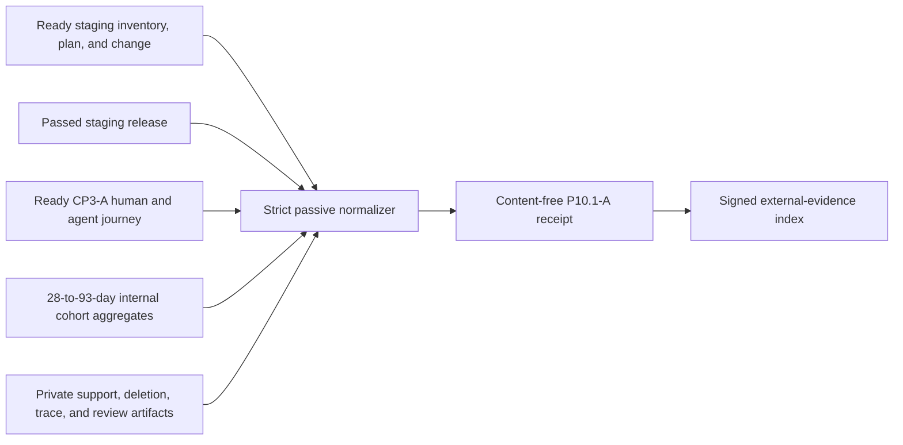

# Release-bound internal-alpha lifecycle evidence

P10.1-A requires real internal accounts to exercise the operational product
from invitation through account deletion. The local alpha gate is an isolated
engineering rehearsal; it cannot prove a human cohort, real support routing,
monthly consent renewal, or deployed deletion reconciliation.



## Private collection contract

Use one to 100 invited internal accounts and only capped, non-sensitive test
copies. Product, QA, and Operations approve the cohort, total source-count cap,
total source-byte cap, support targets, and review procedure before the run.
Retain the unchanged decisions outside the application database.

The content-free input conforms to
`api/evidence/v1/staging-internal-alpha-input.schema.json` and binds:

- the exact ready staging inventory, plan, applied change, passed release, and
  ready CP3-A journey receipt;
- positive PDF, EPUB, Markdown, and text aggregates that reconcile source,
  byte, indexed, non-sensitive, and deleted totals;
- exactly eleven causal stages from invitation acceptance and signup through
  consent, upload, query/review/export, monthly renewal, source deletion, and
  account deletion;
- at least one controlled case through the installed support route, with
  approved acknowledgement/resolution targets and matched sampling;
- exact source/account deletion aggregates with zero pending items for a ready
  run; and
- nine fixed SHA-256-backed checks. The cohort, source-cap, support, deletion,
  trace/audit, and Product/QA/Operations checks must reference their declared
  artifacts exactly.

Initial consent and monthly renewal must be separated by at least 28 days. The
whole alpha window must last 28 to 93 days, start after the bound release and
CP3-A journey, and be normalized within 24 hours of input generation. Failed
stages, unresolved cases, target breaches, incomplete processing, pending
deletion, or a declined review remain valid-but-unready when their aggregates
and checks agree. Omissions, substitutions, impossible chronology, mismatched
totals, and contradictory readiness fail closed.

Never place account, tenant, workspace, source, case, memory, export, deletion,
request, or trace identifiers in the input. Keep filenames, copies, queries,
results, routes, contacts, credentials, logs, screenshots, raw tickets, and raw
reports in separately controlled immutable custody.

## Normalize and retain

Choose a receipt destination that does not exist:

```sh
make saas-alpha-evidence-check \
  PLATFORM_INVENTORY=/evidence/platform-inventory.json \
  PLATFORM_PLAN=/evidence/platform-plan.json \
  PLATFORM_CHANGE=/evidence/platform-change.json \
  STAGING_RELEASE=/evidence/staging-release.json \
  STAGING_JOURNEY_RECEIPT=/evidence/staging-journey.json \
  ALPHA_EVIDENCE_INPUT=/private/internal-alpha-input.json \
  ALPHA_EVIDENCE_RECEIPT=/evidence/internal-alpha-receipt.json
```

Exit `0` means ready, `3` means valid-but-unready, `2` means invalid command
usage, and `1` means malformed, unsafe, or operational failure. The command
publishes one create-only mode-`0600` receipt and prints only aggregate counts.

Retain the input, normalized receipt, exact upstream receipts, cohort/source/
support policies, per-format and lifecycle evidence, support cases, deletion
reconciliation, trace/audit manifest, issue burn-down, weekly scorecards, and
joint review in the immutable P10.1-A dossier. Product, QA, and Operations sign
that dossier through the external-evidence index. Repository examples and local
fixtures never close P10.1-A.
