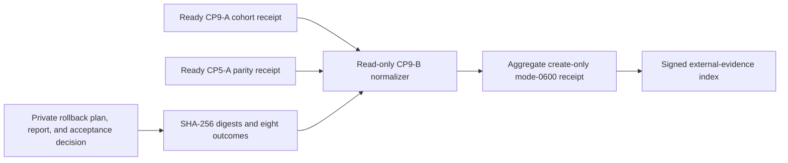

# Staging migration parity and rollback acceptance evidence

CP9-B requires Product, Engineering, and Operations to accept retrieval parity
and a completed rollback tabletop for the exact representative migration
cohort. The collector is read-only and never disables a profile, revokes a
credential, or deletes hosted data.



Both prerequisite receipts must be ready, must be revalidated from their exact
opened bytes, and must name the same staging inventory, plan, applied change,
passed release, and dataset version. The tabletop starts after both receipts
were collected, lasts at most four hours, and is normalized within 24 hours.

The eight fixed outcomes cover local-copy preservation, hosted-profile
disablement, credential revocation, import reconciliation, hosted deletion,
explicit local continuity, fresh-bundle remigration, and joint
Product/Engineering/Operations review. Failed or inconclusive outcomes produce
a valid-unready receipt instead of erasing an honest rehearsal result.

Keep participant identities, commands, credentials, endpoints, account and
item identifiers, deletion receipts, report text, logs, traces, and payloads in
the private immutable dossier. The normalized files contain opaque versions,
digests, times, fixed outcomes, and aggregate counts only.

```sh
make saas-migration-acceptance-check \
  MIGRATION_COHORT_RECEIPT=/private/migration-cohort-receipt.json \
  PARITY_EVIDENCE_RECEIPT=/private/parity-receipt.json \
  MIGRATION_ACCEPTANCE_INPUT=/private/migration-acceptance.json \
  MIGRATION_ACCEPTANCE_RECEIPT=/private/migration-acceptance-receipt.json
```

Exit `0` is ready, `3` valid-unready, `2` invalid usage, and `1` invalid
evidence or I/O failure. The example proves shape only. CP9-B remains open
until the real staging parity report and rollback tabletop are retained
immutably and Product, Engineering, and Operations approve the exact dossier
through the signed external-evidence index.
